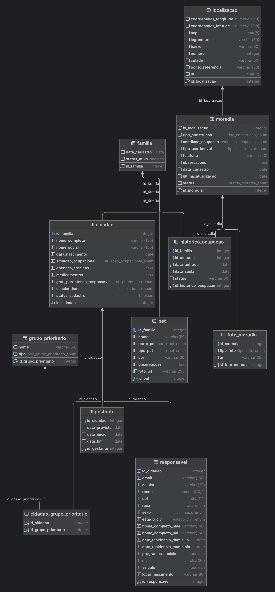

# WAD - Web Application Document - Módulo 2 - Inteli


## Nome do Grupo

#### Nomes dos integrantes do grupo

Ali Abdallah  
Arthur Davi  
Davi Tricarico  
Eduardo Totti  
Enzo Kojian  
Gabriel Andreott  
Julio Quevedo  
Lucas Bianchezzi


## Sumário

[1. Introdução](#c1)

[2. Visão Geral da Aplicação Web](#c2)

[3. Projeto Técnico da Aplicação Web](#c3)

[4. Desenvolvimento da Aplicação Web](#c4)

[5. Testes da Aplicação Web](#c5)

[6. Estudo de Mercado e Plano de Marketing](#c6)

[7. Registro de Atualizações](#c7)

[8. Conclusões e trabalhos futuros](#c8)

[9. Referências](#c9)

[Anexos](#c10)

<br>


# <a name="c1"></a>1. Introdução (sprints 1 a 5)

O município de Santo André enfrenta desafios críticos na gestão de populações em áreas de risco. Com mapa de risco estratificado em zonas amarelas (monitoramento), laranja (área de risco) e vermelho (área de muito risco), o município identifica constantemente famílias vulneráveis que necessitam de proteção. Contudo, o processo de coleta de dados em campo é lento, descentralizado e sem registro geolocalizado integrado. Quando desastres ou eventos extremos ocorrem, agentes da Defesa Civil precisam evacuar famílias rapidamente, mas enfrentam dificuldades: não há rastreamento unificado de retiradas, entrada em abrigos ou quantidade de pessoas por território. Isso compromete a resposta ágil, gera perda de informação entre etapas e dificulta o suporte da sede em tempo real.

Como resposta, foi desenvolvido o GeoRisco Santo André: aplicação web offline-first focada no cadastro georreferenciado rápido de casas e pessoas em áreas de risco. O MVP permite que agentes em campo preencham formulários concisos via mobile, com sistema híbrido de geolocalização (CEP, coordenadas, referências e fotos de imóvel), funcionando mesmo sem GPS preciso. Dados sincronizam automaticamente quando conectado. O sistema registra retiradas de famílias e entrada em abrigos no momento do incidente, e um painel desktop oferece visualização geolocalizada para a sede monitorar densidade de pessoas por território.

Os aspectos essenciais para criação de valor incluem: redução do tempo crítico de coleta em cenários de desastre, eliminação de gaps operacionais entre retirada e abrigo, visão estratégica em tempo real para alocação de recursos, e arquivamento de cadastros para manter integridade da base. A solução substitui sistemas desatualizados e fortalece a capacidade de resposta e resiliência urbana de Santo André.

Este projeto será desenvolvido em parceria com a Defesa Civil de Santo André, incorporando sua experiência operacional e validação contínua das funcionalidades entregues.

# <a name="c2"></a>2. Visão Geral da Aplicação Web (sprint 1)

## 2.1. Escopo do Projeto (sprints 1 e 4)

Esta seção apresenta o escopo do projeto, contemplando as análises estratégicas e conceituais realizadas ao longo das sprints iniciais. São abordados o Modelo das 5 Forças de Porter, a análise SWOT da instituição parceira, a definição da solução proposta, bem como ferramentas de apoio à tomada de decisão, como o Value Proposition Canvas e a matriz de riscos. Além disso, há as personas e as user stories que servem para entendermos melhor sobre o usuário real. O objetivo é contextualizar o problema, compreender o ambiente de atuação e orientar o desenvolvimento da solução.

### 2.1.1. Modelo de 5 Forças de Porter (sprint 1)

O modelo das 5 Forças de Porter foi utilizado para analisar o ambiente competitivo e estratégico no qual a instituição está inserida. A partir dessa abordagem, são avaliadas forças como rivalidade, poder de barganha, ameaça de novos entrantes e de substitutos, permitindo compreender fatores externos que podem impactar a atuação da Defesa Civil e orientar o desenvolvimento da solução proposta.


#### Rivalidade Entre Concorrentes

Existem órgãos que atuam em cenários semelhantes aos da Defesa Civil, como Corpo de Bombeiros, SAMU, Forças Armadas, Polícia Militar e defesas civis de outros municípios. No entanto, a rivalidade é considerada baixa pois cada instituição possui atribuições legais e mandatos distintos, com atuação geralmente complementar e protocolos de cooperação estabelecidos.

#### Poder de Barganha: Fornecedores

O poder de barganha dos fornecedores varia conforme o recurso e o contexto. Em situações normais, é baixo para insumos básicos, como lonas, colchões e água, devido à ampla oferta e compras públicas. Em emergências, esse poder aumenta, pois rapidez e disponibilidade se tornam mais importantes que o preço, favorecendo fornecedores com pronta entrega. Já serviços especializados, como tecnologia, georreferenciamento e análises técnicas, apresentam maior poder, pela escassez de alternativas e dependência de expertise. Assim, o poder dos fornecedores é médio: baixo para itens comuns, mas elevado em emergências e serviços técnicos.

#### Poder de Barganha: Clientes

O poder de barganha dos clientes avalia a influência dos consumidores sobre preços, qualidade e condições. Quanto mais alternativas, maior o poder de negociação. Neste contexto, os moradores de Santo André exercem poder moderado a alto sobre a Defesa Civil, mesmo sem relação comercial direta. Esse poder é limitado pela dependência operacional em situações de risco, sem alternativas viáveis. Porém, se fortalece pela pressão social e política, via reclamações e mobilização. Além disso, a eficácia do sistema depende da colaboração da população na coleta de dados, ampliando sua influência e podendo impactar diretamente a qualidade e o sucesso da solução.

#### Ameaça de Novos Entrantes

A ameaça de novos entrantes é baixa, pois não se trata de um mercado competitivo. Trata-se de um órgão público ligado à Prefeitura, responsável por prevenção, resposta e recuperação em desastres. Sua atuação exige conhecimento técnico, autorização institucional, integração com outras áreas e experiência prática. Embora empresas privadas possam oferecer tecnologias e consultorias, não substituem a autoridade da Defesa Civil em ações como evacuações e vistorias. 

#### Ameaça de Substitutos

A análise da ameaça de substitutos deve ser adaptada, pois se trata de um serviço público exclusivo, sem concorrência direta. Ainda assim, existem alternativas como aplicativos climáticos, redes comunitárias, ONGs e seguros privados. Essas opções possuem alta acessibilidade e baixo custo, resultando em intensidade baixa a moderada. Assim, a Defesa Civil deve manter eficiência operacional e comunicação ágil para preservar a confiança da população e reduzir a dependência dessas alternativas.

Fontes (seção 8): (REF.1, REF.2, REF.3, REF.4, REF.5).


### 2.1.2. Análise SWOT da Instituição Parceira (sprint 1)

A análise SWOT foi realizada com o objetivo de compreender o cenário interno e externo da instituição parceira, identificando suas forças, fraquezas, oportunidades e ameaças. Essa análise permite avaliar aspectos que impactam diretamente o desenvolvimento e a implementação da solução proposta, contribuindo para decisões mais estratégicas e alinhadas ao contexto da Defesa Civil.

<div align="center">
    <p>Figura 1: Análise Swot</p>
    
    <p>Feito pela própria equipe (2026)</p>
</div>

#### Strengths

A Defesa Civil de Santo André tem como uma de suas principais forças o fato de **atuar em uma área essencial** para a cidade: a **prevenção, preparação, resposta e recuperação diante de desastres naturais e tecnológicos.**

Por estar ligada à Prefeitura e à Secretaria de Meio Ambiente e Mudanças Climáticas, a organização possui **legitimidade institucional** e **capacidade de articulação com outras áreas públicas.**

Além disso, tem conhecimento técnico sobre **áreas de risco**, protocolos de evacuação, acolhimento emergencial e atendimento a populações vulneráveis, como idosos, crianças, gestantes e pessoas com deficiência.


#### Weaknesses

A Defesa Civil de Santo André possui alta **dependência de processos analógicos** e do **conhecimento de agentes veteranos**. A falta de um repositório digital centralizado fragmenta as informações e compromete a memória técnica da instituição.

Além disso, a **comunicação fragmentada** entre setores impede o fluxo ágil de informações com as pastas de Saúde e Assistência Social. Essa lacuna inviabiliza o acesso a um perfil socioeconômico atualizado das populações em áreas de risco.


O uso de ferramentas como planilhas físicas gera **barreiras operacionais críticas**. Essa limitação reduz a velocidade de resposta e a eficiência na gestão de abrigos e logística durante crises severas.

#### Opportunities

Entre as oportunidades, destaca-se o uso de **tecnologia para modernizar a gestão pública de riscos e desastres.** Ferramentas digitais podem ajudar a organizar dados, acelerar atendimentos, melhorar a comunicação entre secretarias e apoiar decisões mais rápidas. 

Além disso, o aumento da **preocupação com eventos climáticos extremos** torna o trabalho da Defesa Civil ainda mais relevante, abrindo espaço para investimentos, parcerias com instituições de ensino e soluções inovadoras. A **atuação preventiva** também pode fortalecer a confiança da população no serviço público.

#### Threats

**Eventos climáticos extremos e imprevisíveis** desafiam a capacidade instalada de resposta do município. O aumento da intensidade das chuvas pode saturar os planos de contingência atuais, superando os limites operacionais da instituição.


Além disso, a **expansão urbana desordenada** e a **concentração em áreas de encosta** tornam o mapeamento de riscos rapidamente obsoleto. A dinâmica social dessas ocupações dificulta a manutenção de dados precisos para ações preventivas.


**Instabilidades orçamentárias** e a **baixa adesão comunitária aos protocolos de evacuação** também representam riscos. Tais fatores comprometem a continuidade de investimentos e a eficácia das salvaguardas em momentos de desastre.


### 2.1.3. Solução (sprints 1 a 5)

Nesta seção, apresenta-se a solução proposta para o problema identificado, detalhando suas principais funcionalidades, forma de utilização, dados envolvidos e benefícios esperados. O objetivo é demonstrar como a aplicação web contribuirá para a centralização das informações, melhoria dos processos operacionais e apoio à tomada de decisão no contexto da Defesa Civil.

1. Problema a ser resolvido

A Defesa Civil de Santo André enfrenta desafios na gestão ágil de populações em áreas de risco. Coleta de dados em campo é lenta e descentralizada. Não há registro geolocalizado integrado de evacuações, retiradas de famílias ou entrada em abrigos. Agentes precisam identificar imóveis com segurança em cenários de risco, e a Defesa Civil necessita visualizar geograficamente onde as pessoas foram realocadas.

2. Dados disponíveis (mencionar fonte e conteúdo; se não houver, indicar “não se aplica”)

| Documento | Fonte / Órgão Responsável | Acesso | Link / Explicação |
| :--- | :--- | :--- | :--- |
| **Ficha SDUH** | Secretaria de Desenvolvimento Urbano e Habitação (SP) | **Privada** | Portal SDUH (Acesso restrito via login Gov.br/Senha) |
| **Formulário SUAS** | Ministério da Cidadania / Rede SUAS | **Pública** | [Blog Rede SUAS (Modelos)](http://blog.mds.gov.br/redesuas/) |
| **Fichas de Resgate de Animais** | Polícia Ambiental / Secretarias de Meio Ambiente | **Privada** | Sistema Interno de Ocorrências (Documento Administrativo) |
| **Formulário de Bens sob Guarda** | Defesa Civil Municipal / Estadual | **Privada** | [Sistema S2ID](https://s2id.mi.gov.br/) (Exige cadastro de gestor público) |
| **Mapas de Risco Municipal** | SIGA (Sistema Integrado de Gestão Ambiental) | **Pública** | [Portal SIGA - Infraestrutura e Meio Ambiente](https://sigamapa.santoandre.sp.gov.br/) |
| **Referências Geográficas** | IBGE / IGC-SP (DataGEO) | **Pública** | [IBGE Mapas](https://mapas.ibge.gov.br/) ou [DataGEO SP](http://datageo.ambiente.sp.gov.br/) |
| **Estudos de Vulnerabilidade** | CEMADEN / Defesa Civil Nacional | **Pública** | [Painel de Monitoramento CEMADEN](http://www.cemaden.gov.br/) |


(Dados fictícios coerentes serão utilizados para testes, garantindo conformidade com LGPD e Termo de Confidencialidade.)

3. Solução proposta

GeoRisco Santo André: aplicação web offline-first com geolocalização multimodal usando CEP, coordenadas, referências geográficas e fotos de imóvel. A solução MVP gira em torno do cadastro rápido de pessoas assistidas por casa, podendo haver múltiplas pessoas no registro daquela residência. Englobando a captura de dados como: nome, CPF, idade e vulnerabilidade. Além de funcionalidades como: sincronização automática com a internet (para uso do cadastro em regiões sem sinal); painel geolocalizado para visualizar densidade de pessoas por território; localização de assistidos e residências. Para além do MVP, tem-se: gráficos ou KPIs sobre as áreas de maior risco e áreas de priorização baseado nas necessidades das pessoas.

4. Forma de utilização da solução

Agentes preenchem formulário mobile conciso em campo com funcionalidade offline. Sistema salva localmente e sincroniza quando conectado. Registram: localização por CEP, coordenadas, referências e fotos de imóvel, composição da casa, vulnerabilidades, retirada e abrigo. Painel desktop exibe mapa geolocalizado com cadastros, filtros por setor de risco, densidade de pessoas e gera relatórios georreferenciados para análise de contingência.

5. Benefícios esperados

Reduz tempo crítico de coleta permitindo cadastro rápido em campo. Geolocalização multimodal funciona sem GPS preciso. Registro integrado de retirada e abrigo elimina gaps operacionais. Painel geolocalizado oferece visão estratégica em tempo real à Defesa Civil e sede. Arquivamento de cadastros mantém base íntegra. Substitui sistemas desatualizados, fortalecendo resiliência urbana.

6. Critério de sucesso e como será avaliado

Sucesso medido por KPIs nas sprints iniciais: tempo de preenchimento inferior a cinco minutos por casa, sincronização offline e online, precisão de localização, taxa de conclusão sem erros, usabilidade com agentes de tecnologia média. Validação com operadores em campo, testes de visualização de sede, exportação de relatórios. Métricas finalizadas com parceiro durante o projeto.


### 2.1.4. Value Proposition Canvas (sprint 1): 
O Value Proposition Canvas é uma ferramenta visual que auxilia na definição clara da proposta de valor de um produto ou serviço, alinhando as necessidades e desejos dos clientes com as soluções oferecidas. 
Nele estão identificados o perfil do cliente, suas dores, ganhos e tarefas, bem como a proposta de valor, com os produtos e serviços, aliviadores de dores e criadores de ganhos.
Dessa forma, o Canvas de Proposta de Valor traz de maneira sintetizada diferentes aspectos relacionados ao parceiro e à solução proposta, ajudando também no alinhamento das prioridades do projeto.

<div align="center">
    <p>Figura 2: Value Proposition Canvas</p>
    
    <p>Feito pela própria equipe (2026)</p>
</div>


### 2.1.5. Matriz de Riscos do Projeto (sprint 1)

<div align="center">
    <p>Figura 3: Matriz de Riscos</p>
    
</div>

<div align="center">
    
    <p>Feito pela própria equipe (2026)</p>
</div>

A Matriz de Riscos, também conhecida como Matriz de Probabilidade e Impacto, é uma ferramenta fundamental para o gerenciamento de riscos no projeto, pois permite identificar, classificar e priorizar os eventos que podem impactar seu desenvolvimento. Essa ferramenta auxilia na tomada de decisões estratégicas, direcionando esforços para mitigação de ameaças e aproveitamento de oportunidades no contexto da gestão de áreas de risco, acolhimento emergencial e logística humanitária. O conceito de risco está diretamente relacionado à combinação entre a probabilidade de ocorrência de um evento e o impacto que ele pode causar ao projeto. Dessa forma, riscos com alta probabilidade e alto impacto demandam maior atenção da equipe e dos stakeholders da Secretaria de Meio Ambiente e Defesa Civil, enquanto aqueles com menor criticidade podem ser monitorados com menor prioridade. Para este projeto, os riscos foram classificados em duas categorias principais: Riscos (ameaças) e Oportunidades (eventos positivos). O nível de criticidade foi definido a partir do cruzamento entre probabilidade e impacto, conforme os critérios apresentados a seguir.

Escala de Probabilidade

A probabilidade de ocorrência é definida em cinco níveis: entre 1% a 10% o evento é considerado muito improvável de ocorrer; de 11% a 30% há uma baixa chance de ocorrência; de 31% a 50% o evento pode ocorrer ocasionalmente; de 51% a 70% trata-se de uma provável ocorrência; e de 71% a 90% indica uma alta probabilidade de ocorrência.

Escala de Impacto

O impacto é classificado conforme a gravidade das consequências: Baixo para consequências leves e facilmente reversíveis; Moderado para impacto perceptível com custos ou prazos controláveis; Alto para impacto significativo no cronograma ou qualidade do projeto; e Muito Alto para impacto crítico, inviabilizador ou que compromete a segurança física dos usuários.
Plano de Ação contra Ameaças

O risco R01 refere-se aos conflitos de sincronização de dados coletados offline, descrevendo a divergência de informações quando agentes sincronizam dados cadastrados simultaneamente sem conexão. Apresenta probabilidade de 71% a 90%, impacto alto e nível de risco alto. A mitigação consiste em implementar IDs únicos (UUID) e lógica de resolução de conflitos, com a resposta de realizar merge manual em registros críticos, sob responsabilidade do Líder Técnico.

O R02 trata do vazamento de dados sensíveis (LGPD), focado no acesso indevido a dados de pessoas vulneráveis. Com probabilidade de 11% a 30% e impacto muito alto, o nível de risco é alto. A mitigação envolve criptografia e controle de acesso (RBAC), enquanto a resposta prevê bloqueio de credenciais, auditoria e notificação ao DPO, sob responsabilidade da Segurança.

O R03 aborda a baixa adesão dos agentes de Defesa Civil por resistência na transição para a interface digital. Com probabilidade de 51% a 70% e impacto alto, o nível de risco é alto. A mitigação foca no envolvimento dos usuários no design (UX) e treinamentos, e a resposta é adaptar funcionalidades para reduzir a carga cognitiva, sob responsabilidade do UX Designer.

O R04 detalha o erro na precisão da geolocalização de vulneráveis, indicando locais incorretos para resgate. Tem probabilidade de 31% a 50% e impacto muito alto, resultando em risco alto. A mitigação ocorre via APIs precisas e validação visual, com resposta de cruzamento de dados históricos, sob responsabilidade da Geolocalização.

O R05 refere-se à indisponibilidade do sistema durante eventos climáticos, como queda de servidor ou lentidão. Com probabilidade de 11% a 30% e impacto muito alto, o nível de risco é alto. A mitigação utiliza infraestrutura escalável e cache local, com resposta de ativação automática de failover e priorização de funções de salvamento, sob responsabilidade do DevOps.
Interdependência dos Riscos

Durante a análise, foi possível identificar relações entre alguns riscos: o sucesso no tratamento da sincronização offline (R01) reduz diretamente o impacto da indisponibilidade do sistema (R05), pois permite que o trabalho continue sem rede. A baixa adesão dos usuários (R03) pode gerar falhas no mapeamento (R04), caso os dados sejam inseridos de forma apressada ou incorreta por falta de familiaridade. Além disso, a segurança contra vazamentos (R02) é o que garante a viabilidade jurídica para a replicação em outros municípios (Oportunidade R10).

Oportunidades Encontradas

A oportunidade R10 foca na replicação para outros municípios do ABC para expandir a solução para cidades vizinhas. Com probabilidade de 71% a 90% e impacto alto, o aproveitamento será feito estruturando o sistema como plataforma modular para facilitar a parametrização. O R11 prevê a integração com Corpo de Bombeiros e PM para compartilhamento de dados em tempo real. Possui probabilidade de 51% a 70% e impacto alto, visando o desenvolvimento de módulos de exportação e APIs de consulta rápida para forças de segurança. O R12 trata da melhoria contínua via feedback operacional para otimizar a logística humanitária. Com probabilidade de 71% a 90% e impacto moderado, será aproveitado através de ciclos curtos de feedback e atualizações após períodos de chuvas intensas. Por fim, o R13 visa a atração de investimentos e funding social de órgãos federais ou agências de inovação. Com probabilidade de 31% a 50% e impacto muito alto, o aproveitamento consiste na elaboração de relatórios de impacto social e eficiência na gestão de abrigos para editais.


## 2.2. Personas (sprint 1)

As personas apresentadas abaixo caracterizam-se como proto-personas, construídas a partir de inferências sobre o contexto institucional e os fluxos operacionais da Defesa Civil, visando representar os principais perfis de usuários e orientar o desenvolvimento da solução. 

<div align="center">
    <p>Figura 5: Persona 1</p>
    
    <p>Feito pela própria equipe (2026)</p> 
</div>


<div align="center">
    <p>Figura 6: Persona 2</p>
     
    <p>Feito pela própria equipe (2026)</p>
</div>

Identificamos dois tipos de proto-personas possíveis para o âmbito em questão: agente de campo e gestor operacional da Defesa Civil. Primeiro, o agente de campo, que no caso é o indivíduo que se responsabiliza pelas conduções das operações nos atendimentos emergenciais, como apontado acima com o João, em que dados demográficos, comportamentos e solução para o perfil de João representam um quadro hipotético que nos evidencia um jeito de humanizar o público-alvo para adotar estratégias mais assertivas e centradas no usuário real. 

Além disso, tem-se o gestor operacional da Defesa Civil, o Wesley, que atua no nível estratégico da operação, sendo responsável pela análise de dados consolidados, definição de prioridades e tomada de decisões em cenários de risco. Nesse contexto, observa-se que a persona atribuída a esse perfil, representada de forma hipotética, permite compreender suas principais necessidades, como acesso centralizado a dados de diferentes plataformas, conhecimento sobre as informações das pessoas e suas localidades em áreas de risco e aumentar a eficiência dos agentes de campo no cadastro de casas e moradores. Dessa forma, assim como no caso do agente de campo, a construção dessa proto-persona contribui para orientar o desenvolvimento de funcionalidades alinhadas às demandas reais do usuário, promovendo uma solução mais eficiente, integrada e centrada no processo decisório.

*Observação: Fotos extraídas de um site produtor de imagens de pessoas inexistentes*: [This Person Does Not Exist](https://thispersondoesnotexist.com/)

## 2.3. User Stories (sprints 1 a 5)

Apresenta-se a seguir a lista de User Stories levantadas para o projeto GeoRisco Santo André. Dividimos os User Stories no baseados no seu nível de prioridade, logo quanto mais no topo estiver a User Stories, mais prioritária será. As 5 primeiras User Stories são prioritárias, e User Stories de prioridade mais baixa seguirão na sequência desta lista, com códigos como US06, US07, e assim por diante.

---

| Identificação | US01 |
|---|---|
| Persona | João Silva (Agente de Campo) |
| User Story | "Como agente de campo, quero cadastrar os dados sociodemográficos dos cidadãos para que eu possa vinculá-los às suas moradias e permitir que a gestão conheça o perfil da população atendida." |
| Critério de aceite 1 | CR1: Dado que o agente de campo inicia o cadastro do núcleo familiar, quando preenche os dados obrigatórios e os indicadores de vulnerabilidade (Idosos, Crianças 0 a 12 anos, Gestantes/Lactantes, PCD), então o sistema deve vincular a pessoa à respectiva moradia. |
| Critério de aceite 2 | CR2: Dado que o assistido possui condições específicas de saúde, quando o agente sinalizar no sistema, então devem ser preenchidos os campos de "Doenças crônicas" e "Uso de medicamento contínuo" para gerar histórico no perfil. |
| Critérios INVEST | Independente: O desenvolvimento do módulo de cadastro pessoal não depende da implementação da funcionalidade de mapas.; Negociável: Os campos sociodemográficos e de vulnerabilidade podem ser ajustados.; Valiosa: Fornece a base de dados central para que a Defesa Civil identifique e proteja vidas humanas.; Estimável: É um formulário CRUD tradicional com complexidade previsível e bem delimitada.; Pequena: Foca exclusivamente nos dados demográficos e de saúde da pessoa.; Testável: O testador pode inserir dados simulados e validar a gravação e o vínculo no banco de dados. |

| Identificação | US02 |
|---|---|
| Persona | João Silva (Agente de Campo) |
| User Story | "Como agente de campo, quero cadastrar as características e a localização das moradias para que possamos mapear a infraestrutura da região e identificar possíveis vulnerabilidades." |
| Critério de aceite 1 | CR1: Dado que o agente avalia o domicílio, quando insere o tipo de construção (Madeira, Alvenaria, Misto), o número de pavimentos e a condição da ocupação (Própria, Alugada, Cedida), então o sistema deve registrar o nível estrutural do imóvel. |
| Critério de aceite 2 | CR2: Dado que o cadastro estrutural exige evidências visuais e de risco, quando o agente salvar o formulário, então o sistema deve exigir obrigatoriamente a inserção de Referência Geográfica, Sinais de alerta observados e permitir o upload de 2 fotos (fachada e entorno). |
| Critérios INVEST | Independente: A gestão de infraestrutura pode ser tratada de forma modular no banco de dados.; Negociável: A quantidade máxima de fotos por moradia pode ser discutida tecnicamente.; Valiosa: Essencial para calcular o risco de desabamento ou alagamento de uma edificação específica.; Estimável: Os atributos presentes na ficha física delimitam o escopo exato do front-end.; Pequena: O escopo limita-se à estrutura da edificação, separando-se da localização por GPS.; Testável: O sistema deve ser capaz de receber os uploads de imagem e retornar os atributos estruturais salvos em um GET. |

| Identificação | US03 |
|---|---|
| Persona | Wesley Souza (Gestor Operacional) |
| User Story | "Como gestor operacional, quero visualizar moradias em um mapa georreferenciado, para obter uma visão geral das ocupações e facilitar tomadas de decisões estratégicas." |
| Critério de aceite 1 | CR1: Dado que o gestor acessa o painel de georreferenciamento, quando o mapa renderizar na tela, então o sistema deve plotar automaticamente "pins" (marcadores) correspondentes às coordenadas GPS de todas as moradias cadastradas. |
| Critério de aceite 2 | CR2: Dado que o gestor está visualizando o mapa de risco, quando ele clica sobre o marcador de um imóvel, então um card informativo deve ser exibido. |
| Critérios INVEST | Independente: Consome os dados de geolocalização existentes sem interferir em como são cadastrados.; Negociável: O tipo de mapa (Satelite, Terreno) pode ser alterado conforme a biblioteca utilizada.; Valiosa: Entrega alto valor estratégico ao permitir a visualização espacial das zonas de perigo.; Estimável: A integração com APIs de mapas possui documentação robusta.; Pequena: Foca apenas na plotagem básica dos marcadores.; Testável: É possível criar coordenadas *mockadas* e verificar a correta plotagem na interface. |

| Identificação | US04 |
|---|---|
| Persona | Wesley Souza (Gestor Operacional) |
| User Story | "Como gestor operacional, quero consultar os dados das moradias e os perfis dos moradores de forma integrada, para que eu possa interpretar esses dados e identificar áreas de vulnerabilidades socioestruturais na região." |
| Critério de aceite 1 | CR1: Dado que o gestor acessa o módulo integrado de consultas, quando seleciona o "Nº da Ficha" de uma moradia, então a tela deve consolidar os dados estruturais do imóvel e os dados sociodemográficos dos responsáveis (1º e 2º Responsável) e demais ocupantes. |
| Critério de aceite 2 | CR2: Dado que o gestor visualiza a ficha integrada, quando a moradia estiver classificada com "Histórico de ocorrência" e tiver moradores "Com mobilidade reduzida/acamada", então o sistema deve exibir uma flag visual de "Risco Crítico" no cabeçalho da consulta. |
| Critérios INVEST | Independente: Utiliza joins de dados já populados pelas US01 e US02.; Negociável: O layout de exibição e os níveis de alerta crítico podem ser ajustados.; Valiosa: Facilita o trabalho do gestor que não precisará cruzar tabelas manualmente em planilhas.; Estimável: A consulta a dados relacionados tem esforço facilmente mensurável.; Pequena: Trata-se de uma view (Visualização de dados) de leitura integrada.; Testável: O teste garante que as informações da ficha física batam com o que está sendo exibido digitalmente. |

| Identificação | US05 |
|---|---|
| Persona | João Silva (Agente de Campo) |
| User Story | "Como agente de campo, quero que a localização da moradia utilize minha posição no momento do cadastro como referência, para que eu tenha salvo o local exato mesmo em zonas remotas." |
| Critério de aceite 1 | CR1: Dado que o agente de campo está na tela de cadastro de nova moradia, quando concluir o cadastro, então o sistema deve solicitar permissão do dispositivo e preencher automaticamente a Latitude e Longitude. |
| Critério de aceite 2 | CR2: Dado que o agente está em uma área sem sinal de internet (offline), quando ele aciona a captura de GPS, então o sistema deve armazenar a coordenada localmente utilizando o sensor nativo do dispositivo para sincronização posterior. |
| Critérios INVEST | Independente: A funcionalidade de captura de hardware é independente dos campos de texto do formulário.; Negociável: A precisão exigida (ex: margem de 5 a 10 metros) pode ser acordada com o time.; Valiosa: Elimina o erro humano da digitação de coordenadas numéricas longas.; Estimável: Utilizar APIs nativas de geolocalização mobile é padrão na indústria.; Pequena: Cobre especificamente um único componente de auto-preenchimento.; Testável: Pode-se simular diferentes coordenadas GPS em emuladores para validar a captura. |

| Identificação | US06 |
|---|---|
| Persona | Wesley Silva (Gestor Operacional) |
| User Story | "Como gestor operacional, quero filtrar moradias por atributos específicos, para poder priorizar atendimentos e identificar as necessidades do público que estou lidando." |
| Critério de aceite 1 | CR1: Dado que o gerente está na tela de gerenciamento de dados, quando aplica os filtros de, por exemplo, "Possui PCD" ou "Uso de equipamento de uso contínuo", então a lista de domicílios deve ser filtrada retornando apenas as residências que preencham esses critérios. |
| Critério de aceite 2 | CR2: Dado que o gerente necessita planejar evacuações, quando ele cruzar os filtros de "Condição da ocupação" (ex: área de risco) com "Local de destino em caso de evacuação", então o sistema deve gerar uma lista exportável com os resultados. |
| Critérios INVEST | Independente: A engine de busca e filtro roda independentemente das rotinas de inserção.; Negociável: Quais filtros exatos estarão disponíveis na V1 pode ser repriorizado.; Valiosa: Essencial para triagem rápida em cenários pre-desastre.; Estimável: A construção de queries dinâmicas no banco é uma tarefa de esforço previsível.; Pequena: Foca unicamente na filtragem de listagens textuais/tabelas.; Testável: O QA deve garantir que ao selecionar um filtro específico, nenhum dado fora do escopo selecionado vaze para a tela. |

| Identificação | US07 |
|---|---|
| Persona | João Silva (Agente de Campo) |
| User Story | "Como agente de campo, quero cadastrar os pets (se houver) da moradia existente no sistema, para que, em casos de emergência, seja facilitada a evacuação e busca." |
| Critério de aceite 1 | CR1: Dado que o agente de campo revisa a seção de contingência do domicílio, quando questiona o morador, então o formulário deve permitir a inserção das quantidades divididas pelas categorias: Cães, Gatos, Aves, ou Outros. |
| Critério de aceite 2 | CR2: Dado que o resgate acessa a ficha de emergência do domicílio, quando visualiza a seção "Animais de estimação", então a quantidade exata informada deve estar em destaque para planejamento logístico de caixas de transporte. |
| Critérios INVEST | Independente: O cadastro de animais não afeta os dados vitais dos seres humanos.; Negociável: A lista de categorias pode ser estendida para animais de grande porte dependendo da região.; Valiosa: Reduz a recusa de moradores em abandonar áreas de risco por causa de seus animais.; Estimável: É uma adição simples de atributos numéricos à entidade Domicílio.; Pequena: Pode ser finalizada em um ou dois dias de desenvolvimento.; Testável: Verificação da persistência e retorno no JSON do perfil do assistido. |

| Identificação | US08 |
|---|---|
| Persona | Wesley Souza (Gestor Operacional) |
| User Story | "Como gestor operacional, quero visualizar os dados dos filtros da moradia e/ou assistidos por meio de mapas de calor, para que eu possa ter um retorno mais visual para análise geral." |
| Critério de aceite 1 | CR1: Dado que o gestor acessa o mapa e seleciona o layer de "Mapa de Calor" cruzado, por exemplo, com o filtro de "Idosos", quando a renderização ocorre, então as áreas com maior adensamento deste público devem ficar em tons intensos/avermelhados. |
| Critério de aceite 2 | CR2: Dado que o mapa de calor é acionado, quando o usuário realizar "zoom in" ou "zoom out", então os clusters térmicos devem ser recalculados dinamicamente com base no novo nível de aproximação. |
| Critérios INVEST | Independente: Construído como uma camada (layer) adicional em cima do mapa principal.; Negociável: A paleta de cores e o raio de dispersão podem ser calibrados futuramente.; Valiosa: Transforma dados brutos em inteligência visual e geográfica.; Estimável: Ferramentas modernas de mapas já contam com plugins de heatmap nativos.; Pequena: Foca na visualização agregada térmica.; Testável: Validar se agrupamentos de dados na mesma coordenada geram as manchas esperadas. |

| Identificação | US09 |
|---|---|
| Persona | Wesley Souza (Gestor Operacional) |
| User Story | "Como gestor operacional, quero arquivar moradias de assistidos, para manter o histórico de moradias que foram destruídas, evacuadas ou abandonadas." |
| Critério de aceite 1 | CR1: Dado que um evento climático destruiu/evacuou uma moradia, quando o gestor entra no cadastro e clica em "Arquivar Imóvel", então o sistema deve exigir a seleção de um motivo (Destruída, Evacuada, Desapropriada) antes de confirmar a ação. |
| Critério de aceite 2 | CR2: Dado que uma moradia foi arquivada, quando o gestor acessar os painéis e o mapa geral de operações ativas, então esta moradia NÃO deve ser exibida, mantendo-se apenas na seção de "Histórico Inativo". |
| Critérios INVEST | Independente: A funcionalidade de inativação lógica (soft delete) não depende de novos registros.; Negociável: Os motivos do arquivamento podem ser populados a partir de um domínio expansível.; Valiosa: Mantém a integridade do banco de dados enquanto limpa a visão operacional.; Estimável: Requer a adição de flags booleanas e atualização das queries.; Pequena: Funcionalidade contida e de rápida implementação.; Testável: Garantir que imóveis com status "Arquivado" não retornem em chamadas de API ativas. |

| Identificação | US10 |
|---|---|
| Persona | Wesley Souza (Gestor Operacional) |
| User Story | "Como gestor operacional, quero arquivar moradores falecidos, para manter o histórico do indivíduo sem comprometer os dados operacionais ativos." |
| Critério de aceite 1 | CR1: Dado que um morador veio a óbito, quando acessado o cadastro do indivíduo e clicado em "Arquivar Morador", então o sistema deve exigir o preenchimento da data de falecimento e a confirmação da ação antes de concluir o arquivamento. |
| Critério de aceite 2 | CR2: Dado que um morador foi arquivado como falecido, quando o gestor acessar listagens, relatórios ou operações ativas, então este morador NÃO deve ser exibido nos registros ativos, permanecendo apenas na seção de "Histórico de Moradores". |
| Critérios INVEST | Independente: A funcionalidade de arquivamento lógico do morador pode ser implementada sem impactar o cadastro ativo.; Negociável: Os campos relacionados ao falecimento podem ser ajustados conforme as regras do sistema.; Valiosa: Mantém o histórico populacional preservado sem interferir nas operações correntes.; Estimável: Requer adição de status lógico, filtros de consulta e atualização das regras de exibição.; Pequena: Funcionalidade isolada e de baixa complexidade técnica.; Testável: Garantir que moradores arquivados não sejam retornados em consultas de moradores ativos e permaneçam acessíveis no histórico. |

| Identificação | US11 |
|---|---|
| Persona | Wesley Souza (Gestor Operacional) |
| User Story | "Como gestor operacional, quero ser avisado a cada 12 meses de cadastro de cada usuário, para que surja um alerta para atualização das informações do mesmo." |
| Critério de aceite 1 | CR1: Dado que o sistema possui uma rotina de checagem automatizada, quando a "Data de Atualização" de uma ficha completar 365 dias sem modificações, então o sistema deve informar o gestor. |
| Critério de aceite 2 | CR2: Dado que o gestor acessa a aba "Visualização/Mapa", quando as informações extras forem desatualizadas, então o número de cadastros desatualizados e atualizados deve aparecer. |
| Critérios INVEST | Independente: A rotina roda em background e não interfere no fluxo de cadastro diário.; Negociável: O prazo de aviso pode ser parametrizável.; Valiosa: Evita o sucateamento dos dados em áreas de risco dinâmico.; Estimável: Configuração de uma job e um painel de notificações são tarefas comuns.; Pequena: Apenas identifica e lista pendências.; Testável: Alterar a data de modificação de um teste no banco para "Data Atual - 366 dias" e validar se o alerta dispara. |

| Identificação | US12 |
|---|---|
| Persona | João Silva (Agente de Campo) |
| User Story | "Como agente de campo, quero atualizar os dados anualmente para validação informacional do banco de dados da Defesa Civil." |
| Critério de aceite 1 | CR1: Dado que o agente revisita um domicílio marcado por alerta de desatualização, quando ele revisa e re-salva os dados estruturais e sociais, então o sistema deve sobrepor a data de atualização antiga com a atual. |
| Critério de aceite 2 | CR2: Dado que o agente assina e envia a atualização, quando os dados são sincronizados no servidor, então o indicador de "desatualizado" no painel do Gestor Operacional deve desaparecer instantaneamente. |
| Critérios INVEST | Independente: Atua apenas sobre registros já existentes fechando o ciclo de vida do dado.; Negociável: A necessidade de manter versionamento de histórico pode ser discutida.; Valiosa: Garante que o banco da Defesa Civil reflita sempre a realidade do ano vigente.; Estimável: É um reaproveitamento do formulário de criação adaptado para Update.; Pequena: Foca unicamente na ação de editar e limpar os alertas.; Testável: Atestar que a ação de salvar a edição atualiza a coluna correspondente no banco e zera a notificação. |

| Identificação | US13 |
|---|---|
| Persona | Wesley Souza (Gestor Operacional) |
| User Story | "Como gestor operacional, quero que toda moradia ativa possua obrigatoriamente um chefe de família vinculado, para garantir a integridade cadastral e facilitar a gestão operacional e social das famílias atendidas." |
| Critério de aceite 1 | CR1: Dado que uma moradia esteja ativa no sistema, quando não houver um morador definido como chefe de família, então o sistema deve exibir um alerta de inconsistência cadastral e impedir a finalização ou permanência do cadastro como ativo. |
| Critério de aceite 2 | CR2: Dado que um chefe de família seja arquivado, inativado ou removido da moradia, quando a alteração for confirmada, então o sistema deve exigir a definição de um novo chefe de família antes de concluir a operação. |
| Critérios INVEST | Independente: A validação do chefe de família pode ser implementada sem impactar os demais módulos do sistema.; Negociável: As regras de definição e substituição do chefe de família podem ser ajustadas conforme as políticas da Defesa Civil.; Valiosa: Garante consistência nos registros familiares e melhora a rastreabilidade das informações sociais.; Estimável: A implementação exige apenas validações de vínculo e regras de negócio simples.; Pequena: O escopo está restrito à obrigatoriedade e substituição do chefe de família.; Testável: O QA pode tentar manter uma moradia ativa sem chefe de família e validar se o sistema bloqueia a operação corretamente. |

| Identificação | US14 |
|---|---|
| Persona | Wesley Souza (Gestor Operacional) |
| User Story | "Como gestor operacional, quero que toda família ativa possua obrigatoriamente uma moradia vinculada, para garantir a integridade cadastral e facilitar a gestão operacional e social das famílias atendidas." |
| Critério de aceite 1 | CR1: Dado que uma família esteja ativa no sistema, quando não houver um moradia definida e ativa, então o sistema deve exibir um alerta de inconsistência cadastral e impedir a finalização ou permanência do cadastro como ativo. |
| Critério de aceite 2 | CR2: Dado que a moradia seja arquivada, inativado ou removido enquanto uma família estiver vinculada, quando a alteração for confirmada, então o sistema deve exigir a definição de uma nova moradia. |
| Critérios INVEST | Independente: A validação da moradia pode ser implementada sem impactar os demais módulos do sistema.; Negociável: As regras de definição e substituição da moradia podem ser ajustadas conforme as políticas da Defesa Civil.; Valiosa: Garante consistência nos registros familiares e melhora a rastreabilidade das informações sociais.; Estimável: A implementação exige apenas validações de vínculo e regras de negócio simples.; Pequena: O escopo está restrito à obrigatoriedade e substituição da moradia vinculada a família.; Testável: O QA pode tentar manter uma família ativa sem moradia e validar se o sistema envia o alerta corretamente. |


# <a name="c3"></a>3. Projeto da Aplicação Web (sprints 1 a 5)

## 3.1. Requisitos do Sistema (sprints 1 a 5)

Este documento formaliza o que o sistema deve fazer, sob quais regras e com quais qualidades, com base nas User Stories levantadas para o projeto. O sistema tem como propósito central permitir a compreensão precisa da quantidade de pessoas em territórios de risco, operando de forma georreferenciada para identificar residências mesmo em locais sem endereçamento oficial — como barracos ou vielas —, utilizando coordenadas GPS ou CEP Digital.

O sistema atende primordialmente ao Agente de Campo (A01) no que tange à operatividade e à coleta de dados in loco, e ao Gestor Operacional (A03) na tomada de decisão estratégica. As funcionalidades de cadastro, visualização em mapa, geração de mapas de calor, filtros avançados e alertas de recadastro derivam diretamente das necessidades mapeadas nas US01 a US12.

---

### 3.1.1 Lista de Atores

| ID  | Nome do Ator                           | Descrição                                                                                                                                                                                      | Frequência de Uso | Proficiência Tecnológica |
|-----|----------------------------------------|------------------------------------------------------------------------------------------------------------------------------------------------------------------------------------------------|-------------------|--------------------------|
| A01 | Agente de Defesa Civil (Campo)         | Coleta dados georreferenciados in loco, realiza vistorias em áreas de risco e alimenta o sistema com informações de interdições ou rotas obstruídas.                                           | Diária            | Média / Baixa            |
| A02 | Agente de Defesa Civil (Interno)       | Visualiza todas as informações coletadas e gera relatórios a partir delas.                                                                                                                     | Diária            | Média / Alta             |
| A03 | Agente de Defesa Civil (Administração) | Gerencia os parâmetros de monitoramento e extrai relatórios, análises e mapas de calor. Subsidia a tomada de decisão e o planejamento de contingência da prefeitura. | Diária            | Média / Alta             |

---

### 3.1.2 Requisitos Funcionais

| ID | Nome | Descrição | Tipo | Prioridade | Atores | US Origem | Status |
|---|---|---|---|---|---|---|---|
| RF001 | Cadastro de Dados Sociodemográficos e Vínculos | O sistema deve registrar os dados pessoais dos cidadãos (nome, CPF, data de nascimento, condições de saúde, doenças crônicas e uso de medicação contínua) e os indicadores de vulnerabilidade (idoso, criança 0–12 anos, gestante/lactante, PCD), vinculando obrigatoriamente cada pessoa à sua respectiva moradia. | Cadastro | Alta | A01, A03 | US01 | Planejado |
| RF002 | Cadastro Estrutural de Moradias | O sistema deve registrar as características físicas do imóvel, incluindo tipo de construção (Madeira, Alvenaria, Misto), número de pavimentos, condição de ocupação (Própria, Alugada, Cedida), sinais de alerta observados e upload de até 2 fotos (fachada e entorno). | Cadastro | Alta | A01, A03 | US02 | Planejado |
| RF003 | Georreferenciamento de Moradias via GPS | O sistema deve capturar automaticamente as coordenadas geográficas (latitude e longitude) do dispositivo do agente no momento do cadastro da moradia, armazenando-as localmente quando offline e sincronizando-as com o servidor assim que houver conexão. | Cadastro | Alta | A01 | US05 | Planejado |
| RF004 | Visualização de Moradias em Mapa Georreferenciado | O sistema deve exibir marcadores (pins) no mapa correspondentes às coordenadas de todas as moradias cadastradas, apresentando um card informativo com os dados do imóvel ao clicar sobre o marcador. | Relatório / Consulta | Alta | A02, A03 | US03 | Planejado |
| RF005 | Consulta Integrada de Moradia e Moradores | O sistema deve consolidar, em uma única tela, os dados estruturais do imóvel e os dados sociodemográficos de todos os seus ocupantes, exibindo automaticamente a flag visual "Risco Crítico" quando a moradia possuir histórico de ocorrência e ao menos um morador com mobilidade reduzida ou acamado. | Consulta | Alta | A02, A03 | US04 | Planejado |
| RF006 | Filtros Avançados de Moradias e Assistidos | O sistema deve permitir filtrar a lista de domicílios por atributos como "Possui PCD", "Uso de equipamento contínuo", "Condição da ocupação" e "Local de destino em caso de evacuação", gerando uma lista exportável com os resultados. | Consulta | Média | A02, A03 | US06 | Planejado |
| RF007 | Cadastro de Animais de Estimação | O sistema deve registrar a quantidade de animais de estimação por categoria (Cães, Gatos, Aves, Outros) vinculada ao domicílio, exibindo essas informações em destaque na ficha de emergência para apoio ao planejamento logístico de evacuação. | Cadastro | Baixa | A01 | US07 | Planejado |
| RF008 | Visualização de Mapa de Calor | O sistema deve gerar uma camada (layer) de mapa de calor cruzada com filtros selecionáveis (ex.: idosos, PCDs), recalculando dinamicamente os clusters térmicos ao realizar zoom in/out. | Relatório | Média | A02, A03 | US08 | Planejado |
| RF009 | Arquivamento de Moradias | O sistema deve inativar logicamente (soft delete) imóveis destruídos, evacuados ou desapropriados, exigindo a seleção de um motivo obrigatório antes da confirmação, e deve impedir que imóveis arquivados apareçam em operações ativas, mantendo-os apenas no Histórico Inativo. | Atualização | Média | A03 | US09 | Planejado |
| RF010 | Arquivamento de Moradores Falecidos | O sistema deve inativar logicamente o cadastro de moradores falecidos, exigindo o preenchimento da data de falecimento e a confirmação da ação, removendo-os de todas as listagens e relatórios ativos e preservando-os no Histórico de Moradores. | Atualização | Média | A02, A03 | US10 | Planejado |
| RF011 | Alerta Automático de Recadastro (12 meses) | O sistema deve detectar automaticamente fichas sem modificação há 365 dias e emitir notificação ao gestor, exibindo no painel de visualização/mapa o total de cadastros desatualizados versus atualizados. | Outro | Média | A02, A03 | US11 | Planejado |
| RF012 | Atualização Anual de Dados pelo Agente de Campo | O sistema deve permitir a reedição dos dados estruturais e sociodemográficos de domicílios com alerta de desatualização ativo, removendo automaticamente o indicador "desatualizado" do painel do gestor após o salvamento e a sincronização dos dados. | Atualização | Média | A01 | US12 | Planejado |

---

### 3.1.3 Regras de Negócio

| ID   | Nome                                                   | Descrição                                                                                                                                                                                                                                                                   | Pré-condição                                                                              | Consequência do Descumprimento                                                                        | Atores       | RFs Associados      |
|------|--------------------------------------------------------|-----------------------------------------------------------------------------------------------------------------------------------------------------------------------------------------------------------------------------------------------------------------------------|-------------------------------------------------------------------------------------------|-------------------------------------------------------------------------------------------------------|--------------|---------------------|
| RN01 | Priorização Hierárquica de Evacuação                   | A ordem de resgate deve seguir classificação de vulnerabilidade em 3 níveis: **(1) Nível Crítico** — mobilidade reduzida, acamados, deficiência severa ou dependência total; **(2) Nível Alto** — gestantes, lactantes, idosos, PCDs moderados e crianças de 0–12 anos; **(3) Nível Padrão** — demais indivíduos. | Existência de registros com indicadores de vulnerabilidade preenchidos.                   | Priorização incorreta no plano de evacuação, colocando vidas em risco.                                | A01, A02, A03 | RF001, RF005        |
| RN02 | Recadastro Obrigatório a cada 12 Meses                 | O sistema deve detectar fichas de moradores e moradias sem atualização há 365 dias e emitir alerta automático. O alerta persiste até que o agente de campo revisite e re-salve os dados.                                                                                     | Ficha cadastrada há mais de 12 meses sem edição.                                          | Dados desatualizados podem comprometer planos de evacuação e distribuição de recursos humanitários.   | A02, A03     | RF011, RF012        |
| RN03 | Arquivamento Lógico de Moradias e Moradores (LGPD)     | Registros de moradores falecidos e imóveis destruídos/evacuados/desapropriados devem ser inativados logicamente (soft delete), com registro de motivo e data. Os dados são preservados para fins históricos, auditoria e rastreabilidade, em conformidade com a LGPD.        | Ação confirmada pelo gestor com motivo e data preenchidos.                                | Deleção física viola a LGPD e elimina histórico necessário para relatórios e auditorias.              | A02, A03     | RF009, RF010        |
| RN04 | Captura de Geolocalização e Proibição de Foto de Pessoas | O sistema deve capturar automaticamente as coordenadas GPS do dispositivo no cadastro de moradia. É estritamente proibido o registro fotográfico das pessoas cadastradas; apenas fotos de fachada e entorno do imóvel são permitidas (máx. 2 por imóvel).                    | Permissão de GPS concedida pelo dispositivo.                                              | Foto de pessoas cadastradas viola a LGPD e direitos de imagem.                                        | A01          | RF002, RF003        |
| RN05 | Flag de Risco Crítico na Consulta Integrada            | Quando uma moradia possuir histórico de ocorrência registrado **E** tiver pelo menos um morador com mobilidade reduzida ou acamado, o sistema deve exibir automaticamente a flag visual "Risco Crítico" no cabeçalho da consulta integrada.                                 | Campos "Histórico de ocorrência" e "Mobilidade reduzida/acamado" preenchidos.             | Omissão da flag pode levar à negligência de vítimas em situação crítica.                              | A02, A03     | RF005               |

---

### 3.1.4 Requisitos Não Funcionais — ISO/IEC 25010:2011

| ID | Eixo | Descrição | Derivação e Contexto do Parceiro | Métrica / Critério de Aceite | Conexão com RFs | Como Verificar |
|---|---|---|---|---|---|---|
| RNF001 | **Usabilidade** | A interface PWA deve permitir o preenchimento completo de um cadastro de moradia em menos de 3 minutos por agentes de campo em situações de estresse, com layout otimizado para uso em campo. | Derivado da US01 e US02: João Silva atua em áreas de risco sob pressão, com proficiência tecnológica média/baixa. O parceiro exige que o sistema reduza o tempo de operação e evite erros de preenchimento. A métrica de 3 minutos foi estabelecida com base no tempo médio de uma vistoria presencial. | Tempo médio de preenchimento completo < 3 min (Time-on-Task com mín. 5 agentes reais). Taxa de erro de preenchimento < 5%. | RF001, RF002 | Testes de usabilidade cronometrados com agentes reais em dispositivos móveis em condições simuladas de campo. |
| RNF002 | **Confiabilidade** | O sistema deve operar em modo offline-first, salvando 100% dos dados localmente em cache durante vistorias em áreas sem cobertura, com sincronização automática ao reconectar. | Derivado da US05: o parceiro atua em vielas e zonas de risco com cobertura instável ou inexistente. A perda de dados em campo é inaceitável operacionalmente e pode custar vidas. O uptime de 99,9% foi definido como restrição organizacional do parceiro para sistemas críticos de gestão pública. | 100% dos dados offline persistidos sem perda; uptime ≥ 99,9% ao ano (downtime tolerado < 8,7 h/ano); sincronização concluída em até 30 s após reconexão. | RF003, RF012 | Simulação de modo avião durante preenchimento; monitoramento automatizado de uptime; testes de reconexão com verificação de integridade dos dados. |
| RNF003 | **Desempenho** | O sistema deve responder dentro dos limites aceitáveis para operações em campo sob redes 3G/4G/Wi-Fi. | Derivado das US03 e US05: agentes e gestores consultam mapas e fichas em tempo real durante emergências. Um tempo de resposta elevado pode atrasar decisões críticas de evacuação. O parceiro opera com dispositivos de entrada intermediária e redes móveis de qualidade variável, tornando o desempenho sob 3G inegociável. | Salvamento local < 500 ms; renderização do mapa (p95) < 3 s; carga de ficha completa < 3 s em rede 3G simulada. | RF003, RF004, RF005 | Testes de carga com JMeter ou k6 simulando rede 3G (latência ~100 ms, banda ~1 Mbps) e múltiplos acessos simultâneos. |
| RNF004 | **Capacidade** | O sistema deve suportar picos de acesso durante alertas climáticos severos sem degradação perceptível para nenhum dos usuários ativos. | Derivado do contexto operacional do parceiro: eventos climáticos extremos (enchentes, deslizamentos) disparam uso simultâneo por dezenas de agentes e gestores. A métrica de 500 req/min foi estimada com base no tamanho da equipe operacional da Defesa Civil de Santo André. | Processamento de até 500 requisições simultâneas por minuto sem degradação do p95. Tempo de resposta p95 não deve ultrapassar 3 s sob carga máxima. | RF004, RF008, RF011 | Testes de stress com simulação de pico de acesso; monitoramento de I/O e uso de CPU/memória do banco de dados durante carga máxima. |
| RNF005 | **Suportabilidade** | A aplicação PWA deve operar corretamente nos dispositivos móveis fornecidos ou utilizados pela prefeitura, sem quebra de layout ou perda de funcionalidade. | Derivado da restrição de hardware do parceiro: a Defesa Civil de Santo André utiliza dispositivos institucionais de modelos variados, sem padronização de hardware, com telas entre 5,5 e 7 polegadas e versões de SO diversas. A compatibilidade ampla é essencial para a adoção do sistema em campo. | Layout funcional sem sobreposição de elementos em telas de 5,5 a 7 polegadas; compatibilidade plena com as 3 últimas versões de Android e iOS, sem erros de renderização. | RF001, RF002, RF003 | Matriz de testes em emuladores (BrowserStack) cobrindo modelos e versões especificados; testes complementares nos aparelhos físicos disponibilizados pela Defesa Civil. |
| RNF006 | **Segurança** | Todos os dados pessoais devem ser protegidos em repouso e em trânsito, com controle de acesso robusto, em conformidade estrita com a LGPD e o Termo de Confidencialidade firmado com o parceiro. | Derivado de restrição legal e contratual: o sistema coleta dados sensíveis de cidadãos vulneráveis (saúde, geolocalização, composição familiar), classificados como dados sensíveis pela LGPD (Lei 13.709/2018). O Termo de Confidencialidade proíbe explicitamente o uso de dados reais em qualquer fase de desenvolvimento. AES-256 e TLS 1.3 são padrões mínimos para sistemas de gestão pública com dados pessoais. | 100% dos dados pessoais criptografados com AES-256 em repouso; tráfego via TLS 1.3; bloqueio automático após 5 tentativas de login falhas consecutivas. | RF001, RF002, RF009, RF010 | Auditoria de código estático (SAST); testes de intrusão (PenTest) em homologação; varredura de configurações de segurança do servidor (headers HTTP, certificados, políticas de senha). |
| RNF007 | **Restrições de Design** | O bundle PWA deve ser compacto para funcionar em dispositivos com armazenamento limitado. Fotos de imóveis devem ser comprimidas automaticamente antes do armazenamento. | Derivado da US02 e da restrição de hardware do parceiro: dispositivos institucionais possuem armazenamento interno reduzido. O upload de fotos de fachada e entorno, exigido pelo parceiro como evidência visual, pode consumir espaço excessivo sem controle de tamanho. Os limites de 15 MB e 2 MB por foto foram definidos para garantir operação em aparelhos a partir de 16 GB com conexões lentas. | Bundle PWA em cache < 15 MB; cada imagem comprimida automaticamente para máx. 2 MB sem intervenção do agente. | RF002 | Análise de payload via Chrome DevTools (aba Network/Storage); validação automatizada do tamanho dos arquivos armazenados no banco após upload. |
| RNF008 | **Organizacionais** | O ambiente de homologação e testes deve operar exclusivamente com dados fictícios e mascarados durante toda a fase de desenvolvimento, sem exceções. | Derivado diretamente do Termo de Confidencialidade e da LGPD: qualquer exposição acidental de dados reais de populações vulneráveis em ambiente de desenvolvimento constitui violação legal e contratual. Esta restrição se aplica a todos os membros da equipe em todas as sprints, incluindo seeds, fixtures e dumps de teste. | 100% dos registros em homologação fictícios ou mascarados, auditado ao encerramento de cada sprint. Nenhum CPF, nome real ou coordenada real em base de testes. | Todos os RFs | Auditoria periódica da base de testes; checklist de conformidade no encerramento de cada sprint; scripts de varredura automatizada para detectar padrões de dados reais. |

### 3.1.5. Matriz RF → RN → Endpoint (sprints 3 a 5)

Matriz de cobertura que demonstra quais RN (Regras de Negócio) e endpoints implementam cada RF (Requisito Funcional).

| RF    | RN associadas | Endpoint    | Método |
|-------|---------------|-------------|--------|
| RF001 | RN01, RN02    | `/usuarios` | POST   |

## 3.2. Arquitetura (sprints 1 a 5)

### 3.2.1. Diagrama de Arquitetura (sprints 3 e 4)

*Posicione aqui o diagrama de arquitetura da solução, indicando as camadas principais (Controller, Service, Repository, Model) e suas responsabilidades. Atualize sempre que necessário.*

### 3.2.2. Diagrama de Casos de Uso (sprint 1)

O diagrama de casos de uso é uma ilustração visual que representa as funcionalidades de um sistema sob a perspectiva de seus usuários, mapeando quais atores interagem com quais casos de uso. Nele, é possível visualizar como os requisitos funcionais se relacionam por meio de dois tipos de relação: `<<include>>`, que indica uma etapa obrigatória dentro de um fluxo, assim, sempre que o caso de uso base for executado, o caso de uso incluído também será; e `<<extend>>`, que indica uma etapa condicional, presente no fluxo apenas em situações específicas, sem ser obrigatória.


O diagrama mapeia dois atores e três perfis de uso distintos. O **Agente de Campo** representa o perfil **cadastrador**, sendo responsável por registrar e gerenciar dados em campo, interagindo com os casos de uso de cadastro (RF001 a RF004) e gerenciamento (RF006 a RF009). O **Diretor da Defesa Civil** acumula os perfis de **visualizador** e **administrador**: como visualizador, acompanha informações estratégicas por meio dos mapas de calor (RF013); como administrador, é o único ator com acesso à geração de relatórios (RF014) e à exportação de dados (RF015). No fluxo de cadastro, as relações `<<include>>` evidenciam a obrigatoriedade em cadeia, como por exemplo: cadastrar uma moradia (RF001) sempre exige cadastrar o chefe de família (RF002), que por sua vez inclui o cadastro dos membros (RF003). Já o `<<extend>>` aparece nos dois pontos condicionais do diagrama: o cadastro de membros pode, opcionalmente, registrar necessidades especiais (RF004), e a exportação de dados (RF015) estende a geração de relatórios (RF014), ocorrendo apenas quando necessário.

### 3.2.3. Diagrama de Classes do Domínio (sprint 2)

*Diagrama UML de classes com entidades, atributos, relacionamentos e responsabilidades. Diferencie **associação**, **agregação** (losango vazio), **composição** (losango cheio) e **herança** (triângulo vazio). Multiplicidade explícita em toda associação.*

### 3.2.4. Diagrama de Sequência UML (sprint 3)

Os diagramas de sequência UML desta seção documentam os fluxos de interação entre as camadas da arquitetura do sistema deste projeto, evidenciando como as requisições originadas na interface do usuário percorrem a cadeia **Frontend → Controller → Service → Repository → Banco de Dados** até a geração da resposta. Cada linha de vida vertical representa um participante ativo no processamento, com ativações indicando o período em que cada componente mantém controle da execução. Mensagens síncronas (chamadas diretas) são representadas por setas sólidas, enquanto retornos são indicados por setas tracejadas. Caminhos alternativos e de exceção são delimitados por blocos `alt`/`opt`, refletindo as ramificações de negócio documentadas nos fluxos de interação.

Os dois fluxos priorizados nesta sprint cobrem as operações de maior impacto no ciclo de uso do sistema: o cadastro completo de uma moradia com seus moradores, operação central dos agentes de campo, e a visualização georreferenciada do mapa de riscos pelo corpo gestor. Os demais fluxos (FL03 até FL11) estão na pasta ***diagrama_de_sequencia*** neste repositório.

---

#### FL01 — Cadastro de Cidadão e Vínculo à Moradia


Este fluxo descreve a jornada de cadastro conduzida pelo **Agente de Campo (A01)** a partir do aplicativo mobile. O processo é estruturado em cinco sessões sequenciais: Moradia, Localização, Chefe de Família, Composição Familiar e Pets. Cada uma liberada somente após a confirmação da anterior, garantindo a integridade referencial dos dados antes do envio. Ao submeter o formulário completo, o Frontend dispara uma sequência ordenada de requisições `POST` que cria os registros em cascata (`LOCALIZACAO → MORADIA → CIDADAO → RESPONSAVEL → PET → FORMULARIO`), enquanto o Service aplica as regras de negócio RN01 (classificação de risco) e RN04 (restrição de fotos). O diagrama também contempla o **modo offline**, no qual o formulário é persistido em cache local via IndexedDB e sincronizado automaticamente ao restabelecer conexão, e o **caminho de exceção** de duplicidade de cadastro, que oferece ao agente as opções de busca, atualização ou cancelamento.

---

#### FL02 — Visualização de Mapa Georreferenciado


Este fluxo descreve a consulta ao mapa de risco realizada pelo **Diretor ou Gestor Operacional (A02/A03)** a partir do painel desktop. Ao acessar o módulo de mapa, o Frontend solicita ao backend a lista de moradias com coordenadas geográficas e nível de risco, que são renderizadas como marcadores coloridos (vermelho para Crítico, laranja para Alto, amarelo para Padrão). Ao clicar em um marcador, uma segunda requisição carrega os dados completos da moradia, momento em que o Service executa a **regra transversal FL11** para avaliar a condição de Risco Crítico (RN05) (presença de morador com deficiência que necessita de apoio) e injeta a flag correspondente na resposta. O diagrama também cobre os caminhos alternativos de ausência de dados georreferenciados e de falha na API de mapas.


### 3.2.5. Diagrama de Atividades ou Estados (sprint 3)

*Ao menos um fluxo relevante em UML ou BPMN. Use a notação da ferramenta escolhida de forma consistente (sem misturar convenções).*

### 3.2.6. Diagrama de Implantação (sprints 4 e 5)

*Diagrama UML de deployment mostrando nós físicos, artefatos e canais de comunicação. Representa a visão Engineering + Technology do RM-ODP.*

### 3.2.7. Padrões de Projeto Aplicados (sprints 3 a 5)

*Documente os design patterns utilizados (Repository, Strategy, Factory, DTO etc.) e quais princípios SOLID se aplicam. Justifique a adoção de cada padrão com base em uma necessidade real do projeto.*

## 3.3. Wireframes (sprint 2)

Esta seção é destinada para apresentar os primeiros esboços do sistema: os wireframes. Além de ser a representação das telas de menor fidelidade com o resultado final, esses 

Um wireframe é um quadro (frame) com a estrutura do sistema desenhada em fios (wire) ou blocos de maneira bastante simples.

Vale ressaltar que todas as informações presentes nos wireframes são apenas para facilitar a visualização futura de uma aplicação funcional. Caso alguma informação precise ser adicionada ou excluída, isso será possível futuramente.

### **1. Página Inicial**

<div align="center">
    <p>Figura 7: Wireframe Tela Inicial</p>
    
    <p>Feito pela própria equipe (2026)</p>
</div>

Num primeiro momento, a ideia desse wireframe é a simplicidade e a intuitividade. O layout escolhido, com três grandes botões centralizados, e um cabeçalho, importante mas não principal, posicionado na parte de cima, tem como objetivo trazer poucas informações na tela, servindo apenas para uma recepção amigável e uma navegação intuitiva entre outras páginas.

Além disso, na parte superior, exitem duas logos: Defesa civil de Santo André (círculo maior) e Prefeitura de Santo André (círculo menor). Junto dessas logos, respectivamente, tem um texgo generalizado (como "Olá Agente!") e um texto de cabeçalho simples. Por fim, a engrenagem no canto superior esquerdo significa uma possível aba de configurações.

Por fim, mas não menos importante, o menu de navegação presente na parte inferior inteira da tela, contém ícones referentes aos três grandes botões. Isso foi implementado como um "rodapé" fixo para a aplicação, presente em todo o restante das telas, a fim de facilitar a navegação entre telas, deixando o usuário mais livre para transitar entre tarefas.

---

### **2. Páginas de Cadastro**

Ao clicar no botão "Novo Cadastro", o usuário será redirecionado para a tela de cadastro, para inserir novos dados de pessoas e moradias no banco de dados.

A ideia inicial é seguir uma ordem, separando cada seção por tela e guiando o usuário com setas indicando "próximo" e "voltar". No entanto, com o objetivo de deixar a navegação o mais livre possível, foi pensada uma barra na parte superior da tela, abaixo do cabeçalho, contendo quatro botões clicáveis que redirecionam para cada seção.

Quanto ao menu de navegação, ele será mantido na parte inferior da tela, da mesma forma que foi inserido na tela inicial.

Para concluir o cadastro, um botão "Concluir Cadastro" deve ser exibido assim que todos os campos obrigatórios forem preenchidos. (Obs: os campos obrigatórios ainda não foram definidos completamente na sprint 3, por isso os wireframes não os abordam)

---

<div align="center">
    <p>Figura 9: Wireframe Tela Cadastro - Moradias</p>
    
    <p>Feito pela própria equipe (2026)</p>
</div>

Esta seção engloba todas as informações necessárias para completar o cadastro das moradias. 

Uma funcionalidade adicional que vale a pena ressaltar, é a de inclusão de imagens. No bloco de "Referência Geográfica", será possível adicionar uma imagem tanto por foto quanto por upload, além de ser possível excluí-la.

Outra funcionalidade interessante é a de seleção de múltipla escolha em um bloco, representada por uma seta para baixo que, ao clicar, são exibidos todos os preenchimentos possíveis para aquele campo.

Neste wireframe, por conter uma tela bastante preenchida com informações pertinentes, os botões "Próximo" e "Voltar" não estão representados. Porém, é possível identificar uma barra na lateral direita, sinalizando que a página pode ser arrastada para baixo.

---

<div align="center">
    <p>Figura 10: Wireframe Tela Cadastro - Responsável</p>
    
    <p>Feito pela própria equipe (2026)</p>
</div>

Esta seção engloba todas as informações necessárias para completar o cadastro do responsável.

A ideia desta tela se assemelha muito à anterior, contendo campos de informação preenchíveis, tanto por digitação quanto por múltipla escolha. No entanto, esta página não terá um campo que permita a adição de fotos ou arquivos.

Neste wireframe, por conter uma tela bastante preenchida com informações pertinentes, os botões "Próximo" e "Voltar" não estão representados. Porém, é possível identificar uma barra na lateral direita, sinalizando que a página pode ser arrastada para baixo.

---

<div align="center">
    <p>Figura 11: Wireframe Tela Cadastro - Moradores</p>
    
    <p>Feito pela própria equipe (2026)</p>
</div>

Esta seção engloba todas as informações necessárias para completar o cadastro dos moradores restantes.

Nesse wireframe, algumas informações que estavam presentes na seção 2 serão preservadas, mas outras (como renda) serão removidas, com o intuito de deixar mais simples. 

Além disso, vale ressaltar que na imagem está representado apenas o preenchimento de um morador. No caso de existir mais moradores, o usuário deve clicar na área tracejada "+ Adicionar Morador". Assim, um novo bloco de campos preenchíveis, com as mesmas informações, deve surgir para registro e a área tracejada deve ser exibida logo abaixo o novo bloco de campos.

---

<div align="center">
    <p>Figura 12: Wireframe Tela Cadastro - Pets</p>
    
    <p>Feito pela própria equipe (2026)</p>
</div>

Esta seção engloba todas as informações necessárias para concluir o cadastro de Pets (se houver).

Para o cadastro de Pets, será possível incluir algumas informações essenciais e uma foto do animal. No caso de existir mais de um animal, o usuário deve clicar na área tracejada "+ Adicionar Animal". Assim, um novo bloco de campos preenchíveis, com as mesmas informações, deve surgir para registro e a área tracejada deve ser exibida logo abaixo o novo bloco de campos.

---

### **3. Página de Mapa**

<div align="center">
    <p>Figura 13: Wireframe Tela Mapa</p>
    
    <p>Feito pela própria equipe (2026)</p>
</div>

Esta seção permite a interação com um mapa georreferenciado e refinar a exibição de dados utilizando um menu lateral de Filtros com diversas caixas de seleção. Além disso, uma peculiaridade dessa seção é a possibilidade de recolher esse painel de filtros para maximizar a área visual do mapa, bem como a barra retratil de navegação no inferior da tela, que permite ao usuário alternar agilmente entre os módulos de "Mapa", "Formulário" e "Consulta".

### **4. Página de Busca**

<div align="center">
    <p>Figura 14: Wireframe Tela Busca - </p>
    
    <p>Feito pela própria equipe (2026)</p>
</div>

Esta seção permite a localização rápida de registros no sistema através de um campo de busca textual localizado no topo da tela. Para refinar a pesquisa e direcionar os resultados, o usuário conta com seletores sob o título "Tipo de pesquisa", permitindo alternar de forma simples entre a busca por dados de "Moradia" ou por "Responsável".

Os dados encontrados são apresentados na área de "Resultados" em formato de lista contínua com cartões (cards). Cada cartão é estruturado para exibir uma imagem ou foto de referência à esquerda, acompanhada de linhas detalhadas de informações textuais à direita. Além disso, a tela preserva a barra retrátil de navegação na área inferior, garantindo que o usuário possa expandi-la para alternar agilmente entre os demais módulos do sistema.

<div align="center">
    <p>Figura 15: Wireframe Tela Resultado da Busca</p>
    
    <p>Feito pela própria equipe (2026)</p>
</div>

Esta seção apresenta o detalhamento de um registro específico, acessado após a etapa de pesquisa. No topo, a interface mantém a barra superior e um campo de busca em destaque (com um ícone de lupa), pois o detalhamento aparece como um pop-up sobre a tela de busca, permitindo que o usuário mantenha o contexto e a possibilidade de alternar rapidamente para outros registros. O layout do detalhamento é dividido em duas colunas: à esquerda, uma imagem ou foto de referência relacionada ao registro; à direita, um conjunto organizado de informações textuais, estruturadas em linhas para facilitar a leitura e compreensão dos dados apresentados.


## 3.4. Guia de estilos (sprint 3)

Esta seção apresenta o guia de estilos utilizado no desenvolvimento da aplicação web. Aqui estão definidos os padrões visuais e componentes de interface adotados, como cores, tipografia, botões, ícones e demais elementos gráficos. O objetivo é garantir consistência visual, padronização e melhor experiência de uso durante o desenvolvimento e evolução da solução.

### 3.4.1 Cores

*Apresente aqui a paleta de cores, com seus códigos de aplicação e suas respectivas funções*

### 3.4.2 Tipografia

*Apresente aqui a tipografia da solução, com famílias de fontes e suas respectivas funções*

### 3.4.3 Iconografia e imagens 

*(esta subseção é opcional, caso não existam ícones e imagens, apague esta subseção)*

*posicione aqui imagens e textos contendo exemplos padronizados de ícones e imagens, com seus respectivos atributos de aplicação, utilizadas na solução*

## 3.5. Protótipo de alta fidelidade (sprint 3)

*posicione aqui algumas imagens demonstrativas de seu protótipo de alta fidelidade e o link para acesso ao protótipo completo (mantenha o link sempre público para visualização)*

## 3.6. Modelagem do banco de dados (sprints 2 e 4)

### 3.6.1. Modelo Entidade-Relacionamento (ER) (sprint 2)

<div align="center">
    <p>Figura 16: Modelo Entidade Relacionamento- </p>
    
    <p>Feito pela própria equipe (2026)</p>
</div>

O modelo de dados foi estruturado seguindo as melhores práticas de normalização, rastreabilidade e integridade referencial, com foco em sistemas governamentais. As principais decisões arquiteturais refletidas no diagrama são:

#### 1. Herança e Especialização (Pessoa, Responsável e Grávida)
Para evitar redundância de dados e focar no Responsável da Família sem perder o mapeamento de vulnerabilidade dos dependentes, adotamos o padrão de herança (representado pelo triângulo).
* **`Pessoa` (Superclasse):** Centraliza os atributos universais (Nome, Escolaridade, Situação Ocupacional, Doenças Crônicas).
* **`Responsável` e `Grávida` (Subclasses):** Herdam os atributos de Pessoa, mas agregam dados específicos de suas funções no sistema. O `Responsável` carrega a carga burocrática (CPF, NIS, Renda, Programas Sociais), enquanto a `Grávida` guarda dados vitais de saúde para prioridade em resgates (Data Prevista de Parto).

#### 2. Agrupamento Lógico por `Família`
Em vez de vincular dezenas de indivíduos diretamente a uma casa de forma solta, criamos a entidade agrupadeira **`Família`**.
* Toda `Pessoa` está vinculada a uma `Família` (relacionamento *Pertence*).
* A `Família` possui obrigatoriamente um `Responsável`.
* **Vantagem Técnica:** Essa decisão facilita o trânsito de dados. Se uma enchente desalojar 6 pessoas de uma casa, o sistema precisa atualizar apenas o endereço da entidade `Família`, e todos os membros (incluindo os `Pets` associados a ela) herdam a mudança automaticamente.

#### 3. Rastreabilidade e Histórico (Relacionamento N:N "Ocupa")
O maior desafio resolvido neste modelo foi a preservação do histórico de ocupação sem duplicar dados físicos. A estrutura da **`Moradia`** (Latitude, Longitude, CEP) é imutável. O que muda é quem mora lá.
* Criamos o relacionamento **Muitos-para-Muitos (N:N)** chamado **`Ocupa`** entre `Família` e `Moradia`.
* Este relacionamento gera uma tabela associativa contendo atributos temporais: **`DataEntrada`**, **`DataSaida`** e **`Status`**.
* **Como funciona:** Quando uma família se muda ou é evacuada, preenchemos a `DataSaida` do vínculo atual e criamos um novo vínculo com a nova moradia. Assim, temos a linha do tempo exata de por quais casas a família passou e quais famílias já ocuparam um determinado terreno de risco. Por isso dizemos que uma família ocupa N casas ao longo do tempo, e uma casa é ocupada por N famílias ao longo do tempo, sem perder nenhum dado histórico.

#### 4. Exclusão Lógica (Soft Delete) e Estados Operacionais
Em conformidade com a LGPD e regras de auditoria pública, **nenhum dado é deletado fisicamente (DROP/DELETE)**.
* Inserimos o atributo **`Status`** nas entidades vitais (`Pessoa` e `Moradia`).
* Se um morador sai do município, o status da `Pessoa` fica inativo. Se uma casa de risco desaba, o status da `Moradia` é atualizado para "Demolida". O histórico do que aconteceu ali permanece intacto.

#### 5. Entidades Satélites Flexíveis
* **`Foto`:** Ligada em uma relação (1:N) com a `Moradia`, permitindo criar uma galeria de fotos para identificação da moradia.
* **`GrupoPrioritario`:** Permite associar cidadãos a listas de vulnerabilidade (ex: Acamados, Deficientes Visuais), agilizando a logística humanitária em emergências.

### 3.6.2. Diagrama Entidade-Relacionamento (DER) (sprint 2)

O Diagrama Entidade-Relacionamento (DER) representa a modelagem conceitual do banco de dados da aplicação, demonstrando as entidades do sistema, seus atributos, chaves primárias e estrangeiras, além dos relacionamentos e cardinalidades existentes. O diagrama serve como base para a implementação da estrutura relacional no banco de dados.

<p>Figura 17: Diagrama Entidade-Relacionamento - </p>

<p>Feito pela própria equipe (2026)</p>

Cada **retângulo** no diagrama representa uma tabela do banco de dados. Cada **linha** dentro do retângulo representa uma coluna dessa tabela. As **linhas que conectam** os retângulos representam os relacionamentos entre as tabelas.


## Tipos de Dados Utilizados

| Tipo | Significado |
|------|-------------|
| `INT` | Número inteiro. Usado para identificadores, contagens e chaves. Ex: `1`, `42`, `1000`. |
| `VARCHAR(n)` | Texto de tamanho **variável** com até *n* caracteres. Só ocupa o espaço que o texto realmente utilizar. Ex: nome de uma pessoa. |
| `CHAR(n)` | Texto de tamanho **fixo** com exatamente *n* caracteres. Usado quando o valor tem sempre o mesmo tamanho. Ex: CPF (sempre 11 dígitos), CEP (sempre 8 dígitos), UF (sempre 2 letras). |
| `TEXT` | Texto longo **sem limite de tamanho** definido. Usado para observações, descrições livres e campos abertos. |
| `DATE` | Data no formato `AAAA-MM-DD`. Armazena apenas a data, sem horário. Ex: `1990-05-20`. |
| `TIMESTAMP` | Data e hora completas. Armazena dia, mês, ano, hora, minuto e segundo. Ex: `2024-03-15 14:32:00`. |
| `DECIMAL(p, s)` | Número com casas decimais. `p` é o total de dígitos e `s` são as casas após a vírgula. Ex: `DECIMAL(10,2)` permite valores como `99999999.99`. Usado para renda e coordenadas geográficas. |
| `BOOLEAN` | Valor lógico **verdadeiro ou falso** (sim/não). Ex: possui veículo? sim ou não. |
| `ENUM(valores)` | **Lista fechada** de valores permitidos. O campo só aceita um dos valores definidos previamente. Garante a consistência e evita erros de digitação. Ex: `ENUM(estado_civil)` aceita apenas `"Solteiro"`, `"Casado"`, `"Divorciado"`, etc. |
| `PK` | ***Primary Key* — Chave Primária.** Identifica de forma única cada registro da tabela. Não pode se repetir nem ser nulo. |
| `FK` | ***Foreign Key* — Chave Estrangeira.** Referencia a chave primária de outra tabela, criando o vínculo entre elas. |

---

## Entidades e seus Atributos

### 1. Família (Núcleo Familiar)

Entidade **agrupadora central**. Representa o núcleo familiar como um todo. É esta entidade que transita entre diferentes moradias, levando consigo todos os cidadãos e animais de estimação associados.

| Atributo | Tipo | Descrição |
|----------|------|-----------|
| `id_familia` | `INT PK` | Identificador único da família. |
| `data_cadastro` | `DATE` | Data em que a família foi cadastrada no sistema. |
| `status_ativo` | `BOOLEAN` | Controle de exclusão lógica (*Soft Delete*). Se `false`, a família está inativada no sistema. |

---

### 2. Cidadão (Pessoa)

Representa qualquer indivíduo cadastrado no sistema. Contém os dados universais (saúde, escolaridade, etc.) e está sempre associado a uma `Família`.

| Atributo | Tipo | Descrição |
|----------|------|-----------|
| `id_cidadao` | `INT PK` | Identificador único do cidadão. |
| `id_familia` | `INT FK` | Referência à família à qual o cidadão pertence. |
| `nome_completo` | `VARCHAR(150)` | Nome civil completo da pessoa. |
| `nome_social` | `VARCHAR(150)` | Nome pelo qual a pessoa prefere ser chamada. |
| `data_nascimento` | `DATE` | Data de nascimento no formato `AAAA-MM-DD`. |
| `situacao_ocupacional` | `ENUM` | Situação de trabalho atual (ex: `Empregado`, `Desempregado`, `Aposentado`). |
| `doencas_cronicas` | `TEXT` | Registro de doenças crônicas que a pessoa possui. |
| `medicamentos` | `TEXT` | Lista de medicamentos de uso contínuo. |
| `grau_parentesco_responsavel` | `ENUM` | Relação do cidadão com o responsável da família. |
| `escolaridade` | `ENUM` | Nível de instrução escolar. |
| `status_cadastro` | `BOOLEAN` | Controle de exclusão lógica individual, em conformidade com a LGPD. |

---

### 3. Responsável (Especialização)

Entidade que herda os dados de `Cidadão`, representando o **Chefe de Família**. Armazena a carga burocrática e os dados de contato do núcleo familiar.

| Atributo | Tipo | Descrição |
|----------|------|-----------|
| `id_responsavel` | `INT PK` | Identificador único do responsável. |
| `id_cidadao` | `INT FK` | Referência ao registro base de cidadão (Relação de Herança). |
| `email` | `VARCHAR(150)` | Endereço de e-mail para contato. |
| `celular` | `VARCHAR(20)` | Número de celular com DDD. |
| `renda` | `DECIMAL(10,2)` | Renda mensal em reais. |
| `cpf` | `CHAR(11)` | Documento de identificação (CPF), sempre com 11 dígitos numéricos. |
| `programas_sociais` | `BOOLEAN` | Indica se é beneficiário de algum programa de apoio social. |
| `nis` | `VARCHAR(20)` | Número de Identificação Social. |
| `veiculo` | `BOOLEAN` | Indica se possui veículo próprio, vital para planejamento de evacuações. |

---

### 4. Gestante (Especialização)

Entidade que herda os dados de `Cidadão` para registrar informações de indivíduos em **período gestacional**, garantindo prioridade em resgates.

| Atributo | Tipo | Descrição |
|----------|------|-----------|
| `id_gestante` | `INT PK` | Identificador único do registro de gestação. |
| `id_cidadao` | `INT FK` | Referência ao registro base de cidadão. |
| `data_prevista` | `DATE` | Data prevista para o parto. |

---

### 5. Grupo Prioritário

Tabela auxiliar que define os **grupos de vulnerabilidade** (ex: Idosos, Acamados, Deficientes).

| Atributo | Tipo | Descrição |
|----------|------|-----------|
| `id_grupo_prioritario` | `INT PK` | Identificador único do grupo. |
| `nome` | `VARCHAR(50)` | Nome do grupo prioritário. |
| `tipo` | `ENUM` | Classificação do grupo (Saúde, Social, Etária). |

---

### 6. Moradia

A **estrutura física** no terreno. Uma vez mapeada, a moradia raramente muda ou é apagada, servindo como âncora fixa no Mapa de Calor.

| Atributo | Tipo | Descrição |
|----------|------|-----------|
| `id_moradia` | `INT PK` | Identificador único da infraestrutura. |
| `id_localizacao` | `INT FK` | Referência aos dados geográficos (coordenadas e endereço). |
| `tipo_construcao` | `ENUM` | Material predominante (ex: `Alvenaria`, `Madeira`). |
| `status` | `ENUM` | Estado operacional rápido para o mapa: `Ativa`, `Interditada`, `Demolida`. |
| `data_cadastro` | `DATE` | Data da primeira vistoria no local. |

---

### 7. Histórico de Ocupação (Tabela Associativa N:N)

O "coração" do sistema de rastreabilidade. Registra a **linha do tempo** de qual família morou em qual casa, permitindo auditoria contínua sem perda de dados.

| Atributo | Tipo | Descrição |
|----------|------|-----------|
| `id_historico_ocupacao` | `INT PK` | Identificador da relação de ocupação. |
| `id_familia` | `INT FK` | Referência à família ocupante. |
| `id_moradia` | `INT FK` | Referência à casa ocupada. |
| `data_entrada` | `DATE` | Data em que a família se mudou para o local. |
| `data_saida` | `DATE` | Data em que saíram. **Se nulo**, significa que ainda residem no local. |
| `status` | `VARCHAR(50)` | Motivo/Situação do vínculo (ex: `Regular`, `Evacuada por Deslizamento`). |

---

### 8. Pet (Animal de Estimação)

Animais que pertencem a uma família. Mudam de casa automaticamente se a família for realojada.

| Atributo | Tipo | Descrição |
|----------|------|-----------|
| `id_pet` | `INT PK` | Identificador único do animal. |
| `id_familia` | `INT FK` | Referência à família tutora do animal. |
| `tipo_pet` | `ENUM` | Espécie do animal (ex: `Cão`, `Gato`). |
| `porte_pet` | `ENUM` | Tamanho (ex: `Pequeno`, `Médio`). |

---

### 9. Localização e Foto Moradia

Entidades satélites que armazenam, respectivamente, as coordenadas/endereço exato do lote e o arquivo de fotografias da estrutura.

---

## Relacionamentos e Cardinalidades

A **cardinalidade** define como os registros se interligam no banco de dados. Com a nova arquitetura focada no histórico, as ligações comportam-se da seguinte forma:

### Família → Cidadão — `1:N` (Um para Muitos)
Uma família é composta por um ou vários cidadãos. Cada cidadão pertence exclusivamente a uma única família. Se a família for realojada em um abrigo, todos os cidadãos associados deslocam-se logicamente com ela.

### Família → Pet — `1:N` (Um para Muitos)
A mesma lógica aplica-se aos animais. Um núcleo familiar pode possuir vários animais de estimação, e o sistema rastreia os animais através da família, facilitando as operações de resgate animal.

### Cidadão → Responsável / Gestante — `Herança (Especialização)`
Não se trata de um relacionamento tradicional, mas de uma extensão do cidadão. Todo o `Responsável` é obrigatoriamente um `Cidadão`, mas nem todo o cidadão é um responsável. A ligação é de `1:1` no banco de dados (o ID do responsável aponta para o ID do cidadão correspondente).

### Cidadão → Grupo Prioritário — `N:N` (Muitos para Muitos)
Um cidadão pode possuir múltiplas vulnerabilidades (ex: Idoso e Acamado simultaneamente), e um grupo contém múltiplos cidadãos. Isso é resolvido através da tabela associativa `cidadao_grupo_prioritario`.

### Família → Moradia — `N:N` (Muitos para Muitos através de Histórico)
**A alteração mais importante do sistema.** Uma família pode passar por várias casas ao longo do tempo (ex: casa antiga → abrigo → casa nova), e uma casa pode ser habitada por diferentes famílias ao longo dos anos. Esta relação gera a entidade **`Histórico de Ocupação`**, garantindo que nenhum dado do passado seja reescrito ou perdido.

### 3.6.3. Modelo Físico

### Diagrama Entidade-Relacionamento (DER) — Modelo Físico

O modelo físico apresentado implementa a arquitetura conceitual descrita em 3.6.1 e 3.6.2 utilizando PostgreSQL como SGBD. As principais decisões de implementação refletem os requisitos de rastreabilidade, integridade referencial, conformidade com LGPD e otimização para mapeamento geográfico de áreas de risco.

---

### Decisões Arquiteturais do Modelo Físico

#### 1. Família como Entidade Agrupadeira Central

A entidade **`familia`** é o núcleo organizador do sistema. Todos os cidadãos e pets vinculam-se a uma família, não diretamente a uma moradia. Isso permite:
- Controle de ocupação histórica sem duplicação de dados
- Transição de moradias em casos de desalojamento ou evacuação
- Atualizações em massa (ex: toda a família se mudou)
- Rastreamento de vulnerabilidade familiar ao longo do tempo

#### 2. Herança de Cidadão: Responsável e Gestante

A hierarquia `Cidadão` → (`Responsável`, `Gestante`) foi implementada usando **class-table inheritance**:
- Tabela **`cidadao`** armazena atributos comuns (nome, data nascimento, situação ocupacional)
- Tabelas **`responsavel`** e `gestante` herdam via `id_cidadao` como PK + FK
- Cada subtipo adiciona dados específicos sem redundância

**Vantagem:** Um cidadão pode ser responsável, gestante, ou apenas dependente sem conflitos.

#### 3. Relacionamento N:N com Histórico Temporal (Historico_Ocupacao)

O relacionamento **`historico_ocupacao`** entre `familia` e `moradia` preserva:
- `data_entrada`: início da ocupação
- `data_saida`: encerramento (NULL se ainda ocupa)
- `status`: motivo da saída (Desalojado, Evacuado, Mudança Voluntária, etc.)

Permite análises históricas completas: **qual familia morou onde, por quanto tempo, por quê**.

#### 4. Soft Delete (Exclusão Lógica)

Em conformidade com LGPD e auditoria pública:
- **`cidadao.status_cadastro`** (BOOLEAN): ativa/inativa pessoa individual
- **`familia.status_ativo`** (BOOLEAN): ativa/inativa núcleo familiar
- **`moradia.status`** (ENUM): operacional (Ativa, Interditada, Demolida, Evacuada)

Nenhum registro é fisicamente deletado; histórico é preservado para auditoria.

#### 5. Pet Vinculado a Família (Não a Moradia)

Pets relacionam-se a `familia` e não a `moradia` porque:
- Quando uma família se muda, leva seus pets consigo
- Evita dados órfãos quando moradia é evacuada
- Facilita rastreamento de animais em emergências

#### 6. Constraints e Validações

- **NOT NULL** em campos obrigatórios (nomes, datas, coordenadas)
- **UNIQUE** em CPF, email, NIS (sem duplicação)
- **FOREIGN KEY** em todos os relacionamentos
- **CHECK** para validações de range (renda, coordenadas geográficas)

---

### Tipos Enumerados (ENUMs)

```sql
CREATE TYPE grau_parentesco_enum AS ENUM (
  'Responsável',
  'Pai',
  'Mãe',
  'Avô/Avó',
  'Tia/Tio',
  'Irmã/Irmão',
  'Sobrinho/Sobrinha',
  'Filho/Filha',
  'Outro'
);

CREATE TYPE escolaridade_enum AS ENUM (
  'Analfabeto',
  'Ensino Fundamental Incompleto',
  'Ensino Fundamental Completo',
  'Ensino Médio Incompleto',
  'Ensino Médio Completo',
  'Ensino Superior Incompleto',
  'Ensino Superior Completo',
  'Pós-Graduação'
);

CREATE TYPE situacao_ocupacional_enum AS ENUM (
  'Empregado',
  'Desempregado',
  'Autônomo',
  'Informal',
  'Aposentado',
  'Estudante',
  'Do Lar',
  'Outro'
);

CREATE TYPE tipo_grupo_prioritario_enum AS ENUM (
  'Criança',
  'Gestante',
  'Idoso',
  'Deficiente',
  'Vulnerável',
  'Acamado',
  'Outro'
);

CREATE TYPE raca_enum AS ENUM (
  'Branco',
  'Preto',
  'Pardo',
  'Amarelo',
  'Indígena',
  'Outro'
);

CREATE TYPE sexo_enum AS ENUM (
  'Masculino',
  'Feminino',
  'Outro'
);

CREATE TYPE porte_pet_enum AS ENUM (
  'Pequeno',
  'Médio',
  'Grande'
);

CREATE TYPE tipo_pet_enum AS ENUM (
  'Cão',
  'Gato',
  'Pássaro',
  'Roedor',
  'Réptil',
  'Outro'
);

CREATE TYPE tipo_construcao_enum AS ENUM (
  'Alvenaria',
  'Madeira',
  'Misto'
);

CREATE TYPE condicao_ocupacao_enum AS ENUM (
  'Própria Quitada',
  'Própria Financiada',
  'Alugada',
  'Cedida',
  'Ocupação',
  'Outro'
);

CREATE TYPE tipo_uso_imovel_enum AS ENUM (
  'Residencial',
  'Comercial',
  'Misto'
);

CREATE TYPE estado_civil_enum AS ENUM (
  'Solteiro',
  'Casado',
  'Divorciado',
  'Viúvo',
  'União Estável',
  'Outro'
);

CREATE TYPE tipo_foto_enum AS ENUM (
  'Frente',
  'Redor'
);

CREATE TYPE status_moradia_enum AS ENUM (
  'Ativa',
  'Interditada',
  'Demolida',
  'Área de Risco Evacuada'
);
```

---

### Migrations DDL (Create Tables)

#### Migration 001: Criar Tabela de Localização

```sql
-- Armazena endereço e coordenadas geográficas
-- Base para plotagem em mapa e rastreamento de áreas de risco
CREATE TABLE localizacao (
  id_localizacao SERIAL PRIMARY KEY,
  coordenadas_longitude DECIMAL(10, 8),
  coordenadas_latitude DECIMAL(10, 8),
  cep CHAR(8),
  logradouro VARCHAR(80),
  bairro VARCHAR(50),
  numero INT,
  cidade VARCHAR(50),
  ponto_referencia VARCHAR(150),
  uf CHAR(2)
);

CREATE INDEX idx_localizacao_cep ON localizacao(cep);
```

**Justificativa:** Coordenadas são opcionais pois podem ser preenchidas posterior. Índice em CEP para buscas geográficas rápidas.

---

#### Migration 002: Criar Tabela de Moradia

```sql
-- Representa o imóvel onde as famílias residem
-- Status permite rastreamento operacional (ativa, demolida, evacuada)
CREATE TABLE moradia (
  id_moradia SERIAL PRIMARY KEY,
  id_localizacao INT REFERENCES localizacao(id_localizacao),
  tipo_construcao tipo_construcao_enum,
  condicao_ocupacao condicao_ocupacao_enum,
  tipo_uso_imovel tipo_uso_imovel_enum,
  telefone VARCHAR(20),
  observacoes TEXT,
  data_cadastro DATE,
  ultima_atualizacao DATE,
  status status_moradia_enum DEFAULT 'Ativa'
);

CREATE INDEX idx_moradia_localizacao ON moradia(id_localizacao);
CREATE INDEX idx_moradia_status ON moradia(status);
```

**Justificativa:** Status permite soft delete operacional. Índices em FK e status para queries frequentes de mapeamento.

---

#### Migration 003: Criar Tabela de Grupo Prioritário

```sql
-- Define grupos de vulnerabilidade/prioridade para atendimento
-- Auxilia na logística de emergências e políticas públicas
CREATE TABLE grupo_prioritario (
  id_grupo_prioritario SERIAL PRIMARY KEY,
  nome VARCHAR(50) NOT NULL UNIQUE,
  tipo tipo_grupo_prioritario_enum NOT NULL
);
```

**Justificativa:** Nome único evita duplicação de grupos (ex: não há dois grupos "Idoso").

---

#### Migration 004: Criar Tabela de Família

```sql
-- Entidade agrupadeira central do sistema
-- Organiza cidadãos sob um núcleo familiar
-- Facilita controle de ocupação histórica e mobilidade residencial
CREATE TABLE familia (
  id_familia SERIAL PRIMARY KEY,
  data_cadastro DATE DEFAULT CURRENT_DATE,
  status_ativo BOOLEAN DEFAULT TRUE
);

CREATE INDEX idx_familia_status ON familia(status_ativo);
```

**Justificativa:** Simples e flexível. Status permite desativar núcleo sem deletar dados. Crucial para rastreabilidade histórica.

---

#### Migration 005: Criar Tabela de Cidadão (Superclasse)

```sql
-- Superclasse que agrupa Responsável e Gestante
-- Armazena atributos comuns a todas as pessoas cadastradas
-- Soft delete individual via status_cadastro
CREATE TABLE cidadao (
  id_cidadao SERIAL PRIMARY KEY,
  id_familia INT NOT NULL REFERENCES familia(id_familia),
  nome_completo VARCHAR(150) NOT NULL,
  nome_social VARCHAR(150),
  data_nascimento DATE,
  situacao_ocupacional situacao_ocupacional_enum,
  doencas_cronicas TEXT,
  medicamentos TEXT,
  grau_parentesco_responsavel grau_parentesco_enum,
  escolaridade escolaridade_enum,
  status_cadastro BOOLEAN DEFAULT TRUE
);

CREATE INDEX idx_cidadao_familia ON cidadao(id_familia);
CREATE INDEX idx_cidadao_status ON cidadao(status_cadastro);
```

**Justificativa:** Centraliza dados comuns. `status_cadastro` permite inativar pessoa individual (LGPD). Índices para buscas por família e status ativo.

---

#### Migration 006: Criar Tabela de Responsável (Subclasse de Cidadão)

```sql
-- Subclasse de Cidadão: acrescenta dados burocrático-sociais
-- Um Responsável é sempre um Cidadão previamente cadastrado
-- CPF, Email, NIS são únicos para evitar duplicação
CREATE TABLE responsavel (
  id_responsavel SERIAL PRIMARY KEY,
  id_cidadao INT NOT NULL REFERENCES cidadao(id_cidadao) ON DELETE CASCADE,
  email VARCHAR(150) UNIQUE,
  celular VARCHAR(20),
  renda DECIMAL(10, 2) CHECK (renda >= 0),
  cpf CHAR(11) NOT NULL UNIQUE,
  raca raca_enum,
  sexo sexo_enum,
  estado_civil estado_civil_enum,
  nome_completo_mae VARCHAR(150),
  nome_completo_pai VARCHAR(150),
  data_residencia_domicilio DATE,
  data_residencia_municipio DATE,
  programas_sociais BOOLEAN,
  nis VARCHAR(20) UNIQUE,
  veiculo BOOLEAN,
  local_nascimento VARCHAR(80)
);

CREATE INDEX idx_responsavel_cpf ON responsavel(cpf);
CREATE INDEX idx_responsavel_email ON responsavel(email);
CREATE INDEX idx_responsavel_nis ON responsavel(nis);
```

**Justificativa:** CPF, email, NIS são UNIQUE para integridade. Renda com CHECK não-negativa. Múltiplos índices para buscas por identidade.

---

#### Migration 007: Criar Tabela de Gestante (Subclasse de Cidadão)

```sql
-- Subclasse de Cidadão: registra gestações
-- Permite múltiplos registros por pessoa (histórico de gestações)
-- Atualizado a cada 1,5 a 2 anos conforme lógica de negócio
CREATE TABLE gestante (
  id_gestante SERIAL PRIMARY KEY,
  id_cidadao INT NOT NULL REFERENCES cidadao(id_cidadao) ON DELETE CASCADE,
  data_prevista DATE,
  data_inicio DATE,
  data_fim DATE
);

CREATE INDEX idx_gestante_cidadao ON gestante(id_cidadao);
CREATE INDEX idx_gestante_data_prevista ON gestante(data_prevista);
```

**Justificativa:** Múltiplos registros por pessoa permitem histórico. Índice em `data_prevista` para priorização rápida de gestantes.

---

#### Migration 008: Criar Tabela de Pet

```sql
-- Registra animais de estimação residentes na família
-- Vinculado a familia e não moradia (pets acompanham família na mudança)
-- Relevante para controle de zoonoses e assistência social
CREATE TABLE pet (
  id_pet SERIAL PRIMARY KEY,
  id_familia INT NOT NULL REFERENCES familia(id_familia),
  nome VARCHAR(50),
  porte_pet porte_pet_enum,
  tipo_pet tipo_pet_enum NOT NULL,
  cor VARCHAR(30),
  observacoes TEXT,
  foto_url VARCHAR(255)
);

CREATE INDEX idx_pet_familia ON pet(id_familia);
```

**Justificativa:** Pets vinculados a família (não moradia) porque acompanham família em evacuações. `tipo_pet` obrigatório.

---

#### Migration 009: Criar Tabela de Foto Moradia

```sql
-- Armazena fotos do imóvel para identificação visual
-- Uma moradia pode ter múltiplas fotos (frente, redor, lateral, etc.)
-- Fundamental para trabalho de campo da Defesa Civil
CREATE TABLE foto_moradia (
  id_foto_moradia SERIAL PRIMARY KEY,
  id_moradia INT NOT NULL REFERENCES moradia(id_moradia) ON DELETE CASCADE,
  tipo_foto tipo_foto_enum,
  url VARCHAR(255) NOT NULL
);

CREATE INDEX idx_foto_moradia ON foto_moradia(id_moradia);
```

**Justificativa:** Permite galeria por moradia. Índice facilita buscar "todas as fotos de uma moradia" para validação de campo.

---

#### Migration 010: Criar Tabela Histórico de Ocupação (N:N com Histórico Temporal)

```sql
-- Relacionamento N:N entre Família e Moradia com atributos temporais
-- CORE da rastreabilidade do sistema
-- Preserva histórico completo de ocupações para análise de vulnerabilidade
-- Uma família pode ocupar N moradias ao longo do tempo
-- Uma moradia pode ser ocupada por N famílias ao longo do tempo
CREATE TABLE historico_ocupacao (
  id_historico_ocupacao SERIAL PRIMARY KEY,
  id_familia INT NOT NULL REFERENCES familia(id_familia),
  id_moradia INT NOT NULL REFERENCES moradia(id_moradia),
  data_entrada DATE NOT NULL,
  data_saida DATE,
  status VARCHAR(50) DEFAULT 'Regular',
  UNIQUE (id_familia, id_moradia, data_entrada),
  CONSTRAINT chk_datas_ocupacao CHECK (data_saida IS NULL OR data_saida > data_entrada)
);

CREATE INDEX idx_hist_ocupacao_fam ON historico_ocupacao(id_familia);
CREATE INDEX idx_hist_ocupacao_mor ON historico_ocupacao(id_moradia);
CREATE INDEX idx_hist_ocupacao_ativo ON historico_ocupacao(data_saida);
```

**Justificativa:** Chave composta garante único vínculo por período. CHECK valida lógica temporal. Índices para buscas de histórico ativo/passado.

---

#### Migration 011: Criar Tabela Associativa Cidadão-GrupoPrioritario (N:N)

```sql
-- Relacionamento N:N: um cidadão pode pertencer a vários grupos prioritários
-- Um grupo pode incluir muitos cidadãos
-- Exemplo: uma pessoa pode ser Idosa E Deficiente simultaneamente
CREATE TABLE cidadao_grupo_prioritario (
  id_cidadao INT NOT NULL REFERENCES cidadao(id_cidadao) ON DELETE CASCADE,
  id_grupo_prioritario INT NOT NULL REFERENCES grupo_prioritario(id_grupo_prioritario) ON DELETE CASCADE,
  PRIMARY KEY (id_cidadao, id_grupo_prioritario)
);

CREATE INDEX idx_cid_grupo_cid ON cidadao_grupo_prioritario(id_cidadao);
CREATE INDEX idx_cid_grupo_grupo ON cidadao_grupo_prioritario(id_grupo_prioritario);
```

**Justificativa:** Chave composta evita duplicatas. Índices permitem buscas eficientes: "todas as pessoas de um grupo" ou "todos os grupos de uma pessoa".

---

#### Resumo de Constraints Implementados

| Tipo | Aplicação |
|------|-----------|
| **NOT NULL** | id_familia (cidadao); id_cidadao (responsavel, gestante); id_moradia (foto_moradia, historico_ocupacao); nome_completo (cidadao); cpf (responsavel); tipo_pet (pet); data_entrada (historico_ocupacao) |
| **UNIQUE** | cpf, email, nis (responsavel); nome (grupo_prioritario); (id_familia, id_moradia, data_entrada) (historico_ocupacao) |
| **FOREIGN KEY** | Todas as referências entre tabelas com ON DELETE CASCADE onde apropriado |
| **CHECK** | renda >= 0 (responsavel); data_saida > data_entrada (historico_ocupacao) |
| **PRIMARY KEY** | Todas as tabelas com id_* SERIAL ou chaves compostas (associativas) |

---

#### Índices Estratégicos para Performance

Otimizados para operações mais frequentes:

| Índice | Justificativa |
|--------|---------------|
| `idx_familia_status` | Filtrar famílias ativas vs inativas rapidamente |
| `idx_cidadao_familia` | Listar todos os cidadãos de uma família |
| `idx_cidadao_status` | Filtrar cadastros ativos para LGPD |
| `idx_moradia_status` | Mostrar moradias ativas no mapa |
| `idx_moradia_localizacao` | Buscar moradias por localização geográfica |
| `idx_historico_ocupacao_ativo` | Encontrar ocupações ativas (data_saida IS NULL) |
| `idx_gestante_data_prevista` | Priorizar gestantes para atendimento pré-natal |
| `idx_responsavel_cpf` | Busca rápida por CPF (documentação) |
| `idx_foto_moradia` | Galeria rápida de fotos por moradia |
| `idx_cid_grupo_grupo` | Listar pessoas de um grupo de vulnerabilidade |

---

#### Modelo de Dados Relacional — Garantias

O modelo implementado assegura:

 **Integridade Referencial** — FKs garantem relacionamentos válidos  
 **Rastreabilidade Completa** — Histórico preservado via `historico_ocupacao`  
 **Exclusão Lógica (LGPD)** — Soft delete via `status_cadastro` e `status_ativo`  
 **Normalização 3FN** — Sem redundância estrutural  
 **Flexibilidade de Mudança** — Pets/pessoas acompanham família em mobilidade  
 **Performance em Mapeamento** — Índices estratégicos para geolocalização  
 **Suporte a Especialização** — Herança de Cidadão sem conflitos  


### 3.6.4. Consultas SQL e lógica proposicional (sprint 2)

A lógica proposicional é um ramo da Matemática e da Computação utilizado para representar e analisar condições lógicas por meio de proposições. No contexto de bancos de dados e consultas SQL, ela permite interpretar como diferentes condições presentes em comandos como `WHERE`, `AND`, `OR`, `NOT`, `LIKE` e `IN` influenciam o resultado final de uma consulta.

Cada condição de uma instrução SQL pode ser representada por uma proposição lógica, normalmente identificada por letras como $A$, $B$ e $C$. Essas proposições assumem apenas dois valores possíveis: verdadeiro (V) ou falso (F). A partir disso, utilizam-se conectivos lógicos para combinar condições e construir expressões mais complexas. O operador `AND` corresponde à conjunção lógica ($\land$), exigindo que ambas as condições sejam verdadeiras; o operador `OR` representa a disjunção lógica ($\lor$), em que pelo menos uma condição deve ser verdadeira; e o operador `NOT` representa a negação lógica ($\neg$), invertendo o valor lógico da proposição.

A tabela verdade é uma ferramenta utilizada para demonstrar todas as combinações possíveis entre proposições lógicas e seus respectivos resultados. Ela permite visualizar, de maneira organizada, como uma expressão lógica se comporta em diferentes cenários. Dessa forma, torna-se possível compreender com precisão quando uma consulta SQL retornará registros ou atualizará dados do banco.

No desenvolvimento da aplicação web para a Defesa Civil, a lógica proposicional foi aplicada para estruturar consultas SQL mais robustas e coerentes, possibilitando a filtragem correta de dados relacionados a cidadãos, famílias, moradias, grupos prioritários, vínculos de ocupação e localização. As tabelas verdade auxiliam na validação dessas regras lógicas, garantindo maior clareza, previsibilidade e confiabilidade nas operações realizadas pelo sistema.

---

#1 | SELECT
--- | ---
**Expressão SQL** | SELECT m.id_moradia, l.logradouro, l.bairro, c.nome_completo AS responsavel FROM moradia m JOIN localizacao l ON m.id_localizacao = l.id_localizacao JOIN historico_ocupacao ho ON m.id_moradia = ho.id_moradia JOIN familia f ON ho.id_familia = f.id_familia JOIN cidadao c ON f.id_familia = c.id_familia JOIN responsavel r ON c.id_cidadao = r.id_cidadao WHERE m.status IN ('Interditada', 'Área de Risco Evacuada') AND ho.data_saida IS NULL AND f.status_ativo = TRUE AND c.status_cadastro = TRUE;
**Descrição da consulta** | Buscar moradias em condição de risco operacional com seus responsáveis familiares ativos.
**Proposições lógicas** | $A$: A moradia está em condição de risco operacional (`m.status IN ('Interditada', 'Área de Risco Evacuada')`) <br> $B$: A família ocupa atualmente a moradia (`ho.data_saida IS NULL`) <br> $C$: A família e o responsável estão ativos (`f.status_ativo = TRUE AND c.status_cadastro = TRUE`)
**Expressão lógica proposicional** | $(A \land B) \land C$
**Tabela Verdade** | <table> <thead> <tr> <th>$A$</th> <th>$B$</th> <th>$C$</th> <th>$(A \land B)$</th> <th>$(A \land B) \land C$</th> </tr> </thead> <tbody> <tr> <td>F</td> <td>F</td> <td>F</td> <td>F</td> <td>F</td> </tr> <tr> <td>F</td> <td>F</td> <td>V</td> <td>F</td> <td>F</td> </tr> <tr> <td>F</td> <td>V</td> <td>F</td> <td>F</td> <td>F</td> </tr> <tr> <td>F</td> <td>V</td> <td>V</td> <td>F</td> <td>F</td> </tr> <tr> <td>V</td> <td>F</td> <td>F</td> <td>F</td> <td>F</td> </tr> <tr> <td>V</td> <td>F</td> <td>V</td> <td>F</td> <td>F</td> </tr> <tr> <td>V</td> <td>V</td> <td>F</td> <td>V</td> <td>F</td> </tr> <tr> <td>V</td> <td>V</td> <td>V</td> <td>V</td> <td>V</td> </tr> </tbody> </table>

A consulta #1 só retorna resultado quando a moradia está em risco operacional, possui ocupação ativa e os cadastros da família e do responsável permanecem ativos.

#2 | SELECT
--- | ---
**Expressão SQL** | SELECT l.bairro, COUNT(c.id_cidadao) AS total_cronicos FROM cidadao c JOIN familia f ON c.id_familia = f.id_familia JOIN historico_ocupacao ho ON f.id_familia = ho.id_familia JOIN moradia m ON ho.id_moradia = m.id_moradia JOIN localizacao l ON m.id_localizacao = l.id_localizacao WHERE c.doencas_cronicas IS NOT NULL AND c.status_cadastro = TRUE AND f.status_ativo = TRUE AND ho.data_saida IS NULL GROUP BY l.bairro;
**Descrição da consulta** | Contar quantas pessoas com doenças crônicas registradas existem por bairro.
**Proposições lógicas** | $A$: A pessoa possui doença crônica registrada (`c.doencas_cronicas IS NOT NULL`) <br> $B$: O cidadão e sua família estão ativos (`c.status_cadastro = TRUE AND f.status_ativo = TRUE`) <br> $C$: O vínculo de ocupação da moradia está ativo (`ho.data_saida IS NULL`)
**Expressão lógica proposicional** | $(A \land B) \land C$
**Tabela Verdade** | <table> <thead> <tr> <th>$A$</th> <th>$B$</th> <th>$C$</th> <th>$(A \land B)$</th> <th>$(A \land B) \land C$</th> </tr> </thead> <tbody> <tr> <td>F</td> <td>F</td> <td>F</td> <td>F</td> <td>F</td> </tr> <tr> <td>F</td> <td>F</td> <td>V</td> <td>F</td> <td>F</td> </tr> <tr> <td>F</td> <td>V</td> <td>F</td> <td>F</td> <td>F</td> </tr> <tr> <td>F</td> <td>V</td> <td>V</td> <td>F</td> <td>F</td> </tr> <tr> <td>V</td> <td>F</td> <td>F</td> <td>F</td> <td>F</td> </tr> <tr> <td>V</td> <td>F</td> <td>V</td> <td>F</td> <td>F</td> </tr> <tr> <td>V</td> <td>V</td> <td>F</td> <td>V</td> <td>F</td> </tr> <tr> <td>V</td> <td>V</td> <td>V</td> <td>V</td> <td>V</td> </tr> </tbody> </table>

A consulta #2 só contabiliza o cidadão quando há doença crônica registrada, cadastro ativo e ocupação residencial vigente.

#3 | SELECT
--- | ---
**Expressão SQL** | SELECT c.nome_completo, g.data_prevista, gp.nome AS grupo_prioritario FROM cidadao c JOIN gestante g ON c.id_cidadao = g.id_cidadao JOIN cidadao_grupo_prioritario cgp ON c.id_cidadao = cgp.id_cidadao JOIN grupo_prioritario gp ON cgp.id_grupo_prioritario = gp.id_grupo_prioritario WHERE c.status_cadastro = TRUE AND gp.nome = 'Gestante';
**Descrição da consulta** | Listar gestantes ativas cadastradas em grupos prioritários.
**Proposições lógicas** | $A$: O cidadão está ativo (`c.status_cadastro = TRUE`) <br> $B$: O cidadão possui registro de gestante (`g.id_cidadao IS NOT NULL`) <br> $C$: O cidadão pertence ao grupo prioritário Gestante (`gp.nome = 'Gestante'`)
**Expressão lógica proposicional** | $(A \land B) \land C$
**Tabela Verdade** | <table> <thead> <tr> <th>$A$</th> <th>$B$</th> <th>$C$</th> <th>$(A \land B)$</th> <th>$(A \land B) \land C$</th> </tr> </thead> <tbody> <tr> <td>F</td> <td>F</td> <td>F</td> <td>F</td> <td>F</td> </tr> <tr> <td>F</td> <td>F</td> <td>V</td> <td>F</td> <td>F</td> </tr> <tr> <td>F</td> <td>V</td> <td>F</td> <td>F</td> <td>F</td> </tr> <tr> <td>F</td> <td>V</td> <td>V</td> <td>F</td> <td>F</td> </tr> <tr> <td>V</td> <td>F</td> <td>F</td> <td>F</td> <td>F</td> </tr> <tr> <td>V</td> <td>F</td> <td>V</td> <td>F</td> <td>F</td> </tr> <tr> <td>V</td> <td>V</td> <td>F</td> <td>V</td> <td>F</td> </tr> <tr> <td>V</td> <td>V</td> <td>V</td> <td>V</td> <td>V</td> </tr> </tbody> </table>

A consulta #3 só retorna resultado quando o cidadão está ativo, possui registro na tabela de gestantes e está associado ao grupo prioritário correspondente.

#4 | UPDATE
--- | ---
**Expressão SQL** | UPDATE moradia SET status = 'Ativa', ultima_atualizacao = CURRENT_DATE WHERE id_moradia = :id_moradia AND status IN ('Interditada', 'Área de Risco Evacuada');
**Descrição da consulta** | Reativar uma moradia específica que estava em status não operacional reversível.
**Proposições lógicas** | $A$: A moradia corresponde ao registro informado (`id_moradia = :id_moradia`) <br> $B$: A moradia está em status não operacional reversível (`status IN ('Interditada', 'Área de Risco Evacuada')`)
**Expressão lógica proposicional** | $A \land B$
**Tabela Verdade** | <table> <thead> <tr> <th>$A$</th> <th>$B$</th> <th>$A \land B$</th> </tr> </thead> <tbody> <tr> <td>F</td> <td>F</td> <td>F</td> </tr> <tr> <td>F</td> <td>V</td> <td>F</td> </tr> <tr> <td>V</td> <td>F</td> <td>F</td> </tr> <tr> <td>V</td> <td>V</td> <td>V</td> </tr> </tbody> </table>

A consulta #4 só realiza a atualização quando o registro informado existe no contexto da operação e a moradia está previamente classificada em um status não operacional reversível.

---


## 3.7. WebAPI e endpoints (sprints 3 e 4)

A documentação completa dos endpoints propostos para a WebAPI está disponível em [documentos/outros/endpoints.md](outros/endpoints.md). O arquivo descreve a base URL, headers, formato padrão de erro, métodos HTTP, endpoints, atores, RF/RN relacionados, exemplos de request/response e status codes possíveis.

## 3.8. Autenticação, Autorização e Resiliência (sprint 5)

### 3.8.1. Autenticação

*Descreva o fluxo de autenticação implementado: persistência de senha com hash bcrypt/argon2 (parâmetros de custo explícitos e justificados), validação de credenciais e criação de sessão. Senhas em texto plano no banco não são aceitas.*

### 3.8.2. Controle de sessão

*Descreva o controle de sessão baseado em `session id` persistido em tabela própria, com expiração. Se optar por JWT, justifique a escolha explicando os trade-offs (stateless, não revogável, payload exposto).*

### 3.8.3. Autorização

*Descreva as regras de autorização por rota e por operação, baseadas no perfil do usuário autenticado. A verificação deve ocorrer no backend — o frontend nunca é fonte de verdade para autorização.*

### 3.8.4. Estratégias de Resiliência

*Descreva as estratégias aplicadas no tratamento de falhas de rede: timeout, retry com backoff exponencial, circuit breaker e idempotência em operações críticas (`PUT`, `DELETE`, operações de pagamento etc.).*

## 3.9. Matriz de Rastreabilidade (RTM) (sprints 3 a 5)

A Matriz de Rastreabilidade (RTM - Requirements Traceability Matrix) consolida, em uma única visão, os elos entre cada Persona, Requisito Funcional (RF), Regra de Negócio (RN), endpoint de API, tela da interface e caso de teste correspondente. O objetivo é garantir que nenhum requisito fique sem implementação, sem teste e sem evidência de validação, em que qualquer lacuna nessa cadeia representa um risco direto à integridade e à confiabilidade do sistema.

| # | Persona | US | RF | RN | Endpoint | Método | Tela | Casos de Teste | Evidência |
|---|---------|----|----|-----|----------|--------|------|----------------|-----------|
| 1 | Agente de Campo | US01, US02, US05 | RF001 — Cadastro Sociodemográfico e Vínculos<br>RF002 — Cadastro Estrutural de Moradias<br>RF003 — Georreferenciamento via GPS | RN01, RN04 | `/api/cadastros-completos` | `POST` | Cadastro → Moradias, Responsável, Moradores | CT01: Cadastro completo transacional com sucesso (`201`)<br>CT02: Validação de campos obrigatórios ausentes (`422`)<br>CT03: CPF/NIS/email duplicado retorna conflito (`409`)<br>CT04: Upload de foto de pessoa bloqueado pela RN04 (`422`)<br>CT05: Captura de coordenadas GPS e persistência em cache offline<br>CT06: Sincronização automática ao reconectar | Print da tela de cadastro; log de inserção no banco; relatório de cobertura de testes |
| 2 | Gestor | US03 | RF004 — Visualização em Mapa Georreferenciado | — | `/api/moradias/mapa` | `GET` | Mapa | CT07: Plotagem de marcadores para todas as moradias ativas<br>CT08: Filtro por `status=Ativa` retorna apenas moradias ativas<br>CT09: Moradias arquivadas ausentes do resultado<br>CT10: Array vazio retorna `200` sem erro | Print do mapa com marcadores; evidência de ausência de moradias arquivadas |
| 3 | Gestor | US04 | RF005 — Consulta Integrada de Moradia e Moradores | RN01, RN05 | `/api/moradias/{id_moradia}/consulta-integrada` | `GET` | Consulta → Resultado da Busca | CT11: Ficha integrada retorna dados de moradia, responsável, moradores e pets<br>CT12: Campo `risco_critico: true` presente quando RN05 satisfeita (mobilidade reduzida + histórico de ocorrência)<br>CT13: Campo `risco_critico: false` quando condição não satisfeita<br>CT14: `prioridade` calculada conforme RN01<br>CT15: `404` para moradia inexistente | Print da ficha com flag ativa; print sem flag; log de resposta da API |
| 4 | Gestor | US06 | RF006 — Filtros Avançados de Moradias | — | `/api/moradias` | `GET` | Consulta / Mapa | CT16: Filtro por `grupo_prioritario=Acamado` retorna apenas registros correspondentes<br>CT17: Filtro por `condicao_ocupacao=Cedida` isolado e combinado<br>CT18: Filtro `desatualizado=true` retorna apenas fichas com `ultima_atualizacao` > 365 dias<br>CT19: Nenhum dado fora do filtro selecionado vaza na resposta | Print dos resultados filtrados; evidência de ausência de registros fora do escopo |
| 5 | Gestor | US06 | RF006 — Exportação de Moradias Filtradas | — | `/api/moradias/exportar` | `GET` | Consulta | CT20: Exportação CSV com headers corretos (`Content-Disposition`)<br>CT21: Exportação PDF gerada sem erros<br>CT22: Filtros aplicados na exportação refletem os mesmos da listagem<br>CT23: Formato inválido retorna `400` | Arquivo CSV/PDF gerado como evidência; print do download no navegador |
| 6 | Agente de Campo | US07 | RF007 — Cadastro de Animais de Estimação | — | `/api/familias/{id_familia}/pets` | `POST` | Cadastro → Pets | CT24: Cadastro de múltiplos pets por categoria com sucesso (`201`)<br>CT25: `tipo_pet` ausente retorna `422`<br>CT26: Família inexistente retorna `404` | Print do cadastro de pet; log de inserção no banco |
| 7 | Agente de Campo e Gestor | US07 | RF007 — Listagem de Pets da Família | — | `/api/familias/{id_familia}/pets` | `GET` | Consulta / Ficha de Emergência | CT27 — Pets exibidos em destaque na ficha de emergência da família<br>CT28 — Array vazio retorna `200` sem erro | Print da ficha de emergência com seção de pets |
| 8 | Agente de Campo e Gestor | US07 | RF007 — Atualização de Pet | — | `/api/pets/{id_pet}` | `PUT` | Cadastro → Pets | CT29 — Atualização de todos os campos com sucesso (`200`)<br>CT30 — Pet inexistente retorna `404` | Log de atualização no banco |
| 9 | Gestor | US08 | RF008 — Mapa de Calor | RN01 | `/api/indicadores/mapa-calor` | `GET` | Mapa | CT31 — Layer de calor renderizado com filtro `Idoso`<br>CT32 — Recálculo dinâmico de intensidade ao variar parâmetro `zoom`<br>CT33 — Agrupamentos de coordenadas iguais geram intensidade proporcional<br>CT34 — Array vazio retorna `200` sem erro | Print do mapa de calor com filtro ativo; evidência de recálculo em diferentes níveis de zoom |
| 10 | Gestor | US09 | RF009 — Arquivamento de Moradias | RN03 | `/api/moradias/{id_moradia}/status` | `PATCH` | Consulta / Mapa | CT35 — Arquivamento com `status=Demolida` e motivo obrigatório (`200`)<br>CT36 — Tentativa de arquivamento com família ativa vinculada retorna `409` com `requer_realocacao: true`<br>CT37 — Moradia arquivada ausente no mapa ativo<br>CT38 — Moradia arquivada visível no Histórico Inativo<br>CT39 — `status` ou `motivo` ausentes retornam `422` | Print do `409` com payload de realocação; print do mapa sem a moradia; print do histórico |
| 11 | Gestor | US09, US14 | RF009 — Realocação de Família | RN03 | `/api/familias/{id_familia}/realocacoes` | `POST` | Consulta | CT40 — Realocação cria novo registro em `historico_ocupacao` e encerra ocupação anterior<br>CT41 — Família sem ocupação ativa retorna `409`<br>CT42 — Nova moradia inexistente retorna `404`<br>CT43 — `data_entrada` inválida retorna `422` | Log do `historico_ocupacao` antes e depois; print de confirmação |
| 12 | Gestor | US10 | RF010 — Arquivamento de Moradores Falecidos | RN03 | `/api/cidadaos/{id_cidadao}/arquivar` | `PATCH` | Consulta | CT44 — Arquivamento com `data_falecimento` e `confirmado: true` (`200`)<br>CT45 — Cidadão arquivado ausente em listagens ativas<br>CT46 — Cidadão arquivado visível no Histórico de Moradores<br>CT47 — Arquivamento do responsável retorna `409` com lista de `candidatos`<br>CT48 — `data_falecimento` ausente retorna `422` | Print de `409` com candidatos; print da listagem sem o morador; print do histórico |
| 13 | Gestor | US11 | RF011 — Alerta Automático de Recadastro (12 meses) | RN02 | `GET /api/indicadores/recadastro` + job agendado em background | `GET` | Mapa / Painel | CT49 — Disparo do job após ficha atingir 365 dias sem atualização<br>CT50 — Painel exibe contadores `atualizados` e `desatualizados` corretamente<br>CT51 — Após atualização da ficha, contador `desatualizados` decrementa na próxima consulta | Log do job agendado; print do painel com contador ativo; evidência de decremento após atualização |
| 14 | Agente de Campo | US12 | RF012 — Atualização Anual de Dados | RN01, RN02, RN04 | `GET /api/familias/{id_familia}/cadastro-completo`<br>`PUT /api/familias/{id_familia}/cadastro-completo` | `GET` / `PUT` | Cadastro (edição) | CT52 — Busca da ficha completa para revisão (`200`)<br>CT53 — Re-salvamento atualiza `ultima_atualizacao` para a data atual<br>CT54 — Indicador `desatualizado` removido do painel do gestor após sincronização<br>CT55 — Foto em desacordo com RN04 bloqueia a atualização (`422`)<br>CT56 — Atualização que deixa família sem responsável retorna `409`) | Print antes/depois no painel; log de sincronização; print do `ultima_atualizacao` no banco |
| 15 | Gestor | US13 | Regra de responsável obrigatório por família | RN03 | `/api/familias/{id_familia}/responsavel` | `PUT` | Consulta | CT57 — Definição de responsável com dados completos (`200`)<br>CT58 — Cidadão informado que não pertence à família retorna `409`<br>CT59 — CPF/NIS/email inválidos retornam `422`<br>CT60 — Família inexistente retorna `404` | Log de atualização no banco; print de confirmação na tela |

---

# <a name="c4"></a>4. Desenvolvimento da Aplicação Web

## 4.1. Primeira versão da aplicação web (sprint 3)

*Descreva e ilustre aqui o desenvolvimento da primeira versão do sistema web. Utilize prints de tela para ilustrar. Indique obrigatoriamente: (a) o que foi implementado, (b) o que não foi concluído, (c) dificuldades técnicas enfrentadas e próximos passos.*

## 4.2. Segunda versão da aplicação web (sprint 4)

*Descreva e ilustre aqui o desenvolvimento da segunda versão do sistema web, com foco no que foi consolidado entre a primeira versão funcional e o sistema operacional integrado. Utilize prints de tela para ilustrar. Indique obrigatoriamente: (a) o que foi implementado, (b) o que não foi concluído, (c) dificuldades técnicas enfrentadas e próximos passos.*

## 4.3. Versão final da aplicação web (sprint 5)

*Descreva e ilustre aqui o desenvolvimento da versão final do sistema web, com foco em refatorações, correções finais e na camada de autenticação/autorização entregue. Utilize prints de tela para ilustrar. Indique obrigatoriamente: (a) o que foi refinado ou adicionado desde a sprint 4, (b) pendências remanescentes, (c) dificuldades técnicas enfrentadas.*

# <a name="c5"></a>5. Testes

## 5.1. Relatório de testes de integração de endpoints automatizados (sprint 4)

*Liste e descreva os testes automatizados dos endpoints criados e planejados para sua solução, implementados com **Jest**. Cubra as duas abordagens:*

- ***White-box*** *— testes unitários de Service que exercitam ramos internos, exceções e regras de negócio (conhecimento da implementação).*
- ***Black-box*** *— testes de integração dos endpoints via Jest + Supertest, verificando apenas o contrato HTTP (status, body, efeito observável), sem depender da implementação interna.*

*Posicione aqui também o relatório de cobertura de testes Jest se houver (através de link ou transcrito para estrutura markdown).*

## 5.2. Testes de usabilidade (sprint 5)

### 5.2.1. Relatório de testes de guerrilha

*Posicione aqui as tabelas com enunciados de tarefas, etapas e resultados de testes de usabilidade. Ou utilize um link para seu relatório de testes (mantenha o link sempre público para visualização).*

### 5.2.2. Relatório de testes SUS (System Usability Scale)

*Posicione aqui o relatório dos testes SUS realizados.*

# <a name="c6"></a>6. Estudo de Mercado e Plano de Marketing (sprint 4)

## 6.1. Resumo Executivo

*Preencher com até 300 palavras, sem necessidade de fonte*

*Apresente de forma clara e objetiva os principais destaques do projeto: oportunidades de mercado, diferenciais competitivos da aplicação web e os objetivos estratégicos pretendidos.*

## 6.2. Análise de Mercado

*a) Visão Geral do Setor (até 250 palavras)*
*Contextualize o setor no qual a aplicação está inserida, considerando aspectos econômicos, tecnológicos e regulatórios. Utilize fontes confiáveis.*

*b) Tamanho e Crescimento do Mercado (até 250 palavras)*
*Apresente dados quantitativos sobre o tamanho atual e projeções de crescimento do mercado. Utilize fontes confiáveis.*

*c) Tendências de Mercado (até 300 palavras)*
*Identifique e analise tendências relevantes (tecnológicas, comportamentais e mercadológicas) que influenciam o setor. Utilize fontes confiáveis.*

## 6.3. Análise da Concorrência

*a) Principais Concorrentes (até 250 palavras)*
*Liste os concorrentes diretos e indiretos, destacando suas principais características e posicionamento no mercado.*

*b) Vantagens Competitivas da Aplicação Web (até 250 palavras)*
*Descreva os diferenciais da sua aplicação em relação aos concorrentes, sem necessidade de citação de fontes.*


## 6.4. Público-Alvo

*a) Segmentação de Mercado (até 250 palavras)*
Descreva os principais segmentos de mercado a serem atendidos pela aplicação. Utilize bases de dados e fontes confiáveis.*

*b) Perfil do Público-Alvo (até 250 palavras)*
*Caracterize o público-alvo com dados demográficos, psicográficos e comportamentais, incluindo necessidades específicas. Utilize fontes obrigatórias.*


## 6.5. Posicionamento

*a) Proposta de Valor Única (até 250 palavras)*
*Defina de maneira clara o que torna a sua aplicação única e valiosa para o mercado.*

*b) Estratégia de Diferenciação (até 250 palavras)*
*Explique como sua aplicação se destacará da concorrência, evidenciando a lógica por trás do posicionamento.*

## 6.6. Estratégia de Marketing 

*a) Produto/Serviço (até 200 palavras)*
*Descreva as funcionalidades, benefícios e diferenciais da aplicação*

*b) Preço (até 200 palavras)*
*Explique o modelo de precificação adotado e justifique com base nas análises anteriores.*

*c) Praça (Distribuição) (até 200 palavras)*
*Apresente os canais digitais utilizados para distribuir e entregar a aplicação ao público.*

*d) Promoção (até 200 palavras)*
*Descreva as estratégias digitais planejadas, como SEO, redes sociais, marketing de conteúdo e campanhas pagas.*

# <a name="c7"></a>7. Registro de atualizações (sprint 5)
Início na sprint 2 pois não é possível realizar atualizações na sprint que foi iniciado o projeto;
### Sprint 2
Tivemos alterações nas Personas (ambas), User Stories (todas), RF, RNF e RN. Dado que o escopo do projeto estava confuso para a equipe, para melhor seguimento do projeto foi necessária essa reformulação na documentação.

### Sprint 3

1. 19/05/2026 - Davi Viana Tricarico - Seção 3.3 Wireframes: Ajuste na documentação e nos próprios wireframes de cadastro, com direito à adição de um menu de navegação entre as seções; alteração da barra de navegação entre telas (barra retrátil substituida por uma barra parcialmente opaca e estática); adição de uma opção que permite adicionar novos moradores e animais.

### Sprint 4


### Sprint 5


# <a name="c8"></a>8. Conclusões e trabalhos futuros (sprint 5)

*Escreva de que formas a solução da aplicação web atingiu os objetivos descritos na seção 2 deste documento. Indique pontos fortes e pontos a melhorar de maneira geral.*

*Relacione os pontos de melhorias evidenciados nos testes com planos de ações para serem implementadas. O grupo não precisa implementá-las, pode deixar registrado aqui o plano para ações futuras*

*Relacione também quaisquer outras ideias que o grupo tenha para melhorias futuras*

# <a name="c9"></a>9. Referências (sprints 1 a 5)

1. PORTER, Michael E. *Estratégia Competitiva: Técnicas para Análise de Indústrias e da Concorrência*. 2. ed. Rio de Janeiro: Campus, 2004.

2. JOHNSON, G.; SCHOLES, K.; WHITTINGTON, R. *Exploring Corporate Strategy*. Harlow: Pearson Education, 2008.

3. PREFEITURA DE SANTO ANDRÉ. Departamento de Proteção e Defesa Civil: Ações e Programas. Disponível em: <https://portais.santoandre.sp.gov.br/defesacivil/>. Acesso em: 27 abr. 2026.

4. BRASIL. Lei nº 12.608, de 10 de abril de 2012. Institui a Política Nacional de Proteção e Defesa Civil (PNPDEC). *Diário Oficial da União*, Brasília, DF, 11 abr. 2012.

5. PEDROSO, Luiz Guilherme Lourenço Becker. [Título do trabalho]. 2017. Trabalho de Conclusão de Curso (Graduação) – Universidade de São Paulo, São Paulo, 2017. Disponível em: https://bdta.abcd.usp.br/directbitstream/05356078-01cb-4989-856d-4cf4dcb8b4cc/LuizGuilhermeLourencoBeckerPedroso%20TCCPRO17.pdf
. Acesso em: 30 abr. 2026.

# <a name="c10"></a>Anexos

*Inclua aqui quaisquer complementos para seu projeto, como diagramas, imagens, tabelas etc. Organize em sub-tópicos utilizando headings menores (use ## ou ### para isso)*
