# WAD - Web Application Document - Módulo 2 - Inteli


## Nome do Grupo

#### Nomes dos integrantes do grupo

Ali Abdallah  
Arthur Davi  
Davi Tricarico  
Eduardo Totti  
Enzo Kojian  
Gabriel Andreott  
Julio Quevedo  
Lucas Bianchezzi


## Sumário

[1. Introdução](#c1)

[2. Visão Geral da Aplicação Web](#c2)

[3. Projeto Técnico da Aplicação Web](#c3)

[4. Desenvolvimento da Aplicação Web](#c4)

[5. Testes da Aplicação Web](#c5)

[6. Estudo de Mercado e Plano de Marketing](#c6)

[7. Registro de Atualizações](#c7)

[8. Conclusões e trabalhos futuros](#c8)

[9. Referências](#c9)

[Anexos](#c10)

<br>


# <a name="c1"></a>1. Introdução (sprints 1 a 5)

O município de Santo André enfrenta desafios críticos na gestão de populações em áreas de risco. Com mapa de risco estratificado em zonas amarelas (monitoramento), laranja (área de risco) e vermelho (área de muito risco), o município identifica constantemente famílias vulneráveis que necessitam de proteção. Contudo, o processo de coleta de dados em campo é lento, descentralizado e sem registro geolocalizado integrado. Quando desastres ou eventos extremos ocorrem, agentes da Defesa Civil precisam evacuar famílias rapidamente, mas enfrentam dificuldades: não há rastreamento unificado de retiradas, entrada em abrigos ou quantidade de pessoas por território. Isso compromete a resposta ágil, gera perda de informação entre etapas e dificulta o suporte da sede em tempo real.

Como resposta, foi desenvolvido o GeoRisco Santo André: aplicação web offline-first focada no cadastro georreferenciado rápido de casas e pessoas em áreas de risco. O MVP permite que agentes em campo preencham formulários concisos via mobile, com sistema híbrido de geolocalização (CEP, coordenadas, referências e fotos de imóvel), funcionando mesmo sem GPS preciso. Dados sincronizam automaticamente quando conectado. O sistema registra retiradas de famílias e entrada em abrigos no momento do incidente, e um painel desktop oferece visualização geolocalizada para a sede monitorar densidade de pessoas por território.

Os aspectos essenciais para criação de valor incluem: redução do tempo crítico de coleta em cenários de desastre, eliminação de gaps operacionais entre retirada e abrigo, visão estratégica em tempo real para alocação de recursos, e arquivamento de cadastros para manter integridade da base. A solução substitui sistemas desatualizados e fortalece a capacidade de resposta e resiliência urbana de Santo André.

Este projeto será desenvolvido em parceria com a Defesa Civil de Santo André, incorporando sua experiência operacional e validação contínua das funcionalidades entregues.

# <a name="c2"></a>2. Visão Geral da Aplicação Web (sprint 1)

## 2.1. Escopo do Projeto (sprints 1 e 4)

Esta seção apresenta o escopo do projeto, contemplando as análises estratégicas e conceituais realizadas ao longo das sprints iniciais. São abordados o Modelo das 5 Forças de Porter, a análise SWOT da instituição parceira, a definição da solução proposta, bem como ferramentas de apoio à tomada de decisão, como o Value Proposition Canvas e a matriz de riscos. Além disso, há as personas e as user stories que servem para entendermos melhor sobre o usuário real. O objetivo é contextualizar o problema, compreender o ambiente de atuação e orientar o desenvolvimento da solução.

### 2.1.1. Modelo de 5 Forças de Porter (sprint 1)

O modelo das 5 Forças de Porter foi utilizado para analisar o ambiente competitivo e estratégico no qual a instituição está inserida. A partir dessa abordagem, são avaliadas forças como rivalidade, poder de barganha, ameaça de novos entrantes e de substitutos, permitindo compreender fatores externos que podem impactar a atuação da Defesa Civil e orientar o desenvolvimento da solução proposta.


#### Rivalidade Entre Concorrentes

Existem órgãos que atuam em cenários semelhantes aos da Defesa Civil, como Corpo de Bombeiros, SAMU, Forças Armadas, Polícia Militar e defesas civis de outros municípios. No entanto, a rivalidade é considerada baixa pois cada instituição possui atribuições legais e mandatos distintos, com atuação geralmente complementar e protocolos de cooperação estabelecidos.

#### Poder de Barganha: Fornecedores

O poder de barganha dos fornecedores varia conforme o recurso e o contexto. Em situações normais, é baixo para insumos básicos, como lonas, colchões e água, devido à ampla oferta e compras públicas. Em emergências, esse poder aumenta, pois rapidez e disponibilidade se tornam mais importantes que o preço, favorecendo fornecedores com pronta entrega. Já serviços especializados, como tecnologia, georreferenciamento e análises técnicas, apresentam maior poder, pela escassez de alternativas e dependência de expertise. Assim, o poder dos fornecedores é médio: baixo para itens comuns, mas elevado em emergências e serviços técnicos.

#### Poder de Barganha: Clientes

O poder de barganha dos clientes avalia a influência dos consumidores sobre preços, qualidade e condições. Quanto mais alternativas, maior o poder de negociação. Neste contexto, os moradores de Santo André exercem poder moderado a alto sobre a Defesa Civil, mesmo sem relação comercial direta. Esse poder é limitado pela dependência operacional em situações de risco, sem alternativas viáveis. Porém, se fortalece pela pressão social e política, via reclamações e mobilização. Além disso, a eficácia do sistema depende da colaboração da população na coleta de dados, ampliando sua influência e podendo impactar diretamente a qualidade e o sucesso da solução.

#### Ameaça de Novos Entrantes

A ameaça de novos entrantes é baixa, pois não se trata de um mercado competitivo. Trata-se de um órgão público ligado à Prefeitura, responsável por prevenção, resposta e recuperação em desastres. Sua atuação exige conhecimento técnico, autorização institucional, integração com outras áreas e experiência prática. Embora empresas privadas possam oferecer tecnologias e consultorias, não substituem a autoridade da Defesa Civil em ações como evacuações e vistorias. 

#### Ameaça de Substitutos

A análise da ameaça de substitutos deve ser adaptada, pois se trata de um serviço público exclusivo, sem concorrência direta. Ainda assim, existem alternativas como aplicativos climáticos, redes comunitárias, ONGs e seguros privados. Essas opções possuem alta acessibilidade e baixo custo, resultando em intensidade baixa a moderada. Assim, a Defesa Civil deve manter eficiência operacional e comunicação ágil para preservar a confiança da população e reduzir a dependência dessas alternativas.

Fontes (seção 8): (REF.1, REF.2, REF.3, REF.4, REF.5).


### 2.1.2. Análise SWOT da Instituição Parceira (sprint 1)

A análise SWOT foi realizada com o objetivo de compreender o cenário interno e externo da instituição parceira, identificando suas forças, fraquezas, oportunidades e ameaças. Essa análise permite avaliar aspectos que impactam diretamente o desenvolvimento e a implementação da solução proposta, contribuindo para decisões mais estratégicas e alinhadas ao contexto da Defesa Civil.

<div align="center">
    <p>Figura 1: Análise Swot</p>
    
    <p>Feito pela própria equipe (2026)</p>
</div>

#### Strengths

A Defesa Civil de Santo André tem como uma de suas principais forças o fato de **atuar em uma área essencial** para a cidade: a **prevenção, preparação, resposta e recuperação diante de desastres naturais e tecnológicos.**

Por estar ligada à Prefeitura e à Secretaria de Meio Ambiente e Mudanças Climáticas, a organização possui **legitimidade institucional** e **capacidade de articulação com outras áreas públicas.**

Além disso, tem conhecimento técnico sobre **áreas de risco**, protocolos de evacuação, acolhimento emergencial e atendimento a populações vulneráveis, como idosos, crianças, gestantes e pessoas com deficiência.


#### Weaknesses

A Defesa Civil de Santo André possui alta **dependência de processos analógicos** e do **conhecimento de agentes veteranos**. A falta de um repositório digital centralizado fragmenta as informações e compromete a memória técnica da instituição.

Além disso, a **comunicação fragmentada** entre setores impede o fluxo ágil de informações com as pastas de Saúde e Assistência Social. Essa lacuna inviabiliza o acesso a um perfil socioeconômico atualizado das populações em áreas de risco.


O uso de ferramentas como planilhas físicas gera **barreiras operacionais críticas**. Essa limitação reduz a velocidade de resposta e a eficiência na gestão de abrigos e logística durante crises severas.

#### Opportunities

Entre as oportunidades, destaca-se o uso de **tecnologia para modernizar a gestão pública de riscos e desastres.** Ferramentas digitais podem ajudar a organizar dados, acelerar atendimentos, melhorar a comunicação entre secretarias e apoiar decisões mais rápidas. 

Além disso, o aumento da **preocupação com eventos climáticos extremos** torna o trabalho da Defesa Civil ainda mais relevante, abrindo espaço para investimentos, parcerias com instituições de ensino e soluções inovadoras. A **atuação preventiva** também pode fortalecer a confiança da população no serviço público.

#### Threats

**Eventos climáticos extremos e imprevisíveis** desafiam a capacidade instalada de resposta do município. O aumento da intensidade das chuvas pode saturar os planos de contingência atuais, superando os limites operacionais da instituição.


Além disso, a **expansão urbana desordenada** e a **concentração em áreas de encosta** tornam o mapeamento de riscos rapidamente obsoleto. A dinâmica social dessas ocupações dificulta a manutenção de dados precisos para ações preventivas.


**Instabilidades orçamentárias** e a **baixa adesão comunitária aos protocolos de evacuação** também representam riscos. Tais fatores comprometem a continuidade de investimentos e a eficácia das salvaguardas em momentos de desastre.


### 2.1.3. Solução (sprints 1 a 5)

Nesta seção, apresenta-se a solução proposta para o problema identificado, detalhando suas principais funcionalidades, forma de utilização, dados envolvidos e benefícios esperados. O objetivo é demonstrar como a aplicação web contribuirá para a centralização das informações, melhoria dos processos operacionais e apoio à tomada de decisão no contexto da Defesa Civil.

1. Problema a ser resolvido

A Defesa Civil de Santo André enfrenta desafios na gestão ágil de populações em áreas de risco. Coleta de dados em campo é lenta e descentralizada. Não há registro geolocalizado integrado de evacuações, retiradas de famílias ou entrada em abrigos. Agentes precisam identificar imóveis com segurança em cenários de risco, e a Defesa Civil necessita visualizar geograficamente onde as pessoas foram realocadas.

2. Dados disponíveis (mencionar fonte e conteúdo; se não houver, indicar “não se aplica”)

| Documento | Fonte / Órgão Responsável | Acesso | Link / Explicação |
| :--- | :--- | :--- | :--- |
| **Ficha SDUH** | Secretaria de Desenvolvimento Urbano e Habitação (SP) | **Privada** | Portal SDUH (Acesso restrito via login Gov.br/Senha) |
| **Formulário SUAS** | Ministério da Cidadania / Rede SUAS | **Pública** | [Blog Rede SUAS (Modelos)](http://blog.mds.gov.br/redesuas/) |
| **Fichas de Resgate de Animais** | Polícia Ambiental / Secretarias de Meio Ambiente | **Privada** | Sistema Interno de Ocorrências (Documento Administrativo) |
| **Formulário de Bens sob Guarda** | Defesa Civil Municipal / Estadual | **Privada** | [Sistema S2ID](https://s2id.mi.gov.br/) (Exige cadastro de gestor público) |
| **Mapas de Risco Municipal** | SIGA (Sistema Integrado de Gestão Ambiental) | **Pública** | [Portal SIGA - Infraestrutura e Meio Ambiente](https://sigamapa.santoandre.sp.gov.br/) |
| **Referências Geográficas** | IBGE / IGC-SP (DataGEO) | **Pública** | [IBGE Mapas](https://mapas.ibge.gov.br/) ou [DataGEO SP](http://datageo.ambiente.sp.gov.br/) |
| **Estudos de Vulnerabilidade** | CEMADEN / Defesa Civil Nacional | **Pública** | [Painel de Monitoramento CEMADEN](http://www.cemaden.gov.br/) |


(Dados fictícios coerentes serão utilizados para testes, garantindo conformidade com LGPD e Termo de Confidencialidade.)

3. Solução proposta

GeoRisco Santo André: aplicação web offline-first com geolocalização multimodal usando CEP, coordenadas, referências geográficas e fotos de imóvel. A solução MVP gira em torno do cadastro rápido de pessoas assistidas por casa, podendo haver múltiplas pessoas no registro daquela residência. Englobando a captura de dados como: nome, CPF, idade e vulnerabilidade. Além de funcionalidades como: sincronização automática com a internet (para uso do cadastro em regiões sem sinal); painel geolocalizado para visualizar densidade de pessoas por território; localização de assistidos e residências. Para além do MVP, tem-se: gráficos ou KPIs sobre as áreas de maior risco e áreas de priorização baseado nas necessidades das pessoas.

4. Forma de utilização da solução

Agentes preenchem formulário mobile conciso em campo com funcionalidade offline. Sistema salva localmente e sincroniza quando conectado. Registram: localização por CEP, coordenadas, referências e fotos de imóvel, composição da casa, vulnerabilidades, retirada e abrigo. Painel desktop exibe mapa geolocalizado com cadastros, filtros por setor de risco, densidade de pessoas e gera relatórios georreferenciados para análise de contingência.

5. Benefícios esperados

Reduz tempo crítico de coleta permitindo cadastro rápido em campo. Geolocalização multimodal funciona sem GPS preciso. Registro integrado de retirada e abrigo elimina gaps operacionais. Painel geolocalizado oferece visão estratégica em tempo real à Defesa Civil e sede. Arquivamento de cadastros mantém base íntegra. Substitui sistemas desatualizados, fortalecendo resiliência urbana.

6. Critério de sucesso e como será avaliado

Sucesso medido por KPIs nas sprints iniciais: tempo de preenchimento inferior a cinco minutos por casa, sincronização offline e online, precisão de localização, taxa de conclusão sem erros, usabilidade com agentes de tecnologia média. Validação com operadores em campo, testes de visualização de sede, exportação de relatórios. Métricas finalizadas com parceiro durante o projeto.


### 2.1.4. Value Proposition Canvas (sprint 1): 
O Value Proposition Canvas é uma ferramenta visual que auxilia na definição clara da proposta de valor de um produto ou serviço, alinhando as necessidades e desejos dos clientes com as soluções oferecidas. 
Nele estão identificados o perfil do cliente, suas dores, ganhos e tarefas, bem como a proposta de valor, com os produtos e serviços, aliviadores de dores e criadores de ganhos.
Dessa forma, o Canvas de Proposta de Valor traz de maneira sintetizada diferentes aspectos relacionados ao parceiro e à solução proposta, ajudando também no alinhamento das prioridades do projeto.

<div align="center">
    <p>Figura 2: Value Proposition Canvas</p>
    
    <p>Feito pela própria equipe (2026)</p>
</div>


### 2.1.5. Matriz de Riscos do Projeto (sprint 1)

<div align="center">
    <p>Figura 3: Matriz de Riscos</p>
    
</div>

<div align="center">
    
    <p>Feito pela própria equipe (2026)</p>
</div>

A Matriz de Riscos, também conhecida como Matriz de Probabilidade e Impacto, é uma ferramenta fundamental para o gerenciamento de riscos no projeto, pois permite identificar, classificar e priorizar os eventos que podem impactar seu desenvolvimento. Essa ferramenta auxilia na tomada de decisões estratégicas, direcionando esforços para mitigação de ameaças e aproveitamento de oportunidades no contexto da gestão de áreas de risco, acolhimento emergencial e logística humanitária. O conceito de risco está diretamente relacionado à combinação entre a probabilidade de ocorrência de um evento e o impacto que ele pode causar ao projeto. Dessa forma, riscos com alta probabilidade e alto impacto demandam maior atenção da equipe e dos stakeholders da Secretaria de Meio Ambiente e Defesa Civil, enquanto aqueles com menor criticidade podem ser monitorados com menor prioridade. Para este projeto, os riscos foram classificados em duas categorias principais: Riscos (ameaças) e Oportunidades (eventos positivos). O nível de criticidade foi definido a partir do cruzamento entre probabilidade e impacto, conforme os critérios apresentados a seguir.

Escala de Probabilidade

A probabilidade de ocorrência é definida em cinco níveis: entre 1% a 10% o evento é considerado muito improvável de ocorrer; de 11% a 30% há uma baixa chance de ocorrência; de 31% a 50% o evento pode ocorrer ocasionalmente; de 51% a 70% trata-se de uma provável ocorrência; e de 71% a 90% indica uma alta probabilidade de ocorrência.

Escala de Impacto

O impacto é classificado conforme a gravidade das consequências: Baixo para consequências leves e facilmente reversíveis; Moderado para impacto perceptível com custos ou prazos controláveis; Alto para impacto significativo no cronograma ou qualidade do projeto; e Muito Alto para impacto crítico, inviabilizador ou que compromete a segurança física dos usuários.
Plano de Ação contra Ameaças

O risco R01 refere-se aos conflitos de sincronização de dados coletados offline, descrevendo a divergência de informações quando agentes sincronizam dados cadastrados simultaneamente sem conexão. Apresenta probabilidade de 71% a 90%, impacto alto e nível de risco alto. A mitigação consiste em implementar IDs únicos (UUID) e lógica de resolução de conflitos, com a resposta de realizar merge manual em registros críticos, sob responsabilidade do Líder Técnico.

O R02 trata do vazamento de dados sensíveis (LGPD), focado no acesso indevido a dados de pessoas vulneráveis. Com probabilidade de 11% a 30% e impacto muito alto, o nível de risco é alto. A mitigação envolve criptografia e controle de acesso (RBAC), enquanto a resposta prevê bloqueio de credenciais, auditoria e notificação ao DPO, sob responsabilidade da Segurança.

O R03 aborda a baixa adesão dos agentes de Defesa Civil por resistência na transição para a interface digital. Com probabilidade de 51% a 70% e impacto alto, o nível de risco é alto. A mitigação foca no envolvimento dos usuários no design (UX) e treinamentos, e a resposta é adaptar funcionalidades para reduzir a carga cognitiva, sob responsabilidade do UX Designer.

O R04 detalha o erro na precisão da geolocalização de vulneráveis, indicando locais incorretos para resgate. Tem probabilidade de 31% a 50% e impacto muito alto, resultando em risco alto. A mitigação ocorre via APIs precisas e validação visual, com resposta de cruzamento de dados históricos, sob responsabilidade da Geolocalização.

O R05 refere-se à indisponibilidade do sistema durante eventos climáticos, como queda de servidor ou lentidão. Com probabilidade de 11% a 30% e impacto muito alto, o nível de risco é alto. A mitigação utiliza infraestrutura escalável e cache local, com resposta de ativação automática de failover e priorização de funções de salvamento, sob responsabilidade do DevOps.
Interdependência dos Riscos

Durante a análise, foi possível identificar relações entre alguns riscos: o sucesso no tratamento da sincronização offline (R01) reduz diretamente o impacto da indisponibilidade do sistema (R05), pois permite que o trabalho continue sem rede. A baixa adesão dos usuários (R03) pode gerar falhas no mapeamento (R04), caso os dados sejam inseridos de forma apressada ou incorreta por falta de familiaridade. Além disso, a segurança contra vazamentos (R02) é o que garante a viabilidade jurídica para a replicação em outros municípios (Oportunidade R10).

Oportunidades Encontradas

A oportunidade R10 foca na replicação para outros municípios do ABC para expandir a solução para cidades vizinhas. Com probabilidade de 71% a 90% e impacto alto, o aproveitamento será feito estruturando o sistema como plataforma modular para facilitar a parametrização. O R11 prevê a integração com Corpo de Bombeiros e PM para compartilhamento de dados em tempo real. Possui probabilidade de 51% a 70% e impacto alto, visando o desenvolvimento de módulos de exportação e APIs de consulta rápida para forças de segurança. O R12 trata da melhoria contínua via feedback operacional para otimizar a logística humanitária. Com probabilidade de 71% a 90% e impacto moderado, será aproveitado através de ciclos curtos de feedback e atualizações após períodos de chuvas intensas. Por fim, o R13 visa a atração de investimentos e funding social de órgãos federais ou agências de inovação. Com probabilidade de 31% a 50% e impacto muito alto, o aproveitamento consiste na elaboração de relatórios de impacto social e eficiência na gestão de abrigos para editais.


## 2.2. Personas (sprint 1)

As personas apresentadas abaixo caracterizam-se como proto-personas, construídas a partir de inferências sobre o contexto institucional e os fluxos operacionais da Defesa Civil, visando representar os principais perfis de usuários e orientar o desenvolvimento da solução. 

<div align="center">
    <p>Figura 5: Persona 1</p>
    
    <p>Feito pela própria equipe (2026)</p> 
</div>


<div align="center">
    <p>Figura 6: Persona 2</p>
     
    <p>Feito pela própria equipe (2026)</p>
</div>

Identificamos dois tipos de proto-personas possíveis para o âmbito em questão: agente de campo e gestor operacional da Defesa Civil. Primeiro, o agente de campo, que no caso é o indivíduo que se responsabiliza pelas conduções das operações nos atendimentos emergenciais, como apontado acima com o João, em que dados demográficos, comportamentos e solução para o perfil de João representam um quadro hipotético que nos evidencia um jeito de humanizar o público-alvo para adotar estratégias mais assertivas e centradas no usuário real. 

Além disso, tem-se o gestor operacional da Defesa Civil, o Wesley, que atua no nível estratégico da operação, sendo responsável pela análise de dados consolidados, definição de prioridades e tomada de decisões em cenários de risco. Nesse contexto, observa-se que a persona atribuída a esse perfil, representada de forma hipotética, permite compreender suas principais necessidades, como acesso centralizado a dados de diferentes plataformas, conhecimento sobre as informações das pessoas e suas localidades em áreas de risco e aumentar a eficiência dos agentes de campo no cadastro de casas e moradores. Dessa forma, assim como no caso do agente de campo, a construção dessa proto-persona contribui para orientar o desenvolvimento de funcionalidades alinhadas às demandas reais do usuário, promovendo uma solução mais eficiente, integrada e centrada no processo decisório.

*Observação: Fotos extraídas de um site produtor de imagens de pessoas inexistentes*: [This Person Does Not Exist](https://thispersondoesnotexist.com/)

## 2.3. User Stories (sprints 1 a 5)

Apresenta-se a seguir a lista de User Stories levantadas para o projeto GeoRisco Santo André. Dividimos os User Stories no baseados no seu nível de prioridade, logo quanto mais no topo estiver a User Stories, mais prioritária será. As 5 primeiras User Stories são prioritárias, e User Stories de prioridade mais baixa seguirão na sequência desta lista, com códigos como US06, US07, e assim por diante.

---

| Identificação | US01 |
|---|---|
| Persona | João Silva (Agente de Campo) |
| User Story | "Como agente de campo, quero cadastrar os dados sociodemográficos dos cidadãos para que eu possa vinculá-los às suas moradias e permitir que a gestão conheça o perfil da população atendida." |
| Critério de aceite 1 | CR1: Dado que o agente de campo inicia o cadastro do núcleo familiar, quando preenche os dados obrigatórios e os indicadores de vulnerabilidade (Idosos, Crianças 0 a 12 anos, Gestantes/Lactantes, PCD), então o sistema deve vincular a pessoa à respectiva moradia. |
| Critério de aceite 2 | CR2: Dado que o assistido possui condições específicas de saúde, quando o agente sinalizar no sistema, então devem ser preenchidos os campos de "Doenças crônicas" e "Uso de medicamento contínuo" para gerar histórico no perfil. |
| Critérios INVEST | Independente: O desenvolvimento do módulo de cadastro pessoal não depende da implementação da funcionalidade de mapas.; Negociável: Os campos sociodemográficos e de vulnerabilidade podem ser ajustados.; Valiosa: Fornece a base de dados central para que a Defesa Civil identifique e proteja vidas humanas.; Estimável: É um formulário CRUD tradicional com complexidade previsível e bem delimitada.; Pequena: Foca exclusivamente nos dados demográficos e de saúde da pessoa.; Testável: O testador pode inserir dados simulados e validar a gravação e o vínculo no banco de dados. |

| Identificação | US02 |
|---|---|
| Persona | João Silva (Agente de Campo) |
| User Story | "Como agente de campo, quero cadastrar as características e a localização das moradias para que possamos mapear a infraestrutura da região e identificar possíveis vulnerabilidades." |
| Critério de aceite 1 | CR1: Dado que o agente avalia o domicílio, quando insere o tipo de construção (Madeira, Alvenaria, Misto), o número de pavimentos e a condição da ocupação (Própria, Alugada, Cedida), então o sistema deve registrar o nível estrutural do imóvel. |
| Critério de aceite 2 | CR2: Dado que o cadastro estrutural exige evidências visuais e de risco, quando o agente salvar o formulário, então o sistema deve exigir obrigatoriamente a inserção de Referência Geográfica, Sinais de alerta observados e permitir o upload de 2 fotos (fachada e entorno). |
| Critérios INVEST | Independente: A gestão de infraestrutura pode ser tratada de forma modular no banco de dados.; Negociável: A quantidade máxima de fotos por moradia pode ser discutida tecnicamente.; Valiosa: Essencial para calcular o risco de desabamento ou alagamento de uma edificação específica.; Estimável: Os atributos presentes na ficha física delimitam o escopo exato do front-end.; Pequena: O escopo limita-se à estrutura da edificação, separando-se da localização por GPS.; Testável: O sistema deve ser capaz de receber os uploads de imagem e retornar os atributos estruturais salvos em um GET. |

| Identificação | US03 |
|---|---|
| Persona | Wesley Souza (Gestor Operacional) |
| User Story | "Como gestor operacional, quero visualizar moradias em um mapa georreferenciado, para obter uma visão geral das ocupações e facilitar tomadas de decisões estratégicas." |
| Critério de aceite 1 | CR1: Dado que o gestor acessa o painel de georreferenciamento, quando o mapa renderizar na tela, então o sistema deve plotar automaticamente "pins" (marcadores) correspondentes às coordenadas GPS de todas as moradias cadastradas. |
| Critério de aceite 2 | CR2: Dado que o gestor está visualizando o mapa de risco, quando ele clica sobre o marcador de um imóvel, então um card informativo deve ser exibido. |
| Critérios INVEST | Independente: Consome os dados de geolocalização existentes sem interferir em como são cadastrados.; Negociável: O tipo de mapa (Satelite, Terreno) pode ser alterado conforme a biblioteca utilizada.; Valiosa: Entrega alto valor estratégico ao permitir a visualização espacial das zonas de perigo.; Estimável: A integração com APIs de mapas possui documentação robusta.; Pequena: Foca apenas na plotagem básica dos marcadores.; Testável: É possível criar coordenadas *mockadas* e verificar a correta plotagem na interface. |

| Identificação | US04 |
|---|---|
| Persona | Wesley Souza (Gestor Operacional) |
| User Story | "Como gestor operacional, quero consultar os dados das moradias e os perfis dos moradores de forma integrada, para que eu possa interpretar esses dados e identificar áreas de vulnerabilidades socioestruturais na região." |
| Critério de aceite 1 | CR1: Dado que o gestor acessa o módulo integrado de consultas, quando seleciona o "Nº da Ficha" de uma moradia, então a tela deve consolidar os dados estruturais do imóvel e os dados sociodemográficos dos responsáveis (1º e 2º Responsável) e demais ocupantes. |
| Critério de aceite 2 | CR2: Dado que o gestor visualiza a ficha integrada, quando a moradia estiver classificada com "Histórico de ocorrência" e tiver moradores "Com mobilidade reduzida/acamada", então o sistema deve exibir uma flag visual de "Risco Crítico" no cabeçalho da consulta. |
| Critérios INVEST | Independente: Utiliza joins de dados já populados pelas US01 e US02.; Negociável: O layout de exibição e os níveis de alerta crítico podem ser ajustados.; Valiosa: Facilita o trabalho do gestor que não precisará cruzar tabelas manualmente em planilhas.; Estimável: A consulta a dados relacionados tem esforço facilmente mensurável.; Pequena: Trata-se de uma view (Visualização de dados) de leitura integrada.; Testável: O teste garante que as informações da ficha física batam com o que está sendo exibido digitalmente. |

| Identificação | US05 |
|---|---|
| Persona | João Silva (Agente de Campo) |
| User Story | "Como agente de campo, quero que a localização da moradia utilize minha posição no momento do cadastro como referência, para que eu tenha salvo o local exato mesmo em zonas remotas." |
| Critério de aceite 1 | CR1: Dado que o agente de campo está na tela de cadastro de nova moradia, quando concluir o cadastro, então o sistema deve solicitar permissão do dispositivo e preencher automaticamente a Latitude e Longitude. |
| Critério de aceite 2 | CR2: Dado que o agente está em uma área sem sinal de internet (offline), quando ele aciona a captura de GPS, então o sistema deve armazenar a coordenada localmente utilizando o sensor nativo do dispositivo para sincronização posterior. |
| Critérios INVEST | Independente: A funcionalidade de captura de hardware é independente dos campos de texto do formulário.; Negociável: A precisão exigida (ex: margem de 5 a 10 metros) pode ser acordada com o time.; Valiosa: Elimina o erro humano da digitação de coordenadas numéricas longas.; Estimável: Utilizar APIs nativas de geolocalização mobile é padrão na indústria.; Pequena: Cobre especificamente um único componente de auto-preenchimento.; Testável: Pode-se simular diferentes coordenadas GPS em emuladores para validar a captura. |

| Identificação | US06 |
|---|---|
| Persona | Wesley Silva (Gestor Operacional) |
| User Story | "Como gestor operacional, quero filtrar moradias por atributos específicos, para poder priorizar atendimentos e identificar as necessidades do público que estou lidando." |
| Critério de aceite 1 | CR1: Dado que o gerente está na tela de gerenciamento de dados, quando aplica os filtros de, por exemplo, "Possui PCD" ou "Uso de equipamento de uso contínuo", então a lista de domicílios deve ser filtrada retornando apenas as residências que preencham esses critérios. |
| Critério de aceite 2 | CR2: Dado que o gerente necessita planejar evacuações, quando ele cruzar os filtros de "Condição da ocupação" (ex: área de risco) com "Local de destino em caso de evacuação", então o sistema deve gerar uma lista exportável com os resultados. |
| Critérios INVEST | Independente: A engine de busca e filtro roda independentemente das rotinas de inserção.; Negociável: Quais filtros exatos estarão disponíveis na V1 pode ser repriorizado.; Valiosa: Essencial para triagem rápida em cenários pre-desastre.; Estimável: A construção de queries dinâmicas no banco é uma tarefa de esforço previsível.; Pequena: Foca unicamente na filtragem de listagens textuais/tabelas.; Testável: O QA deve garantir que ao selecionar um filtro específico, nenhum dado fora do escopo selecionado vaze para a tela. |

| Identificação | US07 |
|---|---|
| Persona | João Silva (Agente de Campo) |
| User Story | "Como agente de campo, quero cadastrar os pets (se houver) da moradia existente no sistema, para que, em casos de emergência, seja facilitada a evacuação e busca." |
| Critério de aceite 1 | CR1: Dado que o agente de campo revisa a seção de contingência do domicílio, quando questiona o morador, então o formulário deve permitir a inserção das quantidades divididas pelas categorias: Cães, Gatos, Aves, ou Outros. |
| Critério de aceite 2 | CR2: Dado que o resgate acessa a ficha de emergência do domicílio, quando visualiza a seção "Animais de estimação", então a quantidade exata informada deve estar em destaque para planejamento logístico de caixas de transporte. |
| Critérios INVEST | Independente: O cadastro de animais não afeta os dados vitais dos seres humanos.; Negociável: A lista de categorias pode ser estendida para animais de grande porte dependendo da região.; Valiosa: Reduz a recusa de moradores em abandonar áreas de risco por causa de seus animais.; Estimável: É uma adição simples de atributos numéricos à entidade Domicílio.; Pequena: Pode ser finalizada em um ou dois dias de desenvolvimento.; Testável: Verificação da persistência e retorno no JSON do perfil do assistido. |

| Identificação | US08 |
|---|---|
| Persona | Wesley Souza (Gestor Operacional) |
| User Story | "Como gestor operacional, quero visualizar os dados dos filtros da moradia e/ou assistidos por meio de mapas de calor, para que eu possa ter um retorno mais visual para análise geral." |
| Critério de aceite 1 | CR1: Dado que o gestor acessa o mapa e seleciona o layer de "Mapa de Calor" cruzado, por exemplo, com o filtro de "Idosos", quando a renderização ocorre, então as áreas com maior adensamento deste público devem ficar em tons intensos/avermelhados. |
| Critério de aceite 2 | CR2: Dado que o mapa de calor é acionado, quando o usuário realizar "zoom in" ou "zoom out", então os clusters térmicos devem ser recalculados dinamicamente com base no novo nível de aproximação. |
| Critérios INVEST | Independente: Construído como uma camada (layer) adicional em cima do mapa principal.; Negociável: A paleta de cores e o raio de dispersão podem ser calibrados futuramente.; Valiosa: Transforma dados brutos em inteligência visual e geográfica.; Estimável: Ferramentas modernas de mapas já contam com plugins de heatmap nativos.; Pequena: Foca na visualização agregada térmica.; Testável: Validar se agrupamentos de dados na mesma coordenada geram as manchas esperadas. |

| Identificação | US09 |
|---|---|
| Persona | Wesley Souza (Gestor Operacional) |
| User Story | "Como gestor operacional, quero arquivar moradias de assistidos, para manter o histórico de moradias que foram destruídas, evacuadas ou abandonadas." |
| Critério de aceite 1 | CR1: Dado que um evento climático destruiu/evacuou uma moradia, quando o gestor entra no cadastro e clica em "Arquivar Imóvel", então o sistema deve exigir a seleção de um motivo (Destruída, Evacuada, Desapropriada) antes de confirmar a ação. |
| Critério de aceite 2 | CR2: Dado que uma moradia foi arquivada, quando o gestor acessar os painéis e o mapa geral de operações ativas, então esta moradia NÃO deve ser exibida, mantendo-se apenas na seção de "Histórico Inativo". |
| Critérios INVEST | Independente: A funcionalidade de inativação lógica (soft delete) não depende de novos registros.; Negociável: Os motivos do arquivamento podem ser populados a partir de um domínio expansível.; Valiosa: Mantém a integridade do banco de dados enquanto limpa a visão operacional.; Estimável: Requer a adição de flags booleanas e atualização das queries.; Pequena: Funcionalidade contida e de rápida implementação.; Testável: Garantir que imóveis com status "Arquivado" não retornem em chamadas de API ativas. |

| Identificação | US10 |
|---|---|
| Persona | Wesley Souza (Gestor Operacional) |
| User Story | "Como gestor operacional, quero arquivar moradores falecidos, para manter o histórico do indivíduo sem comprometer os dados operacionais ativos." |
| Critério de aceite 1 | CR1: Dado que um morador veio a óbito, quando acessado o cadastro do indivíduo e clicado em "Arquivar Morador", então o sistema deve exigir o preenchimento da data de falecimento e a confirmação da ação antes de concluir o arquivamento. |
| Critério de aceite 2 | CR2: Dado que um morador foi arquivado como falecido, quando o gestor acessar listagens, relatórios ou operações ativas, então este morador NÃO deve ser exibido nos registros ativos, permanecendo apenas na seção de "Histórico de Moradores". |
| Critérios INVEST | Independente: A funcionalidade de arquivamento lógico do morador pode ser implementada sem impactar o cadastro ativo.; Negociável: Os campos relacionados ao falecimento podem ser ajustados conforme as regras do sistema.; Valiosa: Mantém o histórico populacional preservado sem interferir nas operações correntes.; Estimável: Requer adição de status lógico, filtros de consulta e atualização das regras de exibição.; Pequena: Funcionalidade isolada e de baixa complexidade técnica.; Testável: Garantir que moradores arquivados não sejam retornados em consultas de moradores ativos e permaneçam acessíveis no histórico. |

| Identificação | US11 |
|---|---|
| Persona | Wesley Souza (Gestor Operacional) |
| User Story | "Como gestor operacional, quero ser avisado a cada 12 meses de cadastro de cada usuário, para que surja um alerta para atualização das informações do mesmo." |
| Critério de aceite 1 | CR1: Dado que o sistema possui uma rotina de checagem automatizada, quando a "Data de Atualização" de uma ficha completar 365 dias sem modificações, então o sistema deve informar o gestor. |
| Critério de aceite 2 | CR2: Dado que o gestor acessa a aba "Visualização/Mapa", quando as informações extras forem desatualizadas, então o número de cadastros desatualizados e atualizados deve aparecer. |
| Critérios INVEST | Independente: A rotina roda em background e não interfere no fluxo de cadastro diário.; Negociável: O prazo de aviso pode ser parametrizável.; Valiosa: Evita o sucateamento dos dados em áreas de risco dinâmico.; Estimável: Configuração de uma job e um painel de notificações são tarefas comuns.; Pequena: Apenas identifica e lista pendências.; Testável: Alterar a data de modificação de um teste no banco para "Data Atual - 366 dias" e validar se o alerta dispara. |

| Identificação | US12 |
|---|---|
| Persona | João Silva (Agente de Campo) |
| User Story | "Como agente de campo, quero atualizar os dados anualmente para validação informacional do banco de dados da Defesa Civil." |
| Critério de aceite 1 | CR1: Dado que o agente revisita um domicílio marcado por alerta de desatualização, quando ele revisa e re-salva os dados estruturais e sociais, então o sistema deve sobrepor a data de atualização antiga com a atual. |
| Critério de aceite 2 | CR2: Dado que o agente assina e envia a atualização, quando os dados são sincronizados no servidor, então o indicador de "desatualizado" no painel do Gestor Operacional deve desaparecer instantaneamente. |
| Critérios INVEST | Independente: Atua apenas sobre registros já existentes fechando o ciclo de vida do dado.; Negociável: A necessidade de manter versionamento de histórico pode ser discutida.; Valiosa: Garante que o banco da Defesa Civil reflita sempre a realidade do ano vigente.; Estimável: É um reaproveitamento do formulário de criação adaptado para Update.; Pequena: Foca unicamente na ação de editar e limpar os alertas.; Testável: Atestar que a ação de salvar a edição atualiza a coluna correspondente no banco e zera a notificação. |

| Identificação | US13 |
|---|---|
| Persona | Wesley Souza (Gestor Operacional) |
| User Story | "Como gestor operacional, quero que toda moradia ativa possua obrigatoriamente um chefe de família vinculado, para garantir a integridade cadastral e facilitar a gestão operacional e social das famílias atendidas." |
| Critério de aceite 1 | CR1: Dado que uma moradia esteja ativa no sistema, quando não houver um morador definido como chefe de família, então o sistema deve exibir um alerta de inconsistência cadastral e impedir a finalização ou permanência do cadastro como ativo. |
| Critério de aceite 2 | CR2: Dado que um chefe de família seja arquivado, inativado ou removido da moradia, quando a alteração for confirmada, então o sistema deve exigir a definição de um novo chefe de família antes de concluir a operação. |
| Critérios INVEST | Independente: A validação do chefe de família pode ser implementada sem impactar os demais módulos do sistema.; Negociável: As regras de definição e substituição do chefe de família podem ser ajustadas conforme as políticas da Defesa Civil.; Valiosa: Garante consistência nos registros familiares e melhora a rastreabilidade das informações sociais.; Estimável: A implementação exige apenas validações de vínculo e regras de negócio simples.; Pequena: O escopo está restrito à obrigatoriedade e substituição do chefe de família.; Testável: O QA pode tentar manter uma moradia ativa sem chefe de família e validar se o sistema bloqueia a operação corretamente. |

| Identificação | US14 |
|---|---|
| Persona | Wesley Souza (Gestor Operacional) |
| User Story | "Como gestor operacional, quero que toda família ativa possua obrigatoriamente uma moradia vinculada, para garantir a integridade cadastral e facilitar a gestão operacional e social das famílias atendidas." |
| Critério de aceite 1 | CR1: Dado que uma família esteja ativa no sistema, quando não houver um moradia definida e ativa, então o sistema deve exibir um alerta de inconsistência cadastral e impedir a finalização ou permanência do cadastro como ativo. |
| Critério de aceite 2 | CR2: Dado que a moradia seja arquivada, inativado ou removido enquanto uma família estiver vinculada, quando a alteração for confirmada, então o sistema deve exigir a definição de uma nova moradia. |
| Critérios INVEST | Independente: A validação da moradia pode ser implementada sem impactar os demais módulos do sistema.; Negociável: As regras de definição e substituição da moradia podem ser ajustadas conforme as políticas da Defesa Civil.; Valiosa: Garante consistência nos registros familiares e melhora a rastreabilidade das informações sociais.; Estimável: A implementação exige apenas validações de vínculo e regras de negócio simples.; Pequena: O escopo está restrito à obrigatoriedade e substituição da moradia vinculada a família.; Testável: O QA pode tentar manter uma família ativa sem moradia e validar se o sistema envia o alerta corretamente. |


# <a name="c3"></a>3. Projeto da Aplicação Web (sprints 1 a 5)

## 3.1. Requisitos do Sistema (sprints 1 a 5)

Este documento formaliza o que o sistema deve fazer, sob quais regras e com quais qualidades, com base nas User Stories levantadas para o projeto. O sistema tem como propósito central permitir a compreensão precisa da quantidade de pessoas em territórios de risco, operando de forma georreferenciada para identificar residências mesmo em locais sem endereçamento oficial — como barracos ou vielas —, utilizando coordenadas GPS ou CEP Digital.

O sistema atende primordialmente ao Agente de Campo (A01) no que tange à operatividade e à coleta de dados in loco, e ao Gestor Operacional (A03) na tomada de decisão estratégica. As funcionalidades de cadastro, visualização em mapa, geração de mapas de calor, filtros avançados e alertas de recadastro derivam diretamente das necessidades mapeadas nas US01 a US12.

---

### 3.1.1 Lista de Atores

| ID  | Nome do Ator                           | Descrição                                                                                                                                                                                      | Frequência de Uso | Proficiência Tecnológica |
|-----|----------------------------------------|------------------------------------------------------------------------------------------------------------------------------------------------------------------------------------------------|-------------------|--------------------------|
| A01 | Agente de Defesa Civil (Campo)         | Coleta dados georreferenciados in loco, realiza vistorias em áreas de risco e alimenta o sistema com informações de interdições ou rotas obstruídas.                                           | Diária            | Média / Baixa            |
| A02 | Agente de Defesa Civil (Interno)       | Visualiza todas as informações coletadas e gera relatórios a partir delas.                                                                                                                     | Diária            | Média / Alta             |
| A03 | Agente de Defesa Civil (Administração) | Gerencia os parâmetros de monitoramento e extrai relatórios, análises e mapas de calor. Subsidia a tomada de decisão e o planejamento de contingência da prefeitura. | Diária            | Média / Alta             |

---

### 3.1.2 Requisitos Funcionais

| ID | Nome | Descrição | Tipo | Prioridade | Atores | US Origem | Status |
|---|---|---|---|---|---|---|---|
| RF001 | Cadastro de Dados Sociodemográficos e Vínculos | O sistema deve registrar os dados pessoais dos cidadãos (nome, CPF, data de nascimento, condições de saúde, doenças crônicas e uso de medicação contínua) e os indicadores de vulnerabilidade (idoso, criança 0–12 anos, gestante/lactante, PCD), vinculando obrigatoriamente cada pessoa à sua respectiva moradia. | Cadastro | Alta | A01, A03 | US01 | Planejado |
| RF002 | Cadastro Estrutural de Moradias | O sistema deve registrar as características físicas do imóvel, incluindo tipo de construção (Madeira, Alvenaria, Misto), número de pavimentos, condição de ocupação (Própria, Alugada, Cedida), sinais de alerta observados e upload de até 2 fotos (fachada e entorno). | Cadastro | Alta | A01, A03 | US02 | Planejado |
| RF003 | Georreferenciamento de Moradias via GPS | O sistema deve capturar automaticamente as coordenadas geográficas (latitude e longitude) do dispositivo do agente no momento do cadastro da moradia, armazenando-as localmente quando offline e sincronizando-as com o servidor assim que houver conexão. | Cadastro | Alta | A01 | US05 | Planejado |
| RF004 | Visualização de Moradias em Mapa Georreferenciado | O sistema deve exibir marcadores (pins) no mapa correspondentes às coordenadas de todas as moradias cadastradas, apresentando um card informativo com os dados do imóvel ao clicar sobre o marcador. | Relatório / Consulta | Alta | A02, A03 | US03 | Planejado |
| RF005 | Consulta Integrada de Moradia e Moradores | O sistema deve consolidar, em uma única tela, os dados estruturais do imóvel e os dados sociodemográficos de todos os seus ocupantes, exibindo automaticamente a flag visual "Risco Crítico" quando a moradia possuir histórico de ocorrência e ao menos um morador com mobilidade reduzida ou acamado. | Consulta | Alta | A02, A03 | US04 | Planejado |
| RF006 | Filtros Avançados de Moradias e Assistidos | O sistema deve permitir filtrar a lista de domicílios por atributos como "Possui PCD", "Uso de equipamento contínuo", "Condição da ocupação" e "Local de destino em caso de evacuação", gerando uma lista exportável com os resultados. | Consulta | Média | A02, A03 | US06 | Planejado |
| RF007 | Cadastro de Animais de Estimação | O sistema deve registrar a quantidade de animais de estimação por categoria (Cães, Gatos, Aves, Outros) vinculada ao domicílio, exibindo essas informações em destaque na ficha de emergência para apoio ao planejamento logístico de evacuação. | Cadastro | Baixa | A01 | US07 | Planejado |
| RF008 | Visualização de Mapa de Calor | O sistema deve gerar uma camada (layer) de mapa de calor cruzada com filtros selecionáveis (ex.: idosos, PCDs), recalculando dinamicamente os clusters térmicos ao realizar zoom in/out. | Relatório | Média | A02, A03 | US08 | Planejado |
| RF009 | Arquivamento de Moradias | O sistema deve inativar logicamente (soft delete) imóveis destruídos, evacuados ou desapropriados, exigindo a seleção de um motivo obrigatório antes da confirmação, e deve impedir que imóveis arquivados apareçam em operações ativas, mantendo-os apenas no Histórico Inativo. | Atualização | Média | A03 | US09 | Planejado |
| RF010 | Arquivamento de Moradores Falecidos | O sistema deve inativar logicamente o cadastro de moradores falecidos, exigindo o preenchimento da data de falecimento e a confirmação da ação, removendo-os de todas as listagens e relatórios ativos e preservando-os no Histórico de Moradores. | Atualização | Média | A02, A03 | US10 | Planejado |
| RF011 | Alerta Automático de Recadastro (12 meses) | O sistema deve detectar automaticamente fichas sem modificação há 365 dias e emitir notificação ao gestor, exibindo no painel de visualização/mapa o total de cadastros desatualizados versus atualizados. | Outro | Média | A02, A03 | US11 | Planejado |
| RF012 | Atualização Anual de Dados pelo Agente de Campo | O sistema deve permitir a reedição dos dados estruturais e sociodemográficos de domicílios com alerta de desatualização ativo, removendo automaticamente o indicador "desatualizado" do painel do gestor após o salvamento e a sincronização dos dados. | Atualização | Média | A01 | US12 | Planejado |

---

### 3.1.3 Regras de Negócio

| ID   | Nome                                                   | Descrição                                                                                                                                                                                                                                                                   | Pré-condição                                                                              | Consequência do Descumprimento                                                                        | Atores       | RFs Associados      |
|------|--------------------------------------------------------|-----------------------------------------------------------------------------------------------------------------------------------------------------------------------------------------------------------------------------------------------------------------------------|-------------------------------------------------------------------------------------------|-------------------------------------------------------------------------------------------------------|--------------|---------------------|
| RN01 | Priorização Hierárquica de Evacuação                   | A ordem de resgate deve seguir classificação de vulnerabilidade em 3 níveis: **(1) Nível Crítico** — mobilidade reduzida, acamados, deficiência severa ou dependência total; **(2) Nível Alto** — gestantes, lactantes, idosos, PCDs moderados e crianças de 0–12 anos; **(3) Nível Padrão** — demais indivíduos. | Existência de registros com indicadores de vulnerabilidade preenchidos.                   | Priorização incorreta no plano de evacuação, colocando vidas em risco.                                | A01, A02, A03 | RF001, RF005        |
| RN02 | Recadastro Obrigatório a cada 12 Meses                 | O sistema deve detectar fichas de moradores e moradias sem atualização há 365 dias e emitir alerta automático. O alerta persiste até que o agente de campo revisite e re-salve os dados.                                                                                     | Ficha cadastrada há mais de 12 meses sem edição.                                          | Dados desatualizados podem comprometer planos de evacuação e distribuição de recursos humanitários.   | A02, A03     | RF011, RF012        |
| RN03 | Arquivamento Lógico de Moradias e Moradores (LGPD)     | Registros de moradores falecidos e imóveis destruídos/evacuados/desapropriados devem ser inativados logicamente (soft delete), com registro de motivo e data. Os dados são preservados para fins históricos, auditoria e rastreabilidade, em conformidade com a LGPD.        | Ação confirmada pelo gestor com motivo e data preenchidos.                                | Deleção física viola a LGPD e elimina histórico necessário para relatórios e auditorias.              | A02, A03     | RF009, RF010        |
| RN04 | Captura de Geolocalização e Proibição de Foto de Pessoas | O sistema deve capturar automaticamente as coordenadas GPS do dispositivo no cadastro de moradia. É estritamente proibido o registro fotográfico das pessoas cadastradas; apenas fotos de fachada e entorno do imóvel são permitidas (máx. 2 por imóvel).                    | Permissão de GPS concedida pelo dispositivo.                                              | Foto de pessoas cadastradas viola a LGPD e direitos de imagem.                                        | A01          | RF002, RF003        |
| RN05 | Flag de Risco Crítico na Consulta Integrada            | Quando uma moradia possuir histórico de ocorrência registrado **E** tiver pelo menos um morador com mobilidade reduzida ou acamado, o sistema deve exibir automaticamente a flag visual "Risco Crítico" no cabeçalho da consulta integrada.                                 | Campos "Histórico de ocorrência" e "Mobilidade reduzida/acamado" preenchidos.             | Omissão da flag pode levar à negligência de vítimas em situação crítica.                              | A02, A03     | RF005               |

---

### 3.1.4 Requisitos Não Funcionais — ISO/IEC 25010:2011

| ID | Eixo | Descrição | Derivação e Contexto do Parceiro | Evolução do conceitual para técnico | Métrica / Critério de Aceite | Conexão com RFs | Como Verificar |
|---|---|---|---|---|---|---|---|
| RNF001 | **Usabilidade** | O sistema deve facilitar o preenchimento e a consulta de cadastros por meio de payloads padronizados, validações de entrada e respostas de erro compreensíveis. Evitando assim, a escrita de dados errados, inconsistentes e dados não padronizados.  | Derivado da US01 e US02: agentes atuam em áreas de risco sob pressão e precisam registrar dados de pessoas, moradias e famílias com o menor número possível de inconsistências. | O requisito evoluiu para decisões técnicas como uso de DTOs, funções de normalização em `request-utils.ts` e validações específicas em `validations/`, reduzindo erros de entrada antes que os dados cheguem aos services. | Payloads obrigatórios devem ser validados antes da persistência; requisições inválidas devem retornar mensagens de erro claras. | RF001, RF002, RF005, RF012 | Testar chamadas da API com dados válidos e inválidos, verificando se os erros retornados orientam a correção do preenchimento. |
| RNF002 | **Confiabilidade** | O backend deve preservar a integridade dos dados em operações compostas, evitando cadastros parciais quando uma etapa do processo falha. | Derivado da necessidade de manter cadastros familiares, moradias, responsáveis e vínculos consistentes, já que dados incompletos podem prejudicar consultas e ações da Defesa Civil. | O requisito evoluiu para o uso de transações nos services, com `BEGIN`, `COMMIT` e `ROLLBACK` em operações que envolvem múltiplas tabelas, como cadastro de responsável, moradia com localização e núcleo familiar. | Operações compostas devem ser concluídas integralmente ou revertidas em caso de erro. | RF001, RF002, RF003, RF012 | Simular falhas durante cadastros compostos e verificar se nenhum registro parcial permanece persistido no banco. |
| RNF003 | **Eficiência de desempenho** | O sistema deve manter uma organização que permita consultas e operações de cadastro com baixo acoplamento e possibilidade de otimização futura. | Derivado da necessidade de consulta rápida a pessoas, moradias, famílias, pets e fotos, especialmente em cenários de uso operacional. | O requisito evoluiu para a separação entre controllers, services e repositories. O acesso ao banco foi isolado em repositories, permitindo otimizar queries SQL sem alterar a lógica dos controllers ou services. | Endpoints principais devem responder de forma consistente, com funções como busca de dados da moradia devem responder em menos de 1 segundo e permitir análise futura de gargalos em consultas SQL. | RF004, RF005, RF006, RF011 | Medir tempo de resposta dos endpoints principais e revisar queries em repositories para identificar pontos de otimização. |
| RNF004 | **Adequação funcional** | A API deve oferecer endpoints coerentes com os fluxos centrais do sistema, cobrindo cadastro, consulta, atualização e remoção de pessoas, moradias, famílias, pets e fotos. Com todos estes seguindo o protocólo HTTP correto. | Derivado da necessidade de transformar os fluxos definidos no WAD em operações concretas no backend. | O requisito evoluiu para rotas REST organizadas por domínio em `routes/`, com controllers e services específicos para cada módulo funcional da aplicação. | Os endpoints implementados devem corresponder aos fluxos funcionais documentados e estar vinculados aos RFs relevantes. | Todos os RFs | Conferir a documentação da WebAPI e testar se os endpoints existentes cobrem os fluxos previstos nos requisitos funcionais. |
| RNF005 | **Interoperabilidade** | A aplicação deve ser acessível por tecnologias web amplamente compatíveis e permitir consumo dos mesmos endpoints por diferentes interfaces. | Derivado da necessidade de uso em diferentes dispositivos e contextos, incluindo telas de cadastro, consulta e uso futuro em mobile/PWA. | O requisito evoluiu para o uso de Express, JSON, EJS e arquivos estáticos, permitindo acesso via navegador e consumo da API HTTP por diferentes interfaces. | A API deve manter contratos independentes do dispositivo ou interface que a consome. | RF001, RF002, RF003, RF004 | Testar a aplicação em navegadores e resoluções diferentes, verificando se os endpoints continuam acessíveis e consistentes. |
| RNF006 | **Segurança** | O sistema deve reduzir exposição de dados sensíveis e arquivos, validando entradas, controlando erros e evitando acesso direto a detalhes internos da aplicação. Importante explicitar que deve-se garantir que logs de erros ou informacionais do sistema não exponham dados sensíveis. | Derivado da LGPD e do tratamento de dados sensíveis de cidadãos vulneráveis, além da necessidade de proteger fotos e informações cadastrais. | O requisito evoluiu para validações de payload, uso de `HttpError`, tratamento padronizado com `handleControllerError` e integração com Supabase Storage por URLs assinadas. | Requisições inválidas não devem expor stack trace, credenciais, detalhes internos do banco ou caminhos sensíveis de storage. | RF001, RF002, RF009, RF010 | Enviar requisições inválidas e verificar se as respostas de erro são controladas e não expõem informações internas. |
| RNF007 | **Compatibilidade** | O sistema deve separar o armazenamento de metadados do armazenamento de arquivos, permitindo integração entre PostgreSQL e serviço externo de storage. | Derivado da necessidade de registrar fotos de moradias e pets sem sobrecarregar o banco relacional com arquivos binários. | O requisito evoluiu para endpoints próprios de fotos e upload mediado por Supabase Storage. O banco mantém vínculos e metadados, enquanto o storage externo armazena os arquivos. | O sistema deve permitir gerar URL assinada, cadastrar metadados da foto e vincular o arquivo à moradia ou ao pet correspondente. | RF002, RF007 | Testar criação de URL assinada, cadastro de foto e vínculo com moradia ou pet, verificando integração entre API, banco e storage. |
| RNF008 | **Manutenibilidade** | O projeto deve manter uma estrutura organizada, auditável e segura para evolução, testes e uso de dados fictícios durante o desenvolvimento. | Derivado da necessidade de evolução contínua do projeto em sprints, com separação clara de responsabilidades e redução do risco de uso indevido de dados reais. | O requisito evoluiu para a organização do backend em `controllers`, `services`, `repositories`, `dtos`, `models`, `validations`, `errors`, `db` e `storage`, além do uso de variáveis de ambiente para configurações sensíveis. | A estrutura do código deve permitir manutenção por módulos e facilitar auditoria do que é regra de negócio, persistência, validação ou infraestrutura. | Todos os RFs | Revisar estrutura de pastas, testes e dados utilizados em desenvolvimento, garantindo que a evolução do sistema não dependa de dados reais. |

## 3.1.5. Matriz RF → RN → Endpoint (sprints 3 a 5)
 
Matriz de cobertura que demonstra quais RN (Regras de Negócio) e endpoints implementam cada RF (Requisito Funcional). Os endpoints listados abaixo estão implementados no backend e formalizados no arquivo `documentos/outros/webapi-docs.html`.
 
| RF | RN associadas | Endpoint | Método |
|----|---------------|----------|--------|
| RF001 | RN01, RN02 | `/api/pessoas` | POST |
| RF001 | RN01, RN02 | `/api/responsaveis` | POST |
| RF001 | RN01, RN02 | `/api/familias` | POST |
| RF001 | RN01, RN02 | `/api/familias/nucleo` | POST |
| RF001 | RN01, RN02 | `/api/familias/{id_familia}/pessoas` | POST |
| RF002 | RN01, RN04 | `/api/moradias` | POST |
| RF002 | RN01, RN04 | `/api/familias/{id_familia}/moradias` | POST |
| RF002 | RN04 | `/api/moradias/{id_moradia}/fotos` | POST |
| RF002 | RN04 | `/api/moradias/{id_moradia}/fotos/upload-url` | POST |
| RF002 | RN04 | `/api/moradias/{id_moradia}/fotos` | GET |
| RF003 | RN01, RN04 | `/api/moradias` | POST |
| RF004 | N/A | `/api/moradias` | GET |
| RF005 | RN01, RN05 | `/api/moradias/{id_moradia}` | GET |
| RF005 | RN01, RN05 | `/api/moradias/{id_moradia}/detalhes` | GET |
| RF006 | RN02 | `/api/moradias` | GET |
| RF006 | RN02 | `/api/pessoas/busca` | GET |
| RF007 | N/A | `/api/familias/{id_familia}/pets` | GET |
| RF007 | N/A | `/api/familias/{id_familia}/pets` | POST |
| RF007 | N/A | `/api/pets/{id_pet}` | PUT |
| RF007 | N/A | `/api/pets/{id_pet}` | GET |
| RF007 | N/A | `/api/pets/{id_pet}/fotos` | GET |
| RF007 | N/A | `/api/pets/{id_pet}/fotos/upload-url` | POST |
| RF007 | N/A | `/api/pets/{id_pet}/fotos` | POST |
| RF009 | RN03 | `/api/moradias/{id_moradia}` | DELETE |
| RF009 | RN03 | `/api/familias/{id_familia}/moradias/{id_moradia}` | DELETE |
| RF010 | RN03 | `/api/pessoas/{id_pessoa}` | DELETE |
| RF010 | RN03 | `/api/pessoas/inativas` | GET |
| RF012 | RN01, RN02, RN04 | `/api/pessoas/{id_pessoa}` | PUT |
| RF012 | RN01, RN02, RN04 | `/api/responsaveis/{id_responsavel}` | PUT |
| RF012 | RN01, RN02, RN04 | `/api/moradias/{id_moradia}` | PUT |
 
---

## 3.2. Arquitetura (sprints 1 a 5)
A arquitetura projetada para o sistema é, em suma, baseada na Arquitetura de Camadas (Layered Architecture), porém com a aplicação de: Arquitetura de Seis Camadas (6-Tier Architecture) com base em princípios SOLID e de separação de conceitos (Separation of Concerns). Dividindo a aplicação em componentes especializados e com responsabilidades muito bem definidas.
Assim, fornece um código testável, escalável e de alta manutenibilidade, permitindo que as regras de negócio fiquem isoladas de detalhes de infraestrutura (como o banco de dados) e da interface do usuário.

### 3.2.1. Diagrama de Arquitetura (sprints 3 e 4)

```
src/
├── models/ – tipos e interfaces
│   ├── validations/ – validação dos atributos / classes
│   └── implementations/ – definição das classes
├── views/ – telas (templates ejs)
├── DTOs/ – Data Transfer Objects: entidades com somente as propriedades necessárias
├── controllers/ – borda HTTP
├── services/ – regras de negócio
│   ├── interfaces – Contratos dos services
│   ├── implementations – implementações dos services
├── repositories/ – acesso ao banco de dados
│   ├── interfaces/ – Contratos dos repositórios
│   └── implementations/ – implementações dos repositórios
├──mappers/ – transformadores de objetos: Model → DTO
├──database/ – configurações do banco de dados e histórico de migrações
│   └── migrations/ – versionamento do esquema do banco de dados
(transversal, fora do fluxo)
├──routes/ – rotas (endpoints) das requisições
├──middlewares/ – guarda o middleware global do sistema
├──errors/ – classes de tratamento de erros específicos e customizados do sistema
└── helpers/ – utilitários puros

```

<div align="center">
    <p>Figura: Diagrama de Classe Arquitetural</p>
    
    <p>Feito pela própria equipe (2026)</p>
</div>


### 3.2.2. Diagrama de Casos de Uso (sprint 1)

O diagrama de casos de uso é uma ilustração visual que representa as funcionalidades de um sistema sob a perspectiva de seus usuários, mapeando quais atores interagem com quais casos de uso. Nele, é possível visualizar como os requisitos funcionais se relacionam por meio de dois tipos de relação: `<<include>>`, que indica uma etapa obrigatória dentro de um fluxo, assim, sempre que o caso de uso base for executado, o caso de uso incluído também será; e `<<extend>>`, que indica uma etapa condicional, presente no fluxo apenas em situações específicas, sem ser obrigatória.


O diagrama mapeia dois atores e três perfis de uso distintos. O **Agente de Campo** representa o perfil **cadastrador**, sendo responsável por registrar e gerenciar dados em campo, interagindo com os casos de uso de cadastro (RF001 a RF004) e gerenciamento (RF006 a RF009). O **Diretor da Defesa Civil** acumula os perfis de **visualizador** e **administrador**: como visualizador, acompanha informações estratégicas por meio dos mapas de calor (RF013); como administrador, é o único ator com acesso à geração de relatórios (RF014) e à exportação de dados (RF015). No fluxo de cadastro, as relações `<<include>>` evidenciam a obrigatoriedade em cadeia, como por exemplo: cadastrar uma moradia (RF001) sempre exige cadastrar o chefe de família (RF002), que por sua vez inclui o cadastro dos membros (RF003). Já o `<<extend>>` aparece nos dois pontos condicionais do diagrama: o cadastro de membros pode, opcionalmente, registrar necessidades especiais (RF004), e a exportação de dados (RF015) estende a geração de relatórios (RF014), ocorrendo apenas quando necessário.

### 3.2.3. Diagrama de Classes do Domínio (sprint 2)

O Diagrama de Classes de Dominio representa visualmente as principais entidades do négocio, com seus atributos e relacionamentos entre elas. Não se preocupando com detalhes técnicos como métodos, chaves estrangeiras ou tecnologias específicas, focando somente em capturar o que existe no mundo real dentro do contexto do sistema.

Link do diagrama (realizado por meio do site draw.io): https://drive.google.com/file/d/1YfjTRYovyfGQ29EKa9RM1ScGjfUeJIIK/view?usp=sharing


<div align="center">
    <p>Figura 7: Diagrama de Classes de Domínio</p>
    
    <p>Feito pela própria equipe (2026)</p>
</div>


### 3.2.4. Diagrama de Sequência UML (sprint 3)

Os diagramas de sequência UML desta seção documentam os fluxos de interação entre as camadas da arquitetura do sistema deste projeto, evidenciando como as requisições originadas na interface do usuário percorrem a cadeia **Frontend → Controller → Service → Repository → Banco de Dados** até a geração da resposta. Cada linha de vida vertical representa um participante ativo no processamento, com ativações indicando o período em que cada componente mantém controle da execução. Mensagens síncronas (chamadas diretas) são representadas por setas sólidas, enquanto retornos são indicados por setas tracejadas. Caminhos alternativos e de exceção são delimitados por blocos `alt`/`opt`, refletindo as ramificações de negócio documentadas nos fluxos de interação.

Os doze fluxos documentados nesta seção cobrem o ciclo principal de uso do sistema, desde o cadastro em campo até as operações de consulta, filtros, mapa de calor, recadastro, arquivamento e validações transversais de integridade. A modelagem foi atualizada conforme o WAD atual, considerando a arquitetura de dados centrada em **família**, **moradia**, **histórico de ocupação**, **cidadão**, **responsável**, **pet**, **foto de moradia** e **grupo prioritário**.

---

#### FL01 — Cadastro de Cidadão e Vínculo à Moradia

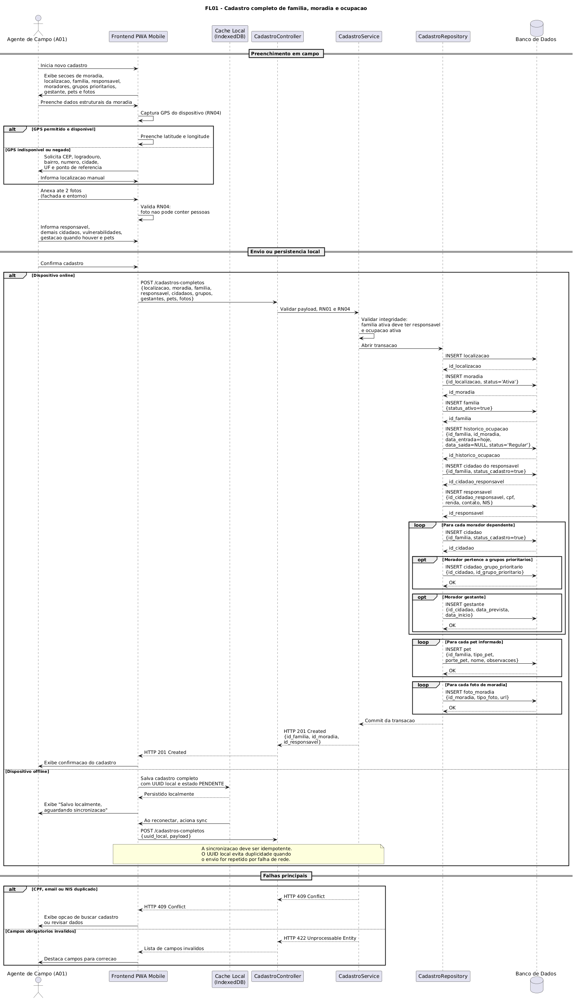

Este fluxo descreve a jornada de cadastro conduzida pelo **Agente de Campo (A01)** a partir do aplicativo mobile. O processo é estruturado em cinco sessões sequenciais: Moradia, Localização, Chefe de Família, Composição Familiar e Pets. Cada uma liberada somente após a confirmação da anterior, garantindo a integridade referencial dos dados antes do envio. Ao submeter o formulário completo, o Frontend dispara uma sequência ordenada de requisições `POST` que cria os registros em cascata (`LOCALIZACAO → MORADIA → CIDADAO → RESPONSAVEL → PET → FORMULARIO`), enquanto o Service aplica as regras de negócio RN01 (classificação de risco) e RN04 (restrição de fotos). O diagrama também contempla o **modo offline**, no qual o formulário é persistido em cache local via IndexedDB e sincronizado automaticamente ao restabelecer conexão, e o **caminho de exceção** de duplicidade de cadastro, que oferece ao agente as opções de busca, atualização ou cancelamento.

---

#### FL02 — Visualização de Mapa Georreferenciado

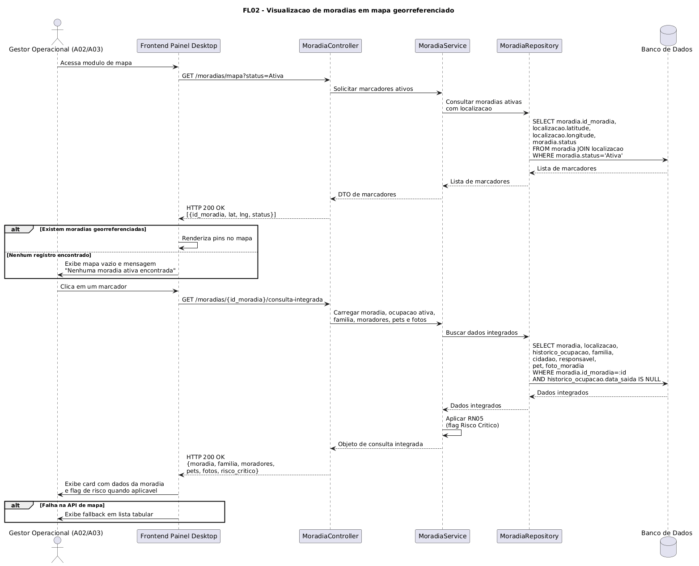

Este fluxo descreve a consulta ao mapa de risco realizada pelo **Diretor ou Gestor Operacional (A02/A03)** a partir do painel desktop. Ao acessar o módulo de mapa, o Frontend solicita ao backend a lista de moradias com coordenadas geográficas e nível de risco, que são renderizadas como marcadores coloridos (vermelho para Crítico, laranja para Alto, amarelo para Padrão). Ao clicar em um marcador, uma segunda requisição carrega os dados completos da moradia, momento em que o Service executa a **regra transversal FL11** para avaliar a condição de Risco Crítico (RN05) (presença de morador com deficiência que necessita de apoio) e injeta a flag correspondente na resposta. O diagrama também cobre os caminhos alternativos de ausência de dados georreferenciados e de falha na API de mapas.


---

#### FL03 - Consulta integrada de moradia e moradores

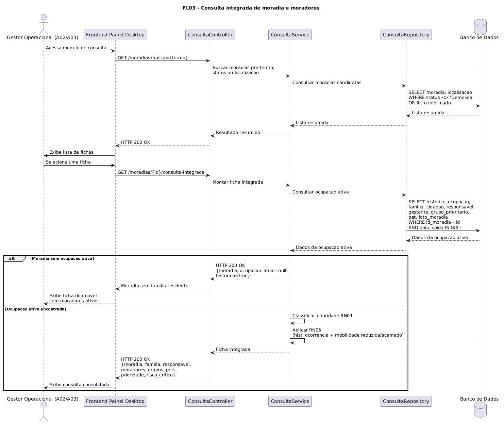

Este fluxo detalha a consulta integrada executada pelo **Gestor Operacional (A02/A03)** ao pesquisar ou selecionar uma ficha. O Frontend solicita uma listagem resumida de moradias e, após a seleção de um registro, carrega os dados completos da moradia, localização, ocupação ativa, família, responsável, moradores, gestantes, grupos prioritários, pets e fotos. A consulta utiliza o `historico_ocupacao` para identificar a família atualmente vinculada à moradia, considerando apenas ocupações com `data_saida` nula. Caso não exista ocupação ativa, o sistema retorna a ficha do imóvel sem moradores ativos. Quando há ocupação ativa, o Service calcula a prioridade de evacuação (RN01) e avalia a flag de Risco Crítico (RN05).

---

#### FL04 - Filtros avançados de moradias e assistidos

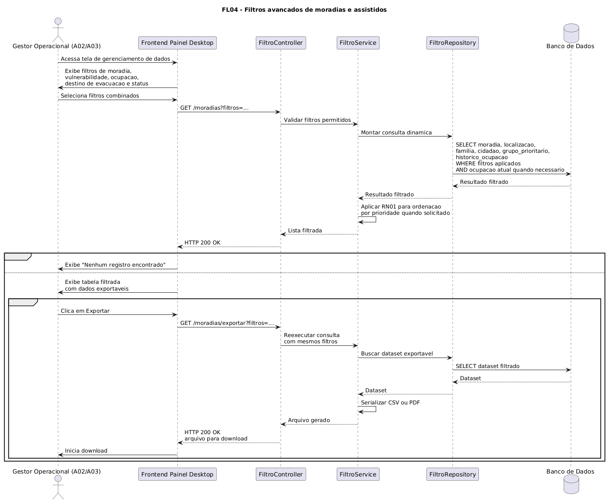

Este fluxo representa o uso de filtros avançados pelo **Gestor Operacional (A02/A03)** na tela de gerenciamento de dados. O usuário pode combinar critérios como status da moradia, condição de ocupação, grupos prioritários, vulnerabilidades, destino em caso de evacuação e situação de recadastro. O Frontend envia os filtros ao Controller, que delega ao Service a validação dos parâmetros e a montagem da consulta. O Repository cruza as tabelas `moradia`, `localizacao`, `historico_ocupacao`, `familia`, `cidadao`, `cidadao_grupo_prioritario` e `grupo_prioritario`, retornando uma lista filtrada. Quando não há resultados, o painel exibe uma mensagem orientativa. Quando há registros, o gestor pode exportar a listagem em formato CSV ou PDF.

---

#### FL05 - Atualização anual de dados pelo agente de campo

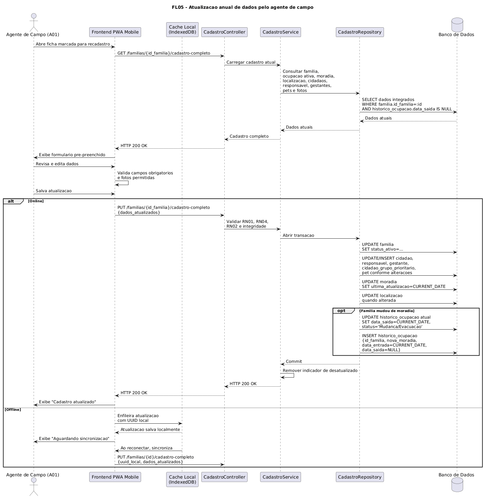

Este fluxo descreve a revisão anual de uma família marcada para recadastro, conduzida pelo **Agente de Campo (A01)**. O Frontend carrega o cadastro completo da família, incluindo ocupação ativa, moradia, localização, responsável, moradores, gestantes, pets e fotos. O agente revisa os dados em campo e envia as alterações para o backend, que valida as regras RN01, RN02 e RN04 antes de persistir as atualizações. Caso a família tenha mudado de moradia, o Service encerra o vínculo atual em `historico_ocupacao` com `data_saida` e cria uma nova ocupação ativa. Em modo offline, a alteração é enfileirada no cache local com UUID próprio e sincronizada posteriormente.

---

#### FL06 - Cadastro e manutenção de pets vinculados à família

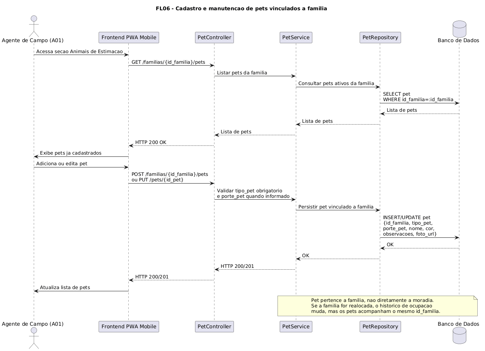

Este fluxo detalha a manutenção dos animais de estimação informados pelo **Agente de Campo (A01)**. O Frontend consulta os pets já vinculados à família e permite adicionar ou editar registros, sempre associando o animal ao `id_familia`, e não diretamente à moradia. Essa decisão acompanha o modelo de dados atual: se a família for realocada, os pets permanecem associados ao mesmo núcleo familiar, enquanto o histórico de ocupação registra a mudança de moradia. O Service valida os campos obrigatórios, como `tipo_pet`, e o Repository persiste os dados na tabela `pet`.

---

#### FL07 - Mapa de calor e indicadores de vulnerabilidade

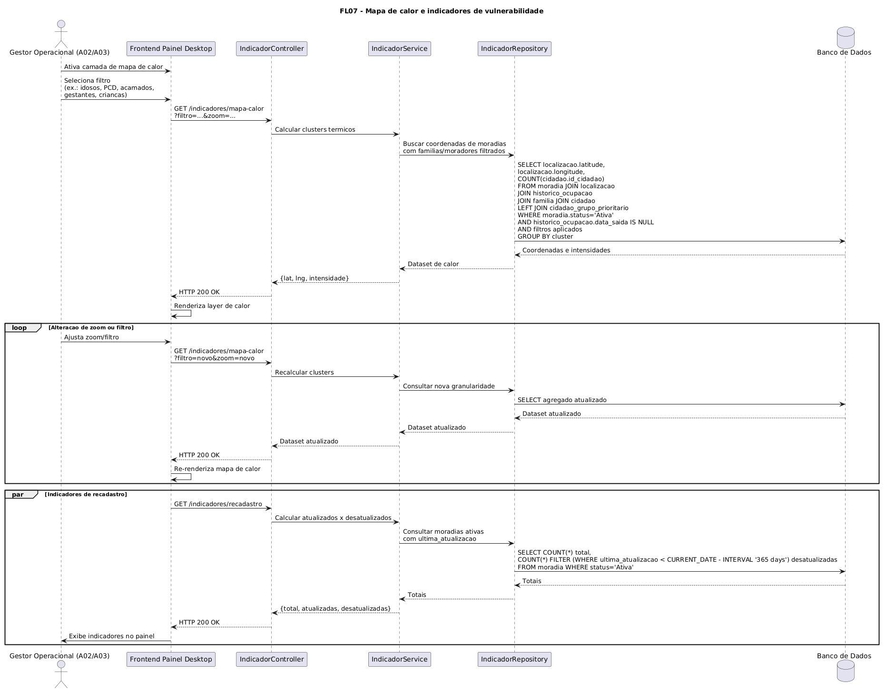

Este fluxo descreve a geração do mapa de calor utilizado pelo **Gestor Operacional (A02/A03)** para visualizar concentrações de vulnerabilidade no território. O usuário ativa a camada de calor e seleciona filtros como idosos, PCDs, acamados, gestantes ou crianças. O backend consulta moradias ativas, ocupações atuais e moradores vinculados aos grupos prioritários, agrupando coordenadas por intensidade. O Frontend renderiza a camada sobre o mapa e recalcula os clusters quando o usuário altera zoom ou filtro. Em paralelo, o painel pode consultar os indicadores de recadastro, exibindo o total de registros atualizados e desatualizados.

---

#### FL08 - Arquivamento lógico de moradia

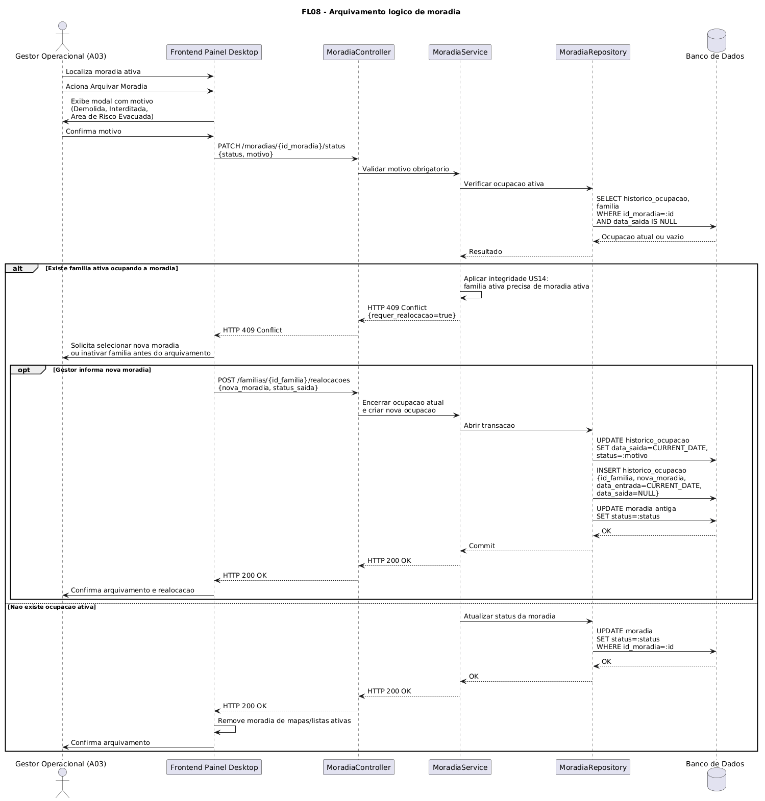

Este fluxo representa o arquivamento lógico de uma moradia pelo **Gestor Operacional (A03)**. O gestor seleciona uma moradia ativa, informa o motivo do arquivamento e envia a solicitação de alteração de status. O Service verifica se existe uma ocupação ativa vinculada à moradia por meio de `historico_ocupacao`. Se houver família ativa residindo no local, a operação é bloqueada com conflito, pois a US14 exige que toda família ativa possua uma moradia ativa vinculada. Nesse caso, o sistema solicita realocação ou inativação da família antes de concluir o arquivamento. Se não houver ocupação ativa, o status da moradia é atualizado sem exclusão física, preservando a rastreabilidade histórica conforme RN03.

---

#### FL09 - Arquivamento lógico de morador falecido

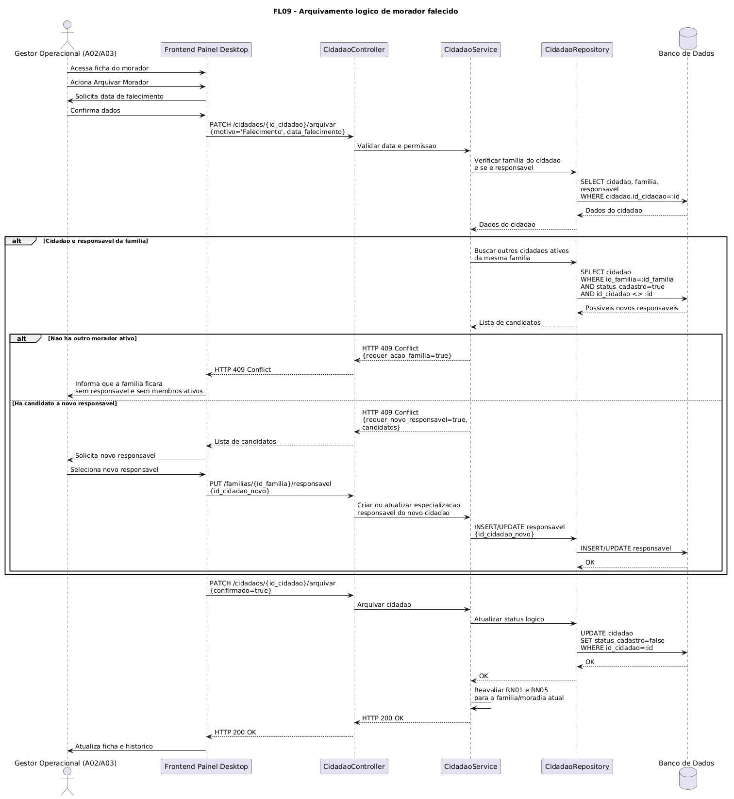

Este fluxo descreve o arquivamento lógico de um morador falecido realizado pelo **Gestor Operacional (A02/A03)**. O gestor informa a data de falecimento e confirma a operação. O Service verifica se o cidadão é o responsável da família. Caso seja, o sistema exige a escolha de um novo responsável ativo antes de concluir o arquivamento, preservando a integridade definida pela US13. Quando a substituição é resolvida, o cadastro do cidadão é inativado por meio de `status_cadastro=false`, sem deleção física. Após a atualização, o Service reavalia a prioridade da família e a regra de Risco Crítico, garantindo que consultas e relatórios ativos não exibam moradores arquivados.

---

#### FL10 - Alerta automático de recadastro a cada 12 meses

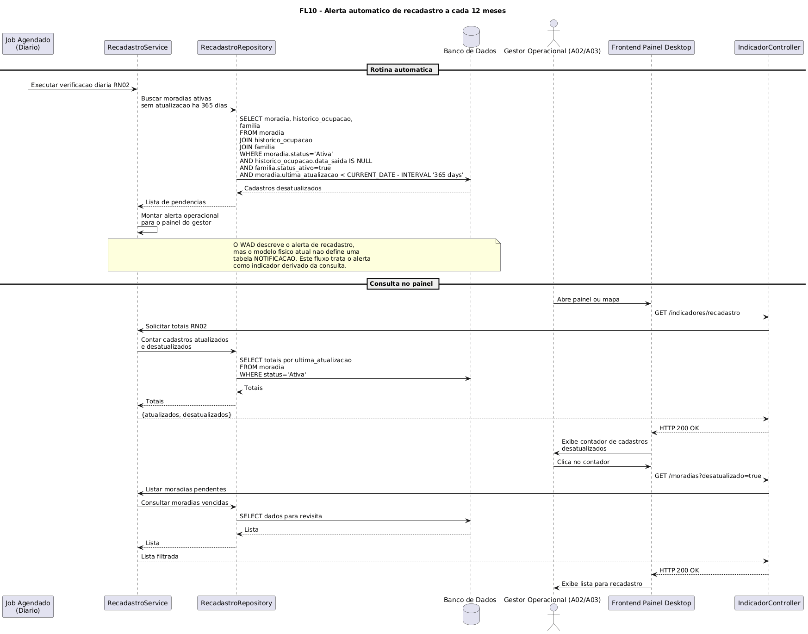

Este fluxo documenta a rotina de recadastro obrigatório prevista pela RN02. Um job agendado verifica diariamente moradias ativas cuja `ultima_atualizacao` tenha ultrapassado 365 dias. A consulta considera moradias com ocupação ativa e família ativa, evitando alertas sobre registros apenas históricos. No painel, o **Gestor Operacional (A02/A03)** consulta os indicadores de recadastro e visualiza o total de cadastros atualizados e desatualizados. Ao clicar no indicador, o Frontend redireciona para a listagem de moradias com o filtro `desatualizado=true`, permitindo organizar as revisitas de campo.

---

#### FL11 - Regra transversal de Risco Crítico (RN05)

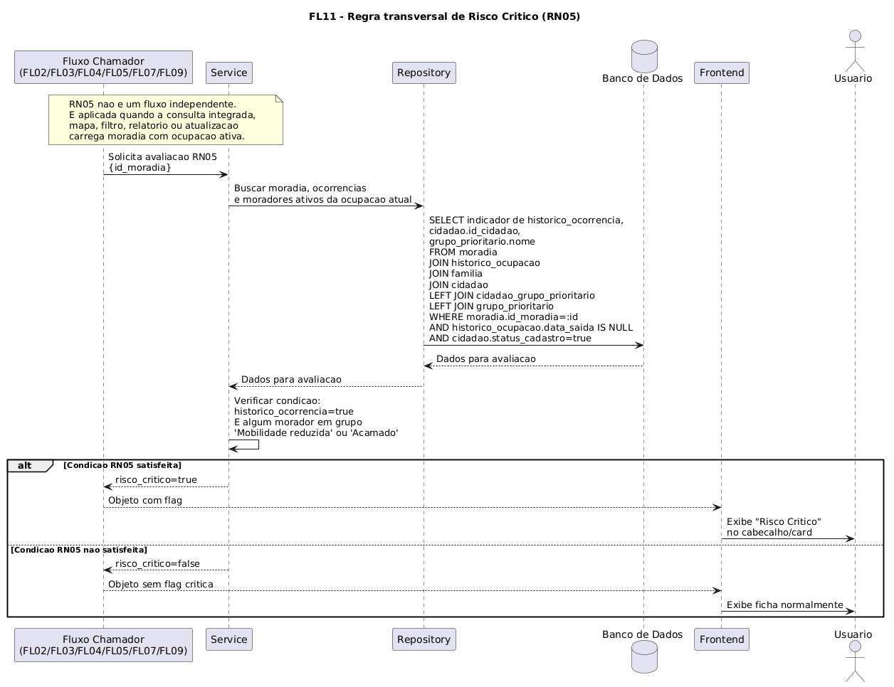

Este fluxo representa uma regra transversal, acionada por outros fluxos sempre que uma moradia e seus moradores ativos são carregados para exibição. O Service consulta a moradia, a ocupação ativa, a família residente e os cidadãos vinculados aos grupos prioritários. A condição RN05 é satisfeita quando a moradia possui histórico de ocorrência e existe ao menos um morador ativo classificado com mobilidade reduzida ou acamado. Quando a condição é verdadeira, a resposta recebe `risco_critico=true`, permitindo que o Frontend destaque a flag "Risco Crítico" em cards, fichas e consultas integradas. Quando a condição não é satisfeita, a ficha é exibida sem o alerta.

---

#### FL12 - Validação transversal de integridade cadastral

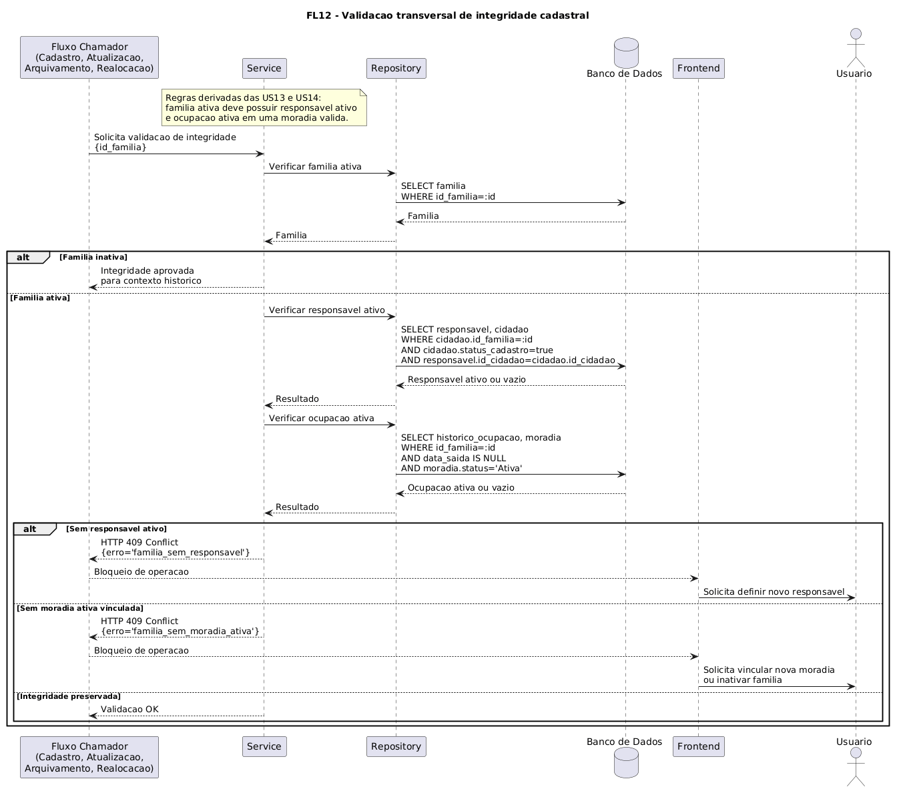

Este fluxo consolida as validações derivadas das US13 e US14. Ele não representa uma tela isolada, mas uma regra transversal chamada por operações de cadastro, atualização, arquivamento e realocação. Sempre que uma família ativa é alterada, o Service verifica se existe responsável ativo vinculado e se há uma ocupação ativa em moradia válida. Se a família ficar sem responsável, a operação é bloqueada e o usuário deve definir um novo responsável. Se a família ficar sem moradia ativa, o sistema exige a criação de uma nova ocupação ou a inativação da família. Essa validação impede inconsistências cadastrais e preserva a coerência entre `familia`, `responsavel`, `moradia` e `historico_ocupacao`.


### 3.2.5. Diagrama de Atividades ou Estados (sprint 3)

*Ao menos um fluxo relevante em UML ou BPMN. Use a notação da ferramenta escolhida de forma consistente (sem misturar convenções).*

### 3.2.6. Diagrama de Implantação (sprints 4 e 5)

*Diagrama UML de deployment mostrando nós físicos, artefatos e canais de comunicação. Representa a visão Engineering + Technology do RM-ODP.*

### 3.2.7. Padrões de Projeto Aplicados (sprints 3 a 5)

Durante o desenvolvimento do backend do GeoRisco, foram aplicados padrões arquiteturais voltados à separação de responsabilidades, testabilidade e manutenção das regras de negócio. A aplicação foi estruturada em camadas, utilizando TypeScript, Express, PostgreSQL e Supabase Storage.

| Padrão / Conceito Arquitetural | Aplicação no GeoRisco | Justificativa |
| :--- | :--- | :--- |
| **Arquitetura em Camadas** | O backend está organizado em `routes`, `controllers`, `services`, `repositories`, `dtos`, `models`, `validations`, `errors`, `db` e `storage`. | Essa divisão separa entrada HTTP, regras de negócio, persistência e infraestrutura. Isso facilita manutenção em um sistema com cadastros de pessoas, moradias, famílias, pets, fotos e vínculos históricos. |
| **Controller** | Os controllers recebem requisições, extraem parâmetros, normalizam payloads e retornam respostas HTTP. | Evita que regras de negócio e SQL fiquem misturados com detalhes de rota, status code e renderização de views/API. |
| **Service Layer** | Os services concentram validações de negócio, transações e orquestração entre repositories. | Necessário para operações compostas, como cadastro de responsável, criação de núcleo familiar, vínculo entre família e moradia e upload de fotos. |
| **Repository Pattern** | Os repositories encapsulam consultas SQL e acesso ao PostgreSQL. | Isola a persistência da lógica de negócio, permitindo alterar queries, views ou estratégia de banco sem impactar diretamente controllers e services. |
| **DTO (Data Transfer Object)** | Os DTOs definem os formatos de entrada e saída usados em cadastros, buscas, fotos, moradias e famílias. | Ajuda a controlar os dados trafegados entre frontend e backend, reduzindo exposição desnecessária de campos sensíveis e padronizando contratos da API. |
| **Dependency Injection por Construtor** | Controllers recebem services, e services recebem repositories por construtor, baseados em interfaces. | Reduz acoplamento entre classes e facilita testes com mocks, como nos testes de controller e persistência. |
| **Interface Segregation / Contratos** | Existem interfaces específicas para services e repositories, como `IPessoaService`, `IPessoaRepository`, `IFamiliaService` e equivalentes. | Os contratos deixam claro o que cada camada pode consumir, evitando dependência direta de implementação concreta. |
| **Validação Centralizada** | Arquivos em `validations/` e funções de normalização em `request-utils.ts` validam payloads, IDs, datas, números e campos obrigatórios. | Garante consistência nos dados antes de persistir informações sensíveis e reduz duplicação de validação nos controllers. |
| **Custom Exception** | A classe `HttpError` representa erros de negócio com status HTTP definido. | Permite diferenciar erros esperados, como ID inválido ou registro não encontrado, de falhas internas do servidor. |
| **Tratamento Centralizado de Erros** | A função `handleControllerError` padroniza respostas de erro nos controllers. | Evita repetição de lógica de erro e impede que detalhes técnicos sejam expostos ao usuário final. |
| **Transação na Camada de Serviço** | Operações que afetam múltiplas tabelas usam `BEGIN`, `COMMIT` e `ROLLBACK` nos services. | Mantém integridade em fluxos críticos, como criação de responsável, moradia com localização e núcleo familiar completo. |
| **Adapter / Facade para Serviço Externo** | O acesso ao Supabase Storage fica isolado em `storage/supabase-storage.client.ts` e no `FotoStorageService`. | Centraliza a integração externa de armazenamento de fotos, evitando que controllers e repositories dependam diretamente da API do Supabase. |

## 3.3. Wireframes (sprint 2)

Esta seção é destinada para apresentar os primeiros esboços do sistema: os wireframes. Além de ser a representação das telas de menor fidelidade com o resultado final, esses 

Um wireframe é um quadro (frame) com a estrutura do sistema desenhada em fios (wire) ou blocos de maneira bastante simples.

Vale ressaltar que todas as informações presentes nos wireframes são apenas para facilitar a visualização futura de uma aplicação funcional. Caso alguma informação precise ser adicionada ou excluída, isso será possível futuramente.

### **1. Página Inicial**

<div align="center">
    <p>Figura 7: Wireframe Tela Inicial</p>
    
    <p>Feito pela própria equipe (2026)</p>
</div>

Num primeiro momento, a ideia desse wireframe é a simplicidade e a intuitividade. O layout escolhido, com três grandes botões centralizados, e um cabeçalho, importante mas não principal, posicionado na parte de cima, tem como objetivo trazer poucas informações na tela, servindo apenas para uma recepção amigável e uma navegação intuitiva entre outras páginas.

Além disso, na parte superior, exitem duas logos: Defesa civil de Santo André (círculo maior) e Prefeitura de Santo André (círculo menor). Junto dessas logos, respectivamente, tem um texgo generalizado (como "Olá Agente!") e um texto de cabeçalho simples. Por fim, a engrenagem no canto superior esquerdo significa uma possível aba de configurações.

Por fim, mas não menos importante, o menu de navegação presente na parte inferior inteira da tela, contém ícones referentes aos três grandes botões. Isso foi implementado como um "rodapé" fixo para a aplicação, presente em todo o restante das telas, a fim de facilitar a navegação entre telas, deixando o usuário mais livre para transitar entre tarefas.

---

### **2. Páginas de Cadastro**

Ao clicar no botão "Novo Cadastro", o usuário será redirecionado para a tela de cadastro, para inserir novos dados de pessoas e moradias no banco de dados.

A ideia inicial é seguir uma ordem, separando cada seção por tela e guiando o usuário com setas indicando "próximo" e "voltar". No entanto, com o objetivo de deixar a navegação o mais livre possível, foi pensada uma barra na parte superior da tela, abaixo do cabeçalho, contendo quatro botões clicáveis que redirecionam para cada seção.

Quanto ao menu de navegação, ele será mantido na parte inferior da tela, da mesma forma que foi inserido na tela inicial.

Para concluir o cadastro, um botão "Concluir Cadastro" deve ser exibido assim que todos os campos obrigatórios forem preenchidos. (Obs: os campos obrigatórios ainda não foram definidos completamente na sprint 3, por isso os wireframes não os abordam)

---

<div align="center">
    <p>Figura 9: Wireframe Tela Cadastro - Moradias</p>
    
    <p>Feito pela própria equipe (2026)</p>
</div>

Esta seção engloba todas as informações necessárias para completar o cadastro das moradias. 

Uma funcionalidade adicional que vale a pena ressaltar, é a de inclusão de imagens. No bloco de "Referência Geográfica", será possível adicionar uma imagem tanto por foto quanto por upload, além de ser possível excluí-la.

Outra funcionalidade interessante é a de seleção de múltipla escolha em um bloco, representada por uma seta para baixo que, ao clicar, são exibidos todos os preenchimentos possíveis para aquele campo.

Neste wireframe, por conter uma tela bastante preenchida com informações pertinentes, os botões "Próximo" e "Voltar" não estão representados. Porém, é possível identificar uma barra na lateral direita, sinalizando que a página pode ser arrastada para baixo.

---

<div align="center">
    <p>Figura 10: Wireframe Tela Cadastro - Responsável</p>
    
    <p>Feito pela própria equipe (2026)</p>
</div>

Esta seção engloba todas as informações necessárias para completar o cadastro do responsável.

A ideia desta tela se assemelha muito à anterior, contendo campos de informação preenchíveis, tanto por digitação quanto por múltipla escolha. No entanto, esta página não terá um campo que permita a adição de fotos ou arquivos.

Neste wireframe, por conter uma tela bastante preenchida com informações pertinentes, os botões "Próximo" e "Voltar" não estão representados. Porém, é possível identificar uma barra na lateral direita, sinalizando que a página pode ser arrastada para baixo.

---

<div align="center">
    <p>Figura 11: Wireframe Tela Cadastro - Moradores</p>
    
    <p>Feito pela própria equipe (2026)</p>
</div>

Esta seção engloba todas as informações necessárias para completar o cadastro dos moradores restantes.

Nesse wireframe, algumas informações que estavam presentes na seção 2 serão preservadas, mas outras (como renda) serão removidas, com o intuito de deixar mais simples. 

Além disso, vale ressaltar que na imagem está representado apenas o preenchimento de um morador. No caso de existir mais moradores, o usuário deve clicar na área tracejada "+ Adicionar Morador". Assim, um novo bloco de campos preenchíveis, com as mesmas informações, deve surgir para registro e a área tracejada deve ser exibida logo abaixo o novo bloco de campos.

---

<div align="center">
    <p>Figura 12: Wireframe Tela Cadastro - Pets</p>
    
    <p>Feito pela própria equipe (2026)</p>
</div>

Esta seção engloba todas as informações necessárias para concluir o cadastro de Pets (se houver).

Para o cadastro de Pets, será possível incluir algumas informações essenciais e uma foto do animal. No caso de existir mais de um animal, o usuário deve clicar na área tracejada "+ Adicionar Animal". Assim, um novo bloco de campos preenchíveis, com as mesmas informações, deve surgir para registro e a área tracejada deve ser exibida logo abaixo o novo bloco de campos.

---

### **3. Página de Mapa**

<div align="center">
    <p>Figura 13: Wireframe Tela Mapa</p>
    
    <p>Feito pela própria equipe (2026)</p>
</div>

Esta seção permite a interação com um mapa georreferenciado e refinar a exibição de dados utilizando um menu lateral de Filtros com diversas caixas de seleção. Além disso, uma peculiaridade dessa seção é a possibilidade de recolher esse painel de filtros para maximizar a área visual do mapa, bem como a barra retratil de navegação no inferior da tela, que permite ao usuário alternar agilmente entre os módulos de "Mapa", "Formulário" e "Consulta".

### **4. Página de Busca**

<div align="center">
    <p>Figura 14: Wireframe Tela Busca - </p>
    
    <p>Feito pela própria equipe (2026)</p>
</div>

Esta seção permite a localização rápida de registros no sistema através de um campo de busca textual localizado no topo da tela. Para refinar a pesquisa e direcionar os resultados, o usuário conta com seletores sob o título "Tipo de pesquisa", permitindo alternar de forma simples entre a busca por dados de "Moradia" ou por "Responsável".

Os dados encontrados são apresentados na área de "Resultados" em formato de lista contínua com cartões (cards). Cada cartão é estruturado para exibir uma imagem ou foto de referência à esquerda, acompanhada de linhas detalhadas de informações textuais à direita. Além disso, a tela preserva a barra retrátil de navegação na área inferior, garantindo que o usuário possa expandi-la para alternar agilmente entre os demais módulos do sistema.

<div align="center">
    <p>Figura 15: Wireframe Tela Resultado da Busca</p>
    
    <p>Feito pela própria equipe (2026)</p>
</div>

Esta seção apresenta o detalhamento de um registro específico, acessado após a etapa de pesquisa. No topo, a interface mantém a barra superior e um campo de busca em destaque (com um ícone de lupa), pois o detalhamento aparece como um pop-up sobre a tela de busca, permitindo que o usuário mantenha o contexto e a possibilidade de alternar rapidamente para outros registros. O layout do detalhamento é dividido em duas colunas: à esquerda, uma imagem ou foto de referência relacionada ao registro; à direita, um conjunto organizado de informações textuais, estruturadas em linhas para facilitar a leitura e compreensão dos dados apresentados.


## 3.4. Guia de estilos (sprint 3)

Esta seção apresenta o guia de estilos utilizado no desenvolvimento da aplicação web. Aqui estão definidos os padrões visuais e componentes de interface adotados, como cores, tipografia, botões, ícones e demais elementos gráficos. O objetivo é garantir consistência visual, padronização e melhor experiência de uso durante o desenvolvimento e evolução da solução.

<div align="center">
    <p>Figura 16: Guia de estilos</p>
    
    <p>Feito pela própria equipe (2026)</p>
</div>

### 3.4.1 Cores

A a paleta de cores pensada para a prototipação foi inspirada na logo oficial da própria Defesa Civil de Santo André e do CREDEC-SA (Centro de Resiliência às Emergências de Defesa Civil de Santo André). Logos: 

<div align="center">
    <p>Figura 17: Logo da Defesa Civil de Santo André</p>
    
    <p>Defesa Civil de Santo André</p>
</div>

<div align="center">
    <p>Figura 18: Logo do CREDEC-SA</p>
    
    <p>CREDEC-SA</p>
</div>

A equipe decidiu usar dois tons de azul, um de laranja e três cores neutras. A composição da paleta ficou assim: 

- Azul Escuro: #182C4C
- Azul Claro: #004ea1
- Laranja: #ff7500
- Cinza Escuro: #5e5e5e
- Cinza Claro: #9f9f9f
- Branco: #ffffff 


### 3.4.2 Tipografia

A família tipográfica utilizada na solução é a **DM Sans**, uma fonte geométrica sem serifa (sans-serif) de baixo contraste, projetada pela Colophon Foundry. É ideal para textos legíveis em tamanhos menores e apresenta formas geométricas claras que transmitem um tom neutro e objetivo.

| Estilo | Peso | Tamanho | Uso |
|---|---|---|---|
| Título | DM Sans Bold | 64px | Títulos principais de página |
| Header 1 | DM Sans Regular | 48px | Cabeçalhos de seção primária |
| Header 2 | DM Sans Regular | 40px | Cabeçalhos de seção secundária |
| Header 3 | DM Sans Regular | 36px | Cabeçalhos terciários |
| Header 4 | DM Sans Regular | 32px | Cabeçalhos quaternários |
| Header 5 | DM Sans Regular | 24px | Cabeçalhos de menor hierarquia |
| Corpo / Label | DM Sans Light | 16px | Textos descritivos, legendas e rótulos de componentes |

A cor de texto primária é `#1a1a2e`, utilizada em headers e corpo sobre fundo branco ou claro. Em fundos coloridos, aplica-se texto branco (`#ffffff`).

### 3.4.3 Iconografia e Imagens

A solução utiliza um conjunto de ícones de linha (outline) com estilo geométrico, coerente com a tipografia DM Sans.

**Atributos de aplicação:**

- **Cor padrão:** `#5e5e5e` — ícones em estado neutro
- **Cor ativa:** `#004ea1` — ícones em estado selecionado ou ação principal
- **Cor sobre fundo escuro:** `#ffffff` — sobre fundos `#182C4C` ou `#004ea1`
- **Tamanho padrão:** 24×24px

| Ícone | Função |
|---|---|
| Documento | Representar arquivos ou conteúdos |
| Casa | Navegação para a tela inicial |
| Lupa | Acionar campo de pesquisa |
| Copiar | Duplicar conteúdo ou elemento |
| Editar | Editar informações |
| Diamante | Indicar item especial ou favorito |
| Localização | Indicar endereço ou mapa |
| Upload | Enviar ou exportar conteúdo |
| Lixeira | Excluir item |
| Grade | Visualização em formato de tabela |
| Filtro | Filtrar listagens ou resultados |
| Seta | Navegar para o próximo passo ou página |

## 3.5. Protótipo de alta fidelidade (sprint 3)

### Protótipo Tela Inicial

A tela inicial apresenta o logotipo da Defesa Civil de Santo André centralizado
no topo, sobre um fundo azul gradiente, seguido da saudação **"Bem vindo, Agente."**
com destaque em laranja no nome do perfil.

O conteúdo principal exibe três opções de navegação em formato de cards:

- **Cadastro** — card destacado com fundo azul e borda laranja, indicando a ação
  primária da tela. Contém ícone de documento à esquerda e seta de navegação à direita.
- **Busca** — card secundário com fundo branco, ícone de lupa e seta de navegação.
- **Mapa** — card secundário com fundo branco, ícone de localização e seta de navegação.

Na parte inferior, uma barra de navegação fixa exibe os três atalhos principais:
**Cadastro**, **Mapa** (ativo) e **Busca**, com ícones e rótulos de texto.

---

<div align="center">
    <p>Figura 18: Mockup da Tela Inicial </p>
    
    <p>Feito pela própria equipe (2026)</p>
</div>

### Protótipos da Tela de Mapa

A tela de mapa exibe um cabeçalho azul escuro com o logotipo da Defesa Civil à
esquerda, o título **"Visualização"** centralizado e um ícone de home à direita
para retornar à tela inicial.

O conteúdo principal é ocupado por um mapa interativo da região de Santo André,
sobre o qual é sobreposto um painel lateral de **Filtros** no canto esquerdo.
O painel possui borda laranja, fundo branco e lista categorias de ocorrências
selecionáveis via checkbox. Um botão com seta **"<"** permite recolher o painel,
expandindo a área visível do mapa.

A barra de navegação inferior mantém o padrão da aplicação com os atalhos
**Cadastro**, **Mapa** (ativo) e **Busca**.

 <div align="center">
    <p>Figura 19: Mockup Tela de Mapa </p>
    
    <p>Feito pela própria equipe (2026)</p>
</div> 

### Protótipos da Tela de Busca

A tela de busca mantém o cabeçalho padrão com logotipo, título **"Busca"** e
ícone de home. Abaixo, um campo de texto com ícone de lupa permite inserir termos
de pesquisa, acompanhado de um botão de filtro à direita.

Os resultados são exibidos abaixo do label **"Resultados:"** em azul, com um
contador de registros encontrados ("4 encontrados") alinhado à direita.

Cada resultado é apresentado em um card com borda arredondada contendo:
- **Nome completo** em destaque e CPF como subtítulo
- **Localização** (bairro), **quantidade de pessoas** e **quantidade de pets**
  com ícones correspondentes
- **Tags coloridas** indicando vulnerabilidades do cadastro (ex.: Gestante,
  Criança, Idoso, Doença Crônica), cada uma com cor própria
- Botão **"Editar"** com ícone à direita e botão de **exclusão** (lixeira) abaixo

A barra de navegação inferior mantém o padrão com **Cadastro**, **Mapa** (ativo)
e **Busca**.

 <div align="center">
    <p>Figura 20: Mockup Tela de Busca </p>
    
    <p>Feito pela própria equipe (2026)</p>
</div> 

### Protótipos das telas de Cadastro

Estes protótipos apresentam grandes semelhanças entre eles, visto que possuem quase que a mesma funcionalidade. Entre elas estão, barra azul superior, barra de navegação entre seções, título indicando seção, menu de navegação inferior, botão "Próximo" (embora na seção 2 não seja possível ver), campos para preenchimento de informações, sinalização de obrigatoriedade (* vermelho) e barra lateral indicando possível arraste da página ("scroll up" e "scroll down")

Além disso, os protótipos apresentam funcionalidades em comum, sendo elas: a barra de navegação entre seções indica em qual seção o usuário está (deixando o bloco referente à seção atual azul); o botão "Concluir", apesar de ausente, é exibido assim que o usuário completar todos os campos obrigatórios em qualquer seção; campos preenchíveis por digitação, seleção múltipla, "sim ou não", seleção de data e adição de imagens. 

---

<div align="center">
    <p>Figura 19: Mockup da Seção 1 de Cadastro </p>
    
    <p>Feito pela própria equipe (2026)</p>
</div>

A primeira tela ao clicar no botão "Cadastro" da tela inicial é a seção 1, referente à entrada dos dados da moradia. A partir daqui, o usuário fica livre para navegar entre as seções de cadastro conforme o contexto da entrevista com os moradores evolui. 

A primeira seção engloba todos os dados necessários para o cadastro da moradia visitada. 

Um detalhe bastante importante sobre a mudança dos wireframes para os mockups é a disposição da barra superior da tela. As mudanças citadas a seguir se aplicam à todas as telas de cadastro: exclusão do botão de configurações; exclusão da imagem de logo à esquerda; reposicionamento da logo da Defesa Civil de Santo André; exclusão do pequeno texto acompanhado da logo; adição do ícone de casa (redireciona para a tela inicial). 

Este protótipo já apresenta exemplos de informações a serem adicionadas nos campos e como ficaria com todos preenchidos, incluindo a imagem de referência minimizada.

---

<div align="center">
    <p>Figura 20: Mockup da Seção 2 de Cadastro </p>
    
    <p>Feito pela própria equipe (2026)</p>
</div>

A segunda seção engloba todos os dados necessários para o cadastro do responsável pela família/moradia. 

Este protótipo, diferente do anterior, mostra como são os campos de resposta "sim ou não" (boolean) e sinaliza exatamente como o menu inferior interage com o restante dos elementos na tela: opacidade parcial. Além disso, esta tela, por conter uma quantidade maior de informações, não mostra os campos de problema crônico, medicamento e prioridade que, por sua vez, estão ocultos juntos do botão de próximo. Todo o conteúdo poderá ser visualizado com um simples arraste na tela para baixo.

Este protótipo já apresenta exemplos de informações a serem adicionadas nos campos e como ficaria com todos preenchidos.

---

<div align="center">
    <p>Figura 21: Mockup da Seção 3 de Cadastro </p>
    
    <p>Feito pela própria equipe (2026)</p>
</div>

A terceira seção engloba todos os dados necessários para o cadastro de todos os moradores da moradia visitada. 

Este protótipo, basicamente imita a estrutura dos dois anteriores e indica todas as informações obrigatórias ou não e o tipo de preenchimento. Por outro lado, esta seção e a próxima apresentam um novo grande botão tracejado. No caso dessa página, ao clicar, o usuário adicionará mais um morador. Além disso, os dados preenchidos do primeiro morador devem ser ocultos e compactados para uma longa barra horizontal que, se clicada, expandirá todos os dados do morador cadastrado. O botão "+Adicionar Morador" estará sempre visível abaixo do último formulário incompleto ou expandido. 

Vale a pena ressaltar que os dados de moradores, selecionados pela equipe, também estão presentes na seção 2 (Responsável), mas apenas os dados que foram julgados essenciais ficaram para a seção 3.

Este protótipo já apresenta exemplos de informações a serem adicionadas nos campos e como ficaria com todos preenchidos.

---

<div align="center">
    <p>Figura 22: Mockup da Seção 4 de Cadastro </p>
    
    <p>Feito pela própria equipe (2026)</p>
</div>

A quarta seção engloba todos os dados necessários para o cadastro de todos os pets/animais vinculados à moradia visitada. 

Este protótipo é bastante semelhante ao anterior em termos de estrutura, porém apresenta informações diferentes a serem preenchidas, já que aqui o assunto é um animal, e não uma pessoa. 

A funcionalidade de adicionar mais de um cadastro também está presente aqui e, assim como na seção 1 (Moradia), existe a possibilidade de ser cadastrada uma imagem de referência do(s) animal(is), mas agora com um campo que indique o nome do arquivo inserido.

Por fim, é apenas nesse protótipo que o botão "Concluir" está representado porque entende-se que, mesmo com a liberdade de escolha para a ordem de preenchimento dos dados, a seção de pets muitas vezes será a última.

Este protótipo já apresenta exemplos de informações a serem adicionadas nos campos e como ficaria com todos preenchidos, incluindo com imagens.


---

[Link para visualização do protótipo](https://www.figma.com/design/9C6LICPO1RCl5y9UaVsCQo/Mockups?node-id=0-1&p=f&t=KbpgFnX3YR4LP3ui-0)

---

## 3.6. Modelagem do banco de dados (sprints 2 e 4)

### 3.6.1. Modelo Entidade-Relacionamento (MER)

O **Modelo Entidade-Relacionamento (MER)** é uma abordagem conceitual que representa a estrutura de dados de um sistema através da identificação de entidades (objetos do mundo real), seus atributos e os relacionamentos entre elas. Para este projeto, adotamos a **notação Chen**, que utiliza retângulos para entidades, losangos para relacionamentos, elipses para atributos e triângulos para especializações, oferecendo clareza visual e conformidade com padrões acadêmicos e profissionais.

<div align="center">
    <p>Figura 16: Modelo Entidade-Relacionamento</p>
    
    <p>Feito pela própria equipe (2026)</p>
</div>

O modelo de dados foi estruturado seguindo as melhores práticas de normalização, rastreabilidade e integridade referencial, com foco em sistemas governamentais. As principais decisões arquiteturais refletidas no diagrama são:

#### 1. Herança e Especialização (Pessoa e Responsável)
Para evitar redundância de dados e focar no Responsável da Família, adotamos o padrão de herança (representado pelo triângulo na notação Chen).
* **`Pessoa` (Superclasse):** Centraliza os atributos universais (Nome Social, Data de Nascimento, Escolaridade, Situação Ocupacional, Medicação, Status).
* **`Responsável` (Subclasse):** Herda atributos de Pessoa e agrega dados específicos de gestão familiar: CPF, NIS, Renda, Programas Sociais, dados de contato (Telefone, Email) e informações de residência.

#### 2. Agrupamento Lógico por `Família`
Em vez de vincular dezenas de indivíduos diretamente a uma moradia de forma solta, criamos a entidade agrupadeira **`Família`**.
* Toda `Pessoa` está vinculada a uma `Família` (relacionamento *Pertence*) com cardinalidade (0, n).
* A `Família` possui obrigatoriamente um `Responsável` com cardinalidade (1, n).
* **Vantagem Técnica:** Essa decisão facilita o trânsito de dados. Se uma enchente desalojar 6 pessoas de uma casa, o sistema precisa atualizar apenas o registro da entidade `Família` na tabela `ocupa`, e todos os membros herdam a mudança automaticamente.

#### 3. Rastreabilidade e Histórico (Relacionamento N:N "ocupa")
O maior desafio resolvido neste modelo foi a preservação do histórico de ocupação sem duplicar dados físicos. A estrutura da **`Moradia`** (localização geográfica, CEP, características construtivas) é imutável. O que muda é quem mora lá.
* Criamos o relacionamento **Muitos-para-Muitos (N:N)** chamado **`ocupa`** entre `Família` e `Moradia`, com cardinalidade (0, n) em ambas as extremidades.
* Este relacionamento gera uma tabela associativa contendo atributos temporais: **`DataEntrada`** e **`DataSaida`**, permitindo rastrear períodos de ocupação.
* **Como funciona:** Quando uma família se muda ou é evacuada, preenchemos a `DataSaida` do vínculo atual e criamos um novo vínculo com a nova moradia. Assim, temos a linha do tempo exata de por quais imóveis a família passou e quais famílias já ocuparam determinadas moradias de risco, sem perder nenhum dado histórico.

#### 4. Exclusão Lógica (Soft Delete) e Estados Operacionais
Em conformidade com a LGPD e regras de auditoria pública, **nenhum dado é deletado fisicamente (DROP/DELETE)**.
* Inserimos o atributo **`Status`** nas entidades vitais (`Pessoa` e `Moradia`).
* Se um morador sai do município, o status da `Pessoa` fica inativo. Se uma moradia é desapropriada ou demolida, o status é atualizado para o estado correspondente. O histórico permanece intacto para auditoria.

#### 5. Entidades Satélites Flexíveis
* **`Foto`:** Ligada em uma relação (0, n) com `Moradia`, permitindo criar uma galeria de fotos para identificação e documentação visual da moradia.
* **`Pet`:** Relacionada a `Pessoa` (0, n), registrando animais de estimação dependentes para logística humanitária em evacuações.
* **`GrupoPrioritario`:** Relacionada a `Pessoa` (0, n), permitindo associar cidadãos a listas de vulnerabilidade (ex: Acamados, Deficientes Visuais), agilizando a logística de resgates em emergências.

#### 6. Localização Geográfica e Referência Endereçal
A entidade **`localizacao`** centraliza dados geográficos e endereçais:
* Relacionada a `Moradia` (1, 1), garantindo que cada imóvel possui uma localização única e imutável.
* Armazena **Latitude**, **Longitude**, **CEP**, **Logradouro**, **Bairro**, **Cidade**, **Estado**, **Número**, **Referência** e **Complemento**, permitindo georreferenciamento preciso e retroação em mapas de risco.

### 3.6.2. Modelo Lógico

O modelo lógico traduz o modelo conceptual para a estrutura de um banco de dados relacional, definindo as tabelas, as chaves primárias (PK), as chaves estrangeiras (FK) e a multiplicidade dos relacionamentos. Esta versão está rigorosamente alinhada com as decisões arquiteturais adotadas para a plataforma Supabase, com ênfase na rastreabilidade temporal, na conformidade com as leis de proteção de dados (deleção lógica) e na especialização das entidades.

#### Diagrama de Entidade-Relacionamento (DER)

Abaixo é apresentado o esquema visual do banco de dados, ilustrando as tabelas físicas, os seus atributos e os relacionamentos implementados.

<div align="center">
    <p>Figura 17: Diagrama Entidade-Relacionamento Lógico</p>
    
    <p>Feito pela própria equipe (2026)</p>
</div>
---

#### 1. Entidades Principais e Especializações

**Pessoa**
Entidade base (superclasse) que guarda os dados demográficos e de saúde básicos de qualquer morador ou cidadão assistido.
* **Campos:** `id` (PK), `nome`, `nome_social`, `data_de_nascimento`, `parentesco`, `situacao_ocupacional`, `escolaridade`, `cronico`, `medicacao`, `status`, `deleted_at`.

**Responsável**
Subclasse de `Pessoa` (Herança 1:1), responsável por isolar e armazenar os dados burocráticos, financeiros e de contacto (dados sensíveis) do chefe de família.
* **Campos:** `id_pessoa` (PK, FK para `pessoa`), `cpf`, `nis`, `renda`, `sexo`, `raca`, `estado_civil`, `veiculo`, `programa_social`, `email`, `telefone`, `nome_do_pai`, `nome_da_mae`, `local_de_nascimento`, `data_residencia_estado`, `data_residencia_moradia`.

**Família**
Atua como a entidade agregadora central do sistema (*hub*), permitindo agrupar os cidadãos e os respetivos animais de estimação independentemente da moradia física, o que facilita sobremaneira as transições e relocalizações em casos de desalojamento.
* **Campos:** `id` (PK), `status`, `deleted_at`.

**Localização**
Isola as coordenadas geográficas e o endereço do imóvel, viabilizando o processamento de dados espaciais e a geração de mapas de calor para a Defesa Civil.
* **Campos:** `id` (PK), `logradouro`, `numero`, `bairro`, `cidade`, `estado`, `cep`, `latitude`, `longitude`, `referencia`, `complemento`.

**Moradia**
Representa a infraestrutura residencial ou comercial atrelada a uma localização espacial unívoca.
* **Campos:** `id` (PK), `id_localizacao` (FK para `localizacao`, UNIQUE), `tipo_construcao`, `data_registro`, `status`, `uso_imovel`, `pavimentos`, `situacao_de_ocupacao`, `descricao`, `deleted_at`.

**Pet**
Registo dos animais associados à família, cuja informação é fundamental para as logísticas de evacuação e de acolhimento em abrigos.
* **Campos:** `id` (PK), `id_familia` (FK para `familia`), `nome`, `porte`, `raca`, `cor`, `observacao`, `tipo`.

**Grupo Prioritário**
Cataloga as condições de vulnerabilidade ou necessidades especiais (físicas ou mentais), de modo a priorizar resgates ou assistências (ex: gestantes, acamados).
* **Campos:** `id` (PK), `condicao`, `tipo`.

**Foto**
Registos visuais para atestar a condição estrutural e a avaliação de risco no terreno.
* **Campos:** `id` (PK), `id_moradia` (FK para `moradia`), `url`.

---

#### 2. Entidades Associativas e de Histórico (Relacionamentos N:N)

Para garantir a preservação do histórico de ocupações (auditoria pós-desastre e acompanhamento ao longo dos anos), foram modeladas tabelas associativas cuja chave primária composta incorpora sempre uma dimensão temporal (`data_entrada`).

**Pessoa_Família**
Vincula os indivíduos aos núcleos familiares e regista o seu período de permanência.
* **Campos:** `id_pessoa` (PK, FK), `id_familia` (PK, FK), `data_entrada` (PK), `data_saida`.

**Família_Moradia**
Regista quando um agregado familiar entra ou desocupa uma residência, possibilitando a total rastreabilidade da habitação territorial no município.
* **Campos:** `id_familia` (PK, FK), `id_moradia` (PK, FK), `data_entrada` (PK), `data_saida`, `status`.

**Pessoa_Grupo_Prioritario**
Associação pura (sem temporalidade restrita) entre os indivíduos e os diversos grupos de prioridade a que podem simultaneamente pertencer.
* **Campos:** `id_pessoa` (PK, FK), `id_grupo_prioritario` (PK, FK).

---

#### 3. Domínios de Dados e Tipos Enumerados (ENUMs)

Por forma a padronizar as entradas de dados e evitar inconsistências nos formulários da aplicação (e também ao nível do banco de dados), as seguintes colunas foram restringidas a tipos de dados enumerados (*ENUMs*):

* **Controlo Lógico:** `status_familia_enum` (Ativo, Inativo), `status_pessoa_enum` (Ativo, Obito, Inativo), `status_moradia_enum` (Ativa, Interditada, Demolida, Em Risco, Excluída).
* **Identificação Demográfica:** `sexo_enum`, `raca_enum`, `estado_civil_enum`, `escolaridade_enum`, `situacao_ocupacional_enum`, `parentesco_enum`.
* **Infraestrutura e Ocupação:** `tipo_construcao_enum`, `uso_imovel_enum`, `situacao_ocupacao_moradia_enum`.
* **Classificações Especiais:** `tipo_pet_enum` (cachorro, gato, reptil, ave, roedor, outros), `tipo_prioridade_enum` (Mental, Físico).

---

#### 4. Regras e Restrições Estruturais

* **Integridade Referencial:** Todas as *Foreign Keys* estão acompanhadas da ação `ON DELETE CASCADE`. Deste modo, assegura-se que a base de dados não manterá registos órfãos quando entidades de nível superior (ex: localização ou moradia real) forem limpas.
* **Exclusão Lógica (*Soft Delete*):** A eliminação física de Famílias, Moradias e Pessoas não ocorre. Qualquer interrogação de `DELETE` ao nível da aplicação é intercetada de modo transparente pelo PostgreSQL (através de `RULES`), passando apenas a atualizar as colunas de estado e preenchendo o campo `deleted_at`.
* **Unicidade Restrita (`UNIQUE`):** Implementada para impossibilitar redundâncias em documentos de alta criticidade na entidade `responsavel` (`cpf`, `email`, `telefone`) e para garantir o relacionamento um-para-um (1:1) rigoroso do campo `id_localizacao` alocado a cada `moradia`.

### 3.6.3. Modelo Físico

#### Diagrama Entidade-Relacionamento (DER) — Modelo Físico

O modelo físico apresentado implementa a arquitetura conceitual descrita em 3.6.1 e 3.6.2 utilizando PostgreSQL como SGBD. As principais decisões de implementação refletem os requisitos de rastreabilidade, integridade referencial, conformidade com a LGPD e otimização para mapeamento geográfico de áreas de risco, rodando em ambiente Supabase.

---

#### Decisões Arquiteturais do Modelo Físico

##### 1. Família como Entidade Agrupadeira Central
A entidade **`familia`** é o núcleo organizador e o hub de conectividade do sistema. Diferente de arquiteturas tradicionais, as pessoas e os animais de estimação vinculam-se a uma família, e não diretamente a uma moradia física. Isso viabiliza:
- Controle de ocupação histórica sem duplicação ou redundância de dados.
- Transição simplificada de moradias em cenários de evacuação emergencial.
- Atualizações cadastrais em massa (ex: o núcleo familiar inteiro mudou de endereço).

##### 2. Herança de Pessoa: Responsável
A hierarquia de especialização `Pessoa` → `Responsável` foi consolidada por meio da estratégia de **class-table inheritance**:
- A tabela **`pessoa`** funciona como superclasse, armazenando atributos universais de qualquer cidadão cadastrado (nome, data de nascimento, escolaridade e situação ocupacional).
- A tabela **`responsavel`** atua como a subclasse, estendendo a superclasse e compartilhando a mesma Primary Key (`id_pessoa`) como uma Foreign Key. Ela isola dados burocráticos, financeiros e de contato.

##### 3. Relacionamento N:N com Histórico Temporal Desmembrado
Para garantir auditoria governamental completa, as relações associativas foram desmembradas em duas frentes com persistência temporal:
- **`pessoa_familia`**: Controla as transições de composição interna do núcleo familiar ao longo do tempo (entradas e saídas).
- **`familia_moradia`**: Preserva o histórico de habitação territorial, armazenando dados críticos como `data_entrada`, `data_saida` e o `status` da ocupação.

##### 4. Mecanismo de Soft Delete Integral via Rules
Em estrita conformidade com a LGPD e com as necessidades de auditoria da Defesa Civil, nenhum registro crucial de pessoa, família ou moradia é fisicamente removido do banco. Implementou-se um mecanismo baseado no campo `deleted_at (TIMESTAMP)` controlado por `RULES` do PostgreSQL. Um comando `DELETE` padrão é interceptado pelo banco, que realiza uma exclusão lógica, atualizando o timestamp de remoção e alterando o estado da entidade para `'Inativo'` ou `'Excluída'`.

##### 5. Pet Vinculado à Família
Os animais domésticos relacionam-se diretamente com a tabela `familia`. Em caso de evacuação de áreas de risco, o sistema garante que os pets não fiquem atrelados a um imóvel destruído, facilitando a logística de abrigo.

---

#### Tipos Enumerados (ENUMs)

```sql
CREATE TYPE escolaridade_enum AS ENUM (
    'Analfabeto', 'Fundamental Incompleto', 'Fundamental Completo', 'Médio Incompleto', 'Médio Completo', 'Superior Incompleto', 'Superior Completo', 'Pós-graduação'
);

CREATE TYPE estado_civil_enum AS ENUM (
    'Solteiro', 'Casado', 'Divorciado', 'Viúvo', 'União Estável'
);

CREATE TYPE parentesco_enum AS ENUM (
    'Responsável', 'Cônjuge', 'Filho(a)', 'Enteado(a)', 'Pai/Mãe', 'Outro'
);

CREATE TYPE raca_enum AS ENUM (
    'Branca', 'Preta', 'Parda', 'Amarela', 'Indígena', 'Não Declarado'
);

CREATE TYPE sexo_enum AS ENUM (
    'Masculino', 'Feminino', 'Outro', 'Não Declarado'
);

CREATE TYPE situacao_ocupacao_moradia_enum AS ENUM (
    'Própria Quitada', 'Própria Financiada', 'Alugada', 'Cedida', 'Invasão', 'Outro'
);

CREATE TYPE situacao_ocupacional_enum AS ENUM (
    'Empregado', 'Desempregado', 'Autônomo', 'Informal', 'Aposentado/Pensionista', 'Estudante', 'Do Lar', 'Outro'
);

CREATE TYPE status_familia_enum AS ENUM (
    'Ativo', 'Inativo'
);

CREATE TYPE status_moradia_enum AS ENUM (
    'Ativa', 'Interditada', 'Demolida', 'Em Risco', 'Excluída'
);

CREATE TYPE status_pessoa_enum AS ENUM (
    'Ativo', 'Obito', 'Inativo'
);

CREATE TYPE tipo_construcao_enum AS ENUM (
    'Alvenaria', 'Madeira', 'Mista', 'Taipa', 'Lona/Improvisada', 'Outro'
);

CREATE TYPE tipo_pet_enum AS ENUM (
    'cachorro', 'gato', 'reptil', 'ave', 'roedor', 'outros'
);

CREATE TYPE tipo_prioridade_enum AS ENUM (
    'Mental', 'Físico'
);

CREATE TYPE uso_imovel_enum AS ENUM (
    'Residencial', 'Comercial', 'Misto', 'Institucional', 'Abandonado'
);

```

### 3.6.4. Consultas SQL e lógica proposicional (sprint 2)

A lógica proposicional é um ramo da Matemática e da Computação utilizado para representar e analisar condições lógicas por meio de proposições. No contexto de bancos de dados e consultas SQL, ela permite interpretar como diferentes condições presentes em comandos como `WHERE`, `AND`, `OR`, `NOT`, `LIKE` e `IN` influenciam o resultado final de uma consulta.

Cada condição de uma instrução SQL pode ser representada por uma proposição lógica, normalmente identificada por letras como $A$, $B$ e $C$. Essas proposições assumem apenas dois valores possíveis: verdadeiro (V) ou falso (F). A partir disso, utilizam-se conectivos lógicos para combinar condições e construir expressões mais complexas. O operador `AND` corresponde à conjunção lógica ($\land$), exigindo que ambas as condições sejam verdadeiras; o operador `OR` representa a disjunção lógica ($\lor$), em que pelo menos uma condição deve ser verdadeira; e o operador `NOT` representa a negação lógica ($\neg$), invertendo o valor lógico da proposição.

A tabela verdade é uma ferramenta utilizada para demonstrar todas as combinações possíveis entre proposições lógicas e seus respectivos resultados. Ela permite visualizar, de maneira organizada, como uma expressão lógica se comporta em diferentes cenários. Dessa forma, torna-se possível compreender com precisão quando uma consulta SQL retornará registros ou atualizará dados do banco.

No desenvolvimento da aplicação web para a Defesa Civil, a lógica proposicional foi aplicada para estruturar consultas SQL mais robustas e coerentes, possibilitando a filtragem correta de dados relacionados a cidadãos, famílias, moradias, grupos prioritários, vínculos de ocupação e localização. As tabelas verdade auxiliam na validação dessas regras lógicas, garantindo maior clareza, previsibilidade e confiabilidade nas operações realizadas pelo sistema.

---

#1 | SELECT
--- | ---
**Expressão SQL** | SELECT m.id_moradia, m.id_localizacao, m.tipo_construcao, m.condicao_ocupacao, m.tipo_uso_imovel, m.telefone, m.observacoes, m.data_cadastro, m.ultima_atualizacao, m.status, l.logradouro, l.bairro, c.nome_completo AS responsavel FROM moradia m JOIN localizacao l ON m.id_localizacao = l.id_localizacao JOIN historico_ocupacao ho ON m.id_moradia = ho.id_moradia JOIN familia f ON ho.id_familia = f.id_familia JOIN cidadao c ON f.id_familia = c.id_familia JOIN responsavel r ON c.id_cidadao = r.id_cidadao WHERE m.status IN ('Interditada', 'Área de Risco Evacuada') AND ho.data_saida IS NULL AND f.status_ativo = TRUE AND c.status_cadastro = TRUE;
**Descrição da consulta** | Buscar moradias em condição de risco operacional com seus responsáveis familiares ativos.
**Proposições lógicas** | $A$: A moradia está em condição de risco operacional (`m.status IN ('Interditada', 'Área de Risco Evacuada')`) <br> $B$: A família ocupa atualmente a moradia (`ho.data_saida IS NULL`) <br> $C$: A família e o responsável estão ativos (`f.status_ativo = TRUE AND c.status_cadastro = TRUE`)
**Expressão lógica proposicional** | $(A \land B) \land C$
**Tabela Verdade** | <table> <thead> <tr> <th>$A$</th> <th>$B$</th> <th>$C$</th> <th>$(A \land B)$</th> <th>$(A \land B) \land C$</th> </tr> </thead> <tbody> <tr> <td>F</td> <td>F</td> <td>F</td> <td>F</td> <td>F</td> </tr> <tr> <td>F</td> <td>F</td> <td>V</td> <td>F</td> <td>F</td> </tr> <tr> <td>F</td> <td>V</td> <td>F</td> <td>F</td> <td>F</td> </tr> <tr> <td>F</td> <td>V</td> <td>V</td> <td>F</td> <td>F</td> </tr> <tr> <td>V</td> <td>F</td> <td>F</td> <td>F</td> <td>F</td> </tr> <tr> <td>V</td> <td>F</td> <td>V</td> <td>F</td> <td>F</td> </tr> <tr> <td>V</td> <td>V</td> <td>F</td> <td>V</td> <td>F</td> </tr> <tr> <td>V</td> <td>V</td> <td>V</td> <td>V</td> <td>V</td> </tr> </tbody> </table>

A consulta #1 só retorna resultado quando a moradia está em risco operacional, possui ocupação ativa e os cadastros da família e do responsável permanecem ativos.

#2 | SELECT
--- | ---
**Expressão SQL** | SELECT l.bairro, COUNT(c.id_cidadao) AS total_cronicos FROM cidadao c JOIN familia f ON c.id_familia = f.id_familia JOIN historico_ocupacao ho ON f.id_familia = ho.id_familia JOIN moradia m ON ho.id_moradia = m.id_moradia JOIN localizacao l ON m.id_localizacao = l.id_localizacao WHERE c.doencas_cronicas IS NOT NULL AND c.status_cadastro = TRUE AND f.status_ativo = TRUE AND ho.data_saida IS NULL GROUP BY l.bairro;
**Descrição da consulta** | Contar quantas pessoas com doenças crônicas registradas existem por bairro.
**Proposições lógicas** | $A$: A pessoa possui doença crônica registrada (`c.doencas_cronicas IS NOT NULL`) <br> $B$: O cidadão e sua família estão ativos (`c.status_cadastro = TRUE AND f.status_ativo = TRUE`) <br> $C$: O vínculo de ocupação da moradia está ativo (`ho.data_saida IS NULL`)
**Expressão lógica proposicional** | $(A \land B) \land C$
**Tabela Verdade** | <table> <thead> <tr> <th>$A$</th> <th>$B$</th> <th>$C$</th> <th>$(A \land B)$</th> <th>$(A \land B) \land C$</th> </tr> </thead> <tbody> <tr> <td>F</td> <td>F</td> <td>F</td> <td>F</td> <td>F</td> </tr> <tr> <td>F</td> <td>F</td> <td>V</td> <td>F</td> <td>F</td> </tr> <tr> <td>F</td> <td>V</td> <td>F</td> <td>F</td> <td>F</td> </tr> <tr> <td>F</td> <td>V</td> <td>V</td> <td>F</td> <td>F</td> </tr> <tr> <td>V</td> <td>F</td> <td>F</td> <td>F</td> <td>F</td> </tr> <tr> <td>V</td> <td>F</td> <td>V</td> <td>F</td> <td>F</td> </tr> <tr> <td>V</td> <td>V</td> <td>F</td> <td>V</td> <td>F</td> </tr> <tr> <td>V</td> <td>V</td> <td>V</td> <td>V</td> <td>V</td> </tr> </tbody> </table>

A consulta #2 só contabiliza o cidadão quando há doença crônica registrada, cadastro ativo e ocupação residencial vigente.

#3 | SELECT
--- | ---
**Expressão SQL** | SELECT c.nome_completo, gp.data_prevista, gp.nome AS grupo_prioritario FROM cidadao c JOIN cidadao_grupo_prioritario cgp ON c.id_cidadao = cgp.id_cidadao JOIN grupo_prioritario gp ON cgp.id_grupo_prioritario = gp.id_grupo_prioritario WHERE c.status_cadastro = TRUE AND gp.nome = 'Gestante';
**Descrição da consulta** | Listar gestantes ativas cadastradas em grupos prioritários.
**Proposições lógicas** | $A$: O cidadão está ativo (`c.status_cadastro = TRUE`) <br> $B$: O cidadão possui registro de gestante (`g.id_cidadao IS NOT NULL`) <br> $C$: O cidadão pertence ao grupo prioritário Gestante (`gp.nome = 'Gestante'`)
**Expressão lógica proposicional** | $(A \land B) \land C$
**Tabela Verdade** | <table> <thead> <tr> <th>$A$</th> <th>$B$</th> <th>$C$</th> <th>$(A \land B)$</th> <th>$(A \land B) \land C$</th> </tr> </thead> <tbody> <tr> <td>F</td> <td>F</td> <td>F</td> <td>F</td> <td>F</td> </tr> <tr> <td>F</td> <td>F</td> <td>V</td> <td>F</td> <td>F</td> </tr> <tr> <td>F</td> <td>V</td> <td>F</td> <td>F</td> <td>F</td> </tr> <tr> <td>F</td> <td>V</td> <td>V</td> <td>F</td> <td>F</td> </tr> <tr> <td>V</td> <td>F</td> <td>F</td> <td>F</td> <td>F</td> </tr> <tr> <td>V</td> <td>F</td> <td>V</td> <td>F</td> <td>F</td> </tr> <tr> <td>V</td> <td>V</td> <td>F</td> <td>V</td> <td>F</td> </tr> <tr> <td>V</td> <td>V</td> <td>V</td> <td>V</td> <td>V</td> </tr> </tbody> </table>

A consulta #3 só retorna resultado quando o cidadão está ativo, possui registro na tabela de gestantes e está associado ao grupo prioritário correspondente.

#4 | UPDATE
--- | ---
**Expressão SQL** | UPDATE moradia SET status = 'Ativa', ultima_atualizacao = CURRENT_DATE WHERE id_moradia = :id_moradia AND status IN ('Interditada', 'Área de Risco Evacuada');
**Descrição da consulta** | Reativar uma moradia específica que estava em status não operacional reversível.
**Proposições lógicas** | $A$: A moradia corresponde ao registro informado (`id_moradia = :id_moradia`) <br> $B$: A moradia está em status não operacional reversível (`status IN ('Interditada', 'Área de Risco Evacuada')`)
**Expressão lógica proposicional** | $A \land B$
**Tabela Verdade** | <table> <thead> <tr> <th>$A$</th> <th>$B$</th> <th>$A \land B$</th> </tr> </thead> <tbody> <tr> <td>F</td> <td>F</td> <td>F</td> </tr> <tr> <td>F</td> <td>V</td> <td>F</td> </tr> <tr> <td>V</td> <td>F</td> <td>F</td> </tr> <tr> <td>V</td> <td>V</td> <td>V</td> </tr> </tbody> </table>

A consulta #4 só realiza a atualização quando o registro informado existe no contexto da operação e a moradia está previamente classificada em um status não operacional reversível.

## 3.7. WebAPI e endpoints (sprints 3 e 4)
 
A documentação completa dos endpoints implementados está disponível em [`documentos/outros/webapi-docs.html`](outros/webapi-docs.html). O arquivo descreve a base URL, headers, formato padrão de erro, métodos HTTP, endpoints, atores, RF/RN relacionados, exemplos de request/response e status codes possíveis.
 
### Endpoints implementados por domínio
 
#### Pessoas e Responsáveis
 
| Método | Endpoint | Descrição | RF |
|--------|----------|-----------|-----|
| GET | `/api/pessoas` | Lista todas as pessoas | RF001, RF006 |
| GET | `/api/pessoas/busca` | Busca pessoas por nome ou CPF | RF006 |
| GET | `/api/pessoas/inativas` | Lista pessoas inativas | RF010 |
| GET | `/api/pessoas/{id}` | Retorna pessoa por ID | RF001 |
| POST | `/api/pessoas` | Cadastra nova pessoa | RF001 |
| PUT | `/api/pessoas/{id}` | Atualiza dados de uma pessoa | RF012 |
| DELETE | `/api/pessoas/{id}` | Remove pessoa | RF010 |
| GET | `/api/responsaveis` | Lista todos os responsáveis | RF001 |
| GET | `/api/responsaveis/{id}` | Retorna responsável por ID | RF001 |
| POST | `/api/responsaveis` | Cadastra novo responsável | RF001 |
| PUT | `/api/responsaveis/{id}` | Atualiza dados de um responsável | RF012 |
| DELETE | `/api/responsaveis/{id}` | Remove responsável | RF010 |
 
#### Famílias
 
| Método | Endpoint | Descrição | RF |
|--------|----------|-----------|-----|
| GET | `/api/familias` | Lista todas as famílias | RF001 |
| GET | `/api/familias/{id}` | Retorna família por ID | RF001 |
| POST | `/api/familias` | Cria nova família | RF001 |
| DELETE | `/api/familias/{id}` | Remove família | RF009 |
| POST | `/api/familias/nucleo` | Cadastra núcleo familiar completo | RF001 |
| GET | `/api/familias/{id}/pessoas` | Lista pessoas de uma família | RF001 |
| POST | `/api/familias/{id}/pessoas` | Vincula pessoa à família | RF001 |
| DELETE | `/api/familias/{id}/pessoas/{pessoaId}` | Remove vínculo de pessoa da família | RF010 |
| GET | `/api/familias/{id}/pessoas/historico` | Histórico de pessoas da família | RF005, RF012 |
| GET | `/api/familias/{id}/moradias` | Lista moradias vinculadas à família | RF009, RF012 |
| POST | `/api/familias/{id}/moradias` | Vincula moradia à família | RF002, RF003 |
| DELETE | `/api/familias/{id}/moradias/{moradiaId}` | Remove vínculo de moradia da família | RF009 |
| GET | `/api/familias/{id}/moradias/historico` | Histórico de ocupações da família | RF009, RF012 |
| GET | `/api/familias/{id}/pets` | Lista pets da família | RF007 |
| POST | `/api/familias/{id}/pets` | Cadastra novo pet na família | RF007 |
 
#### Moradias
 
| Método | Endpoint | Descrição | RF |
|--------|----------|-----------|-----|
| GET | `/api/moradias` | Lista moradias com filtros avançados | RF004, RF006 |
| GET | `/api/moradias/{id}` | Retorna moradia por ID | RF005 |
| GET | `/api/moradias/{id}/detalhes` | Retorna moradia com localização e ocupantes | RF005 |
| GET | `/api/moradias/{id}/familias/historico` | Histórico de famílias que ocuparam a moradia | RF005, RF009 |
| POST | `/api/moradias` | Cria nova moradia | RF002, RF003 |
| PUT | `/api/moradias/{id}` | Atualiza dados da moradia | RF012 |
| DELETE | `/api/moradias/{id}` | Remove moradia | RF009 |
 
#### Fotos
 
| Método | Endpoint | Descrição | RF |
|--------|----------|-----------|-----|
| GET | `/api/fotos` | Lista todas as fotos | RF002, RF007 |
| GET | `/api/fotos/{id}` | Retorna foto por ID | RF002, RF007 |
| GET | `/api/fotos/{id}/signed-url` | Gera URL assinada para acesso seguro | RF002, RF007 |
| PUT | `/api/fotos/{id}` | Atualiza metadados de uma foto | RF002, RF007 |
| DELETE | `/api/fotos/{id}` | Remove foto | RF002 |
| GET | `/api/moradias/{id}/fotos` | Lista fotos de uma moradia | RF002 |
| POST | `/api/moradias/{id}/fotos/upload-url` | Gera URL pré-assinada para upload | RF002 |
| POST | `/api/moradias/{id}/fotos` | Registra metadados da foto após upload | RF002 |
| DELETE | `/api/moradias/{id}/fotos/{fotoId}` | Remove foto de uma moradia | RF002 |
| GET | `/api/pets/{id}/fotos` | Lista fotos de um pet | RF007 |
| POST | `/api/pets/{id}/fotos/upload-url` | Gera URL pré-assinada para upload de foto de pet | RF007 |
| POST | `/api/pets/{id}/fotos` | Registra metadados da foto do pet após upload | RF007 |
| DELETE | `/api/pets/{id}/fotos/{fotoId}` | Remove foto de um pet | RF007 |
 
#### Pets
 
| Método | Endpoint | Descrição | RF |
|--------|----------|-----------|-----|
| GET | `/api/pets` | Lista todos os pets | RF007 |
| GET | `/api/pets/{id}` | Retorna pet por ID | RF007 |
| POST | `/api/pets` | Cria novo pet | RF007 |
| PUT | `/api/pets/{id}` | Atualiza dados de um pet | RF007 |
| DELETE | `/api/pets/{id}` | Remove pet | RF007 |

## 3.8. Autenticação, Autorização e Resiliência (sprint 5)

### 3.8.1. Autenticação

*Descreva o fluxo de autenticação implementado: persistência de senha com hash bcrypt/argon2 (parâmetros de custo explícitos e justificados), validação de credenciais e criação de sessão. Senhas em texto plano no banco não são aceitas.*

### 3.8.2. Controle de sessão

*Descreva o controle de sessão baseado em `session id` persistido em tabela própria, com expiração. Se optar por JWT, justifique a escolha explicando os trade-offs (stateless, não revogável, payload exposto).*

### 3.8.3. Autorização

*Descreva as regras de autorização por rota e por operação, baseadas no perfil do usuário autenticado. A verificação deve ocorrer no backend — o frontend nunca é fonte de verdade para autorização.*

### 3.8.4. Estratégias de Resiliência

*Descreva as estratégias aplicadas no tratamento de falhas de rede: timeout, retry com backoff exponencial, circuit breaker e idempotência em operações críticas (`PUT`, `DELETE`, operações de pagamento etc.).*

## 3.9. Matriz de Rastreabilidade (RTM) (sprints 3 a 5)

A Matriz de Rastreabilidade (RTM - Requirements Traceability Matrix) consolida, em uma única visão, os elos entre cada Persona, Requisito Funcional (RF), Regra de Negócio (RN), endpoint de API, tela da interface e caso de teste correspondente. O objetivo é garantir que nenhum requisito fique sem implementação, sem teste e sem evidência de validação, em que qualquer lacuna nessa cadeia representa um risco direto à integridade e à confiabilidade do sistema.

| # | Persona | US | RF | RN | Endpoint | Método | Tela | Casos de Teste | Evidência |
|---|---------|----|----|-----|----------|--------|------|----------------|-----------|
| 1 | Agente de Campo | US01 | RF001 — Cadastro Sociodemográfico e Vínculos | RN01 | `/api/pessoas`<br>`/api/responsaveis`<br>`/api/familias`<br>`/api/familias/nucleo`<br>`/api/familias/{id_familia}/pessoas` | `POST` | Cadastro → Responsável, Moradores, Família | CT01: Pessoa criada com sucesso em `/api/pessoas` (`201`)<br>CT02: Responsável criado com CPF obrigatório em `/api/responsaveis` (`201`)<br>CT03: Família criada em `/api/familias` (`201`)<br>CT04: Núcleo familiar cadastrado em `/api/familias/nucleo` com pessoas vinculadas (`201`)<br>CT05: Pessoa já vinculada à família retorna conflito (`409`)<br>CT06: Campos obrigatórios ausentes retornam `422` | Print da tela de cadastro; logs das respostas `201`; relatório de cobertura dos testes de cadastro |
| 2 | Agente de Campo | US02, US05 | RF002 — Cadastro Estrutural de Moradias<br>RF003 — Georreferenciamento via GPS | RN04 | `/api/moradias`<br>`/api/familias/{id_familia}/moradias`<br>`/api/moradias/{id_moradia}/fotos/upload-url`<br>`/api/moradias/{id_moradia}/fotos`<br>`/api/cadastros-completos` | `POST` | Cadastro → Moradias | CT07: Moradia criada em `/api/moradias` com dados estruturais (`201`)<br>CT08: Moradia vinculada à família em `/api/familias/{id_familia}/moradias` (`201`)<br>CT09: URL de upload de foto de moradia gerada com sucesso (`200`)<br>CT10: Registro de foto da moradia criado após upload (`201`)<br>CT11: Foto de pessoa bloqueada conforme RN04 (`422`)<br>CT12: Cadastro completo transacional planejado em `/api/cadastros-completos` validado quando disponível | Print do formulário de moradia; log de vínculo família-moradia; evidência da URL de upload e da foto cadastrada |
| 3 | Gestor | US03 | RF004 — Visualização em Mapa Georreferenciado | — | `/api/moradias`<br>`/api/moradias/mapa` | `GET` | Mapa | CT13: `/api/moradias?status=Ativa` retorna somente moradias ativas (`200`)<br>CT14: Endpoint planejado `/api/moradias/mapa` retorna marcadores com coordenadas válidas (`200`)<br>CT15: Moradias arquivadas ou inativas não aparecem na visão operacional do mapa<br>CT16: Lista vazia retorna `200` sem erro | Print do mapa com marcadores; payload da API com coordenadas; evidência de ausência de moradias inativas |
| 4 | Gestor | US04 | RF005 — Consulta Integrada de Moradia e Moradores | RN01, RN05 | `/api/moradias/{id_moradia}`<br>`/api/moradias/{id_moradia}/detalhes`<br>`/api/moradias/{id_moradia}/consulta-integrada`<br>`/api/moradias/{id_moradia}/familias/historico` | `GET` | Consulta → Resultado da Busca | CT17: Moradia retornada por ID com dados estruturais (`200`)<br>CT18: Detalhes da moradia retornam localização e ocupantes (`200`)<br>CT19: Histórico de famílias da moradia retorna ocupações com `data_entrada` e `data_saida` (`200`)<br>CT20: Consulta integrada planejada retorna moradia, responsável, moradores e pets<br>CT21: Flag de risco crítico aparece quando a condição da RN05 for satisfeita<br>CT22: Moradia inexistente retorna `404` | Print da ficha detalhada; log da resposta da API; evidência da flag de risco quando aplicável |
| 5 | Gestor | US06 | RF006 — Filtros Avançados de Moradias | — | `/api/moradias`<br>`/api/pessoas/busca`<br>`/api/pessoas` | `GET` | Consulta / Mapa | CT23: Filtro `status=Ativa` em `/api/moradias` retorna apenas moradias correspondentes (`200`)<br>CT24: Busca textual em `/api/pessoas/busca?q=Maria` retorna pessoas compatíveis (`200`)<br>CT25: Listagem de pessoas retorna registros ativos para consulta gerencial (`200`)<br>CT26: Busca sem resultados retorna array vazio sem erro<br>CT27: Nenhum dado fora do filtro selecionado aparece na resposta | Print dos resultados filtrados; payload dos endpoints de busca; evidência de ausência de registros fora do filtro |
| 6 | Gestor | US06 | RF006 — Exportação de Moradias Filtradas | — | `/api/moradias/exportar` | `GET` | Consulta | CT28: Exportação planejada gera arquivo CSV ou PDF com headers corretos<br>CT29: Filtros aplicados na exportação refletem os mesmos filtros da listagem<br>CT30: Formato inválido retorna `400`<br>CT31: Usuário sem autenticação recebe `401` | Arquivo exportado como evidência; print do download; log da resposta HTTP |
| 7 | Agente de Campo | US07 | RF007 — Cadastro de Animais de Estimação | — | `/api/pets`<br>`/api/familias/{id_familia}/pets` | `POST` | Cadastro → Pets | CT32: Pet criado em `/api/pets` com `tipo_pet` obrigatório (`201`)<br>CT33: Pet criado diretamente na família em `/api/familias/{id_familia}/pets` (`201`)<br>CT34: `tipo_pet` ausente retorna `422`<br>CT35: Família inexistente retorna `404` | Print do cadastro de pet; log de inserção no banco; payload da resposta `201` |
| 8 | Agente de Campo e Gestor | US07 | RF007 — Consulta e Atualização de Pets | — | `/api/pets`<br>`/api/pets/{id_pet}`<br>`/api/familias/{id_familia}/pets` | `GET` / `PUT` | Consulta / Ficha de Emergência / Cadastro → Pets | CT36: Lista geral de pets retorna registros cadastrados (`200`)<br>CT37: Pet por ID retorna dados completos (`200`)<br>CT38: Pets da família aparecem na ficha de emergência (`200`)<br>CT39: Atualização de pet em `/api/pets/{id_pet}` retorna sucesso (`200`)<br>CT40: Pet inexistente retorna `404` | Print da ficha de emergência; log de consulta e atualização; evidência do pet atualizado |
| 9 | Agente de Campo e Gestor | US07 | RF007 — Fotos de Pets | — | `/api/pets/{id_pet}/fotos`<br>`/api/pets/{id_pet}/fotos/upload-url`<br>`/api/pets/{id_pet}/fotos/{id_foto}` | `GET` / `POST` / `DELETE` | Cadastro → Pets / Ficha de Emergência | CT41: Fotos do pet são listadas com sucesso (`200`)<br>CT42: URL de upload para foto do pet é gerada (`200`)<br>CT43: Registro de foto do pet é criado (`201`)<br>CT44: Remoção de foto do pet retorna sucesso (`200`)<br>CT45: Pet ou foto inexistente retorna `404` | Print da seção de fotos do pet; evidência da URL de upload; log de remoção |
| 10 | Gestor | US08 | RF008 — Mapa de Calor | RN01 | `/api/indicadores/mapa-calor` | `GET` | Mapa | CT46: Endpoint planejado retorna dados agregados para o layer de calor (`200`)<br>CT47: Filtro por grupo prioritário retorna intensidade coerente com os registros<br>CT48: Agrupamentos de coordenadas próximas geram maior intensidade visual<br>CT49: Array vazio retorna `200` sem erro | Print do mapa de calor; payload agregado; evidência de renderização com filtros |
| 11 | Gestor | US09 | RF009 — Arquivamento de Moradias | RN03 | `/api/moradias/{id_moradia}`<br>`/api/moradias/{id_moradia}/status`<br>`/api/moradias/{id_moradia}/fotos/{id_foto}` | `DELETE` / `PATCH` | Consulta / Mapa | CT50: Remoção de moradia implementada retorna sucesso (`200`)<br>CT51: Atualização planejada de status arquiva moradia com motivo obrigatório (`200`)<br>CT52: Moradia inexistente retorna `404`<br>CT53: Usuário sem permissão recebe `403`<br>CT54: Foto vinculada à moradia pode ser removida sem apagar o restante da ficha (`200`) | Print do histórico inativo; log da alteração de status; payload de erro `403` quando aplicável |
| 12 | Gestor | US09, US14 | RF009 — Realocação de Família | RN03 | `/api/familias/{id_familia}/moradias`<br>`/api/familias/{id_familia}/moradias/historico`<br>`/api/familias/{id_familia}/moradias/{id_moradia}`<br>`/api/familias/{id_familia}/realocacoes` | `GET` / `POST` / `DELETE` | Consulta | CT55: Moradias da família são listadas com sucesso (`200`)<br>CT56: Histórico de moradias da família exibe vínculos ativos e encerrados (`200`)<br>CT57: Nova moradia é vinculada à família com `data_entrada` (`201`)<br>CT58: Desvinculação de moradia retorna sucesso (`200`)<br>CT59: Endpoint planejado de realocação cria novo vínculo e encerra o anterior<br>CT60: Conflito de ocupação retorna `409` | Log do `historico_ocupacao`; print de confirmação da realocação; payload de conflito |
| 13 | Gestor | US10 | RF010 — Arquivamento de Moradores Falecidos | RN03 | `/api/pessoas/{id_cidadao}`<br>`/api/pessoas/inativas`<br>`/api/responsaveis/{id_responsavel}`<br>`/api/familias/{id_familia}`<br>`/api/cidadaos/{id_cidadao}/arquivar` | `DELETE` / `GET` / `PATCH` | Consulta | CT61: Pessoa removida ou inativada retorna sucesso (`200`)<br>CT62: Pessoas inativas são listadas em `/api/pessoas/inativas` (`200`)<br>CT63: Responsável removido exige validação de integridade familiar conforme regra vigente<br>CT64: Família removida por gestor retorna sucesso quando permitido (`200`)<br>CT65: Arquivamento planejado de cidadão preserva histórico e exige data de falecimento<br>CT66: Recurso inexistente retorna `404` | Print da listagem de pessoas inativas; log do arquivamento; evidência de histórico preservado |
| 14 | Gestor | US11 | RF011 — Alerta Automático de Recadastro (12 meses) | RN02 | `/api/indicadores/recadastro` | `GET` | Mapa / Painel | CT67: Endpoint planejado retorna contadores de cadastros atualizados e desatualizados (`200`)<br>CT68: Ficha com mais de 365 dias sem atualização entra no contador de desatualizados<br>CT69: Após atualização da ficha, contador de desatualizados é reduzido na próxima consulta<br>CT70: Usuário não autenticado recebe `401` | Print do painel com indicador; log da consulta; evidência antes/depois da atualização |
| 15 | Agente de Campo | US12 | RF012 — Atualização Anual de Dados | RN01, RN02, RN04 | `/api/pessoas/{id_cidadao}`<br>`/api/responsaveis/{id_responsavel}`<br>`/api/moradias/{id_moradia}`<br>`/api/fotos/{id_foto}`<br>`/api/familias/{id_familia}/cadastro-completo` | `PUT` / `GET` | Cadastro (edição) | CT71: Pessoa atualizada com sucesso (`200`)<br>CT72: Responsável atualizado com sucesso (`200`)<br>CT73: Moradia atualizada com sucesso (`200`)<br>CT74: Foto da moradia atualizada sem violar RN04 (`200`)<br>CT75: Cadastro completo planejado é consultado para revisão anual (`200`)<br>CT76: Atualização planejada do cadastro completo limpa alerta de recadastro | Print antes/depois no painel; log de atualização; evidência de alteração da data de atualização |
| 16 | Gestor | US13 | Regra de responsável obrigatório por família | RN03 | `/api/responsaveis`<br>`/api/responsaveis/{id_responsavel}`<br>`/api/familias/{id_familia}/responsavel` | `GET` / `POST` / `PUT` | Consulta | CT77: Responsáveis são listados para seleção (`200`)<br>CT78: Responsável por ID retorna dados cadastrais (`200`)<br>CT79: Novo responsável é criado quando necessário (`201`)<br>CT80: Dados do responsável são atualizados com sucesso (`200`)<br>CT81: Endpoint planejado define ou substitui responsável familiar (`200`)<br>CT82: CPF ou email duplicado retorna `409` | Log de atualização no banco; print de confirmação; payload de conflito quando aplicável |
| 17 | Gestor | US04, US05 | RF004 — Visualização em Mapa Georreferenciado<br>RF005 — Consulta Integrada de Moradia e Moradores | RN04 | `/api/fotos`<br>`/api/fotos/{id_foto}`<br>`/api/fotos/{id_foto}/signed-url`<br>`/api/moradias/{id_moradia}/fotos` | `GET` / `PUT` / `DELETE` | Consulta / Mapa / Ficha da Moradia | CT83: Fotos cadastradas são listadas com sucesso (`200`)<br>CT84: Foto por ID retorna tipo e URL (`200`)<br>CT85: URL assinada é gerada para acesso seguro à foto (`200`)<br>CT86: Fotos da moradia são listadas na ficha (`200`)<br>CT87: Atualização de foto retorna sucesso (`200`)<br>CT88: Remoção de foto retorna sucesso sem remover a moradia (`200`) | Print da galeria da moradia; evidência da URL assinada; log de atualização ou remoção |

---

# <a name="c4"></a>4. Desenvolvimento da Aplicação Web

## 4.1. Primeira versão da aplicação web (sprint 3)
Na primeira versão do sistema web, foi aplicado a estrutura de pastas juntamente com o desenvolvimento das funcionalidades CRUD base do sistema referente a moradia, moradores, responsáveis e pets, havendo já um protótipo de alta fidelidade com guia e identidade visual. Ademais, o código foi desenvolvido utilizando a metodologia TDD (Test Driven Design), onde o desenvolvimento é orientado a testes, garantindo um código já testado e comprovado.

Assim, ainda não foi inserido métodos complexos e mais específicos, priorizando a entrega de um MVC visualizável e testável.

### 4.1.1 O que foi implementado

#### **Arquitetura em 6 Camadas**
- **Controllers:** Recebem requisições HTTP, validam entrada, retornam respostas (suporte duplo a EJS e JSON)
- **Services:** Implementam regras de negócio (RN01-RN04), validações, transações
- **Repositories:** Encapsulam acesso ao PostgreSQL/Supabase, queries SQL otimizadas
- **DTOs:** Tipagem de dados trafegados entre camadas
- **Models:** Interfaces TypeScript para entidades
- **Validations:** Validação centralizada de payloads
- **Errors:** Classe `HttpError` para tratamento padronizado de erros

#### **Endpoints Implementados (RF001-RF007)**

**Pessoas (RF001):**
- `GET /api/pessoas` — Lista todas as pessoas ativas
- `GET /api/pessoas/busca` — Busca por nome, CPF, email, telefone
- `GET /api/pessoas/inativas` — Lista pessoas inativas (soft delete)
- `GET /api/pessoas/{id}` — Retorna pessoa por ID
- `POST /api/pessoas` — Cria nova pessoa com validação RN01 (nome e data obrigatórios)
- `PUT /api/pessoas/{id}` — Atualiza dados de pessoa
- `DELETE /api/pessoas/{id}` — Remove logicamente pessoa (LGPD soft delete)

**Responsáveis (RF001):**
- `GET /api/responsaveis` — Lista todos os responsáveis
- `GET /api/responsaveis/{id}` — Retorna responsável por ID
- `POST /api/responsaveis` — Cadastra responsável com CPF, NIS, renda, programas sociais
- `PUT /api/responsaveis/{id}` — Atualiza responsável
- `DELETE /api/responsaveis/{id}` — Remove responsável

**Moradias (RF002, RF003):**
- `GET /api/moradias` — Lista moradias com filtros (status, tipo construção)
- `GET /api/moradias/{id}` — Retorna moradia por ID
- `GET /api/moradias/{id}/detalhes` — Detalhes com localização e histórico
- `POST /api/moradias` — Cria moradia com tipo construção, pavimentos, localização
- `PUT /api/moradias/{id}` — Atualiza moradia
- `DELETE /api/moradias/{id}` — Remove moradia com soft delete

**Famílias (RF001):**
- `GET /api/familias` — Lista famílias
- `GET /api/familias/{id}` — Retorna família por ID
- `POST /api/familias` — Cria família
- `POST /api/familias/nucleo` — Cadastro transacional completo (responsável + membros + moradia)
- `GET /api/familias/{id}/pessoas` — Lista pessoas da família
- `POST /api/familias/{id}/pessoas` — Vincula pessoa à família
- `GET /api/familias/{id}/moradias` — Lista moradias da família
- `POST /api/familias/{id}/moradias` — Vincula moradia com histórico de ocupação
- `GET /api/familias/{id}/pets` — Lista pets da família
- `POST /api/familias/{id}/pets` — Cadastra pet

**Pets (RF007):**
- `GET /api/pets` — Lista todos os pets
- `GET /api/pets/{id}` — Retorna pet por ID
- `POST /api/pets` — Cria novo pet (tipo obrigatório)
- `PUT /api/pets/{id}` — Atualiza pet
- `DELETE /api/pets/{id}` — Remove pet

**Fotos (RF002, RF007):**
- `GET /api/moradias/{id}/fotos` — Lista fotos da moradia
- `POST /api/moradias/{id}/fotos/upload-url` — Gera URL pré-assinada Supabase Storage
- `POST /api/moradias/{id}/fotos` — Registra metadados da foto
- `GET /api/pets/{id}/fotos` — Lista fotos do pet
- `POST /api/pets/{id}/fotos/upload-url` — URL de upload para foto de pet

#### **Banco de Dados e Migrações**
- **7 migrações versionadas** implementadas:
  - `01_create_pessoas_sql.sql` — Criação tabela pessoas com ENUMs (parentesco, status, escolaridade, situação ocupacional)
  - `02_add_familias.sql` — Tabela família com relacionamento 1:N com pessoa
  - `03_allow_pet_photos.sql` — Adição suporte a fotos de pets
  - `04_add_pet_status.sql` — Status para pets
  - `05_enforce_responsavel_unico_familia.sql` — Constraint de responsável único por família
  - `06_add_tipo_pet.sql` — Enum de tipos de pets
  - `07_create_storage_bucket.sql` — Bucket Supabase para fotos

- **Tabelas criadas:** `pessoas`, `responsavel`, `familia`, `pet`, `localizacao`, `moradia`, `foto`, `pessoa_familia`, `familia_moradia`
- **ENUMs implementados:** tipo_parentesco, tipo_status, tipo_escolaridade, tipo_situacao_ocupacional, tipo_pet

#### **Validações e Regras de Negócio (RN01-RN04)**
- **RN01:** Nome e data de nascimento obrigatórios para Pessoa
- **RN02:** Escolaridade e situação ocupacional obrigatórias
- **RN03:** Parentesco obrigatório
- **RN04:** Medicação e doença crônica não podem ser nulas
- **RN - LGPD:** Soft delete com `deleted_at` e `status` para conformidade com LGPD

#### **Views EJS e Interface Web**
- `pessoa-novo.ejs` — Formulário de cadastro de pessoa com validação client-side
- `pessoa-lista.ejs` — Tabela de listagem de pessoas com ícones de editar/deletar
- `public/styles.css` — Estilos conforme guia (cores: Azul #182C4C, Laranja #ff7500, tipografia DM Sans)

#### **Testes Automatizados (Jest + Supertest)**
- `pessoa.persistence.spec.ts` — Testes de persistência DB validando RN01
- Controller tests para validação de payloads, status codes, renderização de views
- Cobertura básica de operações CRUD e fluxos de erro

#### **Integração Supabase**
- Classe `SupabaseStorageClient` implementada para upload de fotos
- Geração de URLs pré-assinadas para acesso seguro
- FotoStorageService como wrapper desacoplando detalhes de infraestrutura

#### Reajustes e atualizações da documentação
Foram realizadas as seguintes atualizações no WAD durante essa sprint de consolidação:

- Seção 4.1 (Primeira versão da aplicação web)
- Seção 3.4 (Guia de Estilos): criação do Guia de Estilos completa
- Seção 3.5 (Protótipos de Alta Fidelidade): desenhado os protótipo de Alta Fidelidade do sistema
- Seção 3.6 (Modelo Físico): reajustes conforme surgimento de necessidades de alterações do banco de dados
- Seção 3.6.4 (Consultas SQL com Lógica Proposicional): Escrita das consultas SQL juntamento com a documentação da lógica proposicional do sistema
- Documentação e aplicação geral da arquitetura utilizada (3.2)


### 4.1.2 O que não foi concluído

- **Mapa Georreferenciado (RF004):** Endpoints `/api/moradias/mapa` e visualização de marcadores não implementados
- **Mapa de Calor (RF008):** Endpoint `/api/indicadores/mapa-calor` planejado, não finalizado
- **Alerta de Recadastro (RF011):** Job agendado de detecção de fichas desatualizadas (>365 dias) não implementado
- **Consulta Integrada com Flag Risco Crítico (RF005, RN05):** Endpoint `/api/moradias/{id}/consulta-integrada` com flag de risco crítico não finalizado
- **Exportação de Relatórios (RF006):** Endpoints `/api/moradias/exportar` em CSV/PDF não implementados
- **Realocação de Famílias Avançada (RF009):** Fluxo complexo de realocação com validação de integridade incompleto
- **Frontend Mobile/Responsivo:** Apenas telas EJS básicas. Sem interface desktop.
- **Geolocalização Multimodal (RF003):** Captura automática de GPS, CEP digital e referências visuais não totalmente testada
- **Endpoints GET com agregação:** Endpoints de totalização por grupo prioritário, contadores de vulnerabilidade não implementados


### 4.1.3 Dificuldades encontradas
Dentre as dificuldades, encontramos problemas diversos considerando o prazo de entrega apertadíssimo, dificultando na possibilidade de aplicações de funcionalidades secundárias, porém úteis, como o alerta de atualização do cadastro de Gestantes após um prazo estimado de gravidez; diferenciação de pets para animais com fins funcionais (comerciais e reprodutivos). Sendo todas estas, inseridas como escopo extra que desejaríamos de implementar se fosse possível.


### 4.1.4 Próximos passos
**Sprint 4 (Consolidação e Features Críticas):**
1. **Completar RF005:** Consulta integrada + flag RN05 de risco crítico
2. **Implementar RF004/RF008:** Mapa com marcadores e heatmap de vulnerabilidades
3. **Job de recadastro (RF011):** Scheduler para detectar fichas desatualizadas
4. **Exportação (RF006):** CSV/PDF com filtros
5. **Melhorar testes:** Aumentar cobertura para 80%+; testes e2e com Supertest
6. **Frontend básico:** Começar interface React/Next.js para cadastro
7. **Geolocalização:** Testar captura GPS completa em diferentes contextos

### 4.1.5 Demonstrações visuais

<!-- <p>Arquitetura de pastas e classes</p> -->
<div align="center">
    <p>Arquitetura de pastas e classes</p>
    
    <p>Feito pela própria equipe (2026)</p>
</div>


## 4.2. Segunda versão da aplicação web (sprint 4)

*Descreva e ilustre aqui o desenvolvimento da segunda versão do sistema web, com foco no que foi consolidado entre a primeira versão funcional e o sistema operacional integrado. Utilize prints de tela para ilustrar. Indique obrigatoriamente: (a) o que foi implementado, (b) o que não foi concluído, (c) dificuldades técnicas enfrentadas e próximos passos.*

## 4.3. Versão final da aplicação web (sprint 5)

*Descreva e ilustre aqui o desenvolvimento da versão final do sistema web, com foco em refatorações, correções finais e na camada de autenticação/autorização entregue. Utilize prints de tela para ilustrar. Indique obrigatoriamente: (a) o que foi refinado ou adicionado desde a sprint 4, (b) pendências remanescentes, (c) dificuldades técnicas enfrentadas.*

# <a name="c5"></a>5. Testes

## 5.1. Relatório de testes de integração de endpoints automatizados (sprint 4)

*Liste e descreva os testes automatizados dos endpoints criados e planejados para sua solução, implementados com **Jest**. Cubra as duas abordagens:*

- ***White-box*** *— testes unitários de Service que exercitam ramos internos, exceções e regras de negócio (conhecimento da implementação).*
- ***Black-box*** *— testes de integração dos endpoints via Jest + Supertest, verificando apenas o contrato HTTP (status, body, efeito observável), sem depender da implementação interna.*

*Posicione aqui também o relatório de cobertura de testes Jest se houver (através de link ou transcrito para estrutura markdown).*

## 5.2. Testes de usabilidade (sprint 5)

### 5.2.1. Relatório de testes de guerrilha

*Posicione aqui as tabelas com enunciados de tarefas, etapas e resultados de testes de usabilidade. Ou utilize um link para seu relatório de testes (mantenha o link sempre público para visualização).*

### 5.2.2. Relatório de testes SUS (System Usability Scale)

*Posicione aqui o relatório dos testes SUS realizados.*

# <a name="c6"></a>6. Estudo de Mercado e Plano de Marketing (sprint 4)

## 6.1. Resumo Executivo

*Preencher com até 300 palavras, sem necessidade de fonte*

*Apresente de forma clara e objetiva os principais destaques do projeto: oportunidades de mercado, diferenciais competitivos da aplicação web e os objetivos estratégicos pretendidos.*

## 6.2. Análise de Mercado

O GeoRisco Santo André está inserido no setor de GovTech, que se trasuz para um conjunto de soluções tecnológicas desenvolvidas por empresas privadas para modernizar a gestão pública e melhorar a entrega de serviços governamentais à população.

O setor surge da convergência entre a aceleração digital da sociedade e a defasagem histórica dos sistemas públicos, que ainda operam em grande parte com processos analógicos, fragmentados e pouco escaláveis. À medida que governos enfrentam demandas crescentes por eficiência, transparência e sustentabilidade, o GovTech se consolida como resposta estrutural, oferecendo ferramentas que automatizam processos, reduzem custos operacionais e reconstroem a confiança pública.

No Brasil, o contexto é especialmente favorável. O setor público é o maior comprador de produtos e serviços do país, respondendo por cerca de 12% do PIB brasileiro, o que cria uma demanda estrutural contínua por soluções tecnológicas. Do ponto de vista regulatório, dois marcos legais moldam diretamente o segmento de GovTech voltado à gestão de riscos: a Lei nº 12.608/2012, que institui a Política Nacional de Proteção e Defesa Civil e exige cadastros atualizados de populações vulneráveis, e a LGPD (Lei nº 13.709/2018), que impõe requisitos de rastreabilidade e proteção de dados sensíveis coletados em campo. 

É nesse cenário que soluções como o GeoRisco encontram espaço: endereçando lacunas operacionais reais em municípios que carecem de sistemas digitais integrados para gestão de risco.

*b) Tamanho e Crescimento do Mercado (até 250 palavras)*
*Apresente dados quantitativos sobre o tamanho atual e projeções de crescimento do mercado. Utilize fontes confiáveis.*

*c) Tendências de Mercado (até 300 palavras)*
*Identifique e analise tendências relevantes (tecnológicas, comportamentais e mercadológicas) que influenciam o setor. Utilize fontes confiáveis.*


## 6.3. Público-Alvo

*a) Segmentação de Mercado (até 250 palavras)*
Descreva os principais segmentos de mercado a serem atendidos pela aplicação. Utilize bases de dados e fontes confiáveis.*


O público-alvo principal do GeoRisco são os **Agentes da Defesa Civil de Santo André**, que trabalham em duas funções principais:

**Agente de Defesa Civil (Campo)**
Vai para as ruas visitar as casas e coletar informações sobre as famílias em áreas de risco. Usa a aplicação no celular, frequentemente em chuvas e sem internet. Tem conhecimento tecnológico intermediário — alguns têm facilidade, outros precisam de treinamento. Precisa de um aplicativo simples, fácil de usar e que funcione mesmo sem sinal. Trabalha sob pressão, então os formulários precisam ser rápidos e diretos.

**Agente de Defesa Civil (Administração)**
Coordena as operações, decide onde concentrar esforços, como alocar recursos e quais áreas precisam de ação imediata. Usa a aplicação no computador e gerencia os parâmetros de monitoramento. Precisa de painéis que mostrem claramente os riscos, quantas pessoas estão em cada zona, relatórios detalhados e informações estratégicas para planejar evacuações e contingências.

**Necessidades Comuns:** Todos precisam que os dados sejam precisos, que não haja perda de informações, e que as informações das famílias sejam protegidas com segurança e sigilo.


## 6.4. Posicionamento e Branding

*a) Proposta de Valor Única (até 250 palavras)*
*Defina de maneira clara o que torna a sua aplicação única e valiosa para seus usuários.*

## 6.4.2 Posicionamento e Branding

O público-alvo central do GeoRisco é a população residente nas áreas de risco de Santo André. O município tem 748.919 habitantes (Censo 2022, IBGE), e o Plano Municipal de Redução de Riscos (2025) identifica 28 áreas de risco, com 3.803 edificações em risco alto e muito alto (R3/R4), em bairros como Jardim Santo André, Sítio dos Vianas e Paranapiacaba.

**Demográfico.** Famílias de baixa renda em encostas e margens de córregos — em Santo André, 30,5% da população tem rendimento per capita de até meio salário mínimo — com sobrerrepresentação de grupos prioritários para evacuação: idosos (60+), crianças de 0 a 12 anos, gestantes, lactantes e Pessoas com Deficiência (PCD). O município tem 50.177 moradores com algum tipo de deficiência, 6,7% da população (Paracenso/Prefeitura de Santo André, 2023). Mobilidade reduzida e doenças crônicas exigem priorização.

**Psicográfico.** Forte vínculo afetivo e territorial com a moradia, pertencimento comunitário e desconfiança frente ao poder público; receio de perder bens, documentos e animais de estimação ao deixar a casa.

**Comportamental.** Resistência à evacuação preventiva mesmo sob alerta — equipes da Defesa Civil enfrentam a recusa de moradores em sair de áreas de alto risco, recorrendo, em casos extremos, à remoção compulsória.

**Necessidades específicas.** Identificação imediata de prioridades de evacuação; triagem de saúde e prontuário conforme o SUAS; abrigo que acolha o núcleo familiar e seus animais; guarda de bens; e tratamento anonimizado dos dados, conforme a LGPD.

## 6.5. Business Model Canvas

*Preencha os nove blocos do Business Model Canvas de forma coerente com as análises realizadas nas seções anteriores: Segmentos de clientes; Proposta de valor; Canais; Relacionamento com clientes; Fontes de receita;*

*Recursos principais; Atividades principais; Parcerias principais; e estrutura de custos (somente se couber nesse momento da análise com o parceiro).*

## 6.6. Estratégia de Marketing

*a) Produto/Serviço (até 200 palavras)*
*Descreva as funcionalidades, benefícios e diferenciais da aplicação*

*b) Preço (até 200 palavras)*
*Explique o modelo de precificação adotado e justifique com base nas análises anteriores.*

*c) Praça (Distribuição) (até 200 palavras)*
*Apresente os canais digitais utilizados para distribuir e entregar a aplicação ao público.*

*d) Promoção (até 200 palavras)*
*Descreva as estratégias digitais planejadas, como SEO, redes sociais, marketing de conteúdo e campanhas pagas.*

# <a name="c7"></a>7. Registro de atualizações (sprint 5)
Início na sprint 2 pois não é possível realizar atualizações na sprint que foi iniciado o projeto;
### Sprint 2
Tivemos alterações nas Personas (ambas), User Stories (todas), RF, RNF e RN. Dado que o escopo do projeto estava confuso para a equipe, para melhor seguimento do projeto foi necessária essa reformulação na documentação.

### Sprint 3

1. 19/05/2026 - Davi Viana Tricarico - Seção 3.3 Wireframes: Ajuste na documentação e nos próprios wireframes de cadastro, com direito à adição de um menu de navegação entre as seções; alteração da barra de navegação entre telas (barra retrátil substituida por uma barra parcialmente opaca e estática); adição de uma opção que permite adicionar novos moradores e animais.

### Sprint 4


### Sprint 5


# <a name="c8"></a>8. Conclusões e trabalhos futuros (sprint 5)

*Escreva de que formas a solução da aplicação web atingiu os objetivos descritos na seção 2 deste documento. Indique pontos fortes e pontos a melhorar de maneira geral.*

*Relacione os pontos de melhorias evidenciados nos testes com planos de ações para serem implementadas. O grupo não precisa implementá-las, pode deixar registrado aqui o plano para ações futuras*

*Relacione também quaisquer outras ideias que o grupo tenha para melhorias futuras*

# <a name="c8"></a>8. Referências (sprints 1 a 5)

1. PORTER, Michael E. *Estratégia Competitiva: Técnicas para Análise de Indústrias e da Concorrência*. 2. ed. Rio de Janeiro: Campus, 2004.

2. JOHNSON, G.; SCHOLES, K.; WHITTINGTON, R. *Exploring Corporate Strategy*. Harlow: Pearson Education, 2008.

3. PREFEITURA DE SANTO ANDRÉ. Departamento de Proteção e Defesa Civil: Ações e Programas. Disponível em: <https://portais.santoandre.sp.gov.br/defesacivil/>. Acesso em: 27 abr. 2026.

4. BRASIL. Lei nº 12.608, de 10 de abril de 2012. Institui a Política Nacional de Proteção e Defesa Civil (PNPDEC). *Diário Oficial da União*, Brasília, DF, 11 abr. 2012.

5. PEDROSO, Luiz Guilherme Lourenço Becker. [Título do trabalho]. 2017. Trabalho de Conclusão de Curso (Graduação) – Universidade de São Paulo, São Paulo, 2017. Disponível em: https://bdta.abcd.usp.br/directbitstream/05356078-01cb-4989-856d-4cf4dcb8b4cc/LuizGuilhermeLourencoBeckerPedroso%20TCCPRO17.pdf
. Acesso em: 30 abr. 2026.

# <a name="c10"></a>Anexos

*Inclua aqui quaisquer complementos para seu projeto, como diagramas, imagens, tabelas etc. Organize em sub-tópicos utilizando headings menores (use ## ou ### para isso)*
