# WAD - Web Application Document - Módulo 2 - Inteli


## Nome do Grupo

#### Nomes dos integrantes do grupo

Ali Abdallah  
Arthur Davi  
Davi Tricarico  
Eduardo Totti  
Enzo Kojian  
Gabriel Andreott  
Julio Quevedo  
Lucas Bianchezzi


## Sumário

[1. Introdução](#c1)

[2. Visão Geral da Aplicação Web](#c2)

[3. Projeto Técnico da Aplicação Web](#c3)

[4. Desenvolvimento da Aplicação Web](#c4)

[5. Testes da Aplicação Web](#c5)

[6. Estudo de Mercado e Plano de Marketing](#c6)

[7. Registro de Atualizações](#c7)

[8. Conclusões e trabalhos futuros](#c8)

[9. Referências](#c9)

[Anexos](#c10)

<br>


# <a name="c1"></a>1. Introdução (sprints 1 a 5)

O município de Santo André enfrenta desafios críticos na gestão de populações em áreas de risco. Com mapa de risco estratificado em zonas amarelas (monitoramento), laranja (área de risco) e vermelho (área de muito risco), o município identifica constantemente famílias vulneráveis que necessitam de proteção. Contudo, o processo de coleta de dados em campo é lento, descentralizado e sem registro geolocalizado integrado. Quando desastres ou eventos extremos ocorrem, agentes da Defesa Civil precisam cadastrar e localizar famílias rapidamente, mas enfrentam dificuldades: não há sistema unificado para registrar a quantidade de pessoas por território de forma georreferenciada. Isso compromete a resposta ágil, gera perda de informação entre etapas e dificulta o suporte da sede em tempo real.

Como resposta, foi desenvolvido o GeoRisco Santo André: aplicação web focada no cadastro georreferenciado rápido de moradias e famílias em áreas de risco. O MVP permite que agentes em campo preencham formulários concisos via dispositivo mobile, com captura de coordenadas GPS no momento do cadastro e campos complementares de localização (logradouro, referência geográfica e fotos opcionais do imóvel). O sistema oferece uma interface responsiva que atende tanto ao uso mobile pelos agentes de campo quanto à visualização, busca e edição pelos gestores operacionais.

Os aspectos essenciais para criação de valor incluem: redução do tempo crítico de coleta em cenários de desastre, visão estratégica geolocalizada em tempo real para alocação de recursos, arquivamento de cadastros para manter integridade da base e alertas automáticos de recadastro para garantir dados sempre atualizados. A solução substitui processos analógicos desatualizados e fortalece a capacidade de resposta e resiliência urbana de Santo André.

Este projeto será desenvolvido em parceria com a Defesa Civil de Santo André, incorporando sua experiência operacional e validação contínua das funcionalidades entregues.

# <a name="c2"></a>2. Visão Geral da Aplicação Web (sprint 1)

## 2.1. Escopo do Projeto (sprints 1 e 4)

Esta seção apresenta o escopo do projeto, contemplando as análises estratégicas e conceituais realizadas ao longo das sprints iniciais. São abordados o Modelo das 5 Forças de Porter, a análise SWOT da instituição parceira, a definição da solução proposta, bem como ferramentas de apoio à tomada de decisão, como o Value Proposition Canvas e a matriz de riscos. Além disso, há as personas e as user stories que servem para entendermos melhor sobre o usuário real. O objetivo é contextualizar o problema, compreender o ambiente de atuação e orientar o desenvolvimento da solução.

### 2.1.1. Modelo de 5 Forças de Porter (sprint 1)

O modelo das 5 Forças de Porter foi utilizado para analisar o ambiente competitivo e estratégico no qual a instituição está inserida. A partir dessa abordagem, são avaliadas forças como rivalidade, poder de barganha, ameaça de novos entrantes e de substitutos, permitindo compreender fatores externos que podem impactar a atuação da Defesa Civil e orientar o desenvolvimento da solução proposta.

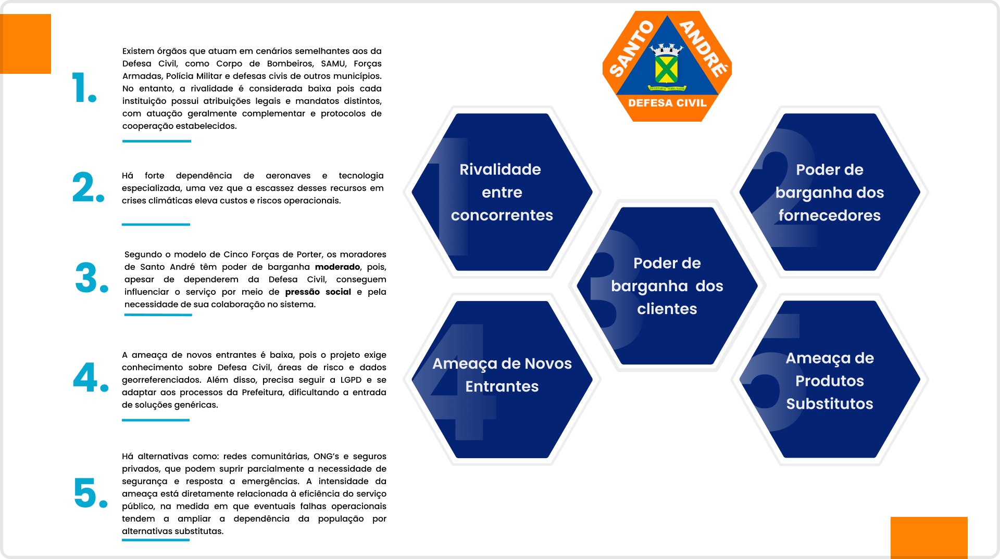

#### Rivalidade Entre Concorrentes

Existem órgãos que atuam em cenários semelhantes aos da Defesa Civil, como Corpo de Bombeiros, SAMU, Forças Armadas, Polícia Militar e defesas civis de outros municípios. No entanto, a rivalidade é considerada baixa pois cada instituição possui atribuições legais e mandatos distintos, com atuação geralmente complementar e protocolos de cooperação estabelecidos.

#### Poder de Barganha: Fornecedores

O poder de barganha dos fornecedores varia conforme o recurso e o contexto. Em situações normais, é baixo para insumos básicos, como lonas, colchões e água, devido à ampla oferta e compras públicas. Em emergências, esse poder aumenta, pois rapidez e disponibilidade se tornam mais importantes que o preço, favorecendo fornecedores com pronta entrega. Já serviços especializados, como tecnologia, georreferenciamento e análises técnicas, apresentam maior poder, pela escassez de alternativas e dependência de expertise. Assim, o poder dos fornecedores é médio: baixo para itens comuns, mas elevado em emergências e serviços técnicos.

#### Poder de Barganha: Clientes

O poder de barganha dos clientes avalia a influência dos consumidores sobre preços, qualidade e condições. Quanto mais alternativas, maior o poder de negociação. Neste contexto, os moradores de Santo André exercem poder moderado a alto sobre a Defesa Civil, mesmo sem relação comercial direta. Esse poder é limitado pela dependência operacional em situações de risco, sem alternativas viáveis. Porém, se fortalece pela pressão social e política, via reclamações e mobilização. Além disso, a eficácia do sistema depende da colaboração da população na coleta de dados, ampliando sua influência e podendo impactar diretamente a qualidade e o sucesso da solução.

#### Ameaça de Novos Entrantes

A ameaça de novos entrantes é baixa, pois não se trata de um mercado competitivo. Trata-se de um órgão público ligado à Prefeitura, responsável por prevenção, resposta e recuperação em desastres. Sua atuação exige conhecimento técnico, autorização institucional, integração com outras áreas e experiência prática. Embora empresas privadas possam oferecer tecnologias e consultorias, não substituem a autoridade da Defesa Civil em ações como evacuações e vistorias. 

#### Ameaça de Substitutos

A análise da ameaça de substitutos deve ser adaptada, pois se trata de um serviço público exclusivo, sem concorrência direta. Ainda assim, existem alternativas como aplicativos climáticos, redes comunitárias, ONGs e seguros privados. Essas opções possuem alta acessibilidade e baixo custo, resultando em intensidade baixa a moderada. Assim, a Defesa Civil deve manter eficiência operacional e comunicação ágil para preservar a confiança da população e reduzir a dependência dessas alternativas.

Fontes (seção 9): (REF.1, REF.2, REF.3, REF.4, REF.5).


### 2.1.2. Análise SWOT da Instituição Parceira (sprint 1)

A análise SWOT foi realizada com o objetivo de compreender o cenário interno e externo da instituição parceira, identificando suas forças, fraquezas, oportunidades e ameaças. Essa análise permite avaliar aspectos que impactam diretamente o desenvolvimento e a implementação da solução proposta, contribuindo para decisões mais estratégicas e alinhadas ao contexto da Defesa Civil.

<div align="center">
    <p>Figura 1: Análise Swot</p>
    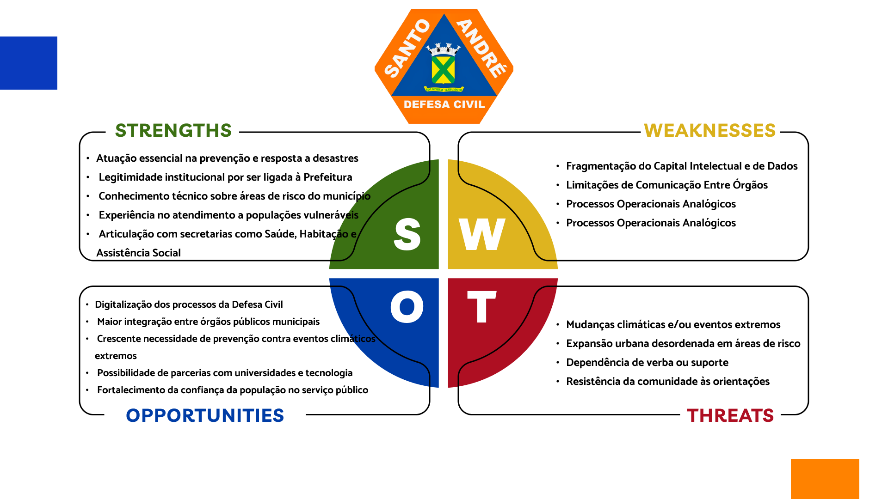
    <p>Feito pela própria equipe (2026)</p>
</div>

#### Strengths

A Defesa Civil de Santo André tem como uma de suas principais forças o fato de **atuar em uma área essencial** para a cidade: a **prevenção, preparação, resposta e recuperação diante de desastres naturais e tecnológicos.**

Por estar ligada à Prefeitura e à Secretaria de Meio Ambiente e Mudanças Climáticas, a organização possui **legitimidade institucional** e **capacidade de articulação com outras áreas públicas.**

Além disso, tem conhecimento técnico sobre **áreas de risco**, protocolos de evacuação, acolhimento emergencial e atendimento a populações vulneráveis, como idosos, crianças, gestantes e pessoas com deficiência.


#### Weaknesses

A Defesa Civil de Santo André possui alta **dependência de processos analógicos** e do **conhecimento de agentes veteranos**. A falta de um repositório digital centralizado fragmenta as informações e compromete a memória técnica da instituição.

Além disso, a **comunicação fragmentada** entre setores impede o fluxo ágil de informações com as pastas de Saúde e Assistência Social. Essa lacuna inviabiliza o acesso a um perfil socioeconômico atualizado das populações em áreas de risco.


O uso de ferramentas como planilhas físicas gera **barreiras operacionais críticas**. Essa limitação reduz a velocidade de resposta e a eficiência na gestão de abrigos e logística durante crises severas.

#### Opportunities

Entre as oportunidades, destaca-se o uso de **tecnologia para modernizar a gestão pública de riscos e desastres.** Ferramentas digitais podem ajudar a organizar dados, acelerar atendimentos, melhorar a comunicação entre secretarias e apoiar decisões mais rápidas. 

Além disso, o aumento da **preocupação com eventos climáticos extremos** torna o trabalho da Defesa Civil ainda mais relevante, abrindo espaço para investimentos, parcerias com instituições de ensino e soluções inovadoras. A **atuação preventiva** também pode fortalecer a confiança da população no serviço público.

#### Threats

**Eventos climáticos extremos e imprevisíveis** desafiam a capacidade instalada de resposta do município. O aumento da intensidade das chuvas pode saturar os planos de contingência atuais, superando os limites operacionais da instituição.


Além disso, a **expansão urbana desordenada** e a **concentração em áreas de encosta** tornam o mapeamento de riscos rapidamente obsoleto. A dinâmica social dessas ocupações dificulta a manutenção de dados precisos para ações preventivas.


**Instabilidades orçamentárias** e a **baixa adesão comunitária aos protocolos de evacuação** também representam riscos. Tais fatores comprometem a continuidade de investimentos e a eficácia das salvaguardas em momentos de desastre.


### 2.1.3. Solução (sprints 1 a 5)

Nesta seção, apresenta-se a solução proposta para o problema identificado, detalhando suas principais funcionalidades, forma de utilização, dados envolvidos e benefícios esperados. O objetivo é demonstrar como a aplicação web contribuirá para a centralização das informações, melhoria dos processos operacionais e apoio à tomada de decisão no contexto da Defesa Civil.

1. Problema a ser resolvido

A Defesa Civil de Santo André enfrenta desafios na gestão ágil de populações em áreas de risco. Coleta de dados em campo é lenta e descentralizada. Não há registro geolocalizado integrado de evacuações, retiradas de famílias ou entrada em abrigos. Agentes precisam identificar imóveis com segurança em cenários de risco, e a Defesa Civil necessita visualizar geograficamente onde as pessoas foram realocadas.

2. Dados disponíveis (mencionar fonte e conteúdo; se não houver, indicar “não se aplica”)

| Documento | Fonte / Órgão Responsável | Acesso | Link / Explicação |
| :--- | :--- | :--- | :--- |
| **Ficha SDUH** | Secretaria de Desenvolvimento Urbano e Habitação (SP) | **Privada** | Portal SDUH (Acesso restrito via login Gov.br/Senha) |
| **Formulário SUAS** | Ministério da Cidadania / Rede SUAS | **Pública** | [Blog Rede SUAS (Modelos)](http://blog.mds.gov.br/redesuas/) |
| **Fichas de Resgate de Animais** | Polícia Ambiental / Secretarias de Meio Ambiente | **Privada** | Sistema Interno de Ocorrências (Documento Administrativo) |
| **Formulário de Bens sob Guarda** | Defesa Civil Municipal / Estadual | **Privada** | [Sistema S2ID](https://s2id.mi.gov.br/) (Exige cadastro de gestor público) |
| **Mapas de Risco Municipal** | SIGA (Sistema Integrado de Gestão Ambiental) | **Pública** | [Portal SIGA - Infraestrutura e Meio Ambiente](https://sigamapa.santoandre.sp.gov.br/) |
| **Referências Geográficas** | IBGE / IGC-SP (DataGEO) | **Pública** | [IBGE Mapas](https://mapas.ibge.gov.br/) ou [DataGEO SP](http://datageo.ambiente.sp.gov.br/) |
| **Estudos de Vulnerabilidade** | CEMADEN / Defesa Civil Nacional | **Pública** | [Painel de Monitoramento CEMADEN](http://www.cemaden.gov.br/) |


(Dados fictícios coerentes serão utilizados para testes, garantindo conformidade com LGPD e Termo de Confidencialidade.)

3. Solução proposta

GeoRisco Santo André: aplicação web offline-first com geolocalização multimodal usando CEP, coordenadas, referências geográficas e fotos de imóvel. A solução MVP gira em torno do cadastro rápido de pessoas assistidas por casa, podendo haver múltiplas pessoas no registro daquela residência. Englobando a captura de dados como: nome, CPF, idade e vulnerabilidade. Além de funcionalidades como: sincronização automática com a internet (para uso do cadastro em regiões sem sinal); painel geolocalizado para visualizar densidade de pessoas por território; localização de assistidos e residências. Para além do MVP, tem-se: gráficos ou KPIs sobre as áreas de maior risco e áreas de priorização baseado nas necessidades das pessoas.

4. Forma de utilização da solução

Agentes preenchem formulário mobile conciso em campo com funcionalidade offline. Sistema salva localmente e sincroniza quando conectado. Registram: localização por CEP, coordenadas, referências e fotos de imóvel, composição da casa, vulnerabilidades, retirada e abrigo. Painel desktop exibe mapa geolocalizado com cadastros, filtros por setor de risco, densidade de pessoas e gera relatórios georreferenciados para análise de contingência.

5. Benefícios esperados

Reduz tempo crítico de coleta permitindo cadastro rápido em campo. Geolocalização multimodal funciona sem GPS preciso. Registro integrado de retirada e abrigo elimina gaps operacionais. Painel geolocalizado oferece visão estratégica em tempo real à Defesa Civil e sede. Arquivamento de cadastros mantém base íntegra. Substitui sistemas desatualizados, fortalecendo resiliência urbana.

6. Critério de sucesso e como será avaliado

Sucesso medido por KPIs nas sprints iniciais: tempo de preenchimento inferior a cinco minutos por casa, sincronização offline e online, precisão de localização, taxa de conclusão sem erros, usabilidade com agentes de tecnologia média. Validação com operadores em campo, testes de visualização de sede, exportação de relatórios. Métricas finalizadas com parceiro durante o projeto.


### 2.1.4. Value Proposition Canvas (sprint 1): 
O Value Proposition Canvas é uma ferramenta visual que auxilia na definição clara da proposta de valor de um produto ou serviço, alinhando as necessidades e desejos dos clientes com as soluções oferecidas. 
Nele estão identificados o perfil do cliente, suas dores, ganhos e tarefas, bem como a proposta de valor, com os produtos e serviços, aliviadores de dores e criadores de ganhos.
Dessa forma, o Canvas de Proposta de Valor traz de maneira sintetizada diferentes aspectos relacionados ao parceiro e à solução proposta, ajudando também no alinhamento das prioridades do projeto.

<div align="center">
    <p>Figura 2: Value Proposition Canvas</p>
    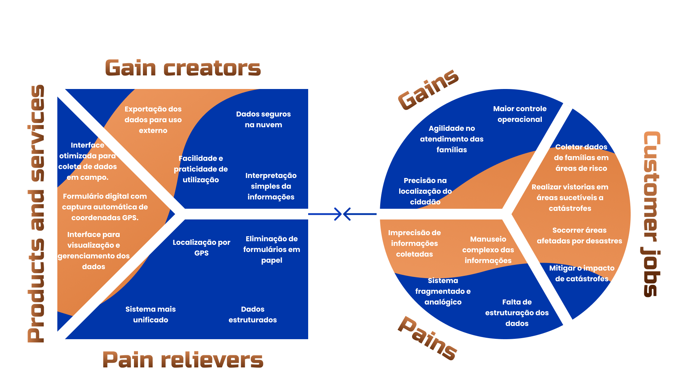
    <p>Feito pela própria equipe (2026)</p>
</div>


### 2.1.5. Matriz de Riscos do Projeto (sprint 1)

<div align="center">
    <p>Figura 3: Matriz de Riscos</p>
    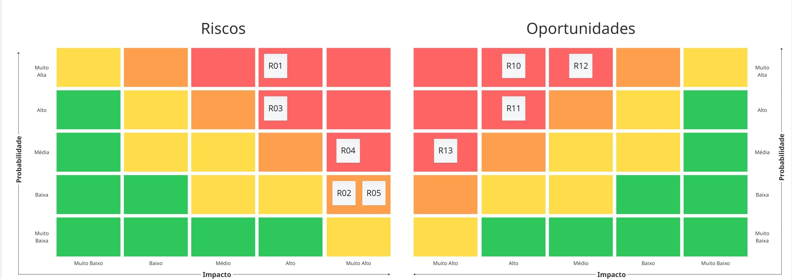
</div>

<div align="center">
    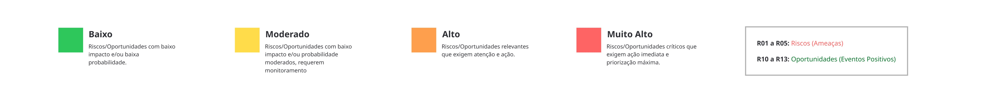
    <p>Feito pela própria equipe (2026)</p>
</div>

A Matriz de Riscos, também conhecida como Matriz de Probabilidade e Impacto, é uma ferramenta fundamental para o gerenciamento de riscos no projeto, pois permite identificar, classificar e priorizar os eventos que podem impactar seu desenvolvimento. Essa ferramenta auxilia na tomada de decisões estratégicas, direcionando esforços para mitigação de ameaças e aproveitamento de oportunidades no contexto da gestão de áreas de risco, acolhimento emergencial e logística humanitária. O conceito de risco está diretamente relacionado à combinação entre a probabilidade de ocorrência de um evento e o impacto que ele pode causar ao projeto. Dessa forma, riscos com alta probabilidade e alto impacto demandam maior atenção da equipe e dos stakeholders da Secretaria de Meio Ambiente e Defesa Civil, enquanto aqueles com menor criticidade podem ser monitorados com menor prioridade. Para este projeto, os riscos foram classificados em duas categorias principais: Riscos (ameaças) e Oportunidades (eventos positivos). O nível de criticidade foi definido a partir do cruzamento entre probabilidade e impacto, conforme os critérios apresentados a seguir.

Escala de Probabilidade

A probabilidade de ocorrência é definida em cinco níveis: entre 1% a 10% o evento é considerado muito improvável de ocorrer; de 11% a 30% há uma baixa chance de ocorrência; de 31% a 50% o evento pode ocorrer ocasionalmente; de 51% a 70% trata-se de uma provável ocorrência; e de 71% a 90% indica uma alta probabilidade de ocorrência.

Escala de Impacto

O impacto é classificado conforme a gravidade das consequências: Baixo para consequências leves e facilmente reversíveis; Moderado para impacto perceptível com custos ou prazos controláveis; Alto para impacto significativo no cronograma ou qualidade do projeto; e Muito Alto para impacto crítico, inviabilizador ou que compromete a segurança física dos usuários.
Plano de Ação contra Ameaças

O risco R01 refere-se aos conflitos de sincronização de dados coletados offline, descrevendo a divergência de informações quando agentes sincronizam dados cadastrados simultaneamente sem conexão. Apresenta probabilidade de 71% a 90%, impacto alto e nível de risco alto. A mitigação consiste em implementar IDs únicos (UUID) e lógica de resolução de conflitos, com a resposta de realizar merge manual em registros críticos, sob responsabilidade do Líder Técnico.

O R02 trata do vazamento de dados sensíveis (LGPD), focado no acesso indevido a dados de pessoas vulneráveis. Com probabilidade de 11% a 30% e impacto muito alto, o nível de risco é alto. A mitigação envolve criptografia e controle de acesso (RBAC), enquanto a resposta prevê bloqueio de credenciais, auditoria e notificação ao DPO, sob responsabilidade da Segurança.

O R03 aborda a baixa adesão dos agentes de Defesa Civil por resistência na transição para a interface digital. Com probabilidade de 51% a 70% e impacto alto, o nível de risco é alto. A mitigação foca no envolvimento dos usuários no design (UX) e treinamentos, e a resposta é adaptar funcionalidades para reduzir a carga cognitiva, sob responsabilidade do UX Designer.

O R04 detalha o erro na precisão da geolocalização de vulneráveis, indicando locais incorretos para resgate. Tem probabilidade de 31% a 50% e impacto muito alto, resultando em risco alto. A mitigação ocorre via APIs precisas e validação visual, com resposta de cruzamento de dados históricos, sob responsabilidade da Geolocalização.

O R05 refere-se à indisponibilidade do sistema durante eventos climáticos, como queda de servidor ou lentidão. Com probabilidade de 11% a 30% e impacto muito alto, o nível de risco é alto. A mitigação utiliza infraestrutura escalável e cache local, com resposta de ativação automática de failover e priorização de funções de salvamento, sob responsabilidade do DevOps.
Interdependência dos Riscos

Durante a análise, foi possível identificar relações entre alguns riscos: o sucesso no tratamento da sincronização offline (R01) reduz diretamente o impacto da indisponibilidade do sistema (R05), pois permite que o trabalho continue sem rede. A baixa adesão dos usuários (R03) pode gerar falhas no mapeamento (R04), caso os dados sejam inseridos de forma apressada ou incorreta por falta de familiaridade. Além disso, a segurança contra vazamentos (R02) é o que garante a viabilidade jurídica para a replicação em outros municípios (Oportunidade R10).

Oportunidades Encontradas

A oportunidade R10 foca na replicação para outros municípios do ABC para expandir a solução para cidades vizinhas. Com probabilidade de 71% a 90% e impacto alto, o aproveitamento será feito estruturando o sistema como plataforma modular para facilitar a parametrização. O R11 prevê a integração com Corpo de Bombeiros e PM para compartilhamento de dados em tempo real. Possui probabilidade de 51% a 70% e impacto alto, visando o desenvolvimento de módulos de exportação e APIs de consulta rápida para forças de segurança. O R12 trata da melhoria contínua via feedback operacional para otimizar a logística humanitária. Com probabilidade de 71% a 90% e impacto moderado, será aproveitado através de ciclos curtos de feedback e atualizações após períodos de chuvas intensas. Por fim, o R13 visa a atração de investimentos e funding social de órgãos federais ou agências de inovação. Com probabilidade de 31% a 50% e impacto muito alto, o aproveitamento consiste na elaboração de relatórios de impacto social e eficiência na gestão de abrigos para editais.


## 2.2. Personas (sprint 1)

As personas apresentadas abaixo caracterizam-se como proto-personas, construídas a partir de inferências sobre o contexto institucional e os fluxos operacionais da Defesa Civil, visando representar os principais perfis de usuários e orientar o desenvolvimento da solução. 

<div align="center">
    <p>Figura 5: Persona 1</p>
    
    <p>Feito pela própria equipe (2026)</p> 
</div>


<div align="center">
    <p>Figura 6: Persona 2</p>
     
    <p>Feito pela própria equipe (2026)</p>
</div>

Identificamos dois tipos de proto-personas possíveis para o âmbito em questão: agente de campo e gestor operacional da Defesa Civil. Primeiro, o agente de campo, que no caso é o indivíduo que se responsabiliza pelas conduções das operações nos atendimentos emergenciais, como apontado acima com o João, em que dados demográficos, comportamentos e solução para o perfil de João representam um quadro hipotético que nos evidencia um jeito de humanizar o público-alvo para adotar estratégias mais assertivas e centradas no usuário real. 

Além disso, tem-se o gestor operacional da Defesa Civil, o Wesley, que atua no nível estratégico da operação, sendo responsável pela análise de dados consolidados, definição de prioridades e tomada de decisões em cenários de risco. Nesse contexto, observa-se que a persona atribuída a esse perfil, representada de forma hipotética, permite compreender suas principais necessidades, como acesso centralizado a dados de diferentes plataformas, conhecimento sobre as informações das pessoas e suas localidades em áreas de risco e aumentar a eficiência dos agentes de campo no cadastro de casas e moradores. Dessa forma, assim como no caso do agente de campo, a construção dessa proto-persona contribui para orientar o desenvolvimento de funcionalidades alinhadas às demandas reais do usuário, promovendo uma solução mais eficiente, integrada e centrada no processo decisório.

*Observação: Fotos extraídas de um site produtor de imagens de pessoas inexistentes*: [This Person Does Not Exist](https://thispersondoesnotexist.com/)

## 2.3. User Stories (sprints 1 a 5)

Apresenta-se a seguir a lista de User Stories levantadas para o projeto GeoRisco Santo André. Dividimos os User Stories no baseados no seu nível de prioridade, logo quanto mais no topo estiver a User Stories, mais prioritária será. As 5 primeiras User Stories são prioritárias, e User Stories de prioridade mais baixa seguirão na sequência desta lista, com códigos como US06, US07, e assim por diante.

> **Responsável (definição):** morador designado como referência do núcleo familiar. É obrigatoriamente um dos cidadãos cadastrados, **único por família**, e concentra os dados de contato e burocráticos do núcleo (ex.: CPF, NIS, renda, programas sociais). Toda família ativa deve ter um responsável definido.

---

### Cadastro - Cidadãos

| Identificação | US01 |
|---|---|
| Persona | João Silva (Agente de Campo) |
| User Story | "Como agente de campo, quero cadastrar os dados sociodemográficos dos cidadãos para que eu possa vinculá-los às suas moradias e permitir que a gestão conheça o perfil e localização da população atendida." |
| Critério de aceite 1 | CR1: Dado que o agente de campo inicia o cadastro do núcleo familiar, quando preenche os dados obrigatórios referentes à família, então o sistema deve cadastrar a família mesmo sem moradia vinculada, sinalizando-a com o indicador de "cadastro incompleto" (motivo: sem moradia). |
| Critério de aceite 2 | CR2: Dado que um agente realiza o cadastro de um cidadão, quando pressiona o botão de enviar, então o sistema deve exigir que todas as informações definidas como obrigatórias sejam preenchidas antes de concluir o cadastro. |
| Critério de aceite 3 | CR3: Dado que o agente cadastra os moradores de um núcleo familiar, quando finaliza o cadastro, então o sistema deve exigir que um dos moradores seja marcado como responsável pela família, bloqueando a conclusão enquanto não houver um responsável definido. |
| Critério de aceite 4 | CR4: Dado que o agente cadastra um cidadão, quando a pessoa se enquadra em um ou mais grupos de prioridade (ex.: idoso, gestante/lactante, PCD), então o sistema deve permitir classificá-la no(s) grupo(s) de vulnerabilidade correspondente(s). |
| Critério de aceite 5 | CR5: Dado que o agente informa o CPF de um cidadão, quando o CPF já estiver cadastrado no sistema, então o sistema deve bloquear o cadastro duplicado e sinalizar que a pessoa já existe. |
| Critérios INVEST | Independente: O módulo de cadastro pessoal não depende da implementação da funcionalidade de mapas.; Negociável: Os campos sociodemográficos e de vulnerabilidade, bem como as regras de marcação do responsável, podem ser ajustados.; Valiosa: Fornece a base de dados central para que a Defesa Civil identifique e proteja vidas humanas.; Estimável: É um formulário CRUD tradicional, com validações previsíveis de campos obrigatórios, responsável, grupos de vulnerabilidade e unicidade de CPF.; Pequena: Foca no cadastro dos dados da família/moradores, na designação do responsável e na classificação de vulnerabilidade, sem abranger mapa ou edição posterior.; Testável: O testador pode inserir dados simulados e validar a gravação, o aviso de "cadastro incompleto" quando não há moradia, o bloqueio do envio sem responsável, a classificação nos grupos de vulnerabilidade e o bloqueio de CPF já cadastrado. |

### Cadastro - Moradias

| Identificação | US02 |
|---|---|
| Persona | João Silva (Agente de Campo) |
| User Story | "Como agente de campo, quero cadastrar as informações sócioestruturais das moradias para que possamos mapear a infraestrutura da região e identificar possíveis vulnerabilidades." |
| Critério de aceite 1 | CR1: Dado que o agente está em campo em um núcleo de risco, quando estiver cadastrando uma moradia, então o sistema deve permitir o registro dos dados estruturais do imóvel (ex.: tipo de construção, número de pavimentos e condição de ocupação). |
| Critério de aceite 2 | CR2: Dado que o agente está cadastrando a moradia, quando desejar registrar evidências visuais do imóvel, então o sistema deve permitir anexar fotos da moradia (ex.: fachada e entorno) ao cadastro. |
| Critérios INVEST | Independente: A gestão de infraestrutura pode ser tratada de forma modular no banco de dados.; Negociável: A quantidade máxima de fotos por moradia pode ser discutida tecnicamente.; Valiosa: Essencial para calcular o risco de desabamento ou alagamento de uma edificação específica.; Estimável: Os atributos presentes na ficha física delimitam o escopo exato do front-end.; Pequena: O escopo limita-se à estrutura da edificação, separando-se da localização por GPS.; Testável: O sistema deve ser capaz de receber os uploads de imagem e retornar os atributos estruturais salvos em um GET. |

### Mapa

| Identificação | US03 |
|---|---|
| Persona | Wesley Souza (Gestor Operacional) |
| User Story | "Como gestor operacional, quero visualizar moradias em um mapa georreferenciado, para obter uma visão geral das ocupações, facilitar tomadas de decisões estratégicas e identificar áreas de vulnerabilidades socioestruturais na região." |
| Critério de aceite 1 | CR1: Dado que o gestor acessa o painel de georreferenciamento, quando o mapa renderizar na tela, então o sistema deve plotar automaticamente "pins" (marcadores) correspondentes às coordenadas GPS de todas as moradias cadastradas. |
| Critério de aceite 2 | CR2: Dado que o gestor está visualizando o mapa, quando ele clica sobre o marcador de um imóvel, então um card informativo deve ser exibido com os dados basicos da moradia. |
| Critérios INVEST | Independente: Consome os dados de geolocalização existentes sem interferir em como são cadastrados.; Negociável: O tipo de mapa (Satelite, Terreno) pode ser alterado conforme a biblioteca utilizada.; Valiosa: Entrega alto valor estratégico ao permitir a visualização espacial das zonas de perigo.; Estimável: A integração com APIs de mapas possui documentação robusta.; Pequena: Foca apenas na plotagem básica dos marcadores.; Testável: É possível criar coordenadas *mockadas* e verificar a correta plotagem na interface. |

### Busca

| Identificação | US04 |
|---|---|
| Persona | Wesley Souza (Gestor Operacional) |
| User Story | "Como gestor operacional, quero poder buscar os dados das familias e moradias, para que eu possa consultar dados relacionados à familias com informações especificas." |
| Critério de aceite 1 | CR1: Dado que o gestor acessa o módulo de consultas, quando utiliza um dos parametros de pesquisa, então a tela deve mostrar os dados basicos sobre o responsável, moradia, moradores e pets relacionados à(s) família(s) encontradas. |
| Critério de aceite 2 | CR2: Dado que o gestor visualiza os dados de uma família, quando a família estiver sem moradia vinculada, então o sistema deve exibir a flag visual de "cadastro incompleto" no cabeçalho da consulta. |
| Critérios INVEST | Independente: Utiliza joins de dados já populados pelas US01 e US02.; Negociável: O layout de exibição e os níveis de alerta crítico podem ser ajustados.; Valiosa: Facilita o trabalho do gestor que não precisará cruzar tabelas manualmente em planilhas.; Estimável: A consulta a dados relacionados tem esforço facilmente mensurável.; Pequena: Trata-se de uma view (Visualização de dados) de leitura integrada.; Testável: O teste garante que as informações da ficha física batam com o que está sendo exibido digitalmente. |

### Edição

| Identificação | US05 |
|---|---|
| Persona | Wesley Souza (Gestor Operacional) |
| User Story | "Como gestor operacional, quero, caso necessário, poder atualizar os dados das famílias para manter a integridade e acertividade dos dados cadastrados no sistema." |
| Critério de aceite 1 | CR1: Dado que seja necessário atualizar os dados após o cadastro inicial do núcleo familiar, quando o gestor encontra a família desejada na busca ou no mapa, então o modal deve possuir um botão de atualização/edição que encaminhe o usuário para a página de cadastro com os dados do núcleo familiar já preenchidos. |
| Critério de aceite 2 | CR2: Dado que o gestor revisa e re-salva os dados de um núcleo familiar com cadastro incompleto, quando o formulário é enviado com sucesso e os dados obrigatórios passam a estar completos, então o indicador de "cadastro incompleto" no painel de pesquisa deve desaparecer. |
| Critério de aceite 3 | CR3: Dado que o gestor edita uma moradia já cadastrada, quando a tela de edição da moradia carregar, então o mini-mapa deve exibir o pin já posicionado nas coordenadas salvas, permitindo confirmá-lo ou reposicioná-lo (tocando no mapa ou arrastando o pin), sendo obrigatório manter coordenadas válidas para concluir o salvamento. |
| Critérios INVEST | Independente: Atua apenas sobre registros já existentes fechando o ciclo de vida do dado.; Negociável: A necessidade de manter versionamento de histórico pode ser discutida.; Valiosa: Garante que o banco da Defesa Civil reflita sempre a realidade do ano vigente.; Estimável: É um reaproveitamento do formulário de criação adaptado para Update.; Pequena: Foca unicamente na ação de editar e limpar os alertas.; Testável: Atestar que salvar a edição atualiza os dados no banco e remove o indicador de "cadastro incompleto" quando os dados obrigatórios passam a estar completos. |

### Cadastro - Localização

| Identificação | US06 |
|---|---|
| Persona | João Silva (Agente de Campo) |
| User Story | "Como agente de campo, quero registrar a localização exata da moradia confirmando minha posição em um mini-mapa no momento do cadastro, para garantir o local correto da residência." |
| Critério de aceite 1 | CR1: Dado que o agente está cadastrando uma nova moradia, quando clica no botão "cadastrar localização", então o sistema deve exibir um mini-mapa de confirmação centralizado na posição obtida automaticamente do dispositivo em segundo plano, com um pin reposicionável; a localização só é registrada após o agente confirmar o pin. |
| Critério de aceite 2 | CR2: Dado que o agente está em local diferente da moradia real ou precisa corrigir o ponto, quando interage com o mini-mapa, então o sistema deve permitir reposicionar o pin (por toque ou arrasto) e refazer o registro (apagar e re-registrar com a posição atual), sem digitação manual de coordenadas. |
| Critérios INVEST | Independente: A captura de geolocalização e o mini-mapa de confirmação são independentes dos demais campos do formulário de moradia.; Negociável: A precisão exigida (ex.: margem de 5 a 10 metros) e o mapa-base utilizado podem ser acordados com o time.; Valiosa: Garante coordenadas confiáveis ao permitir confirmar e ajustar visualmente o pin, eliminando o erro humano na localização da casa.; Estimável: Reutiliza a biblioteca de mapas e a API nativa de geolocalização, com esforço previsível.; Pequena: Cobre a captura automática da posição e a confirmação/reposicionamento do pin no mini-mapa.; Testável: Simular coordenadas em emulador e validar a exibição do mini-mapa, o reposicionamento do pin e o registro somente após a confirmação. |

### Cadastro - Pets

| Identificação | US07 |
|---|---|
| Persona | João Silva (Agente de Campo) |
| User Story | "Como agente de campo, quero cadastrar os pets (se houver) da familia para tê-los na base de dados e ter conhecimento da população animal das áreas de risco." |
| Critério de aceite 1 | CR1: Dado que o agente está cadastrando um núcleo familiar, quando a familia possui um pet, então o formulário deve permitir a inserção do(s) animal(is) com suas informações. |
| Critério de aceite 2 | CR2: Dado que o agente precisa cadastrar o pet da familia, quando houver mais de um pet no núcleo, então o sistema deve permitir o cadastro de multiplos pets de maneira organizada. |
| Critérios INVEST | Independente: O cadastro de animais não afeta os dados vitais dos seres humanos.; Negociável: A lista de categorias pode ser estendida para animais de grande porte dependendo da região.; Valiosa: Reduz a recusa de moradores em abandonar áreas de risco por causa de seus animais.; Estimável: É uma adição simples de atributos numéricos à entidade Domicílio.; Pequena: Pode ser finalizada em um ou dois dias de desenvolvimento.; Testável: Verificação da persistência e retorno no JSON do perfil do assistido. |

### Arquivo - Moradia

| Identificação | US08 |
|---|---|
| Persona | Wesley Souza (Gestor Operacional) |
| User Story | "Como gestor operacional, quero ter a opção de arquivar moradias cadastradas, para ocultá-las das buscas mantendo o histórico de moradias que não estão mais ativas." |
| Critério de aceite 1 | CR1: Dado que um desastre natural ou tecnológico destruiu/evacuou uma moradia, quando acessada a área de edição dos dados e clicado em "Arquivar moradia" na seção de moradia, então o sistema deve definir aquela moradia como inativa no banco de dados e ocultá-la do sistema de busca e visualização por mapa normal, disponibilizando sua visualização apenas quando o filtro de "moradias inativas" estiver ativo nas telas. |
| Critério de aceite 2 | CR2: Dado que uma moradia foi arquivada, quando o gestor acessa o painel de visualização dessa moradia (com o filtro de "moradias inativas" ativo), então deve estar disponível um botão de "Desarquivar" que retorna a moradia ao estado ativo, voltando a exibi-la nas buscas e no mapa. |
| Critério de aceite 3 | CR3: Dado que uma moradia com moradores vinculados é arquivada, quando o arquivamento é confirmado, então os moradores permanecem ativos e passam a ser sinalizados com o indicador de "cadastro incompleto" (motivo: sem moradia). |
| Critérios INVEST | Independente: A inativação lógica (soft delete) e o desarquivamento não dependem de novos registros.; Negociável: Os motivos do arquivamento podem ser populados a partir de um domínio expansível.; Valiosa: Mantém a integridade do banco de dados enquanto limpa a visão operacional.; Estimável: Requer flags de status, atualização das queries e a propagação do aviso aos moradores vinculados.; Pequena: Funcionalidade contida — arquivar, desarquivar e sinalizar os moradores — e de rápida implementação.; Testável: Garantir que moradias arquivadas não retornem em chamadas ativas, que o botão de desarquivar as reative e que os moradores vinculados fiquem com "cadastro incompleto". |

### Arquivo - Morador

| Identificação | US09 |
|---|---|
| Persona | Wesley Souza (Gestor Operacional) |
| User Story | "Como gestor operacional, quero ter a opção de arquivar moradores cadastrados, para ocultá-los das buscas mantendo o histórico de cidadãos que não estão mais ativos." |
| Critério de aceite 1 | CR1: Dado que por alguma circunstância um morador seja considerado inativo (morte, desaparecimento, mudança), quando acessada a área de edição dos dados e clicado em "Arquivar morador", na seção de cidadão, em um dos moradores, então o sistema deve definir aquele morador como inativo no banco de dados e ocultá-lo do sistema de busca e estatísticas normal, disponibilizando sua visualização apenas quando o filtro de "moradores inativos" estiver ativo nas telas. |
| Critério de aceite 2 | CR2: Dado que um morador foi arquivado, quando o gestor acessa o painel de visualização desse morador (com o filtro de "moradores inativos" ativo), então deve estar disponível um botão de "Desarquivar" que retorna o morador ao estado ativo. |
| Critério de aceite 3 | CR3: Dado que o morador a ser arquivado é o responsável pela família, quando o gestor confirma o arquivamento, então o sistema deve exigir a definição de um novo responsável entre os demais moradores ativos antes de concluir a operação. |
| Critérios INVEST | Independente: O arquivamento lógico do morador pode ser implementado sem impactar o cadastro ativo.; Negociável: Os campos e motivos relacionados à inativação (morte, desaparecimento, mudança) podem ser ajustados conforme as regras do sistema.; Valiosa: Mantém o histórico populacional preservado sem interferir nas operações correntes.; Estimável: Requer status lógico, filtros de consulta, desarquivamento e a regra de substituição do responsável.; Pequena: Escopo restrito a arquivar/desarquivar o morador e tratar a substituição quando ele for o responsável.; Testável: Garantir que moradores arquivados não retornem em consultas ativas, que o desarquivamento os reative e que o sistema exija um novo responsável ao arquivar o chefe da família. |

### Aviso 1 ano

| Identificação | US10 |
|---|---|
| Persona | Wesley Souza (Gestor Operacional) |
| User Story | "Como gestor operacional, quero saber quais cadastros do sistema foram feitos a mais de 1 ano, para que eu possa guiar os agentes de campo para atualizar os dados de cadastro que tenham possívelmente mudado e manter a integridade das informações ." |
| Critério de aceite 1 | CR1: Dado que um cadastro existe no sistema, quando a data da última modificação ultrapassar 365 dias, então o sistema deve sinalizá-lo com o indicador de "cadastro desatualizado". |
| Critério de aceite 2 | CR2: Dado que o agente revisa e re-salva os dados de um núcleo familiar com alerta de desatualização, quando o formulário é enviado com sucesso, então a data de última modificação é renovada e o indicador de "cadastro desatualizado" no painel do Gestor Operacional deve desaparecer. |
| Critérios INVEST | Independente: A rotina roda em background e não interfere no fluxo de cadastro diário.; Negociável: O prazo de aviso pode ser parametrizável.; Valiosa: Evita o sucateamento dos dados em áreas de risco dinâmico.; Estimável: Configuração de uma job e um painel de notificações são tarefas comuns.; Pequena: Apenas identifica e lista pendências.; Testável: Alterar a data de modificação de um teste no banco para "Data Atual - 366 dias" e validar se o alerta dispara. |

### Obrigatoriedade - Responsavel na familia 

| Identificação | US11 |
|---|---|
| Persona | Wesley Souza (Gestor Operacional) |
| User Story | "Como gestor operacional, quero que toda moradia ativa possua obrigatoriamente um responsável e uma família vinculada, para garantir a integridade cadastral e facilitar a gestão operacional e social das famílias atendidas." |
| Critério de aceite 1 | CR1: Dado que uma moradia esteja ativa no sistema, quando não houver um morador definido como chefe de família, então o sistema deve exibir um alerta de inconsistência cadastral e impedir a finalização ou permanência do cadastro como ativo. |
| Critério de aceite 2 | CR2: Dado que um chefe de família seja arquivado, inativado ou removido da moradia, quando a alteração for confirmada, então o sistema deve exigir a definição de um novo chefe de família antes de concluir a operação. |
| Critérios INVEST | Independente: A validação do chefe de família pode ser implementada sem impactar os demais módulos do sistema.; Negociável: As regras de definição e substituição do chefe de família podem ser ajustadas conforme as políticas da Defesa Civil.; Valiosa: Garante consistência nos registros familiares e melhora a rastreabilidade das informações sociais.; Estimável: A implementação exige apenas validações de vínculo e regras de negócio simples.; Pequena: O escopo está restrito à obrigatoriedade e substituição do chefe de família.; Testável: O QA pode tentar manter uma moradia ativa sem chefe de família e validar se o sistema bloqueia a operação corretamente. |


# <a name="c3"></a>3. Projeto da Aplicação Web (sprints 1 a 5)

## 3.1. Requisitos do Sistema (sprints 1 a 5)

Este documento formaliza o que o sistema deve fazer, sob quais regras e com quais qualidades, com base nas User Stories levantadas para o projeto. O sistema tem como propósito central permitir a compreensão precisa da quantidade de pessoas em territórios de risco, operando de forma georreferenciada para identificar residências mesmo em locais sem endereçamento oficial — como barracos ou vielas —, utilizando coordenadas GPS capturadas no momento do cadastro.

O sistema atende primordialmente ao Agente de Campo (A01) no que tange à operatividade e à coleta de dados in loco, e ao Gestor Operacional (A02) na tomada de decisão estratégica. As funcionalidades de cadastro, visualização em mapa, filtros avançados e alertas de recadastro derivam diretamente das necessidades mapeadas nas US01 a US12.

---

### 3.1.1 Lista de Atores

| ID  | Nome do Ator                           | Descrição                                                                                                                                                                                      | Frequência de Uso | Proficiência Tecnológica |
|---|---|---|---|---|
| A01 | Agente de campo da Defesa Civil         | Coleta dados georreferenciados in loco, realiza vistorias em áreas de risco e alimenta o sistema com informações de interdições ou rotas obstruídas.                                           | Diária            | Média / Baixa            |
| A02 | Gestor operacional | Gerencia os parâmetros de monitoramento e extrai relatórios, análises e mapas de calor. Subsidia a tomada de decisão e o planejamento de contingência da prefeitura. | Diária            | Média             |

---

### 3.1.2 Requisitos Funcionais

| ID | Nome | Descrição | Tipo | Prioridade | Atores | US Origem | Status |
|---|---|---|---|---|---|---|---|
| RF001 | Cadastro de Dados Sociodemográficos e Vínculos | O sistema deve registrar os dados sociodemográficos dos cidadãos (nome, CPF único e válido, data de nascimento, escolaridade, situação ocupacional, indicador de doença crônica e de uso de medicação contínua) e resolver a classificação de vulnerabilidade de cada pessoa: associação a um ou mais grupos (N:N), com 'idoso' e 'criança 0–12 anos' derivados automaticamente da data de nascimento e os demais (gestante/lactante, PCD, mobilidade reduzida/acamado) marcados manualmente, recebendo 'nenhuma' quando nenhum se aplica. Cada cidadão é vinculado a uma família, que deve possuir exatamente um responsável (com NIS e renda informados); CPF duplicado bloqueia o cadastro. O vínculo da família a uma moradia é opcional — quando ausente, a família permanece ativa e recebe o indicador 'cadastro incompleto' (motivo: sem moradia). | Cadastro | Alta | A01, A02 | US01 | Parcial |
| RF002 | Cadastro Estrutural de Moradias | O sistema deve registrar as características físicas do imóvel — tipo de construção, número de pavimentos e condição de ocupação (valores conforme os enums definidos no modelo físico, seção 3.6) — e o endereço textual da moradia (logradouro, número, bairro, núcleo, complemento, referência e CEP; opcional, complementando as coordenadas capturadas no RF003) — além de um campo livre de observações, com upload opcional de até 2 fotos da fachada e do entorno (proibida foto de pessoas, RN07). | Cadastro | Alta | A01, A02 | US02 | Implementado |
| RF003 | Georreferenciamento de Moradias via GPS | O sistema deve obter automaticamente, em segundo plano, a posição do dispositivo do agente para pré-centralizar um mini-mapa de confirmação. O registro das coordenadas (latitude e longitude) é uma ação explícita: o sistema exibe um pin reposicionável (toque ou arrasto) e salva a localização somente após a confirmação, sem digitação manual; o registro pode ser refeito/reposicionado depois, inclusive na edição (pin exibido na posição salva). As coordenadas confirmadas são persistidas com a moradia. | Cadastro | Alta | A01, A02 | US06 | Parcial |
| RF004 | Visualização de Moradias em Mapa Georreferenciado | O sistema deve exibir no mapa marcadores (pins) correspondentes às coordenadas de todas as moradias ativas, lendo os dados persistidos no banco (RN11). Ao clicar em um marcador, o sistema abre um card resumido com os dados da moradia (incluindo a situação definida manualmente pelo gestor, RN08) e da família vinculada; o card contém um botão que redireciona para a aba de busca com a família aberta, onde estão as informações completas e o acesso à área de edição. O sistema não infere risco automaticamente. | Relatório / Consulta | Alta | A02 | US03 | Planejado |
| RF005 | Consulta Integrada de Moradia e Moradores | O sistema deve consolidar, em uma única tela, os dados estruturais do imóvel (incluindo a situação da moradia marcada manualmente pelo gestor, RN08) e os dados sociodemográficos de todos os ocupantes vinculados (responsável, moradores, indicadores de vulnerabilidade e pets), refletindo sempre o estado atual do banco (RN11). Quando a família não tiver moradia vinculada, exibir a flag 'cadastro incompleto'. | Consulta | Alta | A02 | US04 | Parcial |
| RF006 | Filtros Avançados de Moradias e Assistidos | O sistema deve permitir consultar e filtrar a lista de moradias e moradores a partir dos dados persistidos no banco (fonte oficial, RN11). Filtros previstos: atributos de vulnerabilidade (grupos prioritários) e características estruturais do imóvel (tipo de construção, pavimentos, condição de ocupação, situação). _(os filtros exatos serão definidos durante a implementação; exportação de lista está fora do escopo desta entrega)_ | Consulta | Média | A02 | US04 | **A validar** |
| RF007 | Cadastro de Animais de Estimação | O sistema deve permitir o cadastro individual dos animais de estimação de cada família (tipo — cachorro, gato, réptil, ave, roedor ou outros —, nome, porte, raça e cor), com upload opcional de foto por animal. O pet é vinculado à família (não à moradia), acompanhando-a em caso de mudança de domicílio (RN12). As informações ficam acessíveis na consulta da família/moradia para conhecer a população animal das áreas de risco. | Cadastro | Baixa | A01 | US07 | Implementado |
| RF008 | Visualização de Mapa de Calor | O sistema deve gerar uma camada (layer) de mapa de calor sobre o mapa georreferenciado, cruzada com filtros de grupos de vulnerabilidade selecionáveis (ex.: idosos, PCDs), agrupando as coordenadas das moradias ativas por intensidade e recalculando os clusters ao realizar zoom in/out. Os dados vêm do banco oficial (RN11) e respeitam a classificação de vulnerabilidade (RN04), sem inferir prioridade automática. | Relatório | Média | A02 | — | **Futuro** |
| RF009 | Arquivamento e Desarquivamento de Moradias | O sistema deve inativar logicamente (soft delete) moradias (ex.: destruídas, evacuadas ou desapropriadas), sem exigir motivo nem confirmação adicional (RN06), ocultando-as automaticamente da busca e do mapa de operações ativas e mantendo-as visíveis apenas no Histórico Inativo (filtro 'moradias inativas'). Deve permitir desarquivar uma moradia inativa, retornando-a ao estado ativo. Ao arquivar uma moradia com moradores vinculados, estes permanecem ativos e passam a exibir o indicador 'cadastro incompleto' (motivo: sem moradia). | Atualização | Média | A02 | US08 | Parcial |
| RF010 | Arquivamento e Desarquivamento de Moradores | O sistema deve inativar logicamente (soft delete) moradores que deixem de pertencer à área (ex.: falecimento, desaparecimento ou mudança), sem exigir motivo, data ou confirmação adicional (RN06), removendo-os das listagens, buscas e estatísticas ativas e preservando o registro no Histórico de Moradores (filtro 'moradores inativos'). Quando o morador inativado for o responsável pela família, o sistema deve exigir a definição de um novo responsável entre os moradores ativos antes de concluir; se não restar nenhum morador, a família é arquivada. Deve permitir desarquivar um morador inativo, retornando-o ao estado ativo. | Atualização | Média | A02 | US09 | Parcial |
| RF011 | Alerta Automático de Recadastro (12 meses) | O sistema deve detectar automaticamente fichas sem modificação há mais de 365 dias e sinalizar a necessidade de recadastro, exibindo no painel de visualização/mapa o total de cadastros desatualizados versus atualizados. _(o mecanismo de notificação ao gestor será definido durante a implementação)_ | Outro | Média | A01, A02 | US10 | Planejado |
| RF012 | Atualização Anual de Dados pelo Agente de Campo | O sistema deve permitir a reedição dos dados estruturais e sociodemográficos de domicílios com alerta de desatualização ativo, removendo automaticamente o indicador "desatualizado" do painel do gestor após o salvamento. | Atualização | Média | A01 | US05, US10 | Parcial |
| RF013 | Cadastro Completo da Família (Transacional) | O sistema deve permitir ao Agente de Defesa Civil (A01) registrar, em uma única ação transacional, a moradia com sua localização, a família, o responsável, os dependentes e os pets — garantindo que nenhum dado parcial seja persistido caso a operação falhe (tudo-ou-nada). | Cadastro | Alta | A01 | US01, US02, US06, US07 | Implementado |
| RF014 | Gestão de Família e Vínculos | O sistema deve tratar a família como entidade própria, vinculando pessoas a famílias e famílias a moradias em relação N:N, e preservando o histórico de entrada e saída desses vínculos (registrando data de saída em vez de apagar o registro). A inativação de uma família é lógica (soft delete), conforme RN06; uma família que fique sem nenhuma pessoa ativa é arquivada (RN01). | Cadastro / Atualização | Alta | A01, A02 | US01 | Parcial |
| RF015 | Marcação Manual da Situação da Moradia | O sistema deve permitir ao agente de campo e ao gestor (A01, A02) definir e atualizar manualmente a situação da moradia entre Ativa, Interditada, Em Risco e Demolida, registrando apenas a marcação informada — o sistema não infere risco automaticamente (RN08). A situação é refletida no card do mapa e na consulta da moradia. | Atualização | Média | A01, A02 | — | Parcial |
| RF016 | Busca de Pessoas / Responsáveis | O sistema deve permitir buscar pessoas por nome, CPF, e-mail ou telefone (normalizando dígitos quando aplicável), com escopo configurável (ativas, inativas/arquivadas ou todas), retornando os dados básicos das pessoas encontradas a partir do banco oficial (RN11). | Consulta | Média | A02 | US04 | Implementado |
| RF017 | Indicador de Cadastro Incompleto | O sistema deve sinalizar automaticamente como "cadastro incompleto" as famílias sem moradia vinculada — único motivo possível, já que toda família ativa tem responsável (RN01). O indicador é exibido na busca/consulta e removido automaticamente quando a família passa a ter uma moradia vinculada (RN03, RN10). | Outro | Média | A01, A02 | US01, US04 | Planejado |
| RF018 | Armazenamento Seguro de Fotos | O sistema deve armazenar as fotos de moradias e de pets em bucket privado, gerando URLs de upload e de leitura assinadas e temporárias, validando tipo (jpeg/png/webp) e tamanho máximo do arquivo. Não há armazenamento de foto de pessoas (RN07). | Outro | Média | A01, A02 | US02, US07 | Implementado |
| RF019 | Edição de Cadastro | O sistema deve permitir, a partir da busca ou do mapa, editar os dados de qualquer família, morador ou moradia, abrindo o formulário de cadastro já pré-preenchido (independentemente de existir indicador de desatualização). Inclui a reedição dos dados sociodemográficos e estruturais e, na moradia, o reposicionamento da localização no mini-mapa (RF003). Ao salvar com os dados obrigatórios completos, o indicador 'cadastro incompleto' é removido quando aplicável (RN10). | Atualização | Alta | A01, A02 | US05 | Parcial |

---

### 3.1.3 Regras de Negócio

| ID | Nome | Descrição | Pré-condição | Consequência do Descumprimento | Atores | RFs Associados |
|---|---|---|---|---|---|---|
| RN01 | Família Ativa Deve Possuir Responsável | Toda família ativa deve ter um cidadão definido manualmente como responsável, e esse responsável deve ter seus dados obrigatórios preenchidos (conforme as VC do cidadão e do responsável). O cadastro da família só é concluído com um responsável vinculado e completo, mesmo sem moradia associada. Uma família que fique sem nenhuma pessoa deve ser arquivada (não pode permanecer ativa). | Família ativa em criação ou edição. | Família sem responsável (ou com responsável incompleto) prejudica contato, recadastro e evacuação. | A01, A02 | RF001 |
| RN02 | Responsável Único por Família | Cada família ativa tem exatamente um responsável; o sistema não permite dois responsáveis ativos simultâneos na mesma família. Ao tentar trocar o responsável, o sistema exige uma confirmação antes de aplicar a mudança — confirmada, o responsável anterior deixa de sê-lo e o novo assume. | Família ativa, com um cidadão sendo definido ou trocado como responsável. | Duplicidade de responsabilidade gera conflito de contato e leitura errada dos núcleos familiares. | A01, A02 | RF001 |
| RN03 | Família Pode Ser Cadastrada Sem Moradia (Cadastro Incompleto) | É permitido cadastrar uma família sem moradia vinculada; nesse caso ela permanece ativa, porém sinalizada com o indicador "cadastro incompleto" (motivo: sem moradia) até ser vinculada a uma moradia ou situação de abrigo/realocação. | Dados obrigatórios da família e do responsável preenchidos (ver RN01). | Famílias vulneráveis sem residência definida deixariam de ser registradas, prejudicando o acompanhamento social e a resposta emergencial. | A01, A02 | RF001 |
| RN04 | Registro Obrigatório de Indicadores de Vulnerabilidade | Toda pessoa cadastrada deve ter sua classificação de vulnerabilidade resolvida: pode estar associada a um ou mais grupos de vulnerabilidade (relação N:N) e, quando nenhum se aplica, recebe "nenhuma". Os grupos "idoso" e "criança (0–12 anos)" são atribuídos automaticamente pela data de nascimento; os demais (gestante/lactante, PCD, mobilidade reduzida/acamado) são marcados manualmente. A priorização de atendimento em evacuações é responsabilidade operacional dos agentes com base nesses dados; o sistema não exibe hierarquia automática de priorização. | Existência de registro de pessoa vinculada a uma família. | Classificação de vulnerabilidade ausente ou incorreta compromete o planejamento de evacuação pelos agentes de campo. | A01, A02 | RF001 |
| RN05 | Captura e Confirmação de Geolocalização da Moradia | A obtenção da posição do dispositivo é feita automaticamente pelo sistema em segundo plano (chamada ao serviço de localização, sem interação visível), para agilizar o preenchimento — especialmente na edição. O registro da localização é uma ação explícita do agente: ao clicar em "cadastrar localização", o sistema exibe um mini-mapa de confirmação com pin reposicionável (toque ou arrasto); a localização só é salva após a confirmação, podendo ser refeita/reposicionada posteriormente. | Cadastro ou edição de moradia em andamento (assume-se conexão e GPS disponíveis). | Sem localização confirmada, a moradia não aparece no mapa nem pode ser localizada em resgates. | A01 | RF002, RF003 |
| RN06 | Arquivamento Lógico (Soft Delete) e Conformidade LGPD | Moradores, famílias e moradias nunca são excluídos fisicamente do banco: são inativados logicamente (soft delete), com o status alterado para inativo e o registro preservado para histórico, auditoria e rastreabilidade, em conformidade com a LGPD. Não é exigido motivo nem confirmação adicional para a inativação. | Existência de um registro ativo (morador, família ou moradia) selecionado para inativação. | Deleção física viola a LGPD e elimina o histórico necessário para relatórios e auditorias. | A01, A02 | RF009, RF010 |
| RN07 | Proibição de Foto de Pessoas (LGPD) | É estritamente proibido o registro fotográfico de pessoas cadastradas. Apenas fotos da fachada e do entorno do imóvel são permitidas, limitadas a no máximo 2 por moradia. | Upload de foto vinculada a uma moradia. | Foto de pessoas viola a LGPD e os direitos de imagem dos cidadãos. | A01 | RF002 |
| RN08 | Marcação Manual da Situação da Moradia | A situação operacional da moradia (Ativa, Interditada, Em Risco, Demolida) é definida manualmente pelo agente de campo ou pelo gestor; o sistema apenas registra a marcação, não infere risco automaticamente. | Moradia ativa cadastrada. | Sem a situação marcada, perde-se a visão operacional do estado físico e de risco do imóvel. | A01, A02 | RF002, RF004, RF015 |
| RN09 | Recadastro Obrigatório a cada 12 Meses | O sistema deve detectar automaticamente fichas de moradores e moradias cuja data de última modificação ultrapasse 365 dias e sinalizá-las com o indicador "cadastro desatualizado". O alerta persiste até que os dados sejam revisados e re-salvos (recadastro). | Ficha com data de última modificação superior a 365 dias. | Dados desatualizados podem comprometer planos de evacuação e a distribuição de recursos humanitários. | A01 | RF011, RF012 |
| RN10 | Limpeza Automática dos Indicadores | Os indicadores "cadastro incompleto" e "cadastro desatualizado" são removidos automaticamente quando a condição que os gerou deixa de existir (dados obrigatórios completados; ficha revisada e re-salva). | Registro com indicador ativo sendo editado/completado. | Indicadores que não somem geram ruído e mascaram as pendências reais. | A01, A02 | RF005, RF011, RF012 |
| RN11 | Fonte Oficial dos Dados Operacionais | Consultas, filtros, busca textual e mapa devem usar os dados persistidos no banco (Supabase) como fonte oficial — nunca dados fixos/mockados na interface. As telas devem refletir sempre o estado atual do banco (registros ativos e suas coordenadas). | Dados cadastrados no banco e consulta feita pela aplicação. | Gestores veriam informação divergente da base real, comprometendo decisões. | A02 | RF004, RF005, RF006 |
| RN12 | Pet Vinculado à Família (Não à Moradia) | Pets são vinculados à família, e não diretamente à moradia; quando a família muda de moradia, os pets a acompanham automaticamente. | Família cadastrada; cadastro de pet. | Vincular o pet à moradia faria o animal "sumir" quando a família se mudasse, perdendo o controle da população animal das áreas de risco. | A01 | RF007 |

---

### 3.1.4 Validações de Campo (VC)

As Validações de Campo (VC) definem as restrições de preenchimento obrigatório, unicidade e domínio aplicadas a cada campo no momento do cadastro/edição, antes da persistência. Elas se distinguem das Regras de Negócio (3.1.3): a VC atua sobre um único campo/registro, enquanto a RN expressa políticas e relações entre entidades.

| ID | Campo / Validação | Entidade | Tipo | Observação |
|---|---|---|---|---|
| VC01 | Nome completo preenchido | Cidadão | Obrigatório | — |
| VC02 | Data de nascimento preenchida | Cidadão | Obrigatório | Base para derivar automaticamente "idoso" e "criança (0–12 anos)" |
| VC03 | CPF preenchido, único e válido | Cidadão | Obrigatório + Único | Vale para todos os cidadãos; bloqueia cadastro duplicado; precisa ser válido |
| VC04 | Vínculo a uma família | Cidadão | Obrigatório | Todo cidadão pertence a uma família |
| VC05 | Classificação de vulnerabilidade (≥ 1 grupo) | Cidadão | Obrigatório | Relação N:N (cidadão ↔ vulnerabilidade); recebe "nenhuma" quando nenhum grupo se aplica; "idoso"/"criança" derivados da data de nascimento |
| VC06 | Grau de parentesco com o responsável | Cidadão | Obrigatório | — |
| VC07 | NIS único; renda ≥ 0 | Responsável | Único + Range | O responsável é um cidadão marcado manualmente; o CPF é validado na VC03 (Cidadão) |
| VC08 | Tipo de construção, nº de pavimentos e condição de ocupação | Moradia | Obrigatório | — |
| VC09 | Coordenadas (latitude e longitude) | Moradia | Obrigatório | Endereço textual (rua, número) é opcional |
| VC10 | Limite de fotos da moradia | Moradia | Máx. 2 | Apenas fachada/entorno; proibida foto de pessoa (ver RN de geolocalização/LGPD) |
| VC11 | Escolaridade preenchida | Cidadão | Obrigatório (enum) | — |
| VC12 | Situação ocupacional preenchida | Cidadão | Obrigatório (enum) | — |
| VC13 | Indicador de doença crônica | Cidadão | Obrigatório (booleano) | Default "não"; nunca nulo |
| VC14 | Indicador de uso de medicação contínua | Cidadão | Obrigatório (booleano) | Default "não"; nunca nulo |

---

### 3.1.5 Requisitos Não Funcionais — ISO/IEC 25010:2011
| ID | Eixo | Descrição | Derivação e Contexto do Parceiro | Evolução do conceitual para técnico | Métrica / Critério de Aceite | Conexão com RFs | Como Verificar |
|---|---|---|---|---|---|---|---|
| RNF001 | **Usabilidade** | O sistema deve facilitar o preenchimento e a consulta de cadastros por meio de payloads padronizados, validações de entrada e respostas de erro compreensíveis. Evitando assim, a escrita de dados errados, inconsistentes e dados não padronizados.  | Derivado da US01 e US02: agentes atuam em áreas de risco sob pressão e precisam registrar dados de pessoas, moradias e famílias com o menor número possível de inconsistências. | O requisito evoluiu para decisões técnicas como uso de DTOs, funções de normalização em `request-utils.ts` e validações específicas em `validations/`, reduzindo erros de entrada antes que os dados cheguem aos services. | Payloads obrigatórios devem ser validados antes da persistência; requisições inválidas devem retornar mensagens de erro claras. | RF001, RF002, RF005, RF012 | Testar chamadas da API com dados válidos e inválidos, verificando se os erros retornados orientam a correção do preenchimento. |
| RNF002 | **Confiabilidade** | O backend deve preservar a integridade dos dados em operações compostas, evitando cadastros parciais quando uma etapa do processo falha. | Derivado da necessidade de manter cadastros familiares, moradias, responsáveis e vínculos consistentes, já que dados incompletos podem prejudicar consultas e ações da Defesa Civil. | O requisito evoluiu para o uso de transações nos services, com `BEGIN`, `COMMIT` e `ROLLBACK` em operações que envolvem múltiplas tabelas, como cadastro de responsável, moradia com localização e núcleo familiar. | Operações compostas devem ser concluídas integralmente ou revertidas em caso de erro. | RF001, RF002, RF003, RF012 | Simular falhas durante cadastros compostos e verificar se nenhum registro parcial permanece persistido no banco. |
| RNF003 | **Eficiência de desempenho** | O sistema deve manter uma organização que permita consultas e operações de cadastro com baixo acoplamento e possibilidade de otimização futura. | Derivado da necessidade de consulta rápida a pessoas, moradias, famílias, pets e fotos, especialmente em cenários de uso operacional. | O requisito evoluiu para a separação entre controllers, services e repositories. O acesso ao banco foi isolado em repositories, permitindo otimizar queries SQL sem alterar a lógica dos controllers ou services. | Endpoints principais devem responder de forma consistente, com funções como busca de dados da moradia devem responder em menos de 1 segundo e permitir análise futura de gargalos em consultas SQL. | RF004, RF005, RF006, RF011 | Medir tempo de resposta dos endpoints principais e revisar queries em repositories para identificar pontos de otimização. |
| RNF004 | **Adequação funcional** | A API deve oferecer endpoints coerentes com os fluxos centrais do sistema, cobrindo cadastro, consulta, atualização e remoção de pessoas, moradias, famílias, pets e fotos. Com todos estes seguindo o protocólo HTTP correto. | Derivado da necessidade de transformar os fluxos definidos no WAD em operações concretas no backend. | O requisito evoluiu para rotas REST organizadas por domínio em `routes/`, com controllers e services específicos para cada módulo funcional da aplicação. | Os endpoints implementados devem corresponder aos fluxos funcionais documentados e estar vinculados aos RFs relevantes. | Todos os RFs | Conferir a documentação da WebAPI e testar se os endpoints existentes cobrem os fluxos previstos nos requisitos funcionais. |
| RNF005 | **Interoperabilidade** | A aplicação deve ser acessível por tecnologias web amplamente compatíveis e permitir consumo dos mesmos endpoints por diferentes interfaces. | Derivado da necessidade de uso em diferentes dispositivos e contextos, incluindo telas de cadastro, consulta e uso futuro em mobile/PWA. | O requisito evoluiu para o uso de Express, JSON, EJS e arquivos estáticos, permitindo acesso via navegador e consumo da API HTTP por diferentes interfaces. | A API deve manter contratos independentes do dispositivo ou interface que a consome. | RF001, RF002, RF003, RF004 | Testar a aplicação em navegadores e resoluções diferentes, verificando se os endpoints continuam acessíveis e consistentes. |
| RNF006 | **Segurança** | O sistema deve reduzir exposição de dados sensíveis e arquivos, validando entradas, controlando erros e evitando acesso direto a detalhes internos da aplicação. Importante explicitar que deve-se garantir que logs de erros ou informacionais do sistema não exponham dados sensíveis. | Derivado da LGPD e do tratamento de dados sensíveis de cidadãos vulneráveis, além da necessidade de proteger fotos e informações cadastrais. | O requisito evoluiu para validações de payload, uso de `HttpError`, tratamento padronizado com `handleControllerError` e integração com Supabase Storage por URLs assinadas. | Requisições inválidas não devem expor stack trace, credenciais, detalhes internos do banco ou caminhos sensíveis de storage. | RF001, RF002, RF009, RF010 | Enviar requisições inválidas e verificar se as respostas de erro são controladas e não expõem informações internas. |
| RNF007 | **Compatibilidade** | O sistema deve separar o armazenamento de metadados do armazenamento de arquivos, permitindo integração entre PostgreSQL e serviço externo de storage. | Derivado da necessidade de registrar fotos de moradias e pets sem sobrecarregar o banco relacional com arquivos binários. | O requisito evoluiu para endpoints próprios de fotos e upload mediado por Supabase Storage. O banco mantém vínculos e metadados, enquanto o storage externo armazena os arquivos. | O sistema deve permitir gerar URL assinada, cadastrar metadados da foto e vincular o arquivo à moradia ou ao pet correspondente. | RF002, RF007 | Testar criação de URL assinada, cadastro de foto e vínculo com moradia ou pet, verificando integração entre API, banco e storage. |
| RNF008 | **Manutenibilidade** | O projeto deve manter uma estrutura organizada, auditável e segura para evolução, testes e uso de dados fictícios durante o desenvolvimento. | Derivado da necessidade de evolução contínua do projeto em sprints, com separação clara de responsabilidades e redução do risco de uso indevido de dados reais. | O requisito evoluiu para a organização do backend em `controllers`, `services`, `repositories`, `dtos`, `models`, `validations`, `errors`, `db` e `storage`, além do uso de variáveis de ambiente para configurações sensíveis. | A estrutura do código deve permitir manutenção por módulos e facilitar auditoria do que é regra de negócio, persistência, validação ou infraestrutura. | Todos os RFs | Revisar estrutura de pastas, testes e dados utilizados em desenvolvimento, garantindo que a evolução do sistema não dependa de dados reais. |

## 3.1.6. Matriz RF → RN → Endpoint (sprints 3 a 5)
 
Matriz de cobertura que demonstra quais RN (Regras de Negócio) e endpoints implementam cada RF (Requisito Funcional). Os endpoints listados abaixo estão implementados no backend e formalizados no arquivo `documentos/outros/webapi-docs.html`.
 
| RF | RN associadas | Endpoint | Método |
|----|---------------|----------|--------|
| RF001 | RN01, RN02 | `/api/pessoas` | POST |
| RF001 | RN01, RN02 | `/api/responsaveis` | POST |
| RF001 | RN01, RN02 | `/api/familias` | POST |
| RF001 | RN01, RN02 | `/api/familias/nucleo` | POST |
| RF001 | RN01, RN02 | `/api/familias/{id_familia}/pessoas` | POST |
| RF002 | RN01, RN04 | `/api/moradias` | POST |
| RF002 | RN01, RN04 | `/api/familias/{id_familia}/moradias` | POST |
| RF002 | RN04 | `/api/moradias/{id_moradia}/fotos` | POST |
| RF002 | RN04 | `/api/moradias/{id_moradia}/fotos/upload-url` | POST |
| RF002 | RN04 | `/api/moradias/{id_moradia}/fotos` | GET |
| RF003 | RN01, RN04 | `/api/moradias` | POST |
| RF004 | N/A | `/api/moradias` | GET |
| RF005 | RN01, RN05 | `/api/moradias/{id_moradia}` | GET |
| RF005 | RN01, RN05 | `/api/moradias/{id_moradia}/detalhes` | GET |
| RF006 | RN02 | `/api/moradias` | GET |
| RF006 | RN02 | `/api/pessoas/busca` | GET |
| RF007 | N/A | `/api/familias/{id_familia}/pets` | GET |
| RF007 | N/A | `/api/familias/{id_familia}/pets` | POST |
| RF007 | N/A | `/api/pets/{id_pet}` | PUT |
| RF007 | N/A | `/api/pets/{id_pet}` | GET |
| RF007 | N/A | `/api/pets/{id_pet}/fotos` | GET |
| RF007 | N/A | `/api/pets/{id_pet}/fotos/upload-url` | POST |
| RF007 | N/A | `/api/pets/{id_pet}/fotos` | POST |
| RF009 | RN03 | `/api/moradias/{id_moradia}` | DELETE |
| RF009 | RN03 | `/api/familias/{id_familia}/moradias/{id_moradia}` | DELETE |
| RF010 | RN03 | `/api/pessoas/{id_pessoa}` | DELETE |
| RF010 | RN03 | `/api/pessoas/inativas` | GET |
| RF012 | RN01, RN02, RN04 | `/api/pessoas/{id_pessoa}` | PUT |
| RF012 | RN01, RN02, RN04 | `/api/responsaveis/{id_responsavel}` | PUT |
| RF012 | RN01, RN02, RN04 | `/api/moradias/{id_moradia}` | PUT |
 
---

## 3.2. Arquitetura (sprints 1 a 5)
A arquitetura projetada para o sistema é, em suma, baseada na Arquitetura de Camadas (Layered Architecture), porém com a aplicação de: Arquitetura de Seis Camadas (6-Tier Architecture) com base em princípios SOLID e de separação de conceitos (Separation of Concerns). Dividindo a aplicação em componentes especializados e com responsabilidades muito bem definidas.
Assim, fornece um código testável, escalável e de alta manutenibilidade, permitindo que as regras de negócio fiquem isoladas de detalhes de infraestrutura (como o banco de dados) e da interface do usuário.

### 3.2.1. Diagrama de Arquitetura (sprints 3 e 4)

```
src/
├── app.ts – configuração do Express, middlewares nativos, views, estáticos e rotas
├── server.ts – inicialização do servidor
├── controllers/ – borda HTTP e tratamento das requisições
├── routes/ – rotas/endpoints da aplicação
├── services/ – regras de negócio e orquestração entre repositórios
├── repositories/ – acesso ao banco de dados PostgreSQL
├── interfaces/ – contratos das camadas
│   ├── services/ – contratos dos services
│   └── repositories/ – contratos dos repositories
├── dtos/ – Data Transfer Objects e contratos de entrada/saída
├── models/ – tipos e interfaces de domínio
├── validations/ – validação dos payloads e regras de entrada
├── db/ – conexão, abstrações e migrações do banco de dados
│   └── migrations/ – versionamento do esquema do banco
├── storage/ – integração com Supabase Storage
├── views/ – telas/templates EJS
├── public/ – arquivos estáticos
├── errors/ – erros customizados da aplicação
└── tests/ – testes automatizados

```

<div align="center">
    <p>Figura: Diagrama de Classe Arquitetural</p>
    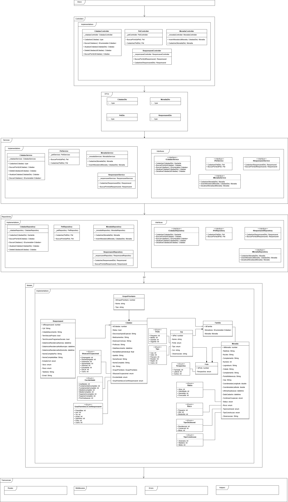
    <p>Feito pela própria equipe (2026)</p>
</div>


### 3.2.2. Diagrama de Casos de Uso (sprint 1)

O diagrama de casos de uso é uma ilustração visual que representa as funcionalidades de um sistema sob a perspectiva de seus usuários, mapeando quais atores interagem com quais casos de uso. Nele, é possível visualizar como os requisitos funcionais se relacionam por meio de dois tipos de relação: `<<include>>`, que indica uma etapa obrigatória dentro de um fluxo, assim, sempre que o caso de uso base for executado, o caso de uso incluído também será; e `<<extend>>`, que indica uma etapa condicional, presente no fluxo apenas em situações específicas, sem ser obrigatória.


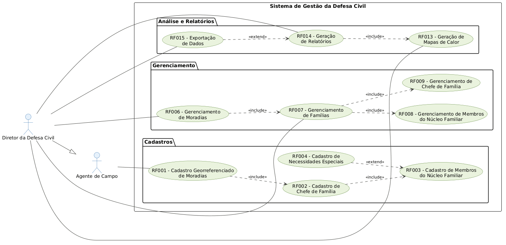

O diagrama mapeia dois atores e três perfis de uso distintos. O **Agente de Campo** representa o perfil **cadastrador**, sendo responsável por registrar e gerenciar dados em campo, interagindo com os casos de uso de cadastro (RF001 a RF004) e gerenciamento (RF006 a RF009). O **Gestor Operacional** acumula os perfis de **visualizador** e **administrador**: como visualizador, acompanha informações estratégicas por meio dos mapas de calor (RF013); como administrador, é o único ator com acesso à geração de relatórios (RF014) e à exportação de dados (RF015). No fluxo de cadastro, as relações `<<include>>` evidenciam a obrigatoriedade em cadeia, como por exemplo: cadastrar uma moradia (RF001) sempre exige cadastrar o chefe de família (RF002), que por sua vez inclui o cadastro dos membros (RF003). Já o `<<extend>>` aparece nos dois pontos condicionais do diagrama: o cadastro de membros pode, opcionalmente, registrar necessidades especiais (RF004), e a exportação de dados (RF015) estende a geração de relatórios (RF014), ocorrendo apenas quando necessário.

### 3.2.3. Diagrama de Classes do Domínio (sprint 2)

O Diagrama de Classes de Dominio representa visualmente as principais entidades do négocio, com seus atributos e relacionamentos entre elas. Não se preocupando com detalhes técnicos como métodos, chaves estrangeiras ou tecnologias específicas, focando somente em capturar o que existe no mundo real dentro do contexto do sistema.

Link do diagrama (realizado por meio do site draw.io): https://drive.google.com/file/d/1YfjTRYovyfGQ29EKa9RM1ScGjfUeJIIK/view?usp=sharing


<div align="center">
    <p>Figura 7: Diagrama de Classes de Domínio</p>
    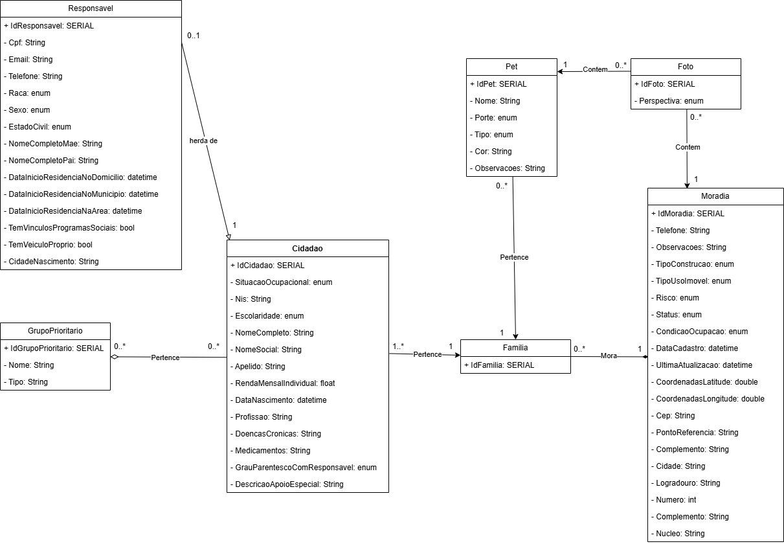
    <p>Feito pela própria equipe (2026)</p>
</div>


### 3.2.4. Diagrama de Sequência UML (sprint 3)

Os diagramas de sequência UML desta seção documentam os fluxos de interação entre as camadas da arquitetura do sistema deste projeto, evidenciando como as requisições originadas na interface do usuário percorrem a cadeia **Frontend → Controller → Service → Repository → Banco de Dados** até a geração da resposta. Cada linha de vida vertical representa um participante ativo no processamento, com ativações indicando o período em que cada componente mantém controle da execução. Mensagens síncronas (chamadas diretas) são representadas por setas sólidas, enquanto retornos são indicados por setas tracejadas. Caminhos alternativos e de exceção são delimitados por blocos `alt`/`opt`, refletindo as ramificações de negócio documentadas nos fluxos de interação.

Os doze fluxos documentados nesta seção cobrem o ciclo principal de uso do sistema, desde o cadastro em campo até as operações de consulta, filtros, mapa de calor, recadastro, arquivamento e validações transversais de integridade. A modelagem foi atualizada conforme o WAD atual, considerando a arquitetura de dados centrada em **família**, **moradia**, **histórico de ocupação**, **pessoa**, **responsável**, **pet**, **foto de moradia** e **grupo prioritário**.
Os doze fluxos documentados nesta seção cobrem o ciclo principal de uso do sistema, desde o cadastro em campo até as operações de consulta, filtros, mapa de calor, recadastro, arquivamento e validações transversais de integridade. A modelagem foi atualizada conforme o WAD atual, considerando a arquitetura de dados centrada em **família**, **moradia**, **histórico de ocupação**, **pessoa**, **responsável**, **pet**, **foto de moradia** e **grupo prioritário**.

---

### FL01 — Cadastro completo de família, moradia e ocupação

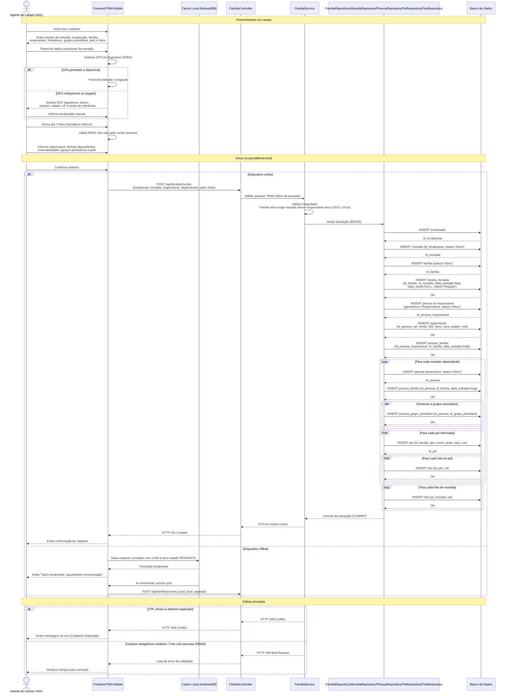
```mermaid
sequenceDiagram
    actor Agente as Agente de Campo (A01)
    participant Frontend as Frontend PWA Mobile
    participant Cache as Cache Local (IndexedDB)
    participant Controller as FamiliaController
    participant Service as FamiliaService
    participant Repository as FamiliaRepository/MoradiaRepository/PessoaRepository/PetRepository/FotoRepository
    participant DB as Banco de Dados

    Note over Agente,DB: Preenchimento em campo

    Agente->>Frontend: Inicia novo cadastro
    Frontend-->>Agente: Exibe seções de moradia, localização, família,<br/>responsável, moradores, grupos prioritários, pets e fotos

    Agente->>Frontend: Preenche dados estruturais da moradia
    Frontend->>Frontend: Captura GPS do dispositivo (RN04)

    alt GPS permitido e disponível
        Frontend->>Frontend: Preenche latitude e longitude
    else GPS indisponível ou negado
        Frontend-->>Agente: Solicita CEP, logradouro, bairro,<br/>número, cidade, UF e ponto de referência
        Agente->>Frontend: Informa localização manual
    end

    Agente->>Frontend: Anexa até 2 fotos (fachada e entorno)
    Frontend->>Frontend: Valida RN04: foto não pode conter pessoas
    Agente->>Frontend: Informa responsável, demais dependentes,<br/>vulnerabilidades (grupos prioritários) e pets

    Note over Agente,DB: Envio ou persistência local

    Agente->>Frontend: Confirma cadastro

    alt Dispositivo online
        Frontend->>Controller: POST /api/familias/nucleo<br/>{localizacao, moradia, responsavel, dependentes, pets, fotos}
        Controller->>Service: Validar payload, RN04 (fotos de pessoas)
        Service->>Service: Validar integridade:<br/>Família ativa exige moradia ativa e responsável ativo (US13, US14)
        Service->>Repository: Iniciar transação (BEGIN)

        Repository->>DB: INSERT localização
        DB-->>Repository: id_localizacao
        Repository->>DB: INSERT moradia {id_localizacao, status='Ativa'}
        DB-->>Repository: id_moradia
        Repository->>DB: INSERT família {status='Ativo'}
        DB-->>Repository: id_familia
        Repository->>DB: INSERT familia_moradia<br/>{id_familia, id_moradia, data_entrada=hoje,<br/>data_saida=NULL, status='Regular'}
        DB-->>Repository: OK
        Repository->>DB: INSERT pessoa do responsável<br/>{parentesco='Responsável', status='Ativo'}
        DB-->>Repository: id_pessoa_responsavel
        Repository->>DB: INSERT responsavel<br/>{id_pessoa, cpf, renda, NIS, sexo, raca, estado_civil}
        DB-->>Repository: OK
        Repository->>DB: INSERT pessoa_familia<br/>{id_pessoa_responsavel, id_familia, data_entrada=hoje}
        DB-->>Repository: OK

        loop Para cada morador dependente
            Repository->>DB: INSERT pessoa {parentesco, status='Ativo'}
            DB-->>Repository: id_pessoa
            Repository->>DB: INSERT pessoa_familia {id_pessoa, id_familia, data_entrada=hoje}
            DB-->>Repository: OK
            opt Pertence a grupos prioritários
                Repository->>DB: INSERT pessoa_grupo_prioritario {id_pessoa, id_grupo_prioritario}
                DB-->>Repository: OK
            end
        end

        loop Para cada pet informado
            Repository->>DB: INSERT pet {id_familia, tipo, nome, porte, raca, cor}
            DB-->>Repository: id_pet
            loop Para cada foto do pet
                Repository->>DB: INSERT foto {id_pet, url}
                DB-->>Repository: OK
            end
        end

        loop Para cada foto de moradia
            Repository->>DB: INSERT foto {id_moradia, url}
            DB-->>Repository: OK
        end

        Repository-->>Service: Commit da transação (COMMIT)
        Service-->>Controller: DTO do núcleo criado
        Controller-->>Frontend: HTTP 201 Created
        Frontend-->>Agente: Exibe confirmação do cadastro

    else Dispositivo offline
        Frontend->>Cache: Salva cadastro completo com UUID local e estado PENDENTE
        Cache-->>Frontend: Persistido localmente
        Frontend-->>Agente: Exibe "Salvo localmente, aguardando sincronização"
        Cache->>Frontend: Ao reconectar, aciona sync
        Frontend->>Controller: POST /api/familias/nucleo {uuid_local, payload}
    end

    Note over Agente,DB: Falhas principais

    alt CPF, email ou telefone duplicado
        Service-->>Controller: HTTP 409 Conflict
        Controller-->>Frontend: HTTP 409 Conflict
        Frontend-->>Agente: Exibe mensagem de erro (Cadastro Duplicado)
    else Campos obrigatórios inválidos / Foto com pessoas (RN04)
        Service-->>Controller: HTTP 400 Bad Request
        Controller-->>Frontend: Lista de erros de validação
        Frontend-->>Agente: Destaca campos para correção
    end
```


Este fluxo descreve a jornada de cadastro conduzida pelo **Agente de Campo (A01)** a partir do aplicativo mobile. O processo é estruturado em cinco sessões sequenciais: Moradia, Localização, Chefe de Família, Composição Familiar e Pets. Cada uma liberada somente após a confirmação da anterior, garantindo a integridade referencial dos dados antes do envio. Ao submeter o formulário completo, o Frontend dispara uma sequência ordenada de requisições `POST` que cria os registros em cascata (`LOCALIZACAO → MORADIA → PESSOA → RESPONSAVEL → PET → FORMULARIO`), enquanto o Service aplica as regras de negócio RN01 (classificação de risco) e RN04 (restrição de fotos). O **caminho de exceção** de duplicidade de cadastro, que oferece ao agente as opções de busca, atualização ou cancelamento.

### FL02 — Visualização de moradias em mapa georreferenciado

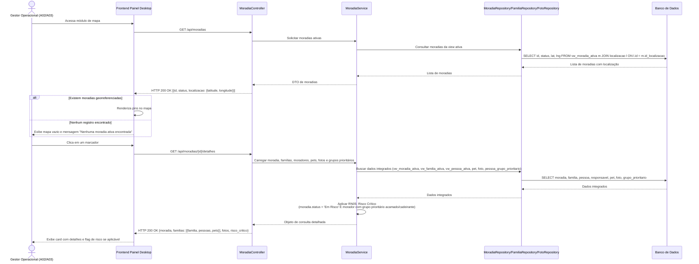
```mermaid
sequenceDiagram
    actor Gestor as Gestor Operacional (A02/A03)
    participant Frontend as Frontend Painel Desktop
    participant Controller as MoradiaController
    participant Service as MoradiaService
    participant Repository as MoradiaRepository/FamiliaRepository/FotoRepository
    participant DB as Banco de Dados

    Gestor->>Frontend: Acessa módulo de mapa
    Frontend->>Controller: GET /api/moradias
    Controller->>Service: Solicitar moradias ativas
    Service->>Repository: Consultar moradias da view ativa
    Repository->>DB: SELECT id, status, lat, lng FROM vw_moradia_ativa m JOIN localizacao l ON l.id = m.id_localizacao
    DB-->>Repository: Lista de moradias com localização
    Repository-->>Service: Lista de moradias
    Service-->>Controller: DTO de moradias
    Controller-->>Frontend: HTTP 200 OK [{id, status, localizacao: {latitude, longitude}}]

    alt Existem moradias georreferenciadas
        Frontend->>Frontend: Renderiza pins no mapa
    else Nenhum registro encontrado
        Frontend-->>Gestor: Exibe mapa vazio e mensagem "Nenhuma moradia ativa encontrada"
    end

    Gestor->>Frontend: Clica em um marcador
    Frontend->>Controller: GET /api/moradias/{id}/detalhes
    Controller->>Service: Carregar moradia, famílias, moradores, pets, fotos e grupos prioritários
    Service->>Repository: Buscar dados integrados (vw_moradia_ativa, vw_familia_ativa, vw_pessoa_ativa, pet, foto, pessoa_grupo_prioritario)
    Repository->>DB: SELECT moradia, familia, pessoa, responsavel, pet, foto, grupo_prioritario
    DB-->>Repository: Dados integrados
    Repository-->>Service: Dados integrados
    Service->>Service: Aplicar RN05: Risco Crítico<br/>(moradia.status = 'Em Risco' E morador com grupo prioritário acamado/cadeirante)
    Service-->>Controller: Objeto de consulta detalhada
    Controller-->>Frontend: HTTP 200 OK {moradia, familias: [{familia, pessoas, pets}], fotos, risco_critico}
    Frontend-->>Gestor: Exibe card com detalhes e flag de risco se aplicável
```
Este fluxo descreve a consulta de informações espaciais executada pelo **Gestor Operacional (A02/A03)** a partir do painel administrativo desktop. O Frontend solicita a listagem de registros georreferenciados para renderização no mapa da região. O Service, por meio do Repository, realiza a busca lendo diretamente da view de leitura **`vw_moradia_ativa`** em conjunto com a tabela **`localizacao`** para obter as coordenadas de latitude e longitude dos imóveis que não sofreram exclusão lógica. Ao receber o conjunto de dados, o Frontend renderiza pins interativos na interface geográfica. Quando o gestor clica sobre um marcador específico, o sistema dispara a requisição de consulta consolidada (`GET /api/moradias/{id}/detalhes`), carregando os dados do imóvel, moradores ativos, pets e fotos, ao mesmo tempo em que calcula e exibe a flag visual de Risco Crítico (RN05) em um card sobreposto no próprio mapa.

### FL03 — Consulta integrada de moradia e moradores

```mermaid
sequenceDiagram
    actor Gestor as Gestor Operacional (A02/A03)
    participant Frontend as Frontend Painel Desktop
    participant Controller as MoradiaController
    participant Service as MoradiaService
    participant Repository as MoradiaRepository/FamiliaRepository/FotoRepository
    participant DB as Banco de Dados

    Gestor->>Frontend: Acessa módulo de consulta
    Frontend->>Controller: GET /api/moradias?busca={termo}
    Controller->>Service: Buscar moradias por termo
    Service->>Repository: Consultar moradias ativas correspondentes
    Repository->>DB: SELECT * FROM vw_moradia_ativa WHERE nome_responsavel ILIKE termo OR logradouro ILIKE termo
    DB-->>Repository: Lista resumida
    Repository-->>Service: Lista resumida
    Service-->>Controller: DTO de busca
    Controller-->>Frontend: HTTP 200 OK [{id, status, localizacao, responsavel}]
    Frontend-->>Gestor: Exibe lista de moradias encontradas

    Gestor->>Frontend: Seleciona uma moradia
    Frontend->>Controller: GET /api/moradias/{id}/detalhes
    Controller->>Service: Montar ficha integrada da moradia
    Service->>Repository: Consultar moradia, famílias, pessoas, responsáveis, pets, fotos e grupos prioritários
    Repository->>DB: SELECT * FROM vw_moradia_ativa WHERE id = :id;<br/>SELECT * FROM familia_moradia JOIN vw_familia_ativa JOIN vw_pessoa_ativa JOIN pessoa_grupo_prioritario JOIN pet JOIN foto
    DB-->>Repository: Dados da moradia e moradores ativos
    Repository-->>Service: Dados consolidados

    alt Moradia sem ocupação ativa
        Service-->>Controller: HTTP 200 OK {moradia, familias=[], fotos}
        Controller-->>Frontend: Exibe moradia sem família residente
        Frontend-->>Gestor: Exibe dados físicos do imóvel sem moradores
    else Ocupação ativa encontrada
        Service->>Service: Classificar prioridade (RN01)
        Service->>Service: Avaliar RN05: Risco Crítico<br/>(status 'Em Risco' + grupo acamado/cadeirante)
        Service-->>Controller: Ficha detalhada
        Controller-->>Frontend: HTTP 200 OK {moradia, familias: [{familia, pessoas, pets}], fotos, prioridade, risco_critico}
        Frontend-->>Gestor: Exibe ficha de consulta consolidada
    end
```

Este fluxo detalha a consulta integrada executada pelo **Gestor Operacional (A02/A03)** ao pesquisar ou selecionar uma ficha. O Frontend solicita uma listagem resumida de moradias e, após a seleção de um registro, carrega os dados completos da moradia, localização, ocupação ativa, família, responsável, moradores, gestantes, grupos prioritários, pets e fotos. A consulta utiliza o `historico_ocupacao` para identificar a família atualmente vinculada à moradia, considerando apenas ocupações com `data_saida` nula. Caso não exista ocupação ativa, o sistema retorna a ficha do imóvel sem moradores ativos. Quando há ocupação ativa, o Service calcula a prioridade de evacuação (RN01) e avalia a flag de Risco Crítico (RN05).
---

### FL04 — Filtros avançados de moradias e assistidos (Backlog)
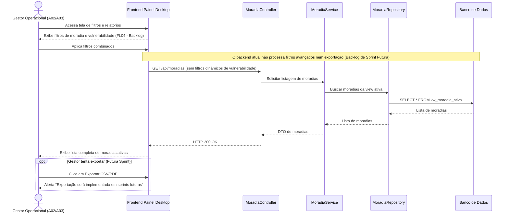
```mermaid
sequenceDiagram
    actor Gestor as Gestor Operacional (A02/A03)
    participant Frontend as Frontend Painel Desktop
    participant Controller as MoradiaController
    participant Service as MoradiaService
    participant Repository as MoradiaRepository
    participant DB as Banco de Dados

    Gestor->>Frontend: Acessa tela de filtros e relatórios
    Frontend-->>Gestor: Exibe filtros de moradia e vulnerabilidade (FL04 - Backlog)
    Gestor->>Frontend: Aplica filtros combinados

    Note over Frontend,DB: O backend atual não processa filtros avançados nem exportação (Backlog de Sprint Futura)

    Frontend->>Controller: GET /api/moradias (sem filtros dinâmicos de vulnerabilidade)
    Controller->>Service: Solicitar listagem de moradias
    Service->>Repository: Buscar moradias da view ativa
    Repository->>DB: SELECT * FROM vw_moradia_ativa
    DB-->>Repository: Lista de moradias
    Repository-->>Service: Lista de moradias
    Service-->>Controller: DTO de moradias
    Controller-->>Frontend: HTTP 200 OK
    Frontend-->>Gestor: Exibe lista completa de moradias ativas

    opt Gestor tenta exportar (Futura Sprint)
        Gestor->>Frontend: Clica em Exportar CSV/PDF
        Frontend-->>Gestor: Alerta "Exportação será implementada em sprints futuras"
    end
```

Este fluxo representa o uso de filtros avançados pelo **Gestor Operacional (A02/A03)** na tela de gerenciamento de dados. O usuário pode combinar critérios como status da moradia, condição de ocupação, grupos prioritários, vulnerabilidades, destino em caso de evacuação e situação de recadastro. O Frontend envia os filtros ao Controller, que delega ao Service a validação dos parâmetros e a montagem da consulta. O Repository cruza as tabelas `moradia`, `localizacao`, `historico_ocupacao`, `familia`, `pessoa`, `pessoa_grupo_prioritario` e `grupo_prioritario`, retornando uma lista filtrada. Quando não há resultados, o painel exibe uma mensagem orientativa. Quando há registros, o gestor pode exportar a listagem em formato CSV ou PDF.

---

### FL05 — Atualização anual de dados pelo agente de campo (Endpoints Separados)
```mermaid
sequenceDiagram
    actor Agente as Agente de Campo (A01)
    participant Frontend as Frontend PWA Mobile
    participant Controller as MoradiaController/PessoaController
    participant Service as MoradiaService/PessoaService
    participant Repository as MoradiaRepository/PessoaRepository/FamiliaRepository
    participant DB as Banco de Dados

    Agente->>Frontend: Abre formulário de recadastro da família
    Frontend->>Controller: GET /api/moradias/{id_moradia}/detalhes
    Controller->>Service: Carregar dados completos
    Service->>Repository: Consultar moradia, famílias, pessoas, responsáveis, pets e fotos
    Repository->>DB: SELECT dados integrados de vw_moradia_ativa, vw_familia_ativa, vw_pessoa_ativa
    DB-->>Repository: Dados da moradia e moradores
    Repository-->>Service: Dados integrados
    Service-->>Controller: DTO detalhado da moradia
    Controller-->>Frontend: HTTP 200 OK
    Frontend-->>Agente: Exibe formulário pré-preenchido

    Agente->>Frontend: Revisa e edita dados
    Frontend->>Frontend: Valida campos obrigatórios e fotos (RN04)
    Agente->>Frontend: Confirma e salva atualização

    Note over Frontend,DB: Como os endpoints NÃO foram unificados, o Frontend realiza chamadas CRUD separadas:

    alt Online
        par Atualizar dados físicos e de localização da moradia
            Frontend->>Controller: PUT /api/moradias/{id_moradia} {moradia, localizacao}
            Controller->>Service: Atualizar moradia/localização
            Service->>Repository: Iniciar transação (BEGIN)
            Repository->>DB: UPDATE localizacao SET ...; UPDATE moradia SET data_modificacao=now() ...
            Repository-->>Service: Commit (COMMIT)
            Service-->>Controller: Moradia atualizada
            Controller-->>Frontend: HTTP 200 OK

        and Atualizar dados pessoais de cada dependente
            loop Para cada morador dependente atualizado
                Frontend->>Controller: PUT /api/pessoas/{id_pessoa} {dados_morador}
                Controller->>Service: Atualizar pessoa
                Service->>Repository: UPDATE pessoa SET status='Ativo', data_modificacao=now() ...
                Repository-->>Service: Pessoa atualizada
                Service-->>Controller: Pessoa atualizada
                Controller-->>Frontend: HTTP 200 OK
            end

        and Atualizar dados específicos do Responsável
            Frontend->>Controller: PUT /api/responsaveis/{id_pessoa} {dados_financeiros_sociais}
            Controller->>Service: Atualizar responsável
            Service->>Repository: Iniciar transação (BEGIN)
            Repository->>DB: UPDATE pessoa ... ; UPDATE responsavel ...
            Repository-->>Service: Commit (COMMIT)
            Service-->>Controller: Responsável atualizado
            Controller-->>Frontend: HTTP 200 OK
        end

        opt Mudança de moradia detectada
            Frontend->>Controller: DELETE /api/familias/{id_familia}/moradias/{id_moradia_antiga}
            Controller->>Service: Desvincular moradia antiga
            Service->>Repository: UPDATE familia_moradia SET data_saida=now() WHERE data_saida IS NULL
            DB-->>Repository: OK
            Service-->>Controller: Desvinculado
            Controller-->>Frontend: HTTP 200 OK

            Frontend->>Controller: POST /api/familias/{id_familia}/moradias {idMoradia: nova_moradia}
            Controller->>Service: Vincular nova moradia
            Service->>Repository: INSERT INTO familia_moradia (id_familia, id_moradia, data_entrada) VALUES (...)
            DB-->>Repository: OK
            Service-->>Controller: Vinculado
            Controller-->>Frontend: HTTP 201 Created
        end

        Frontend-->>Agente: Exibe "Cadastro anual atualizado com sucesso" (Tag de recadastro renovada)

    else Offline
        Note over Frontend, Agente: Enfileira as requisições no cache local (IndexedDB) para sincronizar ao reconectar
    end
```

Este fluxo descreve a revisão anual de uma família marcada para recadastro, conduzida pelo **Agente de Campo (A01)**. O Frontend carrega o cadastro completo da família, incluindo ocupação ativa, moradia, localização, responsável, moradores, gestantes, pets e fotos. O agente revisa os dados em campo e envia as alterações para o backend, que valida as regras RN01, RN02 e RN04 antes de persistir as atualizações. Caso a família tenha mudado de moradia, o Service encerra o vínculo atual em `historico_ocupacao` com `data_saida` e cria uma nova ocupação ativa. Em modo offline, a alteração é enfileirada no cache local com UUID próprio e sincronizada posteriormente.

---

### FL06 — Cadastro e manutenção de pets vinculados à família
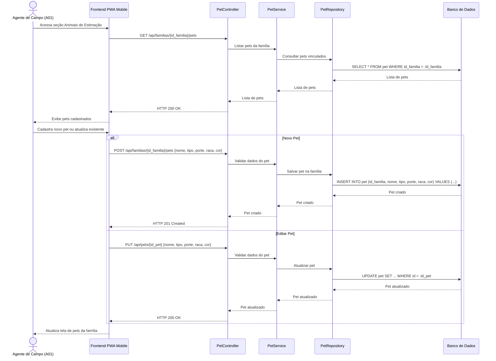
```mermaid
sequenceDiagram
    actor Agente as Agente de Campo (A01)
    participant Frontend as Frontend PWA Mobile
    participant Controller as PetController
    participant Service as PetService
    participant Repository as PetRepository
    participant DB as Banco de Dados

    Agente->>Frontend: Acessa seção Animais de Estimação
    Frontend->>Controller: GET /api/familias/{id_familia}/pets
    Controller->>Service: Listar pets da família
    Service->>Repository: Consultar pets vinculados
    Repository->>DB: SELECT * FROM pet WHERE id_familia = :id_familia
    DB-->>Repository: Lista de pets
    Repository-->>Service: Lista de pets
    Service-->>Controller: Lista de pets
    Controller-->>Frontend: HTTP 200 OK
    Frontend-->>Agente: Exibe pets cadastrados

    Agente->>Frontend: Cadastra novo pet ou atualiza existente
    alt Novo Pet
        Frontend->>Controller: POST /api/familias/{id_familia}/pets {nome, tipo, porte, raca, cor}
        Controller->>Service: Validar dados do pet
        Service->>Repository: Salvar pet na família
        Repository->>DB: INSERT INTO pet (id_familia, nome, tipo, porte, raca, cor) VALUES (...)
        DB-->>Repository: Pet criado
        Repository-->>Service: Pet criado
        Service-->>Controller: Pet criado
        Controller-->>Frontend: HTTP 201 Created
    else Editar Pet
        Frontend->>Controller: PUT /api/pets/{id_pet} {nome, tipo, porte, raca, cor}
        Controller->>Service: Validar dados do pet
        Service->>Repository: Atualizar pet
        Repository->>DB: UPDATE pet SET ... WHERE id = :id_pet
        DB-->>Repository: Pet atualizado
        Repository-->>Service: Pet atualizado
        Service-->>Controller: Pet atualizado
        Controller-->>Frontend: HTTP 200 OK
    end
    Frontend-->>Agente: Atualiza tela de pets da família
```

Este fluxo detalha a manutenção dos animais de estimação informados pelo **Agente de Campo (A01)**. O Frontend consulta os pets já vinculados à família e permite adicionar ou editar registros, sempre associando o animal ao `id_familia`, e não diretamente à moradia. Essa decisão acompanha o modelo de dados atual: se a família for realocada, os pets permanecem associados ao mesmo núcleo familiar, enquanto o histórico de ocupação registra a mudança de moradia. O Service valida os campos obrigatórios, como `tipo_pet`, e o Repository persiste os dados na tabela `pet`.

---

### FL07 — Mapa de calor e indicadores de vulnerabilidade (Backlog)
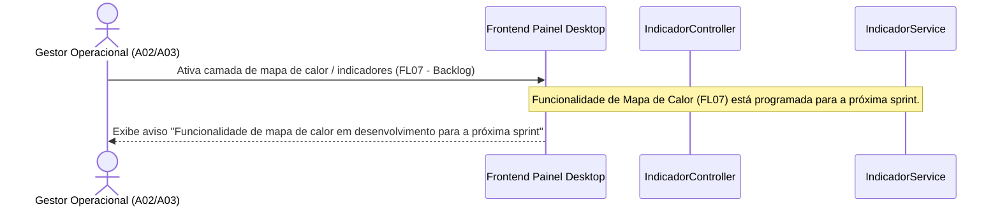
```mermaid
sequenceDiagram
    actor Gestor as Gestor Operacional (A02/A03)
    participant Frontend as Frontend Painel Desktop
    participant Controller as IndicadorController
    participant Service as IndicadorService

    Gestor->>Frontend: Ativa camada de mapa de calor / indicadores (FL07 - Backlog)

    Note over Frontend, Service: Funcionalidade de Mapa de Calor (FL07) está programada para a próxima sprint.

    Frontend-->>Gestor: Exibe aviso "Funcionalidade de mapa de calor em desenvolvimento para a próxima sprint"
```

Este fluxo descreve a geração do mapa de calor utilizado pelo **Gestor Operacional (A02/A03)** para visualizar concentrações de vulnerabilidade no território. O usuário ativa a camada de calor e seleciona filtros como idosos, PCDs, acamados, gestantes ou crianças. O backend consulta moradias ativas, ocupações atuais e moradores vinculados aos grupos prioritários, agrupando coordenadas por intensidade. O Frontend renderiza a camada sobre o mapa e recalcula os clusters quando o usuário altera zoom ou filtro. Em paralelo, o painel pode consultar os indicadores de recadastro, exibindo o total de registros atualizados e desatualizados.

---

### FL08 — Arquivamento lógico de moradia (Endpoints Separados)
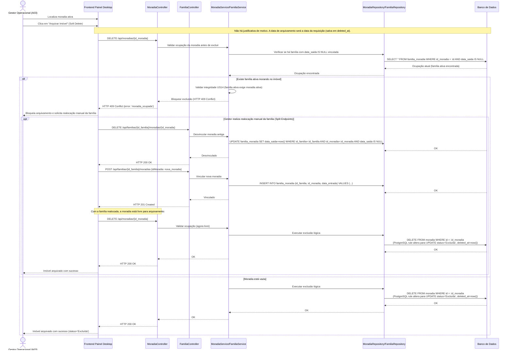
```mermaid
sequenceDiagram
    actor Gestor as Gestor Operacional (A03)
    participant Frontend as Frontend Painel Desktop
    participant MoradiaController as MoradiaController
    participant FamiliaController as FamiliaController
    participant Service as MoradiaService/FamiliaService
    participant Repository as MoradiaRepository/FamiliaRepository
    participant DB as Banco de Dados

    Gestor->>Frontend: Localiza moradia ativa
    Gestor->>Frontend: Clica em "Arquivar Imóvel" (Soft Delete)

    Note over Frontend, DB: Não há justificativa de motivo. A data de arquivamento será a data da requisição (salva em deleted_at).

    Frontend->>MoradiaController: DELETE /api/moradias/{id_moradia}
    MoradiaController->>Service: Validar ocupação da moradia antes de excluir
    Service->>Repository: Verificar se há família com data_saida IS NULL vinculada
    Repository->>DB: SELECT * FROM familia_moradia WHERE id_moradia = :id AND data_saida IS NULL
    DB-->>Repository: Ocupação atual (família ativa encontrada)
    Repository-->>Service: Ocupação encontrada

    alt Existe família ativa morando no imóvel
        Service->>Service: Validar integridade US14 (família ativa exige moradia ativa)
        Service-->>MoradiaController: Bloquear exclusão (HTTP 409 Conflict)
        MoradiaController-->>Frontend: HTTP 409 Conflict {error: 'moradia_ocupada'}
        Frontend-->>Gestor: Bloqueia arquivamento e solicita realocação manual da família

        opt Gestor realiza realocação manual da família (Split Endpoints)
            Frontend->>FamiliaController: DELETE /api/familias/{id_familia}/moradias/{id_moradia}
            FamiliaController->>Service: Desvincular moradia antiga
            Service->>Repository: UPDATE familia_moradia SET data_saida=now() WHERE id_familia=:id_familia AND id_moradia=:id_moradia AND data_saida IS NULL
            DB-->>Repository: OK
            Service-->>FamiliaController: Desvinculado
            FamiliaController-->>Frontend: HTTP 200 OK

            Frontend->>FamiliaController: POST /api/familias/{id_familia}/moradias {idMoradia: nova_moradia}
            FamiliaController->>Service: Vincular nova moradia
            Service->>Repository: INSERT INTO familia_moradia (id_familia, id_moradia, data_entrada) VALUES (...)
            DB-->>Repository: OK
            Service-->>FamiliaController: Vinculado
            FamiliaController-->>Frontend: HTTP 201 Created

            Note over Frontend, MoradiaController: Com a família realocada, a moradia está livre para arquivamento:
            Frontend->>MoradiaController: DELETE /api/moradias/{id_moradia}
            MoradiaController->>Service: Validar ocupação (agora livre)
            Service->>Repository: Executar exclusão lógica
            Repository->>DB: DELETE FROM moradia WHERE id = :id_moradia<br/>(PostgreSQL rule altera para UPDATE status='Excluída', deleted_at=now())
            DB-->>Repository: OK
            Service-->>MoradiaController: OK
            MoradiaController-->>Frontend: HTTP 200 OK
            Frontend-->>Gestor: Imóvel arquivado com sucesso
        end
    else Moradia está vazia
        Service->>Repository: Executar exclusão lógica
        Repository->>DB: DELETE FROM moradia WHERE id = :id_moradia<br/>(PostgreSQL rule altera para UPDATE status='Excluída', deleted_at=now())
        DB-->>Repository: OK
        Repository-->>Service: OK
        Service-->>MoradiaController: OK
        MoradiaController-->>Frontend: HTTP 200 OK
        Frontend-->>Gestor: Imóvel arquivado com sucesso (status='Excluída')
    end
```

Este fluxo representa o arquivamento lógico de uma moradia pelo **Gestor Operacional (A03)**. O gestor seleciona uma moradia ativa, informa o motivo do arquivamento e envia a solicitação de alteração de status. O Service verifica se existe uma ocupação ativa vinculada à moradia por meio de `historico_ocupacao`. Se houver família ativa residindo no local, a operação é bloqueada com conflito, pois a US14 exige que toda família ativa possua uma moradia ativa vinculada. Nesse caso, o sistema solicita realocação ou inativação da família antes de concluir o arquivamento. Se não houver ocupação ativa, o status da moradia é atualizado sem exclusão física, preservando a rastreabilidade histórica conforme RN03.

---

### FL09 — Arquivamento lógico de morador falecido (Endpoints Separados)
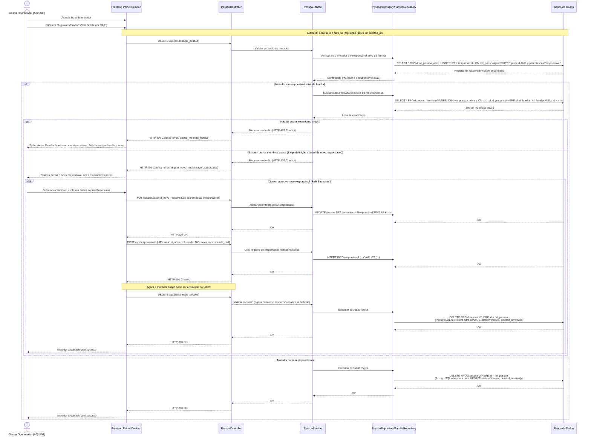
```mermaid
sequenceDiagram
    actor Gestor as Gestor Operacional (A02/A03)
    participant Frontend as Frontend Painel Desktop
    participant PessoaController as PessoaController
    participant Service as PessoaService
    participant Repository as PessoaRepository/FamiliaRepository
    participant DB as Banco de Dados

    Gestor->>Frontend: Acessa ficha do morador
    Gestor->>Frontend: Clica em "Arquivar Morador" (Soft Delete por Óbito)

    Note over Frontend, DB: A data do óbito será a data da requisição (salva em deleted_at).

    Frontend->>PessoaController: DELETE /api/pessoas/{id_pessoa}
    PessoaController->>Service: Validar exclusão do morador
    Service->>Repository: Verificar se o morador é o responsável ativo da família
    Repository->>DB: SELECT * FROM vw_pessoa_ativa p INNER JOIN responsavel r ON r.id_pessoa=p.id WHERE p.id=:id AND p.parentesco='Responsável'
    DB-->>Repository: Registro de responsável ativo encontrado
    Repository-->>Service: Confirmado (morador é o responsável atual)

    alt Morador é o responsável ativo da família
        Service->>Repository: Buscar outros moradores ativos da mesma família
        Repository->>DB: SELECT * FROM pessoa_familia pf INNER JOIN vw_pessoa_ativa p ON p.id=pf.id_pessoa WHERE pf.id_familia=:id_familia AND p.id <> :id
        DB-->>Repository: Lista de membros ativos
        Repository-->>Service: Lista de candidatos

        alt Não há outros moradores ativos
            Service-->>PessoaController: Bloquear exclusão (HTTP 409 Conflict)
            PessoaController-->>Frontend: HTTP 409 Conflict {error: 'ultimo_membro_familia'}
            Frontend-->>Gestor: Exibe alerta: Família ficará sem membros ativos. Solicita inativar família inteira.
        else Existem outros membros ativos (Exige definição manual de novo responsável)
            Service-->>PessoaController: Bloquear exclusão (HTTP 409 Conflict)
            PessoaController-->>Frontend: HTTP 409 Conflict {error: 'requer_novo_responsavel', candidatos}
            Frontend-->>Gestor: Solicita definir o novo responsável entre os membros ativos

            opt Gestor promove novo responsável (Split Endpoints)
                Gestor->>Frontend: Seleciona candidato e informa dados sociais/financeiros

                Frontend->>PessoaController: PUT /api/pessoas/{id_novo_responsavel} {parentesco: 'Responsável'}
                PessoaController->>Service: Alterar parentesco para Responsável
                Service->>Repository: UPDATE pessoa SET parentesco='Responsável' WHERE id=:id
                DB-->>Repository: OK
                Service-->>PessoaController: OK
                PessoaController-->>Frontend: HTTP 200 OK

                Frontend->>PessoaController: POST /api/responsaveis {idPessoa: id_novo, cpf, renda, NIS, sexo, raca, estado_civil}
                PessoaController->>Service: Criar registro de responsável financeiro/social
                Service->>Repository: INSERT INTO responsavel (...) VALUES (...)
                DB-->>Repository: OK
                Service-->>PessoaController: OK
                PessoaController-->>Frontend: HTTP 201 Created

                Note over Frontend, PessoaController: Agora o morador antigo pode ser arquivado por óbito:
                Frontend->>PessoaController: DELETE /api/pessoas/{id_pessoa}
                PessoaController->>Service: Validar exclusão (agora com novo responsável ativo já definido)
                Service->>Repository: Executar exclusão lógica
                Repository->>DB: DELETE FROM pessoa WHERE id = :id_pessoa<br/>(PostgreSQL rule altera para UPDATE status='Inativo', deleted_at=now())
                DB-->>Repository: OK
                Service-->>PessoaController: OK
                PessoaController-->>Frontend: HTTP 200 OK
                Frontend-->>Gestor: Morador arquivado com sucesso
            end
        end
    else Morador comum (dependente)
        Service->>Repository: Executar exclusão lógica
        Repository->>DB: DELETE FROM pessoa WHERE id = :id_pessoa<br/>(PostgreSQL rule altera para UPDATE status='Inativo', deleted_at=now())
        DB-->>Repository: OK
        Repository-->>Service: OK
        Service-->>PessoaController: OK
        PessoaController-->>Frontend: HTTP 200 OK
        Frontend-->>Gestor: Morador arquivado com sucesso
    end
```

Este fluxo descreve o arquivamento lógico de um morador falecido realizado pelo **Gestor Operacional (A02)**. O gestor informa a data de falecimento e confirma a operação. O Service verifica se o cidadão é o responsável da família. Caso seja, o sistema exige a escolha de um novo responsável ativo antes de concluir o arquivamento, preservando a integridade definida pela US13. Quando a substituição é resolvida, o cadastro do cidadão é inativado por meio de `status_cadastro=false`, sem deleção física. Após a atualização, o Service reavalia a prioridade da família e a regra de Risco Crítico, garantindo que consultas e relatórios ativos não exibam moradores arquivados.

---

### FL10 — Alerta automático de recadastro (Tag de 12 meses)
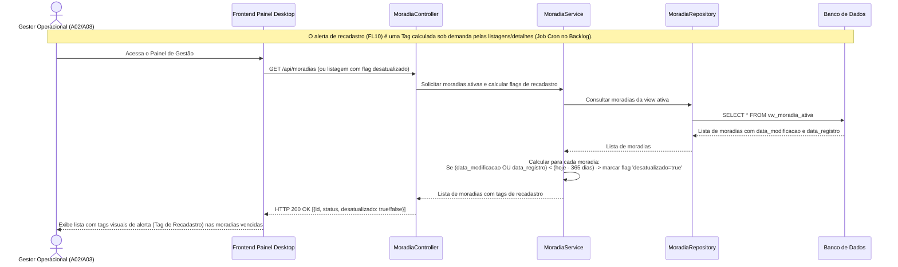
```mermaid
sequenceDiagram
    actor Gestor as Gestor Operacional (A02/A03)
    participant Frontend as Frontend Painel Desktop
    participant Controller as MoradiaController
    participant Service as MoradiaService
    participant Repository as MoradiaRepository
    participant DB as Banco de Dados

    Note over Gestor, DB: O alerta de recadastro (FL10) é uma Tag calculada sob demanda pelas listagens/detalhes (Job Cron no Backlog).

    Gestor->>Frontend: Acessa o Painel de Gestão
    Frontend->>Controller: GET /api/moradias (ou listagem com flag desatualizado)
    Controller->>Service: Solicitar moradias ativas e calcular flags de recadastro
    Service->>Repository: Consultar moradias da view ativa
    Repository->>DB: SELECT * FROM vw_moradia_ativa
    DB-->>Repository: Lista de moradias com data_modificacao e data_registro
    Repository-->>Service: Lista de moradias

    Service->>Service: Calcular para cada moradia:<br/>Se (data_modificacao OU data_registro) < (hoje - 365 dias) -> marcar flag 'desatualizado=true'

    Service-->>Controller: Lista de moradias com tags de recadastro
    Controller-->>Frontend: HTTP 200 OK [{id, status, desatualizado: true/false}]
    Frontend-->>Gestor: Exibe lista com tags visuais de alerta (Tag de Recadastro) nas moradias vencidas
```

Este fluxo documenta a rotina de recadastro obrigatório prevista pela RN02. Um job agendado verifica diariamente moradias ativas cuja `ultima_atualizacao` tenha ultrapassado 365 dias. A consulta considera moradias com ocupação ativa e família ativa, evitando alertas sobre registros apenas históricos. No painel, o **Gestor Operacional (A02/A03)** consulta os indicadores de recadastro e visualiza o total de cadastros atualizados e desatualizados. Ao clicar no indicador, o Frontend redireciona para a listagem de moradias com o filtro `desatualizado=true`, permitindo organizar as revisitas de campo.

---

### FL11 — Regra transversal de Risco Crítico (RN05)
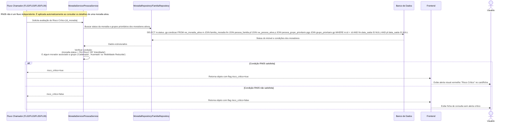
```mermaid
sequenceDiagram
    participant Chamador as Fluxo Chamador (FL02/FL03/FL05/FL09)
    participant Service as MoradiaService/PessoaService
    participant Repository as MoradiaRepository/FamiliaRepository
    participant DB as Banco de Dados
    participant Frontend as Frontend
    actor Usuario as Usuário

    Note over Chamador, Service: RN05 não é um fluxo independente. É aplicada automaticamente ao consultar os detalhes de uma moradia ativa.

    Chamador->>Service: Solicita avaliação de Risco Crítico {id_moradia}
    Service->>Repository: Buscar status da moradia e grupos prioritários dos moradores ativos
    Repository->>DB: SELECT m.status, gp.condicao FROM vw_moradia_ativa m JOIN familia_moradia fm JOIN pessoa_familia pf JOIN vw_pessoa_ativa p JOIN pessoa_grupo_prioritario pgp JOIN grupo_prioritario gp WHERE m.id = :id AND fm.data_saida IS NULL AND pf.data_saida IS NULL
    DB-->>Repository: Status do imóvel e condições dos moradores
    Repository-->>Service: Dados estruturados

    Service->>Service: Verificar condição:<br/>(moradia.status = 'Em Risco' OR 'Interditada')<br/>E algum morador associado a grupo ('Cadeirante', 'Acamado' ou 'Mobilidade Reduzida')

    alt Condição RN05 satisfeita
        Service-->>Chamador: risco_critico=true
        Chamador-->>Frontend: Retorna objeto com flag risco_critico=true
        Frontend-->>Usuario: Exibe alerta visual vermelho "Risco Crítico" no card/ficha
    else Condição RN05 não satisfeita
        Service-->>Chamador: risco_critico=false
        Chamador-->>Frontend: Retorna objeto com flag risco_critico=false
        Frontend-->>Usuario: Exibe ficha de consulta sem alerta crítico
    end
```

Este fluxo representa uma regra transversal, acionada por outros fluxos sempre que uma moradia e seus moradores ativos são carregados para exibição. O Service consulta a moradia, a ocupação ativa, a família residente e os cidadãos vinculados aos grupos prioritários. A condição RN05 é satisfeito quando a moradia possui histórico de ocorrência e existe ao menos um morador ativo classificado com mobilidade reduzida ou acamado. Quando a condição é verdadeira, a resposta recebe `risco_critico=true`, permitindo que o Frontend destaque a flag \"Risco Crítico\" em cards, fichas e consultas integradas. Quando a condição não é satisfeita, a ficha é exibida sem o alerta.

---

### FL12 — Validação transversal de integridade cadastral
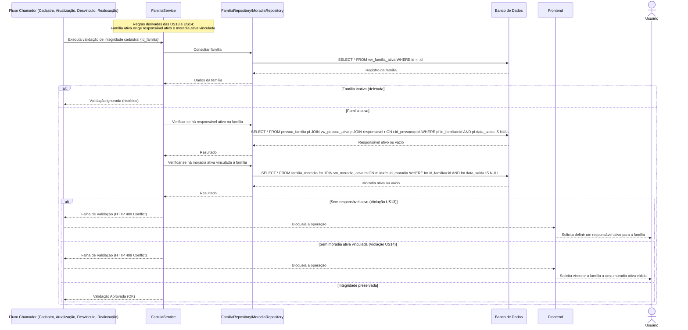
```mermaid
sequenceDiagram
    participant Chamador as Fluxo Chamador (Cadastro, Atualização, Desvinculo, Realocação)
    participant Service as FamiliaService
    participant Repository as FamiliaRepository/MoradiaRepository
    participant DB as Banco de Dados
    participant Frontend as Frontend
    actor Usuario as Usuário

    Note over Service: Regras derivadas das US13 e US14:<br/>Família ativa exige responsável ativo e moradia ativa vinculada.

    Chamador->>Service: Executa validação de integridade cadastral {id_familia}
    Service->>Repository: Consultar família
    Repository->>DB: SELECT * FROM vw_familia_ativa WHERE id = :id
    DB-->>Repository: Registro da família
    Repository-->>Service: Dados da família

    alt Família inativa (deletada)
        Service-->>Chamador: Validação ignorada (histórico)
    else Família ativa
        Service->>Repository: Verificar se há responsável ativo na família
        Repository->>DB: SELECT * FROM pessoa_familia pf JOIN vw_pessoa_ativa p JOIN responsavel r ON r.id_pessoa=p.id WHERE pf.id_familia=:id AND pf.data_saida IS NULL
        DB-->>Repository: Responsável ativo ou vazio
        Repository-->>Service: Resultado

        Service->>Repository: Verificar se há moradia ativa vinculada à família
        Repository->>DB: SELECT * FROM familia_moradia fm JOIN vw_moradia_ativa m ON m.id=fm.id_moradia WHERE fm.id_familia=:id AND fm.data_saida IS NULL
        DB-->>Repository: Moradia ativa ou vazio
        Repository-->>Service: Resultado

        alt Sem responsável ativo (Violação US13)
            Service-->>Chamador: Falha de Validação (HTTP 409 Conflict)
            Chamador-->>Frontend: Bloqueia a operação
            Frontend-->>Usuario: Solicita definir um responsável ativo para a família
        else Sem moradia ativa vinculada (Violação US14)
            Service-->>Chamador: Falha de Validação (HTTP 409 Conflict)
            Chamador-->>Frontend: Bloqueia a operação
            Frontend-->>Usuario: Solicita vincular a família a uma moradia ativa válida
        else Integridade preservada
            Service-->>Chamador: Validação Aprovada (OK)
        end
    end
```

Este fluxo consolida as validações derivadas das US13 e US14. Ele não representa uma tela isolada, mas uma regra transversal chamada por operações de cadastro, atualização, arquivamento e realocação. Sempre que uma família ativa é alterada, o Service verifica se existe responsável ativo vinculado e se há uma ocupação ativa em moradia válida. Se a família ficar sem responsável, a operação é bloqueada e o usuário deve definir um novo responsável. Se a família ficar sem moradia ativa, o sistema exige a criação de uma nova ocupação ou a inativação da família. Essa validação impede inconsistências cadastrais e preserva a coerência entre `familia`, `responsavel`, `moradia` e `historico_ocupacao`.


### 3.2.5. Diagrama de Atividades ou Estados (sprint 3)

*Ao menos um fluxo relevante em UML ou BPMN. Use a notação da ferramenta escolhida de forma consistente (sem misturar convenções).*

### 3.2.6. Diagrama de Implantação (sprints 4 e 5)

*Diagrama UML de deployment mostrando nós físicos, artefatos e canais de comunicação. Representa a visão Engineering + Technology do RM-ODP.*

### 3.2.7. Padrões de Projeto Aplicados (sprints 3 a 5)

Durante o desenvolvimento do backend do GeoRisco, foram aplicados padrões arquiteturais voltados à separação de responsabilidades, testabilidade, segurança e manutenção das regras de negócio. A aplicação foi consolidada em camadas com TypeScript, Express, PostgreSQL/Supabase e Supabase Storage, cobrindo CRUDs, núcleo familiar transacional, histórico de vínculos, consulta detalhada de moradias, pets e fotos.

| Padrão / Conceito Arquitetural | Aplicação no GeoRisco | Justificativa |
| :--- | :--- | :--- |
| **Arquitetura em Camadas** | O backend está organizado em `routes`, `controllers`, `services`, `repositories`, `dtos`, `models`, `validations`, `errors`, `db`, `storage`, `views` e `public`. | Essa divisão separa entrada HTTP, interface EJS, regras de negócio, persistência e infraestrutura, facilitando evolução dos módulos de pessoas, moradias, famílias, pets, fotos e vínculos históricos. |
| **Controller** | Os controllers recebem requisições, extraem parâmetros, normalizam payloads, chamam services e retornam JSON ou views EJS. | Evita que regras de negócio e SQL fiquem misturados com detalhes de rota, status code, renderização e contratos HTTP. |
| **Service Layer** | Os services concentram validações de negócio, orquestração entre repositories, transações e composição de respostas agregadas, como núcleo familiar e detalhes da moradia. | Necessário para fluxos compostos, como cadastro de responsável, criação de moradia com localização, vínculo família-moradia, pets, fotos e consulta detalhada. |
| **Repository Pattern** | Os repositories encapsulam SQL, acesso ao PostgreSQL/Supabase e mapeamento entre colunas do banco e objetos TypeScript. | Isola a persistência da lógica de negócio, permitindo alterar queries, views ou estratégia de banco sem impactar diretamente controllers e services. |
| **DTO (Data Transfer Object)** | Os DTOs definem formatos de entrada e saída para pessoas, responsáveis, moradias, localização, famílias, pets, fotos e URLs assinadas. | Padroniza os dados trafegados entre frontend e backend, reduz exposição de campos sensíveis e torna os contratos da API mais claros. |
| **Dependency Injection por Construtor** | Controllers recebem services, services recebem repositories e alguns repositories aceitam um `Queryable` para uso com `pool` ou cliente transacional. | Reduz acoplamento entre classes, facilita testes com mocks e permite reutilizar a mesma operação dentro ou fora de transações. |
| **Interface Segregation / Contratos** | Existem interfaces específicas para services e repositories, como `IPessoaService`, `IFamiliaRepository`, `IMoradiaService`, `IPetRepository` e equivalentes. | Os contratos deixam claro o que cada camada pode consumir, evitando dependência direta de implementações concretas. |
| **Validação e Normalização Centralizadas** | Arquivos em `validations/` e funções em `request-utils.ts` validam payloads, IDs, datas, números, booleanos, campos obrigatórios e aliases de campos. | Garante consistência antes da persistência, reduz duplicação nos controllers e melhora a qualidade dos dados coletados em campo. |
| **Custom Exception e Erro Padronizado** | A classe `HttpError` representa erros de negócio com status HTTP, e `handleControllerError` padroniza as respostas de erro. | Diferencia erros esperados, como ID inválido, registro inexistente ou conflito de responsável, de falhas internas, sem expor detalhes técnicos. |
| **Transação / Unit of Work** | Operações que afetam múltiplas tabelas usam `BEGIN`, `COMMIT` e `ROLLBACK` nos services com o mesmo cliente de banco. | Mantém integridade em fluxos críticos, como criação de responsável, moradia com localização, atualização conjunta e cadastro completo de núcleo familiar. |
| **Soft Delete e Views Ativas** | O banco usa `deleted_at`, status e views como `vw_pessoa_ativa`, `vw_moradia_ativa` e `vw_familia_ativa` para consultas operacionais. | Preserva histórico e conformidade com LGPD, enquanto evita que registros arquivados apareçam nas listagens e vínculos ativos. |
| **Regras de Integridade no Banco** | Migrações adicionam restrições como foto com exatamente um dono (`moradia` ou `pet`) e trigger de responsável único por família ativa. | Reforça regras críticas mesmo se uma chamada futura contornar a camada de serviço, protegendo consistência entre família, moradia, pessoa, pet e foto. |
| **Adapter / Facade para Serviço Externo** | O acesso ao Supabase Storage fica isolado em `storage/supabase-storage.client.ts` e no `FotoStorageService`, com URLs assinadas para upload e leitura. | Centraliza a integração externa de fotos, separa metadados relacionais dos arquivos e evita que controllers e repositories dependam diretamente da API do Supabase. |

## 3.3. Wireframes (sprint 2)

Esta seção é destinada para apresentar os primeiros esboços do sistema: os wireframes. Além de ser a representação das telas de menor fidelidade com o resultado final, esses 

Um wireframe é um quadro (frame) com a estrutura do sistema desenhada em fios (wire) ou blocos de maneira bastante simples.

Vale ressaltar que todas as informações presentes nos wireframes são apenas para facilitar a visualização futura de uma aplicação funcional. Caso alguma informação precise ser adicionada ou excluída, isso será possível futuramente.

### **1. Página Inicial**

<div align="center">
    <p>Figura 7: Wireframe Tela Inicial</p>
    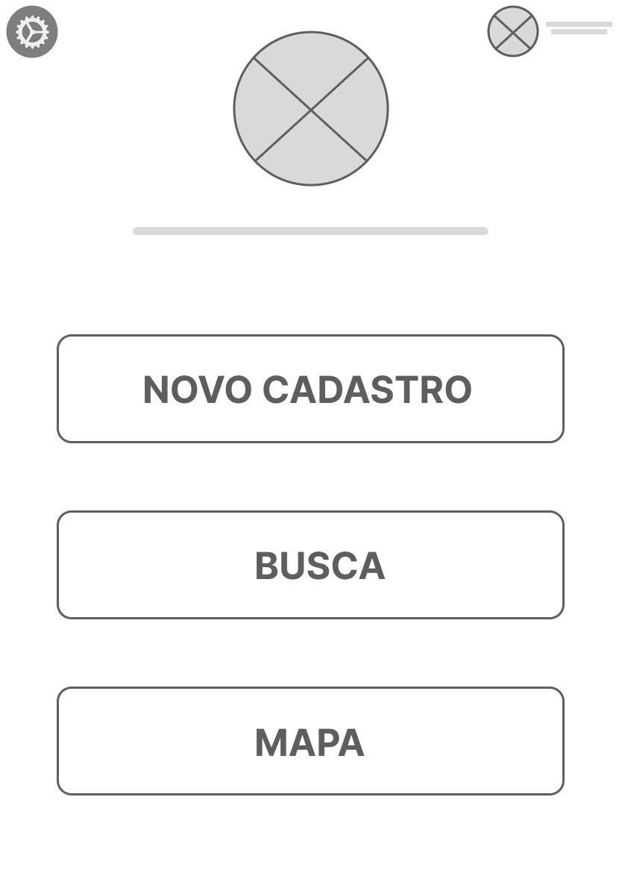
    <p>Feito pela própria equipe (2026)</p>
</div>

Num primeiro momento, a ideia desse wireframe é a simplicidade e a intuitividade. O layout escolhido, com três grandes botões centralizados, e um cabeçalho, importante mas não principal, posicionado na parte de cima, tem como objetivo trazer poucas informações na tela, servindo apenas para uma recepção amigável e uma navegação intuitiva entre outras páginas.

Além disso, na parte superior, exitem duas logos: Defesa civil de Santo André (círculo maior) e Prefeitura de Santo André (círculo menor). Junto dessas logos, respectivamente, tem um texgo generalizado (como "Olá Agente!") e um texto de cabeçalho simples. Por fim, a engrenagem no canto superior esquerdo significa uma possível aba de configurações.

Por fim, mas não menos importante, o menu de navegação presente na parte inferior inteira da tela, contém ícones referentes aos três grandes botões. Isso foi implementado como um "rodapé" fixo para a aplicação, presente em todo o restante das telas, a fim de facilitar a navegação entre telas, deixando o usuário mais livre para transitar entre tarefas.

---

### **2. Páginas de Cadastro**

Ao clicar no botão "Novo Cadastro", o usuário será redirecionado para a tela de cadastro, para inserir novos dados de pessoas e moradias no banco de dados.

A ideia inicial é seguir uma ordem, separando cada seção por tela e guiando o usuário com setas indicando "próximo" e "voltar". No entanto, com o objetivo de deixar a navegação o mais livre possível, foi pensada uma barra na parte superior da tela, abaixo do cabeçalho, contendo quatro botões clicáveis que redirecionam para cada seção.

Quanto ao menu de navegação, ele será mantido na parte inferior da tela, da mesma forma que foi inserido na tela inicial.

Para concluir o cadastro, um botão "Concluir Cadastro" deve ser exibido assim que todos os campos obrigatórios forem preenchidos. (Obs: os campos obrigatórios ainda não foram definidos completamente na sprint 3, por isso os wireframes não os abordam)

---

<div align="center">
    <p>Figura 9: Wireframe Tela Cadastro - Moradias</p>
    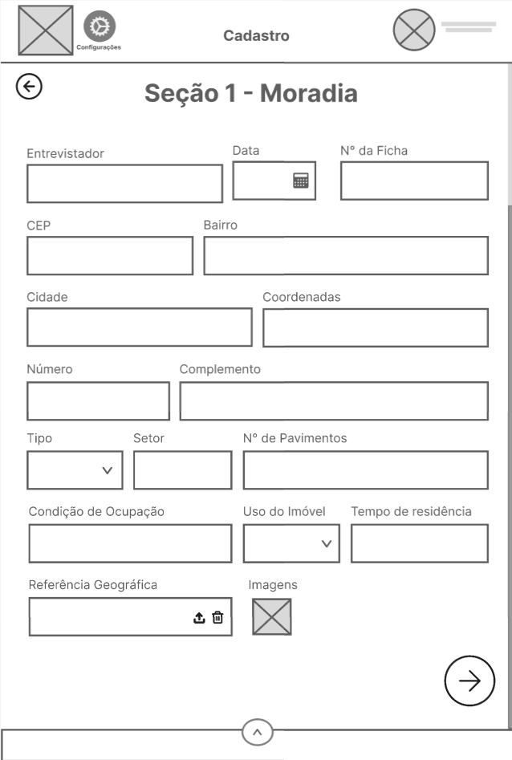
    <p>Feito pela própria equipe (2026)</p>
</div>

Esta seção engloba todas as informações necessárias para completar o cadastro das moradias. 

Uma funcionalidade adicional que vale a pena ressaltar, é a de inclusão de imagens. No bloco de "Referência Geográfica", será possível adicionar uma imagem tanto por foto quanto por upload, além de ser possível excluí-la.

Outra funcionalidade interessante é a de seleção de múltipla escolha em um bloco, representada por uma seta para baixo que, ao clicar, são exibidos todos os preenchimentos possíveis para aquele campo.

Neste wireframe, por conter uma tela bastante preenchida com informações pertinentes, os botões "Próximo" e "Voltar" não estão representados. Porém, é possível identificar uma barra na lateral direita, sinalizando que a página pode ser arrastada para baixo.

---

<div align="center">
    <p>Figura 10: Wireframe Tela Cadastro - Responsável</p>
    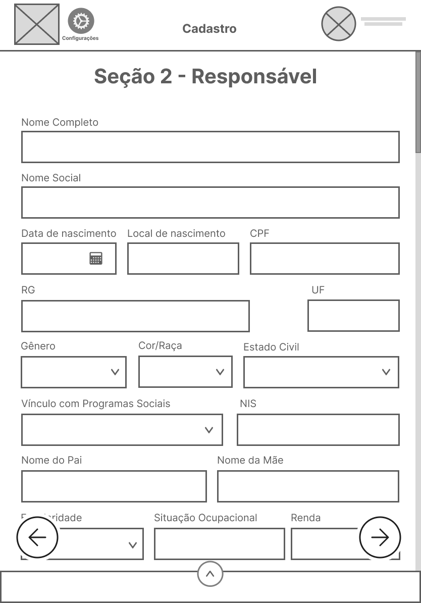
    <p>Feito pela própria equipe (2026)</p>
</div>

Esta seção engloba todas as informações necessárias para completar o cadastro do responsável.

A ideia desta tela se assemelha muito à anterior, contendo campos de informação preenchíveis, tanto por digitação quanto por múltipla escolha. No entanto, esta página não terá um campo que permita a adição de fotos ou arquivos.

Neste wireframe, por conter uma tela bastante preenchida com informações pertinentes, os botões "Próximo" e "Voltar" não estão representados. Porém, é possível identificar uma barra na lateral direita, sinalizando que a página pode ser arrastada para baixo.

---

<div align="center">
    <p>Figura 11: Wireframe Tela Cadastro - Moradores</p>
    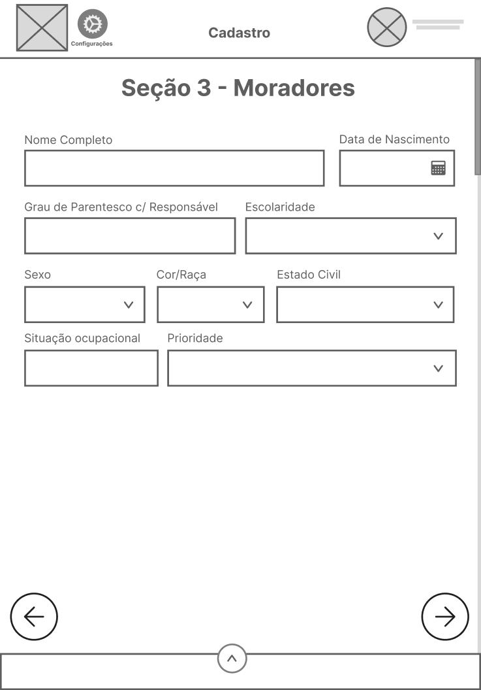
    <p>Feito pela própria equipe (2026)</p>
</div>

Esta seção engloba todas as informações necessárias para completar o cadastro dos moradores restantes.

Nesse wireframe, algumas informações que estavam presentes na seção 2 serão preservadas, mas outras (como renda) serão removidas, com o intuito de deixar mais simples. 

Além disso, vale ressaltar que na imagem está representado apenas o preenchimento de um morador. No caso de existir mais moradores, o usuário deve clicar na área tracejada "+ Adicionar Morador". Assim, um novo bloco de campos preenchíveis, com as mesmas informações, deve surgir para registro e a área tracejada deve ser exibida logo abaixo o novo bloco de campos.

---

<div align="center">
    <p>Figura 12: Wireframe Tela Cadastro - Pets</p>
    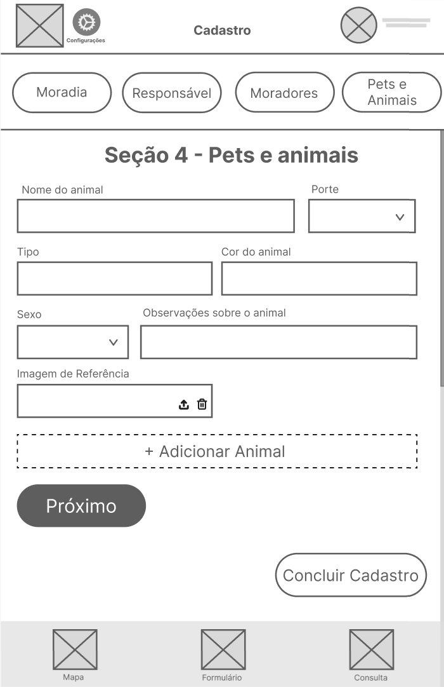
    <p>Feito pela própria equipe (2026)</p>
</div>

Esta seção engloba todas as informações necessárias para concluir o cadastro de Pets (se houver).

Para o cadastro de Pets, será possível incluir algumas informações essenciais e uma foto do animal. No caso de existir mais de um animal, o usuário deve clicar na área tracejada "+ Adicionar Animal". Assim, um novo bloco de campos preenchíveis, com as mesmas informações, deve surgir para registro e a área tracejada deve ser exibida logo abaixo o novo bloco de campos.

---

### **3. Página de Mapa**

<div align="center">
    <p>Figura 13: Wireframe Tela Mapa</p>
    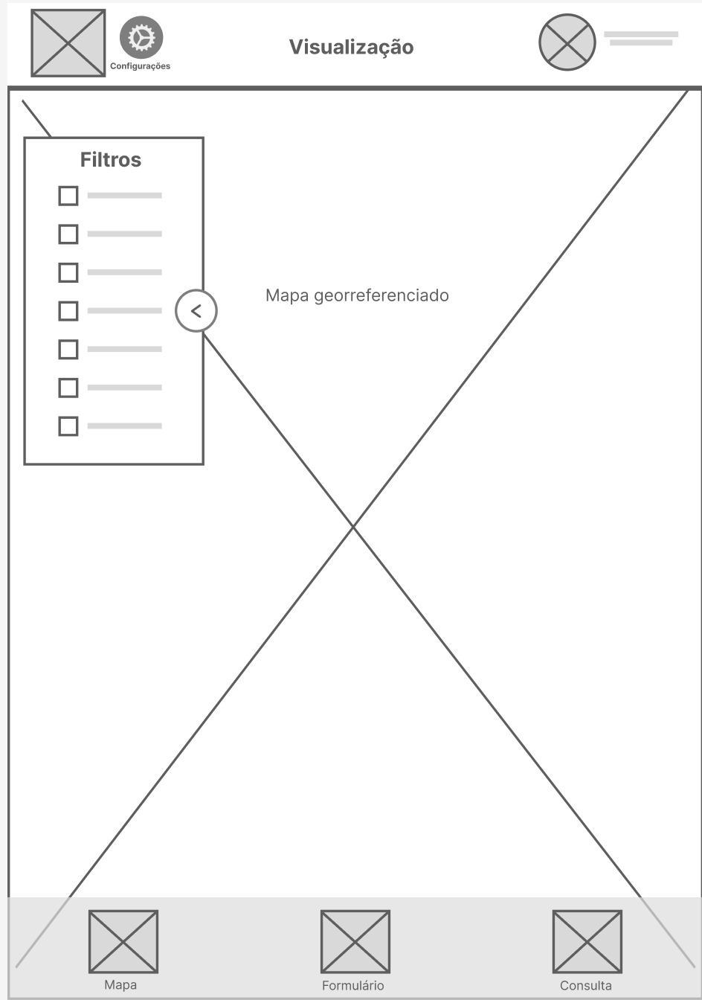
    <p>Feito pela própria equipe (2026)</p>
</div>

Esta seção permite a interação com um mapa georreferenciado e refinar a exibição de dados utilizando um menu lateral de Filtros com diversas caixas de seleção. Além disso, uma peculiaridade dessa seção é a possibilidade de recolher esse painel de filtros para maximizar a área visual do mapa, bem como a barra retratil de navegação no inferior da tela, que permite ao usuário alternar agilmente entre os módulos de "Mapa", "Formulário" e "Consulta".

### **4. Página de Busca**

<div align="center">
    <p>Figura 14: Wireframe Tela Busca - </p>
    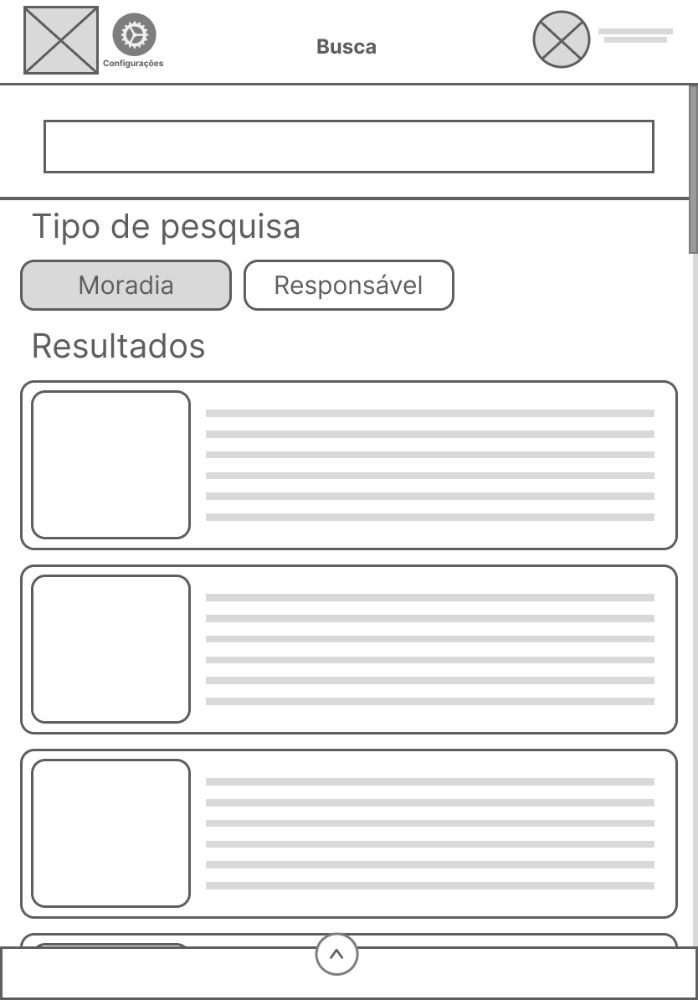
    <p>Feito pela própria equipe (2026)</p>
</div>

Esta seção permite a localização rápida de registros no sistema através de um campo de busca textual localizado no topo da tela. Para refinar a pesquisa e direcionar os resultados, o usuário conta com seletores sob o título "Tipo de pesquisa", permitindo alternar de forma simples entre a busca por dados de "Moradia" ou por "Responsável".

Os dados encontrados são apresentados na área de "Resultados" em formato de lista contínua com cartões (cards). Cada cartão é estruturado para exibir uma imagem ou foto de referência à esquerda, acompanhada de linhas detalhadas de informações textuais à direita. Além disso, a tela preserva a barra retrátil de navegação na área inferior, garantindo que o usuário possa expandi-la para alternar agilmente entre os demais módulos do sistema.

<div align="center">
    <p>Figura 15: Wireframe Tela Resultado da Busca</p>
    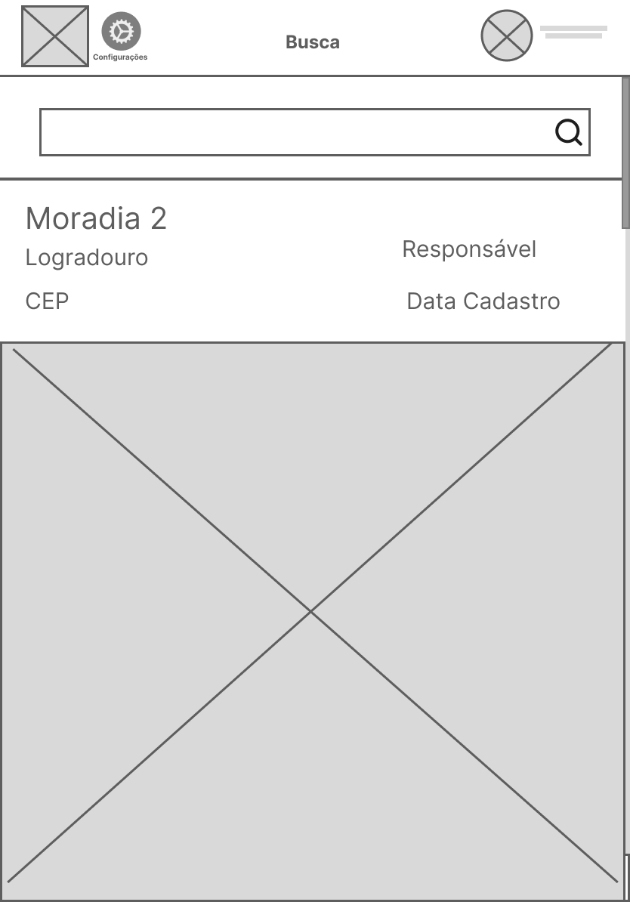
    <p>Feito pela própria equipe (2026)</p>
</div>

Esta seção apresenta o detalhamento de um registro específico, acessado após a etapa de pesquisa. No topo, a interface mantém a barra superior e um campo de busca em destaque (com um ícone de lupa), pois o detalhamento aparece como um pop-up sobre a tela de busca, permitindo que o usuário mantenha o contexto e a possibilidade de alternar rapidamente para outros registros. O layout do detalhamento é dividido em duas colunas: à esquerda, uma imagem ou foto de referência relacionada ao registro; à direita, um conjunto organizado de informações textuais, estruturadas em linhas para facilitar a leitura e compreensão dos dados apresentados.


## 3.4. Guia de estilos (sprint 3)

Esta seção apresenta o guia de estilos utilizado no desenvolvimento da aplicação web. Aqui estão definidos os padrões visuais e componentes de interface adotados, como cores, tipografia, botões, ícones e demais elementos gráficos. O objetivo é garantir consistência visual, padronização e melhor experiência de uso durante o desenvolvimento e evolução da solução.

<div align="center">
    <p>Figura 16: Guia de estilos</p>
    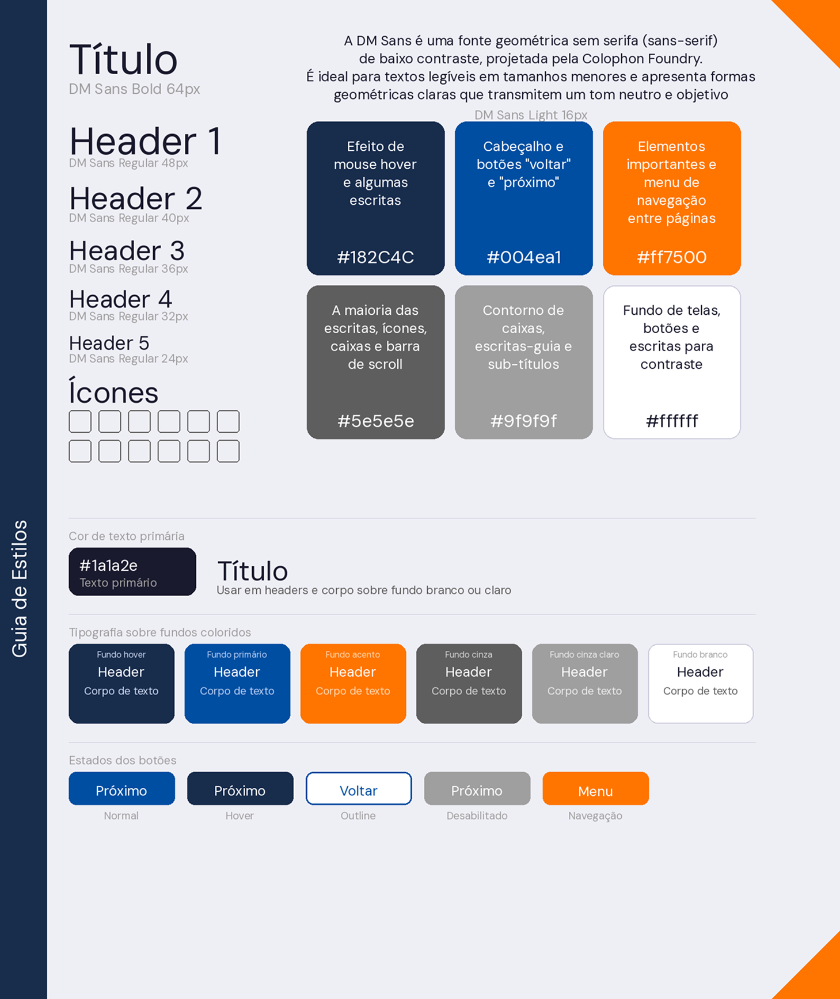
    <p>Feito pela própria equipe (2026)</p>
</div>

### 3.4.1 Cores

A a paleta de cores pensada para a prototipação foi inspirada na logo oficial da própria Defesa Civil de Santo André e do CREDEC-SA (Centro de Resiliência às Emergências de Defesa Civil de Santo André). Logos: 

<div align="center">
    <p>Figura 17: Logo da Defesa Civil de Santo André</p>
    
    <p>Defesa Civil de Santo André</p>
</div>

<div align="center">
    <p>Figura 18: Logo do CREDEC-SA</p>
    
    <p>CREDEC-SA</p>
</div>

A equipe decidiu usar dois tons de azul, um de laranja e três cores neutras. A composição da paleta ficou assim: 

- Azul Escuro: #182C4C
- Azul Claro: #004ea1
- Laranja: #ff7500
- Cinza Escuro: #5e5e5e
- Cinza Claro: #9f9f9f
- Branco: #ffffff 


### 3.4.2 Tipografia

A família tipográfica utilizada na solução é a **DM Sans**, uma fonte geométrica sem serifa (sans-serif) de baixo contraste, projetada pela Colophon Foundry. É ideal para textos legíveis em tamanhos menores e apresenta formas geométricas claras que transmitem um tom neutro e objetivo.

| Estilo | Peso | Tamanho | Uso |
|---|---|---|---|
| Título | DM Sans Bold | 64px | Títulos principais de página |
| Header 1 | DM Sans Regular | 48px | Cabeçalhos de seção primária |
| Header 2 | DM Sans Regular | 40px | Cabeçalhos de seção secundária |
| Header 3 | DM Sans Regular | 36px | Cabeçalhos terciários |
| Header 4 | DM Sans Regular | 32px | Cabeçalhos quaternários |
| Header 5 | DM Sans Regular | 24px | Cabeçalhos de menor hierarquia |
| Corpo / Label | DM Sans Light | 16px | Textos descritivos, legendas e rótulos de componentes |

A cor de texto primária é `#1a1a2e`, utilizada em headers e corpo sobre fundo branco ou claro. Em fundos coloridos, aplica-se texto branco (`#ffffff`).

### 3.4.3 Iconografia e Imagens

A solução utiliza um conjunto de ícones de linha (outline) com estilo geométrico, coerente com a tipografia DM Sans.

**Atributos de aplicação:**

- **Cor padrão:** `#5e5e5e` — ícones em estado neutro
- **Cor ativa:** `#004ea1` — ícones em estado selecionado ou ação principal
- **Cor sobre fundo escuro:** `#ffffff` — sobre fundos `#182C4C` ou `#004ea1`
- **Tamanho padrão:** 24×24px

| Ícone | Função |
|---|---|
| Documento | Representar arquivos ou conteúdos |
| Casa | Navegação para a tela inicial |
| Lupa | Acionar campo de pesquisa |
| Copiar | Duplicar conteúdo ou elemento |
| Editar | Editar informações |
| Diamante | Indicar item especial ou favorito |
| Localização | Indicar endereço ou mapa |
| Upload | Enviar ou exportar conteúdo |
| Lixeira | Excluir item |
| Grade | Visualização em formato de tabela |
| Filtro | Filtrar listagens ou resultados |
| Seta | Navegar para o próximo passo ou página |

## 3.5. Protótipo de alta fidelidade (sprint 3)

### Protótipo Tela Inicial

A tela inicial apresenta o logotipo da Defesa Civil de Santo André centralizado
no topo, sobre um fundo azul gradiente, seguido da saudação **"Bem vindo, Agente."**
com destaque em laranja no nome do perfil.

O conteúdo principal exibe três opções de navegação em formato de cards:

- **Cadastro** — card destacado com fundo azul e borda laranja, indicando a ação
  primária da tela. Contém ícone de documento à esquerda e seta de navegação à direita.
- **Busca** — card secundário com fundo branco, ícone de lupa e seta de navegação.
- **Mapa** — card secundário com fundo branco, ícone de localização e seta de navegação.

Na parte inferior, uma barra de navegação fixa exibe os três atalhos principais:
**Cadastro**, **Mapa** (ativo) e **Busca**, com ícones e rótulos de texto.

---

<div align="center">
    <p>Figura 18: Mockup da Tela Inicial </p>
    
    <p>Feito pela própria equipe (2026)</p>
</div>

### Protótipos da Tela de Mapa

A tela de mapa exibe um cabeçalho azul escuro com o logotipo da Defesa Civil à
esquerda, o título **"Visualização"** centralizado e um ícone de home à direita
para retornar à tela inicial.

O conteúdo principal é ocupado por um mapa interativo da região de Santo André,
sobre o qual é sobreposto um painel lateral de **Filtros** no canto esquerdo.
O painel possui borda laranja, fundo branco e lista categorias de ocorrências
selecionáveis via checkbox. Um botão com seta **"<"** permite recolher o painel,
expandindo a área visível do mapa.

A barra de navegação inferior mantém o padrão da aplicação com os atalhos
**Cadastro**, **Mapa** (ativo) e **Busca**.

 <div align="center">
    <p>Figura 19: Mockup Tela de Mapa </p>
    
    <p>Feito pela própria equipe (2026)</p>
</div> 

### Protótipos da Tela de Busca

A tela de busca mantém o cabeçalho padrão com logotipo, título **"Busca"** e
ícone de home. Abaixo, um campo de texto com ícone de lupa permite inserir termos
de pesquisa, acompanhado de um botão de filtro à direita.

Os resultados são exibidos abaixo do label **"Resultados:"** em azul, com um
contador de registros encontrados ("4 encontrados") alinhado à direita.

Cada resultado é apresentado em um card com borda arredondada contendo:
- **Nome completo** em destaque e CPF como subtítulo
- **Localização** (bairro), **quantidade de pessoas** e **quantidade de pets**
  com ícones correspondentes
- **Tags coloridas** indicando vulnerabilidades do cadastro (ex.: Gestante,
  Criança, Idoso, Doença Crônica), cada uma com cor própria
- Botão **"Editar"** com ícone à direita e botão de **exclusão** (lixeira) abaixo

A barra de navegação inferior mantém o padrão com **Cadastro**, **Mapa** (ativo)
e **Busca**.

 <div align="center">
    <p>Figura 20: Mockup Tela de Busca </p>
    
    <p>Feito pela própria equipe (2026)</p>
</div> 

### Protótipos das telas de Cadastro

Estes protótipos apresentam grandes semelhanças entre eles, visto que possuem quase que a mesma funcionalidade. Entre elas estão, barra azul superior, barra de navegação entre seções, título indicando seção, menu de navegação inferior, botão "Próximo" (embora na seção 2 não seja possível ver), campos para preenchimento de informações, sinalização de obrigatoriedade (* vermelho) e barra lateral indicando possível arraste da página ("scroll up" e "scroll down")

Além disso, os protótipos apresentam funcionalidades em comum, sendo elas: a barra de navegação entre seções indica em qual seção o usuário está (deixando o bloco referente à seção atual azul); o botão "Concluir", apesar de ausente, é exibido assim que o usuário completar todos os campos obrigatórios em qualquer seção; campos preenchíveis por digitação, seleção múltipla, "sim ou não", seleção de data e adição de imagens. 

---

<div align="center">
    <p>Figura 19: Mockup da Seção 1 de Cadastro </p>
    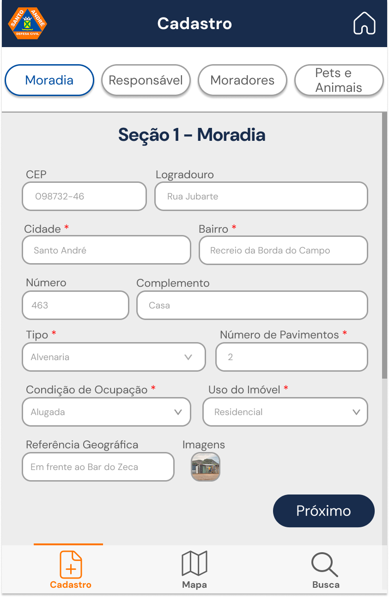
    <p>Feito pela própria equipe (2026)</p>
</div>

A primeira tela ao clicar no botão "Cadastro" da tela inicial é a seção 1, referente à entrada dos dados da moradia. A partir daqui, o usuário fica livre para navegar entre as seções de cadastro conforme o contexto da entrevista com os moradores evolui. 

A primeira seção engloba todos os dados necessários para o cadastro da moradia visitada. 

Um detalhe bastante importante sobre a mudança dos wireframes para os mockups é a disposição da barra superior da tela. As mudanças citadas a seguir se aplicam à todas as telas de cadastro: exclusão do botão de configurações; exclusão da imagem de logo à esquerda; reposicionamento da logo da Defesa Civil de Santo André; exclusão do pequeno texto acompanhado da logo; adição do ícone de casa (redireciona para a tela inicial). 

Este protótipo já apresenta exemplos de informações a serem adicionadas nos campos e como ficaria com todos preenchidos, incluindo a imagem de referência minimizada.

---

<div align="center">
    <p>Figura 20: Mockup da Seção 2 de Cadastro </p>
    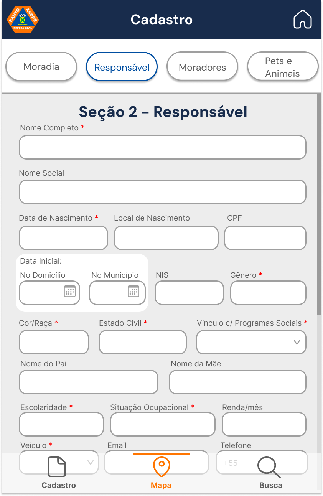
    <p>Feito pela própria equipe (2026)</p>
</div>

A segunda seção engloba todos os dados necessários para o cadastro do responsável pela família/moradia. 

Este protótipo, diferente do anterior, mostra como são os campos de resposta "sim ou não" (boolean) e sinaliza exatamente como o menu inferior interage com o restante dos elementos na tela: opacidade parcial. Além disso, esta tela, por conter uma quantidade maior de informações, não mostra os campos de problema crônico, medicamento e prioridade que, por sua vez, estão ocultos juntos do botão de próximo. Todo o conteúdo poderá ser visualizado com um simples arraste na tela para baixo.

Este protótipo já apresenta exemplos de informações a serem adicionadas nos campos e como ficaria com todos preenchidos.

---

<div align="center">
    <p>Figura 21: Mockup da Seção 3 de Cadastro </p>
    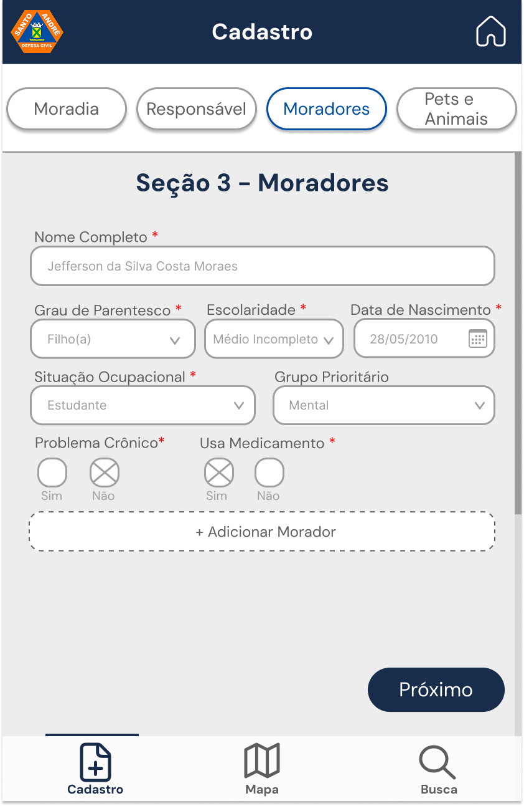
    <p>Feito pela própria equipe (2026)</p>
</div>

A terceira seção engloba todos os dados necessários para o cadastro de todos os moradores da moradia visitada. 

Este protótipo, basicamente imita a estrutura dos dois anteriores e indica todas as informações obrigatórias ou não e o tipo de preenchimento. Por outro lado, esta seção e a próxima apresentam um novo grande botão tracejado. No caso dessa página, ao clicar, o usuário adicionará mais um morador. Além disso, os dados preenchidos do primeiro morador devem ser ocultos e compactados para uma longa barra horizontal que, se clicada, expandirá todos os dados do morador cadastrado. O botão "+Adicionar Morador" estará sempre visível abaixo do último formulário incompleto ou expandido. 

Vale a pena ressaltar que os dados de moradores, selecionados pela equipe, também estão presentes na seção 2 (Responsável), mas apenas os dados que foram julgados essenciais ficaram para a seção 3.

Este protótipo já apresenta exemplos de informações a serem adicionadas nos campos e como ficaria com todos preenchidos.

---

<div align="center">
    <p>Figura 22: Mockup da Seção 4 de Cadastro </p>
    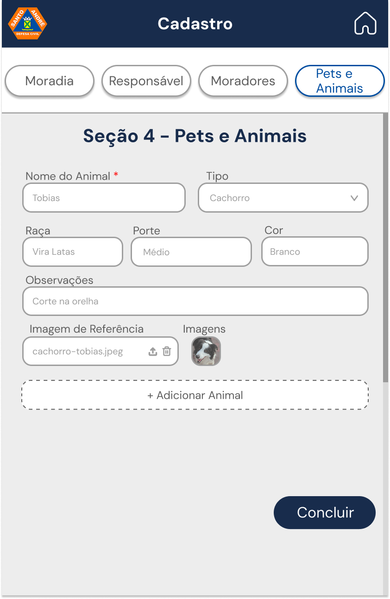
    <p>Feito pela própria equipe (2026)</p>
</div>

A quarta seção engloba todos os dados necessários para o cadastro de todos os pets/animais vinculados à moradia visitada. 

Este protótipo é bastante semelhante ao anterior em termos de estrutura, porém apresenta informações diferentes a serem preenchidas, já que aqui o assunto é um animal, e não uma pessoa. 

A funcionalidade de adicionar mais de um cadastro também está presente aqui e, assim como na seção 1 (Moradia), existe a possibilidade de ser cadastrada uma imagem de referência do(s) animal(is), mas agora com um campo que indique o nome do arquivo inserido.

Por fim, é apenas nesse protótipo que o botão "Concluir" está representado porque entende-se que, mesmo com a liberdade de escolha para a ordem de preenchimento dos dados, a seção de pets muitas vezes será a última.

Este protótipo já apresenta exemplos de informações a serem adicionadas nos campos e como ficaria com todos preenchidos, incluindo com imagens.


---

[Link para visualização do protótipo](https://www.figma.com/design/9C6LICPO1RCl5y9UaVsCQo/Mockups?node-id=0-1&p=f&t=KbpgFnX3YR4LP3ui-0)

---

## 3.6. Modelagem do banco de dados (sprints 2 e 4)

### 3.6.1. Modelo Entidade-Relacionamento (MER)

O **Modelo Entidade-Relacionamento (MER)** é uma abordagem conceitual que representa a estrutura de dados de um sistema através da identificação de entidades (objetos do mundo real), seus atributos e os relacionamentos entre elas. Para este projeto, adotamos a **notação Chen**, que utiliza retângulos para entidades, losangos para relacionamentos, elipses para atributos e triângulos para especializações, oferecendo clareza visual e conformidade com padrões acadêmicos e profissionais.

<div align="center">
    <p>Figura 16: Modelo Entidade-Relacionamento</p>
    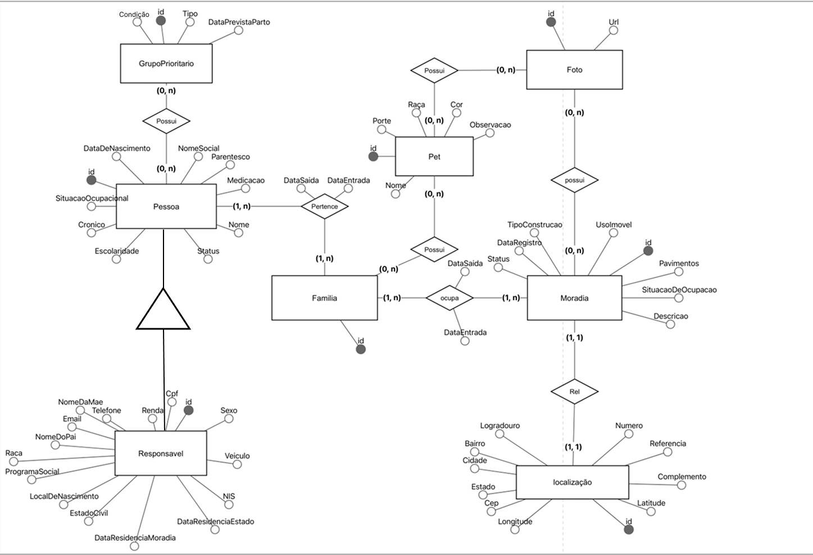
    <p>Feito pela própria equipe (2026)</p>
</div>

O modelo de dados foi estruturado seguindo as melhores práticas de normalização, rastreabilidade e integridade referencial, com foco em sistemas governamentais. As principais decisões arquiteturais refletidas no diagrama são:

#### 1. Herança e Especialização (Pessoa e Responsável)
Para evitar redundância de dados e focar no Responsável da Família, adotamos o padrão de herança (representado pelo triângulo na notação Chen).
* **`Pessoa` (Superclasse):** Centraliza os atributos universais (Nome Social, Data de Nascimento, Escolaridade, Situação Ocupacional, Medicação, Status).
* **`Responsável` (Subclasse):** Herda atributos de Pessoa e agrega dados específicos de gestão familiar: CPF, NIS, Renda, Programas Sociais, dados de contato (Telefone, Email) e informações de residência.

#### 2. Agrupamento Lógico por `Família`
Em vez de vincular dezenas de indivíduos diretamente a uma moradia de forma solta, criamos a entidade agrupadeira **`Família`**.
* Toda `Pessoa` está vinculada a uma `Família` (relacionamento *Pertence*) com cardinalidade (0, n).
* A `Família` possui obrigatoriamente um `Responsável` com cardinalidade (1, n).
* **Vantagem Técnica:** Essa decisão facilita o trânsito de dados. Se uma enchente desalojar 6 pessoas de uma casa, o sistema precisa atualizar apenas o registro da entidade `Família` na tabela `ocupa`, e todos os membros herdam a mudança automaticamente.

#### 3. Rastreabilidade e Histórico (Relacionamento N:N "ocupa")
O maior desafio resolvido neste modelo foi a preservação do histórico de ocupação sem duplicar dados físicos. A estrutura da **`Moradia`** (localização geográfica, CEP, características construtivas) é imutável. O que muda é quem mora lá.
* Criamos o relacionamento **Muitos-para-Muitos (N:N)** chamado **`ocupa`** entre `Família` e `Moradia`, com cardinalidade (0, n) em ambas as extremidades.
* Este relacionamento gera uma tabela associativa contendo atributos temporais: **`DataEntrada`** e **`DataSaida`**, permitindo rastrear períodos de ocupação.
* **Como funciona:** Quando uma família se muda ou é evacuada, preenchemos a `DataSaida` do vínculo atual e criamos um novo vínculo com a nova moradia. Assim, temos a linha do tempo exata de por quais imóveis a família passou e quais famílias já ocuparam determinadas moradias de risco, sem perder nenhum dado histórico.

#### 4. Exclusão Lógica (Soft Delete) e Estados Operacionais
Em conformidade com a LGPD e regras de auditoria pública, **nenhum dado é deletado fisicamente (DROP/DELETE)**.
* Inserimos o atributo **`Status`** nas entidades vitais (`Pessoa` e `Moradia`).
* Se um morador sai do município, o status da `Pessoa` fica inativo. Se uma moradia é desapropriada ou demolida, o status é atualizado para o estado correspondente. O histórico permanece intacto para auditoria.

#### 5. Entidades Satélites Flexíveis
* **`Foto`:** Ligada em uma relação (0, n) com `Moradia`, permitindo criar uma galeria de fotos para identificação e documentação visual da moradia.
* **`Pet`:** Relacionada a `Pessoa` (0, n), registrando animais de estimação dependentes para logística humanitária em evacuações.
* **`GrupoPrioritario`:** Relacionada a `Pessoa` (0, n), permitindo associar cidadãos a listas de vulnerabilidade (ex: Acamados, Deficientes Visuais), agilizando a logística de resgates em emergências.

#### 6. Localização Geográfica e Referência Endereçal
A entidade **`localizacao`** centraliza dados geográficos e endereçais:
* Relacionada a `Moradia` (1, 1), garantindo que cada imóvel possui uma localização única e imutável.
* Armazena **Latitude**, **Longitude**, **CEP**, **Logradouro**, **Bairro**, **Cidade**, **Estado**, **Número**, **Referência** e **Complemento**, permitindo georreferenciamento preciso e retroação em mapas de risco.

### 3.6.2. Modelo Lógico

O modelo lógico traduz o modelo conceptual para a estrutura de um banco de dados relacional, definindo as tabelas, as chaves primárias (PK), as chaves estrangeiras (FK) e a multiplicidade dos relacionamentos. Esta versão está rigorosamente alinhada com as decisões arquiteturais adotadas para a plataforma Supabase, com ênfase na rastreabilidade temporal, na conformidade com as leis de proteção de dados (deleção lógica) e na especialização das entidades.

#### Diagrama de Entidade-Relacionamento (DER)

Abaixo é apresentado o esquema visual do banco de dados, ilustrando as tabelas físicas, os seus atributos e os relacionamentos implementados.

<div align="center">
    <p>Figura 17: Diagrama Entidade-Relacionamento Lógico</p>
    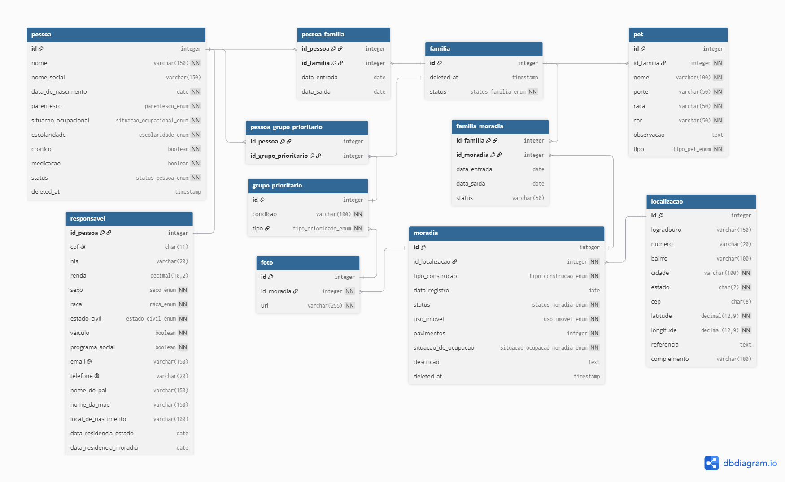
    <p>Feito pela própria equipe (2026)</p>
</div>
---

#### 1. Entidades Principais e Especializações

**Pessoa**
Entidade base (superclasse) que guarda os dados demográficos e de saúde básicos de qualquer morador ou cidadão assistido.
* **Campos:** `id` (PK), `nome`, `nome_social`, `data_de_nascimento`, `parentesco`, `situacao_ocupacional`, `escolaridade`, `cronico`, `medicacao`, `status`, `deleted_at`.

**Responsável**
Subclasse de `Pessoa` (Herança 1:1), responsável por isolar e armazenar os dados burocráticos, financeiros e de contacto (dados sensíveis) do chefe de família.
* **Campos:** `id_pessoa` (PK, FK para `pessoa`), `cpf`, `nis`, `renda`, `sexo`, `raca`, `estado_civil`, `veiculo`, `programa_social`, `email`, `telefone`, `nome_do_pai`, `nome_da_mae`, `local_de_nascimento`, `data_residencia_estado`, `data_residencia_moradia`.

**Família**
Atua como a entidade agregadora central do sistema (*hub*), permitindo agrupar os cidadãos e os respetivos animais de estimação independentemente da moradia física, o que facilita sobremaneira as transições e relocalizações em casos de desalojamento.
* **Campos:** `id` (PK), `status`, `deleted_at`.

**Localização**
Isola as coordenadas geográficas e o endereço do imóvel, viabilizando o processamento de dados espaciais e a geração de mapas de calor para a Defesa Civil.
* **Campos:** `id` (PK), `logradouro`, `numero`, `bairro`, `cidade`, `estado`, `cep`, `latitude`, `longitude`, `referencia`, `complemento`.

**Moradia**
Representa a infraestrutura residencial ou comercial atrelada a uma localização espacial unívoca.
* **Campos:** `id` (PK), `id_localizacao` (FK para `localizacao`, UNIQUE), `tipo_construcao`, `data_registro`, `status`, `uso_imovel`, `pavimentos`, `situacao_de_ocupacao`, `descricao`, `deleted_at`.

**Pet**
Registo dos animais associados à família, cuja informação é fundamental para as logísticas de evacuação e de acolhimento em abrigos.
* **Campos:** `id` (PK), `id_familia` (FK para `familia`), `nome`, `porte`, `raca`, `cor`, `observacao`, `tipo`.

**Grupo Prioritário**
Cataloga as condições de vulnerabilidade ou necessidades especiais (físicas ou mentais), de modo a priorizar resgates ou assistências (ex: gestantes, acamados).
* **Campos:** `id` (PK), `condicao`, `tipo`.

**Foto**
Registos visuais para atestar a condição estrutural e a avaliação de risco no terreno.
* **Campos:** `id` (PK), `id_moradia` (FK para `moradia`), `url`.

---

#### 2. Entidades Associativas e de Histórico (Relacionamentos N:N)

Para garantir a preservação do histórico de ocupações (auditoria pós-desastre e acompanhamento ao longo dos anos), foram modeladas tabelas associativas cuja chave primária composta incorpora sempre uma dimensão temporal (`data_entrada`).

**Pessoa_Família**
Vincula os indivíduos aos núcleos familiares e regista o seu período de permanência.
* **Campos:** `id_pessoa` (PK, FK), `id_familia` (PK, FK), `data_entrada` (PK), `data_saida`.

**Família_Moradia**
Regista quando um agregado familiar entra ou desocupa uma residência, possibilitando a total rastreabilidade da habitação territorial no município.
* **Campos:** `id_familia` (PK, FK), `id_moradia` (PK, FK), `data_entrada` (PK), `data_saida`, `status`.

**Pessoa_Grupo_Prioritario**
Associação pura (sem temporalidade restrita) entre os indivíduos e os diversos grupos de prioridade a que podem simultaneamente pertencer.
* **Campos:** `id_pessoa` (PK, FK), `id_grupo_prioritario` (PK, FK).

---

#### 3. Domínios de Dados e Tipos Enumerados (ENUMs)

Por forma a padronizar as entradas de dados e evitar inconsistências nos formulários da aplicação (e também ao nível do banco de dados), as seguintes colunas foram restringidas a tipos de dados enumerados (*ENUMs*):

* **Controlo Lógico:** `status_familia_enum` (Ativo, Inativo), `status_pessoa_enum` (Ativo, Obito, Inativo), `status_moradia_enum` (Ativa, Interditada, Demolida, Em Risco, Excluída).
* **Identificação Demográfica:** `sexo_enum`, `raca_enum`, `estado_civil_enum`, `escolaridade_enum`, `situacao_ocupacional_enum`, `parentesco_enum`.
* **Infraestrutura e Ocupação:** `tipo_construcao_enum`, `uso_imovel_enum`, `situacao_ocupacao_moradia_enum`.
* **Classificações Especiais:** `tipo_pet_enum` (cachorro, gato, reptil, ave, roedor, outros), `tipo_prioridade_enum` (Mental, Físico).

---

#### 4. Regras e Restrições Estruturais

* **Integridade Referencial:** Todas as *Foreign Keys* estão acompanhadas da ação `ON DELETE CASCADE`. Deste modo, assegura-se que a base de dados não manterá registos órfãos quando entidades de nível superior (ex: localização ou moradia real) forem limpas.
* **Exclusão Lógica (*Soft Delete*):** A eliminação física de Famílias, Moradias e Pessoas não ocorre. Qualquer interrogação de `DELETE` ao nível da aplicação é intercetada de modo transparente pelo PostgreSQL (através de `RULES`), passando apenas a atualizar as colunas de estado e preenchendo o campo `deleted_at`.
* **Unicidade Restrita (`UNIQUE`):** Implementada para impossibilitar redundâncias em documentos de alta criticidade na entidade `responsavel` (`cpf`, `email`, `telefone`) e para garantir o relacionamento um-para-um (1:1) rigoroso do campo `id_localizacao` alocado a cada `moradia`.

### 3.6.3. Modelo Físico

#### Diagrama Entidade-Relacionamento (DER) — Modelo Físico

O modelo físico apresentado implementa a arquitetura conceitual descrita em 3.6.1 e 3.6.2 utilizando PostgreSQL como SGBD. As principais decisões de implementação refletem os requisitos de rastreabilidade, integridade referencial, conformidade com a LGPD e otimização para mapeamento geográfico de áreas de risco, rodando em ambiente Supabase.

---

#### Decisões Arquiteturais do Modelo Físico

##### 1. Família como Entidade Agrupadeira Central
A entidade **`familia`** é o núcleo organizador e o hub de conectividade do sistema. Diferente de arquiteturas tradicionais, as pessoas e os animais de estimação vinculam-se a uma família, e não diretamente a uma moradia física. Isso viabiliza:
- Controle de ocupação histórica sem duplicação ou redundância de dados.
- Transição simplificada de moradias em cenários de evacuação emergencial.
- Atualizações cadastrais em massa (ex: o núcleo familiar inteiro mudou de endereço).

##### 2. Herança de Pessoa: Responsável
A hierarquia de especialização `Pessoa` → `Responsável` foi consolidada por meio da estratégia de **class-table inheritance**:
- A tabela **`pessoa`** funciona como superclasse, armazenando atributos universais de qualquer cidadão cadastrado (nome, data de nascimento, escolaridade e situação ocupacional).
- A tabela **`responsavel`** atua como a subclasse, estendendo a superclasse e compartilhando a mesma Primary Key (`id_pessoa`) como uma Foreign Key. Ela isola dados burocráticos, financeiros e de contato.

##### 3. Relacionamento N:N com Histórico Temporal Desmembrado
Para garantir auditoria governamental completa, as relações associativas foram desmembradas em duas frentes com persistência temporal:
- **`pessoa_familia`**: Controla as transições de composição interna do núcleo familiar ao longo do tempo (entradas e saídas).
- **`familia_moradia`**: Preserva o histórico de habitação territorial, armazenando dados críticos como `data_entrada`, `data_saida` e o `status` da ocupação.

##### 4. Mecanismo de Soft Delete Integral via Rules
Em estrita conformidade com a LGPD e com as necessidades de auditoria da Defesa Civil, nenhum registro crucial de pessoa, família ou moradia é fisicamente removido do banco. Implementou-se um mecanismo baseado no campo `deleted_at (TIMESTAMP)` controlado por `RULES` do PostgreSQL. Um comando `DELETE` padrão é interceptado pelo banco, que realiza uma exclusão lógica, atualizando o timestamp de remoção e alterando o estado da entidade para `'Inativo'` ou `'Excluída'`.

##### 5. Pet Vinculado à Família
Os animais domésticos relacionam-se diretamente com a tabela `familia`. Em caso de evacuação de áreas de risco, o sistema garante que os pets não fiquem atrelados a um imóvel destruído, facilitando a logística de abrigo.

---

#### Tipos Enumerados (ENUMs)

```sql
CREATE TYPE escolaridade_enum AS ENUM (
    'Analfabeto', 'Fundamental Incompleto', 'Fundamental Completo', 'Médio Incompleto', 'Médio Completo', 'Superior Incompleto', 'Superior Completo', 'Pós-graduação'
);

CREATE TYPE estado_civil_enum AS ENUM (
    'Solteiro', 'Casado', 'Divorciado', 'Viúvo', 'União Estável'
);

CREATE TYPE parentesco_enum AS ENUM (
    'Responsável', 'Cônjuge', 'Filho(a)', 'Enteado(a)', 'Pai/Mãe', 'Outro'
);

CREATE TYPE raca_enum AS ENUM (
    'Branca', 'Preta', 'Parda', 'Amarela', 'Indígena', 'Não Declarado'
);

CREATE TYPE sexo_enum AS ENUM (
    'Masculino', 'Feminino', 'Outro', 'Não Declarado'
);

CREATE TYPE situacao_ocupacao_moradia_enum AS ENUM (
    'Própria Quitada', 'Própria Financiada', 'Alugada', 'Cedida', 'Invasão', 'Outro'
);

CREATE TYPE situacao_ocupacional_enum AS ENUM (
    'Empregado', 'Desempregado', 'Autônomo', 'Informal', 'Aposentado/Pensionista', 'Estudante', 'Do Lar', 'Outro'
);

CREATE TYPE status_familia_enum AS ENUM (
    'Ativo', 'Inativo'
);

CREATE TYPE status_moradia_enum AS ENUM (
    'Ativa', 'Interditada', 'Demolida', 'Em Risco', 'Excluída'
);

CREATE TYPE status_pessoa_enum AS ENUM (
    'Ativo', 'Obito', 'Inativo'
);

CREATE TYPE tipo_construcao_enum AS ENUM (
    'Alvenaria', 'Madeira', 'Mista', 'Taipa', 'Lona/Improvisada', 'Outro'
);

CREATE TYPE tipo_pet_enum AS ENUM (
    'cachorro', 'gato', 'reptil', 'ave', 'roedor', 'outros'
);

CREATE TYPE tipo_prioridade_enum AS ENUM (
    'Mental', 'Físico'
);

CREATE TYPE uso_imovel_enum AS ENUM (
    'Residencial', 'Comercial', 'Misto', 'Institucional', 'Abandonado'
);

```

### 3.6.4. Consultas SQL e lógica proposicional (sprint 2)

A lógica proposicional é um ramo da Matemática e da Computação utilizado para representar e analisar condições lógicas por meio de proposições. No contexto de bancos de dados e consultas SQL, ela permite interpretar como diferentes condições presentes em comandos como `WHERE`, `AND`, `OR`, `NOT`, `LIKE` e `IN` influenciam o resultado final de uma consulta.

Cada condição de uma instrução SQL pode ser representada por uma proposição lógica, normalmente identificada por letras como $A$, $B$ e $C$. Essas proposições assumem apenas dois valores possíveis: verdadeiro (V) ou falso (F). A partir disso, utilizam-se conectivos lógicos para combinar condições e construir expressões mais complexas. O operador `AND` corresponde à conjunção lógica ($\land$), exigindo que ambas as condições sejam verdadeiras; o operador `OR` representa a disjunção lógica ($\lor$), em que pelo menos uma condição deve ser verdadeira; e o operador `NOT` representa a negação lógica ($\neg$), invertendo o valor lógico da proposição.

A tabela verdade é uma ferramenta utilizada para demonstrar todas as combinações possíveis entre proposições lógicas e seus respectivos resultados. Ela permite visualizar, de maneira organizada, como uma expressão lógica se comporta em diferentes cenários. Dessa forma, torna-se possível compreender com precisão quando uma consulta SQL retornará registros ou atualizará dados do banco.

No desenvolvimento da aplicação web para a Defesa Civil, a lógica proposicional foi aplicada para estruturar consultas SQL mais robustas e coerentes, possibilitando a filtragem correta de dados relacionados a cidadãos, famílias, moradias, grupos prioritários, vínculos de ocupação e localização. As tabelas verdade auxiliam na validação dessas regras lógicas, garantindo maior clareza, previsibilidade e confiabilidade nas operações realizadas pelo sistema.

---

#1 | SELECT
--- | ---
**Expressão SQL** | SELECT m.id_moradia, m.id_localizacao, m.tipo_construcao, m.condicao_ocupacao, m.tipo_uso_imovel, m.telefone, m.observacoes, m.data_cadastro, m.ultima_atualizacao, m.status, l.logradouro, l.bairro, c.nome_completo AS responsavel FROM moradia m JOIN localizacao l ON m.id_localizacao = l.id_localizacao JOIN historico_ocupacao ho ON m.id_moradia = ho.id_moradia JOIN familia f ON ho.id_familia = f.id_familia JOIN cidadao c ON f.id_familia = c.id_familia JOIN responsavel r ON c.id_cidadao = r.id_cidadao WHERE m.status IN ('Interditada', 'Área de Risco Evacuada') AND ho.data_saida IS NULL AND f.status_ativo = TRUE AND c.status_cadastro = TRUE;
**Descrição da consulta** | Buscar moradias em condição de risco operacional com seus responsáveis familiares ativos.
**Proposições lógicas** | $A$: A moradia está em condição de risco operacional (`m.status IN ('Interditada', 'Área de Risco Evacuada')`) <br> $B$: A família ocupa atualmente a moradia (`ho.data_saida IS NULL`) <br> $C$: A família e o responsável estão ativos (`f.status_ativo = TRUE AND c.status_cadastro = TRUE`)
**Expressão lógica proposicional** | $(A \land B) \land C$
**Tabela Verdade** | <table> <thead> <tr> <th>$A$</th> <th>$B$</th> <th>$C$</th> <th>$(A \land B)$</th> <th>$(A \land B) \land C$</th> </tr> </thead> <tbody> <tr> <td>F</td> <td>F</td> <td>F</td> <td>F</td> <td>F</td> </tr> <tr> <td>F</td> <td>F</td> <td>V</td> <td>F</td> <td>F</td> </tr> <tr> <td>F</td> <td>V</td> <td>F</td> <td>F</td> <td>F</td> </tr> <tr> <td>F</td> <td>V</td> <td>V</td> <td>F</td> <td>F</td> </tr> <tr> <td>V</td> <td>F</td> <td>F</td> <td>F</td> <td>F</td> </tr> <tr> <td>V</td> <td>F</td> <td>V</td> <td>F</td> <td>F</td> </tr> <tr> <td>V</td> <td>V</td> <td>F</td> <td>V</td> <td>F</td> </tr> <tr> <td>V</td> <td>V</td> <td>V</td> <td>V</td> <td>V</td> </tr> </tbody> </table>

A consulta #1 só retorna resultado quando a moradia está em risco operacional, possui ocupação ativa e os cadastros da família e do responsável permanecem ativos.

#2 | SELECT
--- | ---
**Expressão SQL** | SELECT l.bairro, COUNT(c.id_cidadao) AS total_cronicos FROM cidadao c JOIN familia f ON c.id_familia = f.id_familia JOIN historico_ocupacao ho ON f.id_familia = ho.id_familia JOIN moradia m ON ho.id_moradia = m.id_moradia JOIN localizacao l ON m.id_localizacao = l.id_localizacao WHERE c.doencas_cronicas IS NOT NULL AND c.status_cadastro = TRUE AND f.status_ativo = TRUE AND ho.data_saida IS NULL GROUP BY l.bairro;
**Descrição da consulta** | Contar quantas pessoas com doenças crônicas registradas existem por bairro.
**Proposições lógicas** | $A$: A pessoa possui doença crônica registrada (`c.doencas_cronicas IS NOT NULL`) <br> $B$: O cidadão e sua família estão ativos (`c.status_cadastro = TRUE AND f.status_ativo = TRUE`) <br> $C$: O vínculo de ocupação da moradia está ativo (`ho.data_saida IS NULL`)
**Expressão lógica proposicional** | $(A \land B) \land C$
**Tabela Verdade** | <table> <thead> <tr> <th>$A$</th> <th>$B$</th> <th>$C$</th> <th>$(A \land B)$</th> <th>$(A \land B) \land C$</th> </tr> </thead> <tbody> <tr> <td>F</td> <td>F</td> <td>F</td> <td>F</td> <td>F</td> </tr> <tr> <td>F</td> <td>F</td> <td>V</td> <td>F</td> <td>F</td> </tr> <tr> <td>F</td> <td>V</td> <td>F</td> <td>F</td> <td>F</td> </tr> <tr> <td>F</td> <td>V</td> <td>V</td> <td>F</td> <td>F</td> </tr> <tr> <td>V</td> <td>F</td> <td>F</td> <td>F</td> <td>F</td> </tr> <tr> <td>V</td> <td>F</td> <td>V</td> <td>F</td> <td>F</td> </tr> <tr> <td>V</td> <td>V</td> <td>F</td> <td>V</td> <td>F</td> </tr> <tr> <td>V</td> <td>V</td> <td>V</td> <td>V</td> <td>V</td> </tr> </tbody> </table>

A consulta #2 só contabiliza o cidadão quando há doença crônica registrada, cadastro ativo e ocupação residencial vigente.

#3 | SELECT
--- | ---
**Expressão SQL** | SELECT c.nome_completo, gp.data_prevista, gp.nome AS grupo_prioritario FROM cidadao c JOIN cidadao_grupo_prioritario cgp ON c.id_cidadao = cgp.id_cidadao JOIN grupo_prioritario gp ON cgp.id_grupo_prioritario = gp.id_grupo_prioritario WHERE c.status_cadastro = TRUE AND gp.nome = 'Gestante';
**Descrição da consulta** | Listar gestantes ativas cadastradas em grupos prioritários.
**Proposições lógicas** | $A$: O cidadão está ativo (`c.status_cadastro = TRUE`) <br> $B$: O cidadão possui registro de gestante (`g.id_cidadao IS NOT NULL`) <br> $C$: O cidadão pertence ao grupo prioritário Gestante (`gp.nome = 'Gestante'`)
**Expressão lógica proposicional** | $(A \land B) \land C$
**Tabela Verdade** | <table> <thead> <tr> <th>$A$</th> <th>$B$</th> <th>$C$</th> <th>$(A \land B)$</th> <th>$(A \land B) \land C$</th> </tr> </thead> <tbody> <tr> <td>F</td> <td>F</td> <td>F</td> <td>F</td> <td>F</td> </tr> <tr> <td>F</td> <td>F</td> <td>V</td> <td>F</td> <td>F</td> </tr> <tr> <td>F</td> <td>V</td> <td>F</td> <td>F</td> <td>F</td> </tr> <tr> <td>F</td> <td>V</td> <td>V</td> <td>F</td> <td>F</td> </tr> <tr> <td>V</td> <td>F</td> <td>F</td> <td>F</td> <td>F</td> </tr> <tr> <td>V</td> <td>F</td> <td>V</td> <td>F</td> <td>F</td> </tr> <tr> <td>V</td> <td>V</td> <td>F</td> <td>V</td> <td>F</td> </tr> <tr> <td>V</td> <td>V</td> <td>V</td> <td>V</td> <td>V</td> </tr> </tbody> </table>

A consulta #3 só retorna resultado quando o cidadão está ativo, possui registro na tabela de gestantes e está associado ao grupo prioritário correspondente.

#4 | UPDATE
--- | ---
**Expressão SQL** | UPDATE moradia SET status = 'Ativa', ultima_atualizacao = CURRENT_DATE WHERE id_moradia = :id_moradia AND status IN ('Interditada', 'Área de Risco Evacuada');
**Descrição da consulta** | Reativar uma moradia específica que estava em status não operacional reversível.
**Proposições lógicas** | $A$: A moradia corresponde ao registro informado (`id_moradia = :id_moradia`) <br> $B$: A moradia está em status não operacional reversível (`status IN ('Interditada', 'Área de Risco Evacuada')`)
**Expressão lógica proposicional** | $A \land B$
**Tabela Verdade** | <table> <thead> <tr> <th>$A$</th> <th>$B$</th> <th>$A \land B$</th> </tr> </thead> <tbody> <tr> <td>F</td> <td>F</td> <td>F</td> </tr> <tr> <td>F</td> <td>V</td> <td>F</td> </tr> <tr> <td>V</td> <td>F</td> <td>F</td> </tr> <tr> <td>V</td> <td>V</td> <td>V</td> </tr> </tbody> </table>

A consulta #4 só realiza a atualização quando o registro informado existe no contexto da operação e a moradia está previamente classificada em um status não operacional reversível.

## 3.7. WebAPI e endpoints (sprints 3 e 4)
 
A documentação completa dos endpoints implementados está disponível em [`documentos/outros/webapi-docs.html`](outros/webapi-docs.html). O arquivo descreve a base URL, headers, formato padrão de erro, métodos HTTP, endpoints, atores, RF/RN relacionados, exemplos de request/response e status codes possíveis.
 
### Endpoints implementados por domínio
 
#### Pessoas e Responsáveis
 
| Método | Endpoint | Descrição | RF |
|--------|----------|-----------|-----|
| GET | `/api/pessoas` | Lista todas as pessoas | RF001, RF006 |
| GET | `/api/pessoas/busca` | Busca pessoas por nome ou CPF | RF006 |
| GET | `/api/pessoas/inativas` | Lista pessoas inativas | RF010 |
| GET | `/api/pessoas/{id}` | Retorna pessoa por ID | RF001 |
| POST | `/api/pessoas` | Cadastra nova pessoa | RF001 |
| PUT | `/api/pessoas/{id}` | Atualiza dados de uma pessoa | RF012 |
| DELETE | `/api/pessoas/{id}` | Remove pessoa | RF010 |
| GET | `/api/responsaveis` | Lista todos os responsáveis | RF001 |
| GET | `/api/responsaveis/{id}` | Retorna responsável por ID | RF001 |
| POST | `/api/responsaveis` | Cadastra novo responsável | RF001 |
| PUT | `/api/responsaveis/{id}` | Atualiza dados de um responsável | RF012 |
| DELETE | `/api/responsaveis/{id}` | Remove responsável | RF010 |
 
#### Famílias
 
| Método | Endpoint | Descrição | RF |
|--------|----------|-----------|-----|
| GET | `/api/familias` | Lista todas as famílias | RF001 |
| GET | `/api/familias/{id}` | Retorna família por ID | RF001 |
| POST | `/api/familias` | Cria nova família | RF001 |
| DELETE | `/api/familias/{id}` | Remove família | RF009 |
| POST | `/api/familias/nucleo` | Cadastra núcleo familiar completo | RF001 |
| GET | `/api/familias/{id}/pessoas` | Lista pessoas de uma família | RF001 |
| POST | `/api/familias/{id}/pessoas` | Vincula pessoa à família | RF001 |
| DELETE | `/api/familias/{id}/pessoas/{pessoaId}` | Remove vínculo de pessoa da família | RF010 |
| GET | `/api/familias/{id}/pessoas/historico` | Histórico de pessoas da família | RF005, RF012 |
| GET | `/api/familias/{id}/moradias` | Lista moradias vinculadas à família | RF009, RF012 |
| POST | `/api/familias/{id}/moradias` | Vincula moradia à família | RF002, RF003 |
| DELETE | `/api/familias/{id}/moradias/{moradiaId}` | Remove vínculo de moradia da família | RF009 |
| GET | `/api/familias/{id}/moradias/historico` | Histórico de ocupações da família | RF009, RF012 |
| GET | `/api/familias/{id}/pets` | Lista pets da família | RF007 |
| POST | `/api/familias/{id}/pets` | Cadastra novo pet na família | RF007 |
 
#### Moradias
 
| Método | Endpoint | Descrição | RF |
|--------|----------|-----------|-----|
| GET | `/api/moradias` | Lista moradias com filtros avançados | RF004, RF006 |
| GET | `/api/moradias/{id}` | Retorna moradia por ID | RF005 |
| GET | `/api/moradias/{id}/detalhes` | Retorna moradia com localização e ocupantes | RF005 |
| GET | `/api/moradias/{id}/familias/historico` | Histórico de famílias que ocuparam a moradia | RF005, RF009 |
| POST | `/api/moradias` | Cria nova moradia | RF002, RF003 |
| PUT | `/api/moradias/{id}` | Atualiza dados da moradia | RF012 |
| DELETE | `/api/moradias/{id}` | Remove moradia | RF009 |
 
#### Fotos
 
| Método | Endpoint | Descrição | RF |
|--------|----------|-----------|-----|
| GET | `/api/fotos` | Lista todas as fotos | RF002, RF007 |
| GET | `/api/fotos/{id}` | Retorna foto por ID | RF002, RF007 |
| GET | `/api/fotos/{id}/signed-url` | Gera URL assinada para acesso seguro | RF002, RF007 |
| PUT | `/api/fotos/{id}` | Atualiza metadados de uma foto | RF002, RF007 |
| DELETE | `/api/fotos/{id}` | Remove foto | RF002 |
| GET | `/api/moradias/{id}/fotos` | Lista fotos de uma moradia | RF002 |
| POST | `/api/moradias/{id}/fotos/upload-url` | Gera URL pré-assinada para upload | RF002 |
| POST | `/api/moradias/{id}/fotos` | Registra metadados da foto após upload | RF002 |
| DELETE | `/api/moradias/{id}/fotos/{fotoId}` | Remove foto de uma moradia | RF002 |
| GET | `/api/pets/{id}/fotos` | Lista fotos de um pet | RF007 |
| POST | `/api/pets/{id}/fotos/upload-url` | Gera URL pré-assinada para upload de foto de pet | RF007 |
| POST | `/api/pets/{id}/fotos` | Registra metadados da foto do pet após upload | RF007 |
| DELETE | `/api/pets/{id}/fotos/{fotoId}` | Remove foto de um pet | RF007 |
 
#### Pets
 
| Método | Endpoint | Descrição | RF |
|--------|----------|-----------|-----|
| GET | `/api/pets` | Lista todos os pets | RF007 |
| GET | `/api/pets/{id}` | Retorna pet por ID | RF007 |
| POST | `/api/pets` | Cria novo pet | RF007 |
| PUT | `/api/pets/{id}` | Atualiza dados de um pet | RF007 |
| DELETE | `/api/pets/{id}` | Remove pet | RF007 |

## 3.8. Autenticação, Autorização e Resiliência (sprint 5)

> **Escopo desta entrega:** o sistema não implementará autenticação nem controle de acesso por perfil (RBAC). O ambiente opera exclusivamente com dados fictícios. Esta seção será preenchida em sprint futura, caso a autenticação seja incluída no escopo.

### 3.8.1. Autenticação

*Descreva o fluxo de autenticação implementado: persistência de senha com hash bcrypt/argon2 (parâmetros de custo explícitos e justificados), validação de credenciais e criação de sessão. Senhas em texto plano no banco não são aceitas.*

### 3.8.2. Controle de sessão

*Descreva o controle de sessão baseado em `session id` persistido em tabela própria, com expiração. Se optar por JWT, justifique a escolha explicando os trade-offs (stateless, não revogável, payload exposto).*

### 3.8.3. Autorização

*Descreva as regras de autorização por rota e por operação, baseadas no perfil do usuário autenticado. A verificação deve ocorrer no backend — o frontend nunca é fonte de verdade para autorização.*

### 3.8.4. Estratégias de Resiliência

*Descreva as estratégias aplicadas no tratamento de falhas de rede: timeout, retry com backoff exponencial, circuit breaker e idempotência em operações críticas (`PUT`, `DELETE`, operações de pagamento etc.).*

## 3.9. Matriz de Rastreabilidade (RTM) (sprints 3 a 5)

A Matriz de Rastreabilidade (RTM - Requirements Traceability Matrix) consolida, em uma única visão, os elos entre cada Persona, Requisito Funcional (RF), Regra de Negócio (RN), endpoint de API, tela da interface e caso de teste correspondente. O objetivo é garantir que nenhum requisito fique sem implementação, sem teste e sem evidência de validação, em que qualquer lacuna nessa cadeia representa um risco direto à integridade e à confiabilidade do sistema.

| # | Persona | US | RF | RN | Endpoint | Método | Tela | Casos de Teste | Evidência |
|---|---------|----|----|-----|----------|--------|------|----------------|-----------|
| 1 | Agente de Campo | US01 | RF001 — Cadastro Sociodemográfico e Vínculos | RN01 | `/api/pessoas`<br>`/api/responsaveis`<br>`/api/familias`<br>`/api/familias/nucleo`<br>`/api/familias/{id_familia}/pessoas` | `POST` | Cadastro → Responsável, Moradores, Família | CT01: Pessoa criada com sucesso em `/api/pessoas` (`201`)<br>CT02: Responsável criado com CPF obrigatório em `/api/responsaveis` (`201`)<br>CT03: Família criada em `/api/familias` (`201`)<br>CT04: Núcleo familiar cadastrado em `/api/familias/nucleo` com pessoas vinculadas (`201`)<br>CT05: Pessoa já vinculada à família retorna conflito (`409`)<br>CT06: Campos obrigatórios ausentes retornam `422` | Print da tela de cadastro; logs das respostas `201`; relatório de cobertura dos testes de cadastro |
| 2 | Agente de Campo | US02, US05 | RF002 — Cadastro Estrutural de Moradias<br>RF003 — Georreferenciamento via GPS | RN04 | `/api/moradias`<br>`/api/familias/{id_familia}/moradias`<br>`/api/moradias/{id_moradia}/fotos/upload-url`<br>`/api/moradias/{id_moradia}/fotos`<br>`/api/cadastros-completos` | `POST` | Cadastro → Moradias | CT07: Moradia criada em `/api/moradias` com dados estruturais (`201`)<br>CT08: Moradia vinculada à família em `/api/familias/{id_familia}/moradias` (`201`)<br>CT09: URL de upload de foto de moradia gerada com sucesso (`200`)<br>CT10: Registro de foto da moradia criado após upload (`201`)<br>CT11: Foto de pessoa bloqueada conforme RN04 (`422`)<br>CT12: Cadastro completo transacional planejado em `/api/cadastros-completos` validado quando disponível | Print do formulário de moradia; log de vínculo família-moradia; evidência da URL de upload e da foto cadastrada |
| 3 | Gestor | US03 | RF004 — Visualização em Mapa Georreferenciado | — | `/api/moradias`<br>`/api/moradias/mapa` | `GET` | Mapa | CT13: `/api/moradias?status=Ativa` retorna somente moradias ativas (`200`)<br>CT14: Endpoint planejado `/api/moradias/mapa` retorna marcadores com coordenadas válidas (`200`)<br>CT15: Moradias arquivadas ou inativas não aparecem na visão operacional do mapa<br>CT16: Lista vazia retorna `200` sem erro | Print do mapa com marcadores; payload da API com coordenadas; evidência de ausência de moradias inativas |
| 4 | Gestor | US04 | RF005 — Consulta Integrada de Moradia e Moradores | RN01, RN05 | `/api/moradias/{id_moradia}`<br>`/api/moradias/{id_moradia}/detalhes`<br>`/api/moradias/{id_moradia}/consulta-integrada`<br>`/api/moradias/{id_moradia}/familias/historico` | `GET` | Consulta → Resultado da Busca | CT17: Moradia retornada por ID com dados estruturais (`200`)<br>CT18: Detalhes da moradia retornam localização e ocupantes (`200`)<br>CT19: Histórico de famílias da moradia retorna ocupações com `data_entrada` e `data_saida` (`200`)<br>CT20: Consulta integrada planejada retorna moradia, responsável, moradores e pets<br>CT21: Flag de risco crítico aparece quando a condição da RN05 for satisfeita<br>CT22: Moradia inexistente retorna `404` | Print da ficha detalhada; log da resposta da API; evidência da flag de risco quando aplicável |
| 5 | Gestor | US06 | RF006 — Filtros Avançados de Moradias | — | `/api/moradias`<br>`/api/pessoas/busca`<br>`/api/pessoas` | `GET` | Consulta / Mapa | CT23: Filtro `status=Ativa` em `/api/moradias` retorna apenas moradias correspondentes (`200`)<br>CT24: Busca textual em `/api/pessoas/busca?q=Maria` retorna pessoas compatíveis (`200`)<br>CT25: Listagem de pessoas retorna registros ativos para consulta gerencial (`200`)<br>CT26: Busca sem resultados retorna array vazio sem erro<br>CT27: Nenhum dado fora do filtro selecionado aparece na resposta | Print dos resultados filtrados; payload dos endpoints de busca; evidência de ausência de registros fora do filtro |
| 6 | Gestor | US06 | RF006 — Exportação de Moradias Filtradas | — | `/api/moradias/exportar` | `GET` | Consulta | CT28: Exportação planejada gera arquivo CSV ou PDF com headers corretos<br>CT29: Filtros aplicados na exportação refletem os mesmos filtros da listagem<br>CT30: Formato inválido retorna `400`<br>CT31: Usuário sem autenticação recebe `401` | Arquivo exportado como evidência; print do download; log da resposta HTTP |
| 7 | Agente de Campo | US07 | RF007 — Cadastro de Animais de Estimação | — | `/api/pets`<br>`/api/familias/{id_familia}/pets` | `POST` | Cadastro → Pets | CT32: Pet criado em `/api/pets` com `tipo_pet` obrigatório (`201`)<br>CT33: Pet criado diretamente na família em `/api/familias/{id_familia}/pets` (`201`)<br>CT34: `tipo_pet` ausente retorna `422`<br>CT35: Família inexistente retorna `404` | Print do cadastro de pet; log de inserção no banco; payload da resposta `201` |
| 8 | Agente de Campo e Gestor | US07 | RF007 — Consulta e Atualização de Pets | — | `/api/pets`<br>`/api/pets/{id_pet}`<br>`/api/familias/{id_familia}/pets` | `GET` / `PUT` | Consulta / Ficha de Emergência / Cadastro → Pets | CT36: Lista geral de pets retorna registros cadastrados (`200`)<br>CT37: Pet por ID retorna dados completos (`200`)<br>CT38: Pets da família aparecem na ficha de emergência (`200`)<br>CT39: Atualização de pet em `/api/pets/{id_pet}` retorna sucesso (`200`)<br>CT40: Pet inexistente retorna `404` | Print da ficha de emergência; log de consulta e atualização; evidência do pet atualizado |
| 9 | Agente de Campo e Gestor | US07 | RF007 — Fotos de Pets | — | `/api/pets/{id_pet}/fotos`<br>`/api/pets/{id_pet}/fotos/upload-url`<br>`/api/pets/{id_pet}/fotos/{id_foto}` | `GET` / `POST` / `DELETE` | Cadastro → Pets / Ficha de Emergência | CT41: Fotos do pet são listadas com sucesso (`200`)<br>CT42: URL de upload para foto do pet é gerada (`200`)<br>CT43: Registro de foto do pet é criado (`201`)<br>CT44: Remoção de foto do pet retorna sucesso (`200`)<br>CT45: Pet ou foto inexistente retorna `404` | Print da seção de fotos do pet; evidência da URL de upload; log de remoção |
| 10 | Gestor | US08 | RF008 — Mapa de Calor | RN01 | `/api/indicadores/mapa-calor` | `GET` | Mapa | CT46: Endpoint planejado retorna dados agregados para o layer de calor (`200`)<br>CT47: Filtro por grupo prioritário retorna intensidade coerente com os registros<br>CT48: Agrupamentos de coordenadas próximas geram maior intensidade visual<br>CT49: Array vazio retorna `200` sem erro | Print do mapa de calor; payload agregado; evidência de renderização com filtros |
| 11 | Gestor | US09 | RF009 — Arquivamento de Moradias | RN03 | `/api/moradias/{id_moradia}`<br>`/api/moradias/{id_moradia}/status`<br>`/api/moradias/{id_moradia}/fotos/{id_foto}` | `DELETE` / `PATCH` | Consulta / Mapa | CT50: Remoção de moradia implementada retorna sucesso (`200`)<br>CT51: Atualização planejada de status arquiva moradia com motivo obrigatório (`200`)<br>CT52: Moradia inexistente retorna `404`<br>CT53: Usuário sem permissão recebe `403`<br>CT54: Foto vinculada à moradia pode ser removida sem apagar o restante da ficha (`200`) | Print do histórico inativo; log da alteração de status; payload de erro `403` quando aplicável |
| 12 | Gestor | US09, US14 | RF009 — Realocação de Família | RN03 | `/api/familias/{id_familia}/moradias`<br>`/api/familias/{id_familia}/moradias/historico`<br>`/api/familias/{id_familia}/moradias/{id_moradia}`<br>`/api/familias/{id_familia}/realocacoes` | `GET` / `POST` / `DELETE` | Consulta | CT55: Moradias da família são listadas com sucesso (`200`)<br>CT56: Histórico de moradias da família exibe vínculos ativos e encerrados (`200`)<br>CT57: Nova moradia é vinculada à família com `data_entrada` (`201`)<br>CT58: Desvinculação de moradia retorna sucesso (`200`)<br>CT59: Endpoint planejado de realocação cria novo vínculo e encerra o anterior<br>CT60: Conflito de ocupação retorna `409` | Log do `historico_ocupacao`; print de confirmação da realocação; payload de conflito |
| 13 | Gestor | US10 | RF010 — Arquivamento de Moradores Falecidos | RN03 | `/api/pessoas/{id_cidadao}`<br>`/api/pessoas/inativas`<br>`/api/responsaveis/{id_responsavel}`<br>`/api/familias/{id_familia}`<br>`/api/cidadaos/{id_cidadao}/arquivar` | `DELETE` / `GET` / `PATCH` | Consulta | CT61: Pessoa removida ou inativada retorna sucesso (`200`)<br>CT62: Pessoas inativas são listadas em `/api/pessoas/inativas` (`200`)<br>CT63: Responsável removido exige validação de integridade familiar conforme regra vigente<br>CT64: Família removida por gestor retorna sucesso quando permitido (`200`)<br>CT65: Arquivamento planejado de cidadão preserva histórico e exige data de falecimento<br>CT66: Recurso inexistente retorna `404` | Print da listagem de pessoas inativas; log do arquivamento; evidência de histórico preservado |
| 14 | Gestor | US11 | RF011 — Alerta Automático de Recadastro (12 meses) | RN02 | `/api/indicadores/recadastro` | `GET` | Mapa / Painel | CT67: Endpoint planejado retorna contadores de cadastros atualizados e desatualizados (`200`)<br>CT68: Ficha com mais de 365 dias sem atualização entra no contador de desatualizados<br>CT69: Após atualização da ficha, contador de desatualizados é reduzido na próxima consulta<br>CT70: Usuário não autenticado recebe `401` | Print do painel com indicador; log da consulta; evidência antes/depois da atualização |
| 15 | Agente de Campo | US12 | RF012 — Atualização Anual de Dados | RN01, RN02, RN04 | `/api/pessoas/{id_cidadao}`<br>`/api/responsaveis/{id_responsavel}`<br>`/api/moradias/{id_moradia}`<br>`/api/fotos/{id_foto}`<br>`/api/familias/{id_familia}/cadastro-completo` | `PUT` / `GET` | Cadastro (edição) | CT71: Pessoa atualizada com sucesso (`200`)<br>CT72: Responsável atualizado com sucesso (`200`)<br>CT73: Moradia atualizada com sucesso (`200`)<br>CT74: Foto da moradia atualizada sem violar RN04 (`200`)<br>CT75: Cadastro completo planejado é consultado para revisão anual (`200`)<br>CT76: Atualização planejada do cadastro completo limpa alerta de recadastro | Print antes/depois no painel; log de atualização; evidência de alteração da data de atualização |
| 16 | Gestor | US13 | Regra de responsável obrigatório por família | RN03 | `/api/responsaveis`<br>`/api/responsaveis/{id_responsavel}`<br>`/api/familias/{id_familia}/responsavel` | `GET` / `POST` / `PUT` | Consulta | CT77: Responsáveis são listados para seleção (`200`)<br>CT78: Responsável por ID retorna dados cadastrais (`200`)<br>CT79: Novo responsável é criado quando necessário (`201`)<br>CT80: Dados do responsável são atualizados com sucesso (`200`)<br>CT81: Endpoint planejado define ou substitui responsável familiar (`200`)<br>CT82: CPF ou email duplicado retorna `409` | Log de atualização no banco; print de confirmação; payload de conflito quando aplicável |
| 17 | Gestor | US04, US05 | RF004 — Visualização em Mapa Georreferenciado<br>RF005 — Consulta Integrada de Moradia e Moradores | RN04 | `/api/fotos`<br>`/api/fotos/{id_foto}`<br>`/api/fotos/{id_foto}/signed-url`<br>`/api/moradias/{id_moradia}/fotos` | `GET` / `PUT` / `DELETE` | Consulta / Mapa / Ficha da Moradia | CT83: Fotos cadastradas são listadas com sucesso (`200`)<br>CT84: Foto por ID retorna tipo e URL (`200`)<br>CT85: URL assinada é gerada para acesso seguro à foto (`200`)<br>CT86: Fotos da moradia são listadas na ficha (`200`)<br>CT87: Atualização de foto retorna sucesso (`200`)<br>CT88: Remoção de foto retorna sucesso sem remover a moradia (`200`) | Print da galeria da moradia; evidência da URL assinada; log de atualização ou remoção |

---

# <a name="c4"></a>4. Desenvolvimento da Aplicação Web

## 4.1. Primeira versão da aplicação web (sprint 3)
Na primeira versão do sistema web, foi aplicado a estrutura de pastas juntamente com o desenvolvimento das funcionalidades CRUD base do sistema referente a moradia, moradores, responsáveis e pets, havendo já um protótipo de alta fidelidade com guia e identidade visual. Ademais, o código foi desenvolvido utilizando a metodologia TDD (Test Driven Design), onde o desenvolvimento é orientado a testes, garantindo um código já testado e comprovado.

Assim, ainda não foi inserido métodos complexos e mais específicos, priorizando a entrega de um MVC visualizável e testável.

### 4.1.1 O que foi implementado

#### **Arquitetura em 6 Camadas**
- **Controllers:** Recebem requisições HTTP, validam entrada, retornam respostas (suporte duplo a EJS e JSON)
- **Services:** Implementam regras de negócio (RN01-RN04), validações, transações
- **Repositories:** Encapsulam acesso ao PostgreSQL/Supabase, queries SQL otimizadas
- **DTOs:** Tipagem de dados trafegados entre camadas
- **Models:** Interfaces TypeScript para entidades
- **Validations:** Validação centralizada de payloads
- **Errors:** Classe `HttpError` para tratamento padronizado de erros

#### **Endpoints Implementados (RF001-RF007)**

**Pessoas (RF001):**
- `GET /api/pessoas` — Lista todas as pessoas ativas
- `GET /api/pessoas/busca` — Busca por nome, CPF, email, telefone
- `GET /api/pessoas/inativas` — Lista pessoas inativas (soft delete)
- `GET /api/pessoas/{id}` — Retorna pessoa por ID
- `POST /api/pessoas` — Cria nova pessoa com validação RN01 (nome e data obrigatórios)
- `PUT /api/pessoas/{id}` — Atualiza dados de pessoa
- `DELETE /api/pessoas/{id}` — Remove logicamente pessoa (LGPD soft delete)

**Responsáveis (RF001):**
- `GET /api/responsaveis` — Lista todos os responsáveis
- `GET /api/responsaveis/{id}` — Retorna responsável por ID
- `POST /api/responsaveis` — Cadastra responsável com CPF, NIS, renda, programas sociais
- `PUT /api/responsaveis/{id}` — Atualiza responsável
- `DELETE /api/responsaveis/{id}` — Remove responsável

**Moradias (RF002, RF003):**
- `GET /api/moradias` — Lista moradias com filtros (status, tipo construção)
- `GET /api/moradias/{id}` — Retorna moradia por ID
- `GET /api/moradias/{id}/detalhes` — Detalhes com localização e histórico
- `POST /api/moradias` — Cria moradia com tipo construção, pavimentos, localização
- `PUT /api/moradias/{id}` — Atualiza moradia
- `DELETE /api/moradias/{id}` — Remove moradia com soft delete

**Famílias (RF001):**
- `GET /api/familias` — Lista famílias
- `GET /api/familias/{id}` — Retorna família por ID
- `POST /api/familias` — Cria família
- `POST /api/familias/nucleo` — Cadastro transacional completo (responsável + membros + moradia)
- `GET /api/familias/{id}/pessoas` — Lista pessoas da família
- `POST /api/familias/{id}/pessoas` — Vincula pessoa à família
- `GET /api/familias/{id}/moradias` — Lista moradias da família
- `POST /api/familias/{id}/moradias` — Vincula moradia com histórico de ocupação
- `GET /api/familias/{id}/pets` — Lista pets da família
- `POST /api/familias/{id}/pets` — Cadastra pet

**Pets (RF007):**
- `GET /api/pets` — Lista todos os pets
- `GET /api/pets/{id}` — Retorna pet por ID
- `POST /api/pets` — Cria novo pet (tipo obrigatório)
- `PUT /api/pets/{id}` — Atualiza pet
- `DELETE /api/pets/{id}` — Remove pet

**Fotos (RF002, RF007):**
- `GET /api/moradias/{id}/fotos` — Lista fotos da moradia
- `POST /api/moradias/{id}/fotos/upload-url` — Gera URL pré-assinada Supabase Storage
- `POST /api/moradias/{id}/fotos` — Registra metadados da foto
- `GET /api/pets/{id}/fotos` — Lista fotos do pet
- `POST /api/pets/{id}/fotos/upload-url` — URL de upload para foto de pet

#### **Banco de Dados e Migrações**
- **7 migrações versionadas** implementadas:
  - `01_create_pessoas_sql.sql` — Criação tabela pessoas com ENUMs (parentesco, status, escolaridade, situação ocupacional)
  - `02_add_familias.sql` — Tabela família com relacionamento 1:N com pessoa
  - `03_allow_pet_photos.sql` — Adição suporte a fotos de pets
  - `04_add_pet_status.sql` — Status para pets
  - `05_enforce_responsavel_unico_familia.sql` — Constraint de responsável único por família
  - `06_add_tipo_pet.sql` — Enum de tipos de pets
  - `07_create_storage_bucket.sql` — Bucket Supabase para fotos

- **Tabelas criadas:** `pessoas`, `responsavel`, `familia`, `pet`, `localizacao`, `moradia`, `foto`, `pessoa_familia`, `familia_moradia`
- **ENUMs implementados:** tipo_parentesco, tipo_status, tipo_escolaridade, tipo_situacao_ocupacional, tipo_pet

#### **Validações e Regras de Negócio (RN01-RN04)**
- **RN01:** Nome e data de nascimento obrigatórios para Pessoa
- **RN02:** Escolaridade e situação ocupacional obrigatórias
- **RN03:** Parentesco obrigatório
- **RN04:** Medicação e doença crônica não podem ser nulas
- **RN - LGPD:** Soft delete com `deleted_at` e `status` para conformidade com LGPD

#### **Views EJS e Interface Web**
- `pessoa-novo.ejs` — Formulário de cadastro de pessoa com validação client-side
- `pessoa-lista.ejs` — Tabela de listagem de pessoas com ícones de editar/deletar
- `public/styles.css` — Estilos conforme guia (cores: Azul #182C4C, Laranja #ff7500, tipografia DM Sans)

#### **Testes Automatizados (Jest + Supertest)**
- `pessoa.persistence.spec.ts` — Testes de persistência DB validando RN01
- Controller tests para validação de payloads, status codes, renderização de views
- Cobertura básica de operações CRUD e fluxos de erro

#### **Integração Supabase**
- Classe `SupabaseStorageClient` implementada para upload de fotos
- Geração de URLs pré-assinadas para acesso seguro
- FotoStorageService como wrapper desacoplando detalhes de infraestrutura

#### Reajustes e atualizações da documentação
Foram realizadas as seguintes atualizações no WAD durante essa sprint de consolidação:

- Seção 4.1 (Primeira versão da aplicação web)
- Seção 3.4 (Guia de Estilos): criação do Guia de Estilos completa
- Seção 3.5 (Protótipos de Alta Fidelidade): desenhado os protótipo de Alta Fidelidade do sistema
- Seção 3.6 (Modelo Físico): reajustes conforme surgimento de necessidades de alterações do banco de dados
- Seção 3.6.4 (Consultas SQL com Lógica Proposicional): Escrita das consultas SQL juntamento com a documentação da lógica proposicional do sistema
- Documentação e aplicação geral da arquitetura utilizada (3.2)


### 4.1.2 O que não foi concluído

- **Mapa Georreferenciado (RF004):** Endpoints `/api/moradias/mapa` e visualização de marcadores não implementados
- **Mapa de Calor (RF008):** Endpoint `/api/indicadores/mapa-calor` planejado, não finalizado
- **Alerta de Recadastro (RF011):** Job agendado de detecção de fichas desatualizadas (>365 dias) não implementado
- **Consulta Integrada com Flag Risco Crítico (RF005, RN05):** Endpoint `/api/moradias/{id}/consulta-integrada` com flag de risco crítico não finalizado
- **Exportação de Relatórios (RF006):** Endpoints `/api/moradias/exportar` em CSV/PDF não implementados
- **Realocação de Famílias Avançada (RF009):** Fluxo complexo de realocação com validação de integridade incompleto
- **Frontend Mobile/Responsivo:** Apenas telas EJS básicas. Sem interface desktop.
- **Geolocalização Multimodal (RF003):** Captura automática de GPS, CEP digital e referências visuais não totalmente testada
- **Endpoints GET com agregação:** Endpoints de totalização por grupo prioritário, contadores de vulnerabilidade não implementados


### 4.1.3 Dificuldades encontradas
Dentre as dificuldades, encontramos problemas diversos considerando o prazo de entrega apertadíssimo, dificultando na possibilidade de aplicações de funcionalidades secundárias, porém úteis, como o alerta de atualização do cadastro de Gestantes após um prazo estimado de gravidez; diferenciação de pets para animais com fins funcionais (comerciais e reprodutivos). Sendo todas estas, inseridas como escopo extra que desejaríamos de implementar se fosse possível.


### 4.1.4 Próximos passos
**Sprint 4 (Consolidação e Features Críticas):**
1. **Completar RF005:** Consulta integrada + flag RN05 de risco crítico
2. **Implementar RF004/RF008:** Mapa com marcadores e heatmap de vulnerabilidades
3. **Job de recadastro (RF011):** Scheduler para detectar fichas desatualizadas
4. **Exportação (RF006):** CSV/PDF com filtros
5. **Melhorar testes:** Aumentar cobertura para 80%+; testes e2e com Supertest
6. **Frontend básico:** Começar interface React/Next.js para cadastro
7. **Geolocalização:** Testar captura GPS completa em diferentes contextos

### 4.1.5 Demonstrações visuais

<!-- <p>Arquitetura de pastas e classes</p> -->
<div align="center">
    <p>Arquitetura de pastas e classes</p>
    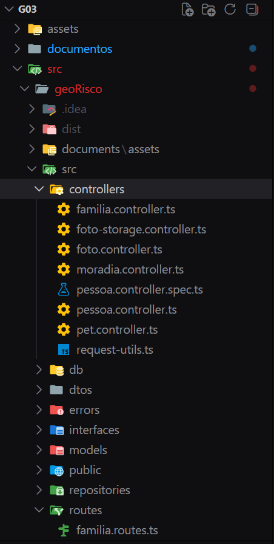
    <p>Feito pela própria equipe (2026)</p>
</div>


## 4.2. Segunda versão da aplicação web (sprint 4)

*Descreva e ilustre aqui o desenvolvimento da segunda versão do sistema web, com foco no que foi consolidado entre a primeira versão funcional e o sistema operacional integrado. Utilize prints de tela para ilustrar. Indique obrigatoriamente: (a) o que foi implementado, (b) o que não foi concluído, (c) dificuldades técnicas enfrentadas e próximos passos.*

## 4.3. Versão final da aplicação web (sprint 5)

*Descreva e ilustre aqui o desenvolvimento da versão final do sistema web, com foco em refatorações, correções finais e na camada de autenticação/autorização entregue. Utilize prints de tela para ilustrar. Indique obrigatoriamente: (a) o que foi refinado ou adicionado desde a sprint 4, (b) pendências remanescentes, (c) dificuldades técnicas enfrentadas.*

# <a name="c5"></a>5. Testes

## 5.1. Relatório de testes de integração de endpoints automatizados (sprint 4)

### 5.1.1 Estratégias de Testes

#### 5.1.1.1 Separação por camada

A estratégia de testes automatizados do projeto deve seguir a separação por camadas da arquitetura da aplicação, definindo abordagens diferentes para Service, Controller e Repository, conforme a responsabilidade de cada camada.

Na camada de Service, os testes devem ser tratados como testes unitários white-box, pois essa camada concentra regras de negócio, validações, tratamentos de exceção e decisões internas da aplicação. Por isso, os testes devem exercitar os principais fluxos internos do serviço, incluindo cenários de sucesso, dados inválidos, entidades inexistentes, conflitos de regra de negócio e falhas esperadas. As dependências externas da camada, como repositórios ou outros serviços, devem ser substituídas por mocks, permitindo verificar tanto o resultado retornado quanto as interações esperadas com essas dependências. Ademais, os testes devem cobrir no mínimo 80% dos métodos da camada Service.

Na camada de Controller, a abordagem recomendada é o teste de integração black-box por meio do Supertest, com o uso do test runner Jest. Nesse caso, o foco não deve estar na implementação interna dos controllers, mas sim no comportamento observável da API. Os testes devem exercitar os endpoints HTTP da aplicação, validando códigos de status, corpo da resposta, mensagens retornadas e tratamento adequado de entradas válidas, inválidas e cenários de erro. Dessa forma, os controllers são avaliados a partir do contrato externo da aplicação, simulando de maneira mais fiel o uso real da API.

Na camada de Repository, os testes são opcionais e devem ser aplicados apenas quando houver lógica não trivial de consulta ou persistência. Isso inclui situações como montagem dinâmica de filtros, joins, consultas com múltiplas condições, soft delete, regras dependentes do banco de dados, views ou relacionamentos relevantes entre entidades. Quando necessários, esses testes devem utilizar um banco controlado ou ambiente isolado, por meio do uso de um banco de dados SQL do PostgreSQL e uso de ROLLBACK a fim de evitar que falhas nas queries reflitam em perdas ou problemas com os dados, evitando dependência de dados externos ou residuais.

#### 5.1.1.2 Padrão AAA e Determinismo

A escrita dos testes deve seguir o padrão AAA (Arrange, Act, Assert), que organiza cada caso de teste em três etapas bem definidas: preparação, execução e verificação. Esse padrão melhora a legibilidade, facilita a manutenção e reduz ambiguidades sobre o comportamento que está sendo validado.

Na etapa Arrange, são preparados todos os dados, objetos, dependências e condições necessárias para o teste. Essa preparação deve ser explícita e isolada, evitando dependência de dados previamente existentes no ambiente. Na etapa Act, executa-se apenas a ação principal que se deseja testar, como a chamada de uma função, método, rota ou serviço. Por fim, na etapa Assert, são verificadas as saídas, alterações de estado ou efeitos esperados, garantindo que o resultado obtido corresponde ao comportamento especificado.

Além da organização pelo padrão AAA, os testes devem ser determinísticos, ou seja, devem produzir sempre o mesmo resultado quando executados nas mesmas condições. Um teste determinístico não pode depender da ordem de execução de outros testes, do relógio real do sistema, de chamadas a redes externas ou de dados residuais deixados por execuções anteriores.

Para garantir esse determinismo, cada teste deve criar seus próprios dados de entrada e limpar ou isolar qualquer estado necessário. Dependências externas, como APIs, serviços de terceiros ou banco de dados compartilhado, devem ser substituídas por mocks, stubs, fixtures ou ambientes controlados. Quando houver lógica dependente de data e hora, o tempo deve ser fixado ou simulado, evitando falhas causadas por diferenças de horário, fuso, virada de dia ou variações de execução.

Também é importante que os testes não compartilhem estado mutável entre si. Cada caso deve poder ser executado individualmente ou em conjunto com toda a suíte, em qualquer ordem, sem alterar seu resultado. Essa característica aumenta a confiabilidade da suíte de testes e reduz a ocorrência de falhas intermitentes, conhecidas como testes “flaky”.

Dessa forma, a adoção do padrão AAA combinada ao determinismo contribui para uma estratégia de testes mais clara, confiável e sustentável. Os testes passam a funcionar não apenas como mecanismos de verificação automática, mas também como documentação objetiva do comportamento esperado do sistema.

### 5.1.2 Testes unitários de service

Os testes unitários da camada Service verificam, de forma isolada, as regras de negócio que ficam entre os controllers e os repositories. Essa camada concentra decisões importantes do sistema, como validação de dados obrigatórios, aplicação de regras de recadastro, controle de arquivamento lógico, restrições de geolocalização/fotos e avaliação de risco crítico.

Esses testes são feitos para garantir que as regras documentadas no WAD continuem funcionando mesmo quando a API, o banco de dados ou a interface mudarem. Para isso, os repositories, transações e serviços externos são substituídos por mocks, permitindo validar apenas o comportamento do Service. Essa abordagem torna os testes mais rápidos, determinísticos e adequados para evidenciar cobertura de regra de negócio sem depender de infraestrutura externa.

O conjunto também serve como evidência de rastreabilidade entre casos de teste e regras de negócio. Os casos prioritários foram nomeados explicitamente no formato `CTxx -> RNxx`, permitindo demonstrar quais regras foram cobertas, qual caminho feliz foi validado e qual caminho de falha foi exercitado.

## Escopo e execução

<!-- Os testes unitários da camada Service ficam em `src/geoRisco/src/services/*.spec.ts`. -->
Os testes unitários da camada Service ficam em `src/geoRisco/src/tests/*.test.ts`.

Comando de evidência:

```bash
npm test -- --coverage
```
Caso o comando acima não funcione por restrições do powershell, rode:

```bash
npm.cmd test -- --coverage
```

O Jest gera o relatório de cobertura da camada Service em `coverage/services`.

A evidência visual da execução do comando `npm test -- --coverage` é apresentada abaixo:

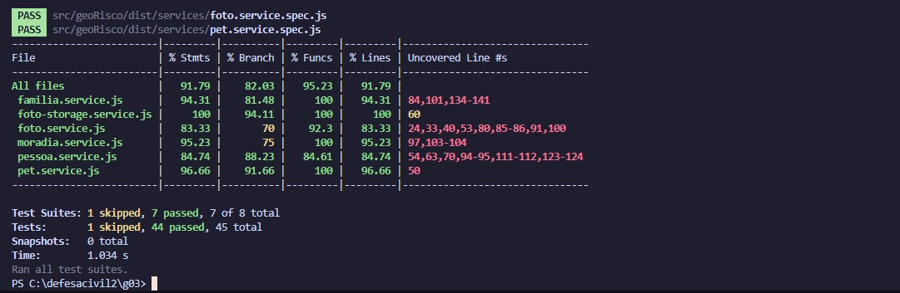

## Dependências necessárias

Para permitir a execução dos testes, foram adicionadas as seguintes dependências:

| Dependência | Tipo | Justificativa |
|---|---|---|
| `typescript` | devDependency | Necessária para compilar o projeto TypeScript antes da execução do Jest. |
| `dotenv` | dependency | Necessária porque o projeto importa `dotenv/config` em arquivos de infraestrutura. |
| `@supabase/supabase-js` | dependency | Necessária porque `foto-storage.service.ts` depende do cliente Supabase Storage. |

Essas dependências já estão registradas no `package.json` e no `package-lock.json`. Portanto, em outro computador, não é necessário instalar cada pacote manualmente: basta executar `npm install` na raiz do projeto para que o npm baixe as versões corretas.

Os testes unitários não dependem do `.env` real do projeto. Durante a execução do Jest, o arquivo `src/geoRisco/src/tests/jest.setup.ts` define valores fictícios para `DATABASE_URL`, `SUPABASE_URL` e `SUPABASE_SERVICE_ROLE_KEY`, permitindo que os imports de infraestrutura funcionem sem acessar banco de dados ou Supabase reais. As chamadas externas usadas nos Services são substituídas por mocks.

Após clonar o projeto, basta executar:

```bash
npm install
npm test -- --coverage
```

## Casos prioritários

| Caso | RN | Arquivo | Objetivo |
|---|---|---|---|
| CT01 | RN01 | `pessoa.service.test.ts` | Validar cadastro de pessoa com dados obrigatórios e falha quando o nome está ausente. |
| CT02 | RN06 | `moradia.service.test.ts` | Validar arquivamento de moradia e falha ao tentar arquivar moradia inexistente. |
| CT03 | RN03 | `familia.service.test.ts` | Validar arquivamento lógico delegado ao repositório e falha para vínculos inexistentes. |
| CT04 | RN04 | `moradia.service.test.ts` e `foto.service.test.ts` | Validar geolocalização obrigatória e registro de foto com exatamente um dono permitido. |
| CT05 | RN11 | `moradia.service.test.ts` | Validar busca de dados detalhados da moradia por ID. |

## Explicação dos 5 prioritários

**CT01 -> RN01**
- AAA: arrange cria repositório mockado e payload válido; act chama `PessoaService.cadastrar`; assert verifica retorno e chamada do repositório com nome normalizado, `nomeSocial` nulo e `status` padrão.
- Determinismo: usa data fixa e mocks, sem banco ou rede.
- RN coberta: RN01 exige dados essenciais para cadastro de pessoa.
- Caminho de falha: payload sem nome rejeita com `HttpError 400` e não chama o repositório.

**CT02 -> RN06**
- AAA: arrange cria moradia existente no repositório mockado; act chama `MoradiaService.remover`; assert verifica delegação de delete.
- Determinismo: sem dependência externa ou clock.
- RN coberta: RN06 para delegação/arquivamento de moradia.
- Caminho de falha: moradia inexistente lança `HttpError 404`.

**CT03 -> RN03**
- AAA: arrange cria família existente e repositório mockado; act chama `FamiliaService.remover`; assert verifica delegação para `delete`, que no banco é soft delete.
- Determinismo: usa apenas mocks de repositório.
- RN coberta: RN03 preserva histórico por arquivamento lógico.
- Caminho de falha: vínculo pessoa-família ou família-moradia inexistente retorna `HttpError 404`.

**CT04 -> RN04**
- AAA: arrange prepara moradia com latitude/longitude e transação mockada; act chama `MoradiaService.cadastrar`; assert verifica commit e persistência com localização. O teste de foto prepara uma moradia existente, chama `FotoService.cadastrarNaMoradia` e confere exatamente um dono.
- Determinismo: coordenadas, payloads e transação são fixos e mockados.
- RN coberta: RN04 exige geolocalização no cadastro de moradia e restringe fotos ao imóvel/pet.
- Caminho de falha: latitude inválida impede transação; foto sem dono ou com dois donos retorna `HttpError 400`.

**CT05 -> RN11**
- AAA: arrange prepara moradia com famílias, fotos e moradores mockados; act chama `MoradiaService.getDetalhes`; assert verifica que retorna árvore completa.
- Determinismo: sem dependência do banco real.
- RN coberta: RN11 para busca de dados consolidados e integrados por ID de moradia.
- Caminho de falha: moradia inexistente lança `HttpError 404`.

### 5.1.3 Testes de Integração de Endpoints

Os testes de integração de endpoints têm como objetivo validar o comportamento observável da API por meio de requisições HTTP executadas em ambiente controlado. Diferentemente dos testes unitários da seção 5.1.2, que verificam a camada de Service com mocks, os testes desta seção devem exercitar a aplicação a partir das rotas HTTP, verificando a integração entre rotas, controllers, services, tratamento de erros e contratos de resposta.

Conforme definido nos critérios do projeto, cada endpoint principal deve contemplar, sempre que aplicável, os quatro cenários-chave:

* **Sucesso**: resposta `200`, `201` ou `204`, conforme o contrato do endpoint;
* **Falha de validação**: resposta `400`, quando o payload, parâmetro ou identificador for inválido;
* **Regra de negócio violada**: resposta `409` quando houver conflito explícito, ou status equivalente já implementado pelo backend, como `400` para regra rejeitada por validação de domínio ou `502` para falha controlada de serviço externo;
* **Recurso não encontrado**: resposta `404`, quando a entidade consultada ou vinculada não existir.

Essa abordagem garante que os fluxos críticos sejam avaliados tanto no caminho feliz quanto em situações de erro previsíveis, mantendo coerência com os status HTTP efetivamente usados pelo backend atual.

#### 5.1.3.1 Cobertura Obrigatória dos Endpoints Principais

A cobertura dos testes de integração foi definida a partir dos requisitos funcionais prioritários da aplicação, garantindo rastreabilidade entre os fluxos de negócio, os contratos HTTP da API e as regras de negócio descritas na Seção 3.1.3. Para cada endpoint principal são contemplados os cenários de sucesso, falha de validação, violação de regra de negócio e recurso não encontrado.

| Endpoint                                     | RF Relacionados            | RN Relacionadas        | Sucesso (200/201/204)                            | Falha de Validação (400/422)                      | Regra de Negócio Violada / Falha Externa (409 ou equivalente)      | Não Encontrado (404)                      |
| -------------------------------------------- | -------------------------- | ---------------------- | ------------------------------------------------ | ------------------------------------------------- | ------------------------------------------------------------------ | ----------------------------------------- |
| `POST /api/pessoas`                          | RF001                      | RN04                   | Pessoa cadastrada com sucesso (`201`)            | Campos obrigatórios ausentes ou inválidos (`400`) | Classificação de vulnerabilidade inconsistente (`400`)             | Entidade vinculada inexistente (`404`)    |
| `GET /api/pessoas/:id`                       | RF001, RF005               | RN11                   | Pessoa encontrada (`200`)                        | ID inválido (`400`)                               | —                                                                  | Pessoa inexistente (`404`)                |
| `PUT /api/pessoas/:id`                       | RF012, RF019               | RN04, RN09, RN10       | Atualização realizada (`200`)                    | Payload inválido (`400`)                          | Violação das regras de recadastro ou atualização cadastral (`400`) | Pessoa inexistente (`404`)                |
| `SOFT DELETE /api/pessoas/:id`                    | RF010                      | RN01, RN06             | Morador arquivado (`204`)                        | ID inválido (`400`)                               | Tentativa de arquivar responsável sem substituição prévia (`409`)  | Pessoa inexistente (`404`)                |
| `GET /api/pessoas/busca`                     | RF016                      | RN11                   | Busca executada com sucesso (`200`)              | Nenhum filtro informado (`400`)                   | Escopo incompatível com regras de consulta (`400`)                 | Lista vazia retorna `200`                 |
| `POST /api/responsaveis`                     | RF001, RF014               | RN01, RN02             | Responsável cadastrado (`201`)                   | Dados obrigatórios ausentes (`400`)               | Família já possui responsável ativo (`409`)                        | Pessoa inexistente (`404`)                |
| `PUT /api/responsaveis/:id`                  | RF014                      | RN01, RN02             | Responsável atualizado (`200`)                   | Payload inválido (`400`)                          | Tentativa de manter dois responsáveis ativos (`409`)               | Responsável inexistente (`404`)           |
| `POST /api/familias`                         | RF001, RF014               | RN01, RN02, RN03       | Família criada (`201`)                           | Dados obrigatórios ausentes (`400`)               | Família sem responsável válido (`400`)                             | —                                         |
| `POST /api/familias/nucleo`                  | RF013                      | RN01, RN02, RN03, RN12 | Cadastro transacional completo realizado (`201`) | Dados obrigatórios ausentes (`400`)               | Violação das regras de composição familiar (`409`)                 | Entidades vinculadas inexistentes (`404`) |
| `POST /api/familias/:id/pessoas`             | RF014                      | RN01, RN02             | Pessoa vinculada à família (`201`)               | ID inválido (`400`)                               | Família já possui responsável ativo (`409`)                        | Pessoa ou família inexistente (`404`)     |
| `SOFT DELETE /api/familias/:id/pessoas/:pessoaId` | RF014                      | RN01, RN06             | Vínculo removido (`200`)                         | IDs inválidos (`400`)                             | Família ativa ficaria sem responsável (`409`)                      | Vínculo inexistente (`404`)               |
| `POST /api/familias/:id/moradias`            | RF014, RF017               | RN03, RN10             | Moradia vinculada à família (`201`)              | ID inválido (`400`)                               | Associação incompatível (`409`)                                    | Moradia inexistente (`404`)               |
| `POST /api/moradias`                         | RF002, RF003               | RN05, RN08             | Moradia cadastrada (`201`)                       | Dados estruturais inválidos (`400`)               | Localização não confirmada ou situação inválida (`400`)            | —                                         |
| `GET /api/moradias/:id`                      | RF002, RF005               | RN11                   | Moradia encontrada (`200`)                       | ID inválido (`400`)                               | —                                                                  | Moradia inexistente (`404`)               |
| `PUT /api/moradias/:id`                      | RF003, RF012, RF015, RF019 | RN05, RN08, RN09, RN10 | Moradia atualizada (`200`)                       | Payload inválido (`400`)                          | Situação operacional inválida ou atualização incompatível (`400`)  | Moradia inexistente (`404`)               |
| `SOFT DELETE /api/moradias/:id`                   | RF009                      | RN06                   | Moradia arquivada (`204`)                        | ID inválido (`400`)                               | Violação das regras de arquivamento lógico (`409`)                 | Moradia inexistente (`404`)               |
| `GET /api/moradias/:id/detalhes`             | RF005                      | RN11                   | Dados consolidados retornados (`200`)            | ID inválido (`400`)                               | Inconsistência de dados agregados (`500` controlado)               | Moradia inexistente (`404`)               |
| `GET /api/mapa/moradias`                     | RF004                      | RN08, RN11             | Marcadores carregados (`200`)                    | Parâmetros inválidos (`400`)                      | Dados inconsistentes com base oficial (`400`)                      | —                                         |
| `GET /api/mapa/calor`                        | RF008                      | RN04, RN11             | Heatmap gerado (`200`)                           | Filtro inválido (`400`)                           | Grupo de vulnerabilidade inexistente (`400`)                       | —                                         |
| `POST /api/pets`                             | RF007                      | RN12                   | Pet cadastrado (`201`)                           | Dados obrigatórios inválidos (`400`)              | Vínculo incompatível com família (`400`)                           | Família inexistente (`404`)               |
| `PUT /api/pets/:id`                          | RF007, RF019               | RN12                   | Pet atualizado (`200`)                           | Payload inválido (`400`)                          | Violação do vínculo familiar (`400`)                               | Pet inexistente (`404`)                   |
| `SOFT DELETE /api/pets/:id`                       | RF007                      | RN12                   | Pet removido (`204`)                             | ID inválido (`400`)                               | Restrição de remoção (`409`)                                       | Pet inexistente (`404`)                   |
| `POST /api/moradias/:id/fotos`               | RF002, RF018               | RN07                   | Foto vinculada à moradia (`201`)                 | Tipo ou tamanho inválido (`400`)                  | Tentativa de cadastro de foto proibida pela LGPD (`400`)           | Moradia inexistente (`404`)               |
| `POST /api/pets/:id/fotos`                   | RF007, RF018               | RN12                   | Foto vinculada ao pet (`201`)                    | Tipo ou tamanho inválido (`400`)                  | Violação das regras de associação (`400`)                          | Pet inexistente (`404`)                   |
| `POST /api/moradias/:id/fotos/upload-url`    | RF018                      | RN07                   | URL de upload gerada (`201`)                     | Arquivo inválido (`400`)                          | Falha controlada de armazenamento (`502`)                          | Moradia inexistente (`404`)               |
| `POST /api/pets/:id/fotos/upload-url`        | RF018                      | RN12                   | URL de upload gerada (`201`)                     | Arquivo inválido (`400`)                          | Falha controlada de armazenamento (`502`)                          | Pet inexistente (`404`)                   |
| `GET /api/fotos/:id/signed-url`              | RF018                      | RN07                   | URL assinada gerada (`200`)                      | Identificador inválido (`400`)                    | Falha controlada de armazenamento (`502`)                          | Foto inexistente (`404`)                  |

- **OBS:** alguns endpoints terão aplicações das validações, requisitos e funções somente na próxima Sprint: GET /api/mapa/moradias ; GET /api/mapa/calor ; (validações): PUT /api/pessoas/:id ; PUT /api/pessoas/:id.

#### 5.1.3.2 Critérios de Implementação dos Testes

Os testes de integração devem ser implementados exercitando a aplicação Express a partir de requisições HTTP, preferencialmente com Supertest. A suíte deve validar:

* código de status retornado;
* formato padrão de erro `{ "error": "mensagem" }`;
* presença dos campos principais no corpo de resposta;
* comportamento com payload válido;
* comportamento com payload inválido;
* comportamento com IDs inexistentes;
* comportamento diante de conflitos ou regras de negócio rejeitadas.

Como os testes de integração dependem da API montada, recomenda-se criar uma suíte separada, por exemplo:

```txt
src/geoRisco/src/tests/endpoints.integration.test.ts

```

Também será necessário adicionar as dependências de teste HTTP, caso ainda não estejam instaladas:

```
npm install --save-dev supertest @types/supertest
```

#### 5.1.3.3 Resultado Esperado

A execução da suíte de testes de integração deve demonstrar que todos os endpoints principais da API possuem cobertura para os cenários de sucesso, validação, conflito de negócio e recurso inexistente, garantindo rastreabilidade entre RFs, RNs, endpoints e casos de teste. Dessa forma, os contratos HTTP documentados permanecem alinhados ao comportamento real da aplicação, reduzindo riscos de regressão e aumentando a confiabilidade da solução.


### 5.1.4 Evidências de Execução

As evidências abaixo foram obtidas a partir da execução da suíte automatizada da WebAPI com Jest, TypeScript e Supertest. Os testes estão versionados no repositório na pasta `src/geoRisco/src/tests`, seguindo a nomenclatura `*.service.test.ts` para testes unitários de Service e `api.controller.test.ts` para os testes de integração dos endpoints.

#### 5.1.4.1 Execução da suíte automatizada

Comando executado:

```bash
npm test -- --no-cache
```

Resultado observado:

```txt
Test Suites: 7 passed, 7 total
Tests:       65 passed, 65 total
Snapshots:   0 total
```

Arquivos de teste executados:

| Arquivo | Camada | Tipo |
|---|---|---|
| `src/geoRisco/src/tests/pessoa.service.test.ts` | Service | Unitário white-box |
| `src/geoRisco/src/tests/familia.service.test.ts` | Service | Unitário white-box |
| `src/geoRisco/src/tests/moradia.service.test.ts` | Service | Unitário white-box |
| `src/geoRisco/src/tests/pet.service.test.ts` | Service | Unitário white-box |
| `src/geoRisco/src/tests/foto.service.test.ts` | Service | Unitário white-box |
| `src/geoRisco/src/tests/foto-storage.service.test.ts` | Service | Unitário white-box |
| `src/geoRisco/src/tests/api.controller.test.ts` | Controller/Endpoint | Integração black-box via Supertest |

#### 5.1.4.2 Relatório de cobertura

Comando executado:

```bash
npm test -- --coverage
```

Resultado observado:

```txt
Test Suites: 7 passed, 7 total
Tests:       65 passed, 65 total
Snapshots:   0 total
```

Resumo de cobertura por camada:

| Camada | % Statements | % Branch | % Functions | % Lines |
|---|---:|---:|---:|---:|
| Controllers | 87.81 | 64.01 | 96.70 | 87.81 |
| Services | 93.16 | 82.65 | 95.23 | 93.16 |
| Validations | 61.30 | 67.07 | 74.07 | 61.67 |
| Models | 92.85 | 100.00 | 100.00 | 92.85 |
| Projeto completo | 55.57 | 48.52 | 66.01 | 57.78 |

Cobertura individual dos Services:

| Arquivo | % Statements | % Branch | % Functions | % Lines |
|---|---:|---:|---:|---:|
| `familia.service.ts` | 96.62 | 79.31 | 100.00 | 96.62 |
| `foto-storage.service.ts` | 93.93 | 82.35 | 100.00 | 93.93 |
| `foto.service.ts` | 88.46 | 80.00 | 92.30 | 88.46 |
| `moradia.service.ts` | 100.00 | 90.00 | 100.00 | 100.00 |
| `pessoa.service.ts` | 81.35 | 80.55 | 84.61 | 81.35 |
| `pet.service.ts` | 100.00 | 100.00 | 100.00 | 100.00 |

Assim, a camada Service atende ao critério mínimo de 80% de cobertura, tanto no agregado da camada quanto nos arquivos individuais de Service.

#### 5.1.4.3 Mapeamento CT -> RN -> RF

| Caso | RN | RF relacionado | Evidência automatizada |
|---|---|---|---|
| CT01 | RN01 | RF001 | `pessoa.service.test.ts` valida cadastro de pessoa com dados obrigatórios e falha controlada para payload sem nome. |
| CT02 | RN06 | RF009 | `moradia.service.test.ts` valida arquivamento de moradia e falha `404` ao tentar arquivar moradia inexistente. |
| CT03 | RN03 | RF014 / RF017 | `familia.service.test.ts` valida remoção/arquivamento lógico e falhas em vínculos inexistentes. |
| CT04 | RN04 | RF002 / RF018 | `moradia.service.test.ts` e `foto.service.test.ts` validam geolocalização obrigatória e vínculo válido de fotos. |
| CT05 | RN11 | RF005 | `moradia.service.test.ts` valida busca/detalhamento da moradia por ID com dados consolidados de família, pessoas, pets e fotos. |

#### 5.1.4.4 Evidência dos testes de endpoints

A suíte `api.controller.test.ts` executa requisições HTTP com Supertest contra uma aplicação Express montada em ambiente controlado, usando controllers reais e services mockados. A suíte cobre os principais contratos HTTP implementados para:

| Grupo de endpoints | Exemplos cobertos | Cenários verificados |
|---|---|---|
| Pessoas e responsáveis | `/api/pessoas`, `/api/pessoas/:id`, `/api/pessoas/busca`, `/api/responsaveis` | Sucesso, validação `400`, conflito/regra de negócio e `404` |
| Famílias e vínculos | `/api/familias`, `/api/familias/nucleo`, `/api/familias/:id/pessoas`, `/api/familias/:id/moradias` | Sucesso, validação `400`, conflito `409` e `404` |
| Moradias | `/api/moradias`, `/api/moradias/:id`, `/api/moradias/:id/detalhes` | Sucesso, validação `400`, erro controlado e `404` |
| Pets | `/api/pets`, `/api/pets/:id`, `/api/familias/:id/pets` | Sucesso, validação `400`, conflito/regra de negócio e `404` |
| Fotos e storage | `/api/fotos`, `/api/moradias/:id/fotos`, `/api/pets/:id/fotos`, `/upload-url`, `/signed-url` | Sucesso, validação `400`, falha externa controlada `502` e `404` |

Os endpoints planejados que ainda não existem no backend atual, como `/api/mapa/moradias` e `/api/mapa/calor`, permanecem registrados na matriz como cobertura futura.


## 5.2. Testes de usabilidade (sprint 5)

### 5.2.1. Relatório de testes de guerrilha

*Posicione aqui as tabelas com enunciados de tarefas, etapas e resultados de testes de usabilidade. Ou utilize um link para seu relatório de testes (mantenha o link sempre público para visualização).*

### 5.2.2. Relatório de testes SUS (System Usability Scale)

*Posicione aqui o relatório dos testes SUS realizados.*

# <a name="c6"></a>6. Estudo de Mercado e Plano de Marketing (sprint 4)

## 6.1. Resumo Executivo

O GeoRisco Santo André é uma aplicação web desenvolvida em parceria com a Defesa Civil do município para apoiar a gestão georreferenciada de populações em áreas de risco. A solução substitui processos analógicos, fragmentados e baseados em planilhas físicas por uma plataforma digital integrada, que permite ao agente de campo cadastrar moradias, núcleos familiares, vulnerabilidades e animais de estimação, e oferece à sede um painel geolocalizado para tomada de decisão estratégica em tempo real.

**Oportunidades de mercado:** O projeto se insere no setor GovTech, segmento em expansão no Brasil, onde o setor público responde por cerca de 12% do PIB e enfrenta forte demanda por modernização. Marcos regulatórios como a Lei nº 12.608/2012 (Política Nacional de Proteção e Defesa Civil) e a LGPD (Lei nº 13.709/2018) reforçam a necessidade de cadastros atualizados, rastreáveis e seguros. Santo André concentra 28 áreas de risco e 3.803 edificações classificadas como risco alto e muito alto (R3/R4), cenário replicável em centenas de municípios brasileiros monitorados pelo CEMADEN, com potencial inicial de expansão para o ABC Paulista e demais coordenadorias municipais de Defesa Civil.

**Diferenciais competitivos:** A aplicação combina geolocalização multimodal (CEP, coordenadas GPS, referências geográficas e fotos do imóvel) e visualização em mapa com filtros por vulnerabilidade e densidade populacional. O modelo B2G prioriza impacto social, conformidade com a LGPD e adequação ao contexto operacional real do agente.

**Objetivos estratégicos:** Reduzir o tempo crítico de coleta para menos de cinco minutos por moradia; eliminar gaps operacionais entre evacuação e abrigo; oferecer visão estratégica em tempo real para alocação de recursos; e consolidar uma base íntegra que fortaleça a resiliência urbana de Santo André e sirva de referência para replicação em outros municípios.

## 6.2. Análise de Mercado

### 6.2.1 Visão Geral do Setor 

O GeoRisco Santo André está inserido no setor de GovTech, que corresponde a um conjunto de soluções tecnológicas desenvolvidas por empresas privadas para modernizar a gestão pública e aprimorar a prestação de serviços à população.

O setor surge da convergência entre a aceleração digital da sociedade e a defasagem histórica dos sistemas públicos, que ainda operam em grande parte com processos analógicos, fragmentados e pouco escaláveis. À medida que governos enfrentam demandas crescentes por eficiência, transparência e sustentabilidade, o GovTech se consolida como resposta estrutural, oferecendo ferramentas que automatizam processos, reduzem custos operacionais e reconstroem a confiança pública.

No Brasil, o contexto é especialmente favorável. O setor público é o maior comprador de produtos e serviços do país, respondendo por cerca de 12% do PIB brasileiro, o que cria uma demanda estrutural contínua por soluções tecnológicas. Do ponto de vista regulatório, dois marcos legais moldam diretamente o segmento de GovTech voltado à gestão de riscos: a Lei nº 12.608/2012, que institui a Política Nacional de Proteção e Defesa Civil e exige cadastros atualizados de populações vulneráveis, e a LGPD (Lei nº 13.709/2018), que impõe requisitos de rastreabilidade e proteção de dados sensíveis coletados em campo. 

É nesse cenário que soluções como o GeoRisco encontram espaço: endereçando lacunas operacionais reais em municípios que carecem de sistemas digitais integrados para gestão de risco.

### 6.2.2 Tamanho e Crescimento de Mercado 

O mercado relacionado ao GeoRisco Santo André está inserido no segmento de softwares de gestão de emergências, segurança pública e gerenciamento de crises, que apresenta forte expansão impulsionada pela digitalização dos serviços públicos, aumento da frequência de eventos climáticos extremos e necessidade de respostas mais rápidas e integradas.

O mercado global de **Emergency Management Software (software de gestão de emergências)** foi estimado entre US$ 420 milhões e US$ 450 milhões em 2025/2026, com projeções de alcançar aproximadamente US$ 1,1 bilhão até 2035, representando uma taxa média de crescimento anual (CAGR) de 11,3%. Esse crescimento é impulsionado pela adoção de soluções baseadas em nuvem, integração de dados geoespaciais e uso de inteligência artificial para monitoramento e resposta a desastres.

Em uma visão mais ampla, o mercado global de **software para segurança pública**, que engloba plataformas de gestão de incidentes, monitoramento em tempo real e coordenação de emergências, movimentou cerca de US$ 11,48 bilhões em 2025 e possui previsão de atingir US$ 24,23 bilhões até 2034, com crescimento anual médio de 9,2%.

Além disso, este mercado, diretamente relacionado à continuidade operacional e resposta a eventos críticos, foi avaliado em US$ 143,97 bilhões em 2025 e deverá alcançar US$ 310,12 bilhões em 2034, mantendo CAGR de 8,9%.

Esses indicadores demonstram um **mercado em expansão consistente**, favorecido pelo aumento dos investimentos governamentais em resiliência urbana, proteção civil e gestão inteligente de riscos.

Fontes (seção 9): (REF.6, REF.7, REF.8).

### 6.2.3 Tendências de Mercado

Três eixos de tendências convergem para ampliar a relevância e a adoção do GeoRisco Santo André nos próximos anos.

**Tendências Tecnológicas**
A consolidação das plataformas de Government as a Service (GaaS) e a adoção crescente de infraestrutura em nuvem pelo setor público brasileiro criam condições favoráveis para soluções SaaS B2G de baixo custo de implantação. O avanço das APIs de geolocalização, como Google Maps Platform e OpenStreetMap, e a popularização de bibliotecas de mapas interativos (Leaflet, Mapbox) reduzem significativamente a barreira técnica para desenvolvimento de sistemas georreferenciados. Paralelamente, o crescimento do uso de dispositivos móveis por servidores públicos em campo impulsiona a demanda por aplicações mobile-first, exatamente o modelo adotado pelo GeoRisco.

**Tendências Comportamentais**
A digitalização acelerada dos processos públicos pós-pandemia gerou maior receptividade de gestores municipais a ferramentas digitais integradas. Há também uma mudança de postura institucional: municípios deixam de reagir a desastres e passam a investir em prevenção e mapeamento contínuo de risco, o que aumenta a demanda por cadastros georreferenciados permanentes, e não apenas emergenciais.

**Tendências Mercadológicas**
O mercado GovTech brasileiro está em expansão. Segundo o relatório GovTech Brasil 2023, elaborado pela Abstartups em parceria com o Sebrae, o ecossistema conta com mais de 800 startups ativas no setor público. O volume de contratações públicas de tecnologia cresce em função da Lei nº 14.133/2021 (Nova Lei de Licitações), que simplifica processos para soluções inovadoras. Além disso, o CEMADEN monitora atualmente 1.295 municípios brasileiros em situação de risco, configurando um mercado endereçável expressivo para replicação da solução além de Santo André.

Fontes (seção 9): (REF.9, REF.10, REF.11, REF.12, REF.13).

## 6.3. Público-Alvo

### 6.3.1 Segmentação de Mercado

A segmentação de mercado da aplicação foi definida a partir do setor público de proteção e defesa civil, com foco em instituições responsáveis pela prevenção, preparação, resposta e recuperação em situações de risco e desastre. O segmento prioritário é composto pela Defesa Civil de Santo André, especialmente pelos agentes de campo e gestores operacionais que atuam no cadastramento, monitoramento e atendimento de famílias residentes em áreas suscetíveis a deslizamentos, enchentes e outros eventos adversos associados a desastres geo-hidrológicos.

Também foi identificado como segmento relevante o conjunto de prefeituras e coordenadorias municipais de Defesa Civil que enfrentam desafios semelhantes, principalmente em municípios com áreas de risco, ocupações vulneráveis e necessidade de atualização constante de dados territoriais e sociodemográficos. Nesses contextos, a aplicação pode ser utilizada como ferramenta de apoio à digitalização de cadastros, ao georreferenciamento de moradias e à priorização de atendimentos em situações emergenciais.

Além disso, a solução pode atender secretarias municipais que atuam de forma integrada com a Defesa Civil, como Habitação, Assistência Social, Saúde, Meio Ambiente e Desenvolvimento Urbano. Esses órgãos dependem de informações confiáveis sobre famílias, moradias, vulnerabilidades, localização e histórico de ocupação para planejar políticas públicas, definir prioridades e coordenar ações preventivas.

Dessa forma, concluiu-se que a aplicação está direcionada principalmente ao mercado institucional govtech, com foco em gestão pública de riscos, resiliência urbana e proteção de populações vulneráveis. Seu potencial de uso concentra-se em órgãos públicos municipais que necessitam substituir processos manuais e descentralizados por uma solução digital, integrada e adaptada ao trabalho em campo.

Fontes (seção 9): (REF.14, REF.15, REF.16, REF.17, REF.18).

### 6.3.2. Perfil do Público-Alvo
O público-alvo do GeoRisco é composto pelos profissionais da Defesa Civil de Santo André responsáveis pela coleta, gestão e análise de informações sobre moradores e áreas de risco do município.

Os Agentes de Defesa Civil, que atuam em campo, são adultos com níveis de familiaridade com tecnologias digitais que variam de baixa a média. Sua rotina envolve visitas domiciliares, vistorias e coleta de dados em locais muitas vezes de difícil acesso e com limitações de informações. Seu comportamento é marcado pela necessidade de mobilidade, agilidade e adaptação a diferentes cenários. Entre suas principais necessidades estão o registro rápido e confiável das informações, a consulta e atualização de dados em campo. Suas principais dores incluem retrabalho, perda de informações, duplicidade de registros e dificuldades de localização de moradias.

Os Gestores Operacionais, por sua vez, atuam no planejamento e coordenação das ações da Defesa Civil. Utilizam computadores para monitorar informações, analisar riscos e apoiar a tomada de decisões. Necessitam de dados consolidados, atualizados e confiáveis para planejar evacuações, direcionar recursos e acompanhar populações vulneráveis. Suas principais dores estão relacionadas à falta de informações integradas e à dificuldade de obter uma visão abrangente dos riscos do município.

Como expectativa comum, ambos os perfis buscam maior precisão, integridade e segurança dos dados, além de processos mais eficientes que apoiem respostas rápidas e assertivas em situações de risco.

## 6.4. Posicionamento e Branding

## 6.4.1 Proposta de Valor Única

Oferecemos um sistema de gestão de famílias e moradias em área de risco para a prefeitura de Santo André, que precisa manusear de forma prática os dados dos cidadãos em vulnerabilidade, bem como visualizar esses dados de forma estratégica e sem a necessidade do uso de formulários em papel.

## 6.4.2 Posicionamento e Branding

**b) Estratégia de Diferenciação**

A diferenciação do GeoRisco Santo André está em sua adaptação direta à rotina da Defesa Civil municipal, e não apenas na digitalização genérica de cadastros. Enquanto alternativas como planilhas, formulários isolados, sistemas nacionais ou ferramentas de mapa atendem partes do processo, o GeoRisco integra, em uma única aplicação, cadastro de moradias, famílias, moradores, pets, fotos, localização, histórico de ocupação, consulta e visualização territorial.

Essa integração posiciona a solução como uma ferramenta operacional de gestão pública de risco, capaz de apoiar tanto o agente em campo quanto o gestor na sede. O diferencial está na rastreabilidade dos dados, na padronização das informações sensíveis e na leitura geográfica das vulnerabilidades, permitindo priorizar atendimentos, planejar evacuações e reduzir perdas de informação entre etapas.

Por ser desenvolvida com base no contexto de Santo André e nas necessidades reais da Defesa Civil, a aplicação também se diferencia pela linguagem institucional, pela interface objetiva e pelo alinhamento à LGPD. Em vez de competir por apelo comercial, o GeoRisco se destaca pela legitimidade pública, pela aderência ao serviço essencial prestado e pela capacidade de transformar dados territoriais em decisões rápidas, seguras e justificáveis.

## 6.5. Business Model Canvas

*Preencha os nove blocos do Business Model Canvas de forma coerente com as análises realizadas nas seções anteriores: Segmentos de clientes; Proposta de valor; Canais; Relacionamento com clientes; Fontes de receita;*

*Recursos principais; Atividades principais; Parcerias principais; e estrutura de custos (somente se couber nesse momento da análise com o parceiro).*

## 6.6. Estratégia de Marketing

A estratégia de marketing do GeoRisco Santo André foi estruturada com base no modelo dos 4Ps: Produto/Serviço, Preço, Praça e Promoção. Essa abordagem permite organizar a forma como a aplicação gera valor, como pode ser financiada, por quais canais será disponibilizada e quais estratégias serão usadas para divulgar sua adoção. Como se trata de uma solução GovTech voltada à gestão pública e à Defesa Civil, os 4Ps foram adaptados ao contexto B2G, priorizando impacto social, eficiência operacional e relacionamento institucional.

Em **Produto/Serviço**, são descritas as funcionalidades, benefícios e diferenciais da aplicação. Em **Preço**, apresenta-se o modelo de monetização mais adequado para órgãos públicos e sua justificativa. Em **Praça**, explica-se como a solução será distribuída e entregue aos usuários. Por fim, em **Promoção**, são definidas as estratégias digitais e institucionais para divulgação, aquisição de parceiros e expansão da aplicação para novos contextos municipais.

### 6.6.1. Produto/Serviço

O GeoRisco Santo André é uma aplicação web voltada à gestão de populações em áreas de risco, desenvolvida para apoiar agentes de campo e gestores operacionais da Defesa Civil. A solução permite o cadastro georreferenciado de moradias, famílias, moradores e pets, reunindo informações como endereço, coordenadas, fotos do imóvel, composição familiar, vulnerabilidades e histórico de ocupação. Também oferece consulta integrada de registros, visualização em mapa, filtros por território e apoio à identificação de situações críticas.

O principal benefício da aplicação é centralizar dados antes dispersos em processos manuais, planilhas ou registros fragmentados, aumentando a agilidade, a confiabilidade e a rastreabilidade das informações. Seu diferencial está na adequação ao contexto real da Defesa Civil de Santo André, com foco em tomada de decisão rápida, priorização de grupos vulneráveis, apoio à evacuação e melhoria da gestão de abrigos. Assim, o GeoRisco fortalece a capacidade preventiva e operacional do município diante de eventos climáticos extremos.


### 6.6.2. Preço 

O modelo de precificação proposto é B2G (Business to Government), voltado à contratação por órgãos públicos municipais, sem cobrança direta dos cidadãos ou dos agentes que utilizam a aplicação. A solução pode ser implantada por meio de contratação institucional, contemplando custos relacionados à hospedagem, manutenção, suporte técnico e treinamento dos usuários.

Esse modelo é adequado porque a Defesa Civil presta um serviço público essencial, sem finalidade comercial voltada ao consumidor final. O valor da aplicação está na centralização das informações, na redução de processos manuais, no aumento da eficiência operacional e no apoio à tomada de decisão em situações de risco e emergência.

Por se tratar de uma solução destinada ao setor público, não são definidos valores comerciais específicos nesta etapa. A precificação depende de fatores como porte do município, número de usuários, requisitos técnicos, disponibilidade orçamentária e processos de contratação pública. Dessa forma, a proposta prioriza a definição de um modelo de contratação sustentável e compatível com a realidade da administração pública.


### 6.6.3. Praça

A distribuição do GeoRisco ocorrerá por canais digitais institucionais, com acesso seguro por navegador em celulares, tablets e computadores. A aplicação poderá ser disponibilizada em domínio oficial da Prefeitura ou da Defesa Civil, com perfis de permissão adequados às funções de agentes de campo, gestores e administradores. Dessa forma, o sistema atende tanto ao uso operacional em campo quanto à análise estratégica em ambiente de sede.

A entrega da aplicação pode ser feita por infraestrutura em nuvem ou em ambiente tecnológico definido pelo município, garantindo disponibilidade, armazenamento centralizado e padronização dos dados. Para expansão, os canais de distribuição incluem parcerias com prefeituras, Defesa Civil estadual, consórcios intermunicipais, secretarias de meio ambiente, assistência social e tecnologia. Documentação técnica, manuais digitais, treinamentos online e APIs de integração podem apoiar a implantação em novos contextos, permitindo que a solução seja replicada para outros municípios com necessidades semelhantes.


### 6.6.4. Promoção

A estratégia de promoção do GeoRisco prioriza credibilidade institucional, impacto social e demonstração de resultados, considerando que o público-alvo é composto por órgãos públicos e gestores municipais. Uma página institucional otimizada para SEO poderá divulgar a solução por meio de termos como “gestão de áreas de risco”, “Defesa Civil municipal”, “cadastro georreferenciado” e “gestão de desastres”, facilitando sua descoberta por potenciais interessados.

A divulgação também poderá ocorrer por canais institucionais da Prefeitura, da Defesa Civil e por redes profissionais como o LinkedIn, destacando benefícios como centralização de dados, apoio à evacuação e proteção de populações vulneráveis. O marketing de conteúdo incluirá estudos de caso, vídeos demonstrativos, relatórios de impacto, infográficos e artigos sobre prevenção de desastres e gestão territorial. Além disso, a promoção poderá ser fortalecida por apresentações para prefeituras, participação em eventos de inovação pública, parcerias acadêmicas e divulgação em redes de Defesa Civil. Essas ações contribuem para ampliar a visibilidade da solução, fortalecer sua legitimidade institucional e incentivar sua adoção por outros municípios.

---

# <a name="c7"></a>7. Registro de atualizações (sprint 5)
Início na sprint 2 pois não é possível realizar atualizações na sprint que foi iniciado o projeto;
### Sprint 2
Tivemos alterações nas Personas (ambas), User Stories (todas), RF, RNF e RN. Dado que o escopo do projeto estava confuso para a equipe, para melhor seguimento do projeto foi necessária essa reformulação na documentação.

### Sprint 3

1. 19/05/2026 - Davi Viana Tricarico - Seção 3.3 Wireframes: Ajuste na documentação e nos próprios wireframes de cadastro, com direito à adição de um menu de navegação entre as seções; alteração da barra de navegação entre telas (barra retrátil substituida por uma barra parcialmente opaca e estática); adição de uma opção que permite adicionar novos moradores e animais.

### Sprint 4


### Sprint 5


# <a name="c8"></a>8. Conclusões e trabalhos futuros (sprint 5)

*Escreva de que formas a solução da aplicação web atingiu os objetivos descritos na seção 2 deste documento. Indique pontos fortes e pontos a melhorar de maneira geral.*

*Relacione os pontos de melhorias evidenciados nos testes com planos de ações para serem implementadas. O grupo não precisa implementá-las, pode deixar registrado aqui o plano para ações futuras*

*Relacione também quaisquer outras ideias que o grupo tenha para melhorias futuras*

# <a name="c8"></a>9. Referências (sprints 1 a 5)

1. PORTER, Michael E. *Estratégia Competitiva: Técnicas para Análise de Indústrias e da Concorrência*. 2. ed. Rio de Janeiro: Campus, 2004.

2. JOHNSON, G.; SCHOLES, K.; WHITTINGTON, R. *Exploring Corporate Strategy*. Harlow: Pearson Education, 2008.

3. PREFEITURA DE SANTO ANDRÉ. Departamento de Proteção e Defesa Civil: Ações e Programas. Disponível em: <https://portais.santoandre.sp.gov.br/defesacivil/>. Acesso em: 27 abr. 2026.

4. BRASIL. Lei nº 12.608, de 10 de abril de 2012. Institui a Política Nacional de Proteção e Defesa Civil (PNPDEC). *Diário Oficial da União*, Brasília, DF, 11 abr. 2012.

5. PEDROSO, Luiz Guilherme Lourenço Becker. [Título do trabalho]. 2017. Trabalho de Conclusão de Curso (Graduação) – Universidade de São Paulo, São Paulo, 2017. Disponível em: https://bdta.abcd.usp.br/directbitstream/05356078-01cb-4989-856d-4cf4dcb8b4cc/LuizGuilhermeLourencoBeckerPedroso%20TCCPRO17.pdf
. Acesso em: 30 abr. 2026.

6. FORTUNE BUSINESS INSIGHTS. Crisis Management Software Market Size, Share & Industry Analysis. Pune, 2026. Disponível em: https://www.fortunebusinessinsights.com/pt/crisis-management-software-market-110370. Acesso em: 2 jun. 2026.

7. GLOBAL GROWTH INSIGHTS. Emergency Management Software Market Report. 2026. Disponível em: https://www.globalgrowthinsights.com/market-reports/emergency-management-software-market-105680. Acesso em: 2 jun. 2026.

8. VERIFIED MARKET REPORTS. Public Safety Software Market Size, Share, Trends and Forecast. 2026. Disponível em: https://www.verifiedmarketreports.com/product/public-safety-software-market/. Acesso em: 2 jun. 2026.

9. ABSTARTUPS; SEBRAE. GovTech Brasil 2023: mapeamento do ecossistema de tecnologia para o setor público. São Paulo: Abstartups, 2023. Disponível em: https://abstartups.com.br/govtech-brasil. Acesso em: 09 jun. 2026.

10. BRASIL. Lei nº 14.133, de 1º de abril de 2021. Lei de Licitações e Contratos Administrativos. Diário Oficial da União, Brasília, DF, 1 abr. 2021. Disponível em: https://www.planalto.gov.br/ccivil_03/_ato2019-2022/2021/lei/l14133.htm. Acesso em: 09 jun. 2026.

11. CENTRO NACIONAL DE MONITORAMENTO E ALERTAS DE DESASTRES NATURAIS (CEMADEN). CEMADEN expande rede de monitoramento e passa a monitorar 1.295 municípios. Brasília: CEMADEN, 2024. Disponível em: https://www.gov.br/cemaden/pt-br/assuntos/noticias-cemaden/cemaden-expande-rede-de-monitoramento-e-passa-a-monitorar-1-295-municipios. Acesso em: 09 jun. 2026.

12. GOOGLE. Google Maps Platform documentation. Mountain View: Google LLC, 2024. Disponível em: https://developers.google.com/maps/documentation. Acesso em: 09 jun. 2026.

13. OPENSTREETMAP FOUNDATION. OpenStreetMap. 2024. Disponível em: https://www.openstreetmap.org. Acesso em: 09 jun. 2026.

14. CENTRO NACIONAL DE MONITORAMENTO E ALERTAS DE DESASTRES NATURAIS (CEMADEN). Cemaden expande rede de monitoramento e passa a monitorar 1.295 municípios. São José dos Campos, 2026. Disponível em: <https://www.gov.br/cemaden/pt-br/assuntos/noticias-cemaden/cemaden-expande-rede-de-monitoramento-e-passa-a-monitorar-1-295-municipios>. Acesso em: 9 jun. 2026.

15. BRASIL. Secretaria de Comunicação Social da Presidência da República (SECOM). Mais 162 cidades brasileiras são incluídas na rede de alertas do Cemaden. Brasília, 2026. Disponível em: <https://www.gov.br/secom/pt-br/acompanhe-a-secom/noticias/2026/05/mais-162-cidades-brasileiras-sao-incluidas-na-rede-de-alertas-do-cemaden/>. Acesso em: 9 jun. 2026.

16. BRASIL. Casa Civil. Cadastro de municípios suscetíveis a eventos de enxurradas e inundações: Nota Técnica 2. Brasília, [s.d.]. Disponível em: <https://www.gov.br/casacivil/pt-br/assuntos/cadastro-de-municipios-suscetiveis-a-eventos-de-enxurradas-e-inundacoes/Nota_Tecnica_2.pdf>. Acesso em: 9 jun. 2026.

17. INSTITUTO BRASILEIRO DE GEOGRAFIA E ESTATÍSTICA (IBGE). Estudo inédito mostra moradores sujeitos a enchentes e deslizamentos. Rio de Janeiro, 2018. Disponível em: <https://agenciadenoticias.ibge.gov.br/agencia-noticias/2012-agencia-de-noticias/noticias/21566-estudo-inedito-mostra-moradores-sujeitos-a-enchentes-e-deslizamentos>. Acesso em: 9 jun. 2026.

18. INSTITUTO DE PESQUISAS TECNOLÓGICAS (IPT). Mapeamento e gerenciamento de áreas de risco de deslizamento e solapamento de margem no município de Santo André-SP. São Paulo, 27 mar. 2023. Disponível em: <https://ipt.br/2023/03/27/mapeamento-e-gerenciamento-de-areas-de-risco-de-deslizamento-e-solapamento-de-margem-no-municipio-de-santo-andre-sp/>. Acesso em: 9 jun. 2026.


# <a name="c10"></a>Anexos

*Inclua aqui quaisquer complementos para seu projeto, como diagramas, imagens, tabelas etc. Organize em sub-tópicos utilizando headings menores (use ## ou ### para isso)*
